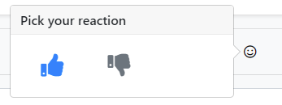

# CMS Kit: Reaction System

CMS Kit provides a **reaction** system to add reactions feature to any kind of resource, like blog posts or comments.

Reaction component allows users to react to your content via pre-defined icons/emojis. Here how the reactions component may looks like: 



You can also customize the reaction icons shown in the reaction component.

## Enabling the Reaction Feature

By default, CMS Kit features are disabled. Therefore, you need to enable the features you want, before starting to use it. You can use the [Global Feature](../../framework/infrastructure/global-features.md) system to enable/disable CMS Kit features on development time. Alternatively, you can use the ABP's [Feature System](../../framework/infrastructure/features.md) to disable a CMS Kit feature on runtime.

> Check the ["How to Install" section of the CMS Kit Module documentation](index.md#how-to-install) to see how to enable/disable CMS Kit features on development time.

## Options

Reaction system provides a mechanism to group reactions by entity types. For example, if you want to use the reaction system for products, you need to define an entity type named `Product`, and then add reactions under the defined entity type.

`CmsKitReactionOptions` can be configured in the domain layer, in the `ConfigureServices` method of your [module](../../framework/architecture/modularity/basics.md). Example:

```csharp
Configure<CmsKitReactionOptions>(options =>
{
    options.EntityTypes.Add(
        new ReactionEntityTypeDefinition(
            "Product",
            reactions: new[]
            {
                new ReactionDefinition(StandardReactions.Smile),
                new ReactionDefinition(StandardReactions.ThumbsUp),
                new ReactionDefinition(StandardReactions.ThumbsDown),
                new ReactionDefinition(StandardReactions.Confused),
                new ReactionDefinition(StandardReactions.Eyes),
                new ReactionDefinition(StandardReactions.Heart)
            }));
});
```

> If you're using the [Comment](./comments.md) or [Blogging](./blogging.md) features, the ABP defines predefined reactions for these features automatically.

`CmsKitReactionOptions` properties:

- `EntityTypes`: List of defined entity types (`CmsKitReactionOptions`) in the reaction system.

`ReactionEntityTypeDefinition` properties:

- `EntityType`: Name of the entity type.
- `Reactions`: List of defined reactions (`ReactionDefinition`) in the entity type.

## The Reactions Widget

The reaction system provides a reaction widget to allow users to send reactions to resources. You can place the widget on a page like below:

```csharp
@await Component.InvokeAsync(typeof(ReactionSelectionViewComponent), new
{
  entityType = "Product",
  entityId = "..."
})
```

`entityType` was explained in the previous section. `entityId` should be the unique id of the product, in this example. If you have a Product entity, you can use its Id here.

# Internals

## Domain Layer

#### Aggregates

This module follows the [Entity Best Practices & Conventions](../../framework/architecture/best-practices/entities.md) guide.

##### UserReaction

A user reaction represents a given reaction from a user.

- `UserReaction` (aggregate root): Represents a given reaction in the system.

#### Repositories

This module follows the [Repository Best Practices & Conventions](../../framework/architecture/best-practices/repositories.md) guide.

Following custom repositories are defined for this feature:

- `IUserReactionRepository`

#### Domain services

This module follows the [Domain Services Best Practices & Conventions](../../framework/architecture/best-practices/domain-services.md) guide.

##### Reaction Manager

`ReactionManager` is used to perform some operations for the `UserReaction` aggregate root.

### Application layer

#### Application services

- `ReactionPublicAppService` (implements `IReactionPublicAppService`): Implements the use cases of reaction system.

### Database providers

#### Common

##### Table / collection prefix & schema

All tables/collections use the `Cms` prefix by default. Set static properties on the `CmsKitDbProperties` class if you need to change the table prefix or set a schema name (if supported by your database provider).

##### Connection string

This module uses `CmsKit` for the connection string name. If you don't define a connection string with this name, it fallbacks to the `Default` connection string.

See the [connection strings](../../framework/fundamentals/connection-strings.md) documentation for details.

#### Entity Framework Core

##### Tables

- CmsUserReactions

#### MongoDB

##### Collections

- **CmsUserReactions**
