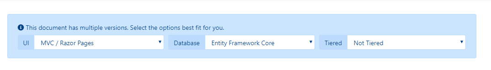
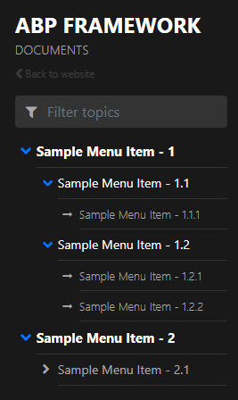

```json
//[doc-seo]
{
    "Description": "Discover the ABP Docs Module for easy software documentation management, supporting GitHub integration and versioning for streamlined workflows."
}
```

# Docs Module

## What is the Docs Module?

The Docs module is a free and open-source application module for publishing software documentation in an ABP application.

### Integration

The module can load documentation from GitHub or the local file system. You can also add a custom document source.

### Hosting

The module renders documentation inside your application. It does not provide a separate hosting service, so the application can be hosted on-premises or in the cloud.

### Versioning

GitHub sources can expose releases or branches as document versions. The UI displays a version selector when multiple versions are available. File-system sources expose a single internal version.

The [ABP documentation](../) also uses this module.

> Docs module follows the [module architecture best practices](../framework/architecture/best-practices/module-architecture.md) guide.

## Installation

The Docs module supports Entity Framework Core and MongoDB. From the solution directory, use the ABP CLI to add the module packages, module dependencies, client-side package and database integration that match your solution:

```bash
abp add-module Volo.Docs
```

For an Entity Framework Core solution with a conventional layered structure, the command adds `builder.ConfigureDocs()` to the `DbContext` in the `.EntityFrameworkCore` (or `.DbMigrations`) project, creates a migration and runs the `DbMigrator` project. When the solution doesn't contain these projects (for example, a single-layer solution), configure the model and apply the migration yourself. Use `--skip-db-migrations` when you want to manage that step yourself. MongoDB does not require an EF Core migration.

For a manual installation, add the Docs packages and module dependencies that correspond to each application layer. MVC/Razor Pages hosts also need the `@abp/docs` package. Keep every package on the same version as the rest of your ABP solution, then run `abp install-libs` in the web project.

### Database configuration

The module uses the `Docs` connection string name and falls back to `Default` when a dedicated connection string is not configured. `AbpDocsDbProperties.DbTablePrefix` and `AbpDocsDbProperties.DbSchema` control the EF Core table names; the prefix also controls the MongoDB collection names. Set these static properties before the persistence model is configured.

Both built-in persistence providers mark the Docs database context with `IgnoreMultiTenancy`. Projects, cached documents and generated PDF metadata are application-wide data and are not partitioned by the current tenant. Do not expose the administration permissions to tenant administrators unless this application-wide behavior is intended.

## Creating a Docs Project

After installation, users with the `Docs.Admin.Projects` permission can open **Administration → Documents → Projects**. The built-in administration UI creates and edits GitHub projects. `Docs.Admin.Projects.Create`, `.Update` and `.Delete` control the corresponding actions. `Docs.Admin.Documents` provides the cached-document administration screen.

The main project fields are:

* **Name**: Display name of the project.
* **ShortName**: URL-friendly identifier. It is normalized to lowercase when the project is created and cannot be changed later.
* **Format**: The built-in web converter supports Markdown (`md`). Register a custom document converter before using another format.
* **DefaultDocumentName**: Initial document name. The default is `Index`.
* **NavigationDocumentName**: Navigation file name. The default is `docs-nav.json`.
* **ParametersDocumentName**: Scriban parameter file name. The default is `docs-params.json`.
* **MinimumVersion**: Oldest listed GitHub version.
* **MainWebsiteUrl**: Target of the project logo.
* **LatestVersionBranchName**: Branch used for the latest documentation.

Deleting a project deletes the project record and its PDF file metadata, but nothing else. Before deleting it, remove its cached documents through document administration, verify and remove its Elasticsearch entries when search is enabled, and delete every generated PDF through **Manage PDF Files** so the BLOB objects are deleted. The project delete operation does not perform these cleanup steps automatically.

The public UI starts at `/documents`. You can change this route with `DocsUiOptions.RoutePrefix`, as shown in the [UI options](#ui-options) section.

### GitHub source

Set **GitHub Root URL** to a tree URL that contains the `{version}` placeholder and points to the directory above the language folders. For example:

```text
https://github.com/abpframework/abp/tree/{version}/docs
```

GitHub projects use releases as the version source by default. Select branches to list repository branches instead. In branch mode, **Version Branch Prefix** filters the branches and removes the prefix from displayed version names. **Latest Version Branch Name** must contain the real branch name, including the prefix when one is used.

The module builds the edit link from the GitHub tree URL and loads relative images and other resources from the same repository and version. An access token is optional for public repositories and is needed for private repositories or higher API limits. The token is stored in the project's extra properties; public project APIs remove it from their responses, but administrators can retrieve it. Protect the database and use a token with only the repository permissions that the Docs host needs.

### File-system source

The `FileSystem` source loads documents from a local root directory stored in the project's `Path` extra property. Its directory layout is the same as the GitHub source:

```text
<project-root>/docs-langs.json
<project-root>/<language-code>/<document-name>
```

File-system projects always use the internal version `1.0.0` and do not provide a version list or an edit link. The source rejects document and resource paths outside the configured project root.

The built-in project create/edit pages currently expose only GitHub fields. Create a file-system project through `IProjectAdminAppService`, a data seeder or another administration UI by setting `DocumentStoreType` to `FileSystem` and the `Path` extra property.

### Language configuration

Place `docs-langs.json` at the project root, outside the language directories:

```json
{
  "languages": [
    {
      "displayName": "English",
      "code": "en",
      "isDefault": true
    },
    {
      "displayName": "Türkçe",
      "code": "tr",
      "isDefault": false
    }
  ]
}
```

When a GitHub source cannot load this file, it falls back to the language configured by `DocsGithubLanguageOptions.DefaultLanguage`, which is English by default. The file-system source requires a valid `docs-langs.json` file.

The language list is cached for 24 hours using the project short name, not the requested version. Keep `docs-langs.json` consistent across all versions. Clear the project cache after changing the manifest; the first version requested after a clear repopulates the project-wide language cache.

### Adding a custom document source

Implement `IDocumentSource`, register the implementation in dependency injection and map a unique source name to it:

```csharp
context.Services.AddTransient<MyDocumentSource>();

Configure<DocumentSourceOptions>(options =>
{
    options.Sources["MySource"] = typeof(MyDocumentSource);
});
```

Use the same source name as the project's `DocumentStoreType`. The factory resolves the mapped type from dependency injection when it loads documents, versions, resources and languages.

## Creating a New Document

The built-in converter renders [Markdown](https://en.wikipedia.org/wiki/Markdown) documents as HTML. The following example demonstrates headings, links, images and code blocks:

~~~markdown
# This is a header

Welcome to Docs Module.

## This is a sub header

 [This is a link](https://abp.io) 


## This is a code block

```csharp
public class Person
{
    public string Name { get; set; }

    public string Address { get; set; }
}
```
~~~

You can also browse the [ABP documentation sources](https://github.com/abpframework/abp/tree/dev/docs/en) for complete examples.

### Conditional Sections with Scriban

The Docs module uses [Scriban](https://scriban.github.io/docs/) to conditionally show or hide parts of a document. Create one parameter document for each language. It contains the available parameters, their values and their display names.

For example, `en/docs-params.json` can contain:

```json
{
    "parameters": [{
        "name": "UI",
        "displayName": "UI",
		"values": {
			"MVC": "MVC / Razor Pages",
			"NG": "Angular"
		}
    },
	{
        "name": "DB",
        "displayName": "Database",
		"values": {
			"EF": "Entity Framework Core",
			"Mongo": "MongoDB"			
		}
    },
	{
        "name": "Tiered",
        "displayName": "Tiered",
		"values": {
			"No": "Not Tiered",
			"Yes": "Tiered"
		}
    }]
}
```

Each document declares the parameters it uses in a JSON block anywhere in the document.

For example:

​```json
//[doc-params]
{
    "UI": ["MVC","NG"],
    "DB": ["EF", "Mongo"],
    "Tiered": ["Yes", "No"]
}
​```

This block is removed while the document is rendered. Its keys and values must match the parameter document.



Now you can use **Scriban** syntax to create sections in your document.

For example:



You can also use variables in a text, adding **_Value** postfix to its key:

```txt
This document assumes that you prefer to use **{{ UI_Value }}** as the UI framework and **{{ DB_Value }}** as the database provider.
```

`Document_Language_Code` and `Document_Version` are predefined keys. They can be used, for example, to build links to another documentation system.

------

> Scriban uses `{{` and `}}` as delimiters. Use the escape block described in the [Scriban language reference](https://scriban.github.io/docs/language/) when the document contains these delimiters as literal text, such as in an Angular example.

## Creating the Navigation Document

Navigation document is the main menu of the documents page. It is located on the left side of the page. It is a `JSON` file. Take a look at the below sample navigation document to understand the structure.

```json
{  
   "items":[  
      {  
         "text":"Sample Menu Item - 1",
         "items":[  
            {  
               "text":"Sample Menu Item - 1.1",
               "items":[  
                  {  
                     "text":"Sample Menu Item - 1.1.1",
                     "path":"SampleMenuItem_1_1_1.md"
                  }
               ]
            },
            {  
               "text":"Sample Menu Item - 1.2",
               "items":[  
                  {  
                     "text":"Sample Menu Item - 1.2.1",
                     "path":"SampleMenuItem_1_2_1.md"
                  },
                  {  
                     "text":"Sample Menu Item - 1.2.2",
                     "path":"SampleMenuItem_1_2_2.md"
                  }
               ]
            }
         ]
      },
      {  
         "text":"Sample Menu Item - 2",
         "items":[  
            {  
               "text":"Sample Menu Item - 2.1",
               "items":[  
                  {  
                     "text":"Sample Menu Item - 2.1.1",
                     "path":"SampleMenuItem_2_1_1.md"
                  }
               ]
            }
         ]
      }
   ]
}
```

The sample JSON file renders the navigation menu shown below.



Implement `INavigationTreePostProcessor` to modify the deserialized navigation tree before it is returned to the UI. The default implementation makes no changes, so a custom implementation can be registered by replacing that service.


## Full-Text Search with Elasticsearch

Elasticsearch integration is disabled by default. Configure the Elasticsearch URL and enable `DocsElasticSearchOptions`:

```json
{
  "ElasticSearch": {
    "Url": "http://localhost:9200"
  }
}
```

```csharp
Configure<DocsElasticSearchOptions>(options =>
{
    options.Enable = true;
    options.IndexName = "docs";
    options.UseApiKeyAuthentication("key-id", "api-key");
});
```

The default index name is `abp_documents`. Use `UseBasicAuthentication(username, password)` instead of `UseApiKeyAuthentication` when the Elasticsearch server uses basic authentication.

The module creates the index during application initialization when it does not exist. Creating, updating or deleting a cached document updates the index. The administration UI can reindex one project or all projects from the documents already stored in the Docs database.

`DefaultElasticClientProvider` creates the Elasticsearch client from these settings. Replace `IElasticClientProvider` in the [dependency injection](../framework/fundamentals/dependency-injection.md) system when the client needs additional configuration.

## Document Caching

The module stores downloaded documents in the Docs database, caches document update metadata and uses the distributed cache for document resources. These configuration values control when that data is refreshed:

```json
{
  "Volo.Docs": {
    "DocumentCacheTimeoutInterval": "06:00:00",
    "DocumentResource.AbsoluteExpirationRelativeToNow": "06:00:00",
    "DocumentResource.SlidingExpiration": "00:30:00"
  }
}
```

The values shown above are the defaults. `DocumentCacheTimeoutInterval` controls how often a stored document is checked against its source. The resource settings control the absolute and sliding expirations for images and other document resources. Resource caching is bypassed in the Development environment.

Users with the `Docs.Admin.Documents` permission can clear a project's cache from the administration UI. This removes the cached language and version metadata, invalidates document update information and causes the stored documents to be refreshed on subsequent requests.

Clearing the project cache does not remove document-resource cache entries. Cached images and other resources remain available until their absolute or sliding cache expiration is reached.


## Row Highlighting

You can apply highlight to specific code lines or a range of sequential lines.
See the following examples:

```
	```C# {3, 5}
	public class Book : Entity<Guid>
	{
	    public string Name { get; set; }
	    public string Surname { get; set; }
	}
	```
```

```
	```C# {2-4}
	public class Book : Entity<Guid>
	{
	    public string Name { get; set; }
	    public string Surname { get; set; }
	}
	```
```

```
	```C# {1, 2-4}
	public class Book : Entity<Guid>
	{
	    public string Name { get; set; }
	    public string Surname { get; set; }
	}
	```
```

## Referencing Next & Previous Documents

The **Docs Module** supports referencing previous and next documents. It's useful if you have a series of documents that are strictly related to each other and need to be followed one after the other. 

To reference the previous and next documents from a document, you should specify the documentation titles and their paths as follows:

```json
//[doc-nav]
{
  "Previous": {
    "Name": "Overall",
    "Path": "testing/overall"
  },
  "Next": {
    "Name": "Integration tests",
    "Path": "testing/integration-tests"
  }
}
```

After you specify the next & previous documents, they will appear at the end of the current documentation like in the following figure:


## UI Options

Configure `DocsUiOptions` to customize routes and document-page behavior:

```csharp
Configure<DocsUiOptions>(options =>
{
    options.RoutePrefix = "docs";
    options.ShowProjectsCombobox = false;
    options.ShowProjectsComboboxLabel = false;
    options.SectionRendering = true;
    options.MultiLanguageMode = true;
    options.EnableEnlargeImage = true;
    options.SingleProjectMode.Enable = true;
    options.SingleProjectMode.ProjectName = "abp";
});
```

The defaults are:

| Option | Default | Description |
| --- | --- | --- |
| `RoutePrefix` | `documents` | Route prefix for the public document pages. |
| `ShowProjectsCombobox` | `true` | Shows the project selector when more than one project is available. |
| `ShowProjectsComboboxLabel` | `true` | Shows the label for the project selector. |
| `SectionRendering` | `true` | Enables Scriban-based conditional sections. |
| `MultiLanguageMode` | `true` | Adds the language to routes and displays the language selector. |
| `EnableEnlargeImage` | `true` | Allows document images to be enlarged in the UI. |
| `SingleProjectMode.Enable` | `false` | Removes the project name from document routes. |

When single-project mode is enabled, `SingleProjectMode.ProjectName` selects the project by short name. If it is empty, the module uses the project automatically only when exactly one project exists.

`DocumentLinksNormalizer` transforms generated links to other documents. Its default removes a trailing `/Index`. `RedirectUrlResolver` applies the corresponding redirect when an incoming URL ends in `/Index`. Replace either delegate when the application needs a different canonical URL convention.

## Google Translate and Programmable Search

The MVC UI can add Google Translate and Google Programmable Search to document pages. Both integrations are disabled by default:

```csharp
Configure<DocsWebGoogleOptions>(options =>
{
    options.EnableGoogleTranslate = true;
    options.IncludedLanguages = ["en", "de", "fr"];
    options.EnableGoogleProgrammableSearchEngine = true;
    options.GoogleSearchEngineId = "search-engine-id";
});
```

`GetCultureLanguageCode` maps the current UI culture to the code passed to Google Translate. The default maps `zh-Hans` to `zh-CN`, `zh-Hant` to `zh-TW` and other cultures to their two-letter ISO language name.

## Generating PDF Files

The administration module can generate a PDF archive for a project, version and language. Generation runs as a background job and stores the archive through ABP's BLOB storing system. Configure a BLOB provider for the application, then configure the generator when its defaults do not match the host:

```csharp
Configure<DocsProjectPdfGeneratorOptions>(options =>
{
    options.BaseUrl = configuration["App:SelfUrl"];
    options.IndexPagePath = "index.md";
    options.CalculatePdfFileTitle = project => project.Name;
});
```

`HtmlLayout` and `HtmlStyle` customize the generated content. `BaseUrl` is used to resolve relative images for local sources. `IndexPagePath` inserts an additional document at the beginning of the archive without adding it to the PDF outline. `CalculatePdfFileName`, `CalculatePdfFileTitle`, `HtmlContentNormalizer` and `DocumentContentNormalizer` provide additional extension points.

`Docs.Admin.Projects.ManagePdfFiles` allows administrators to generate, list and delete archives. Generation creates a ZIP file that contains the rendered PDF documents. Users need `Docs.Common.PdfDownload` to download it, and the public UI displays the download action only when that permission is granted and an archive exists for the selected project, version and language.

PDF generation failures are written to the application logs. The background job does not rethrow failures to the job system, including errors already handled by the generator. A failed run does not make a new archive available, and the background-job system does not automatically retry it as a failed job. Check the host logs and manually start generation again after fixing the error.

## See Also

Docs Module is also available as a standalone application. Check out [VoloDocs](../apps/volo-docs.md).
