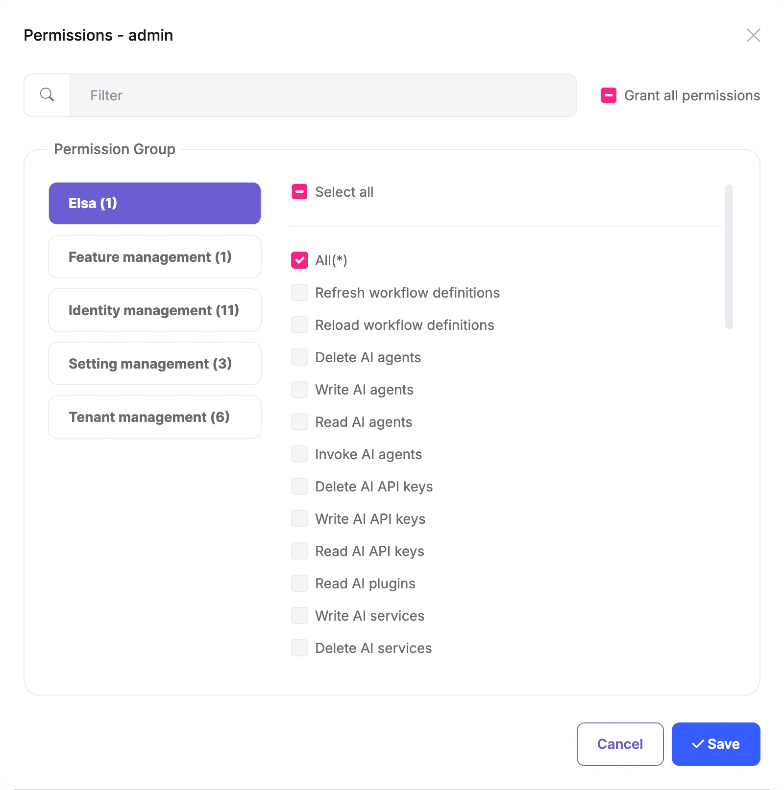
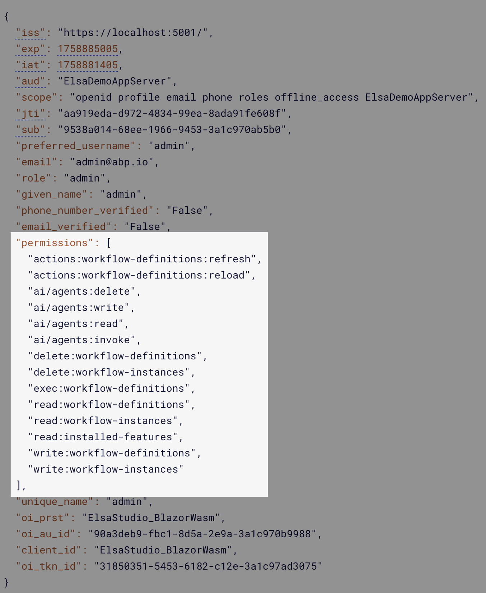
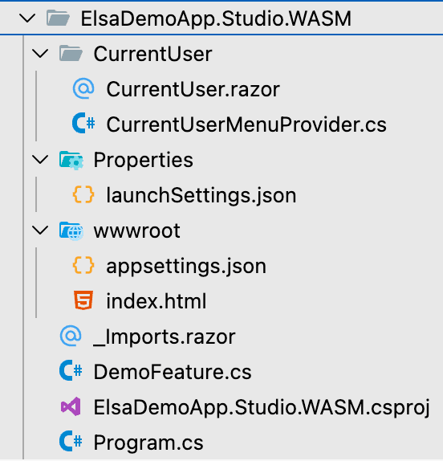
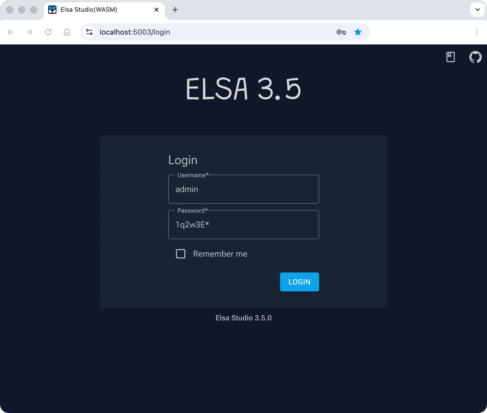
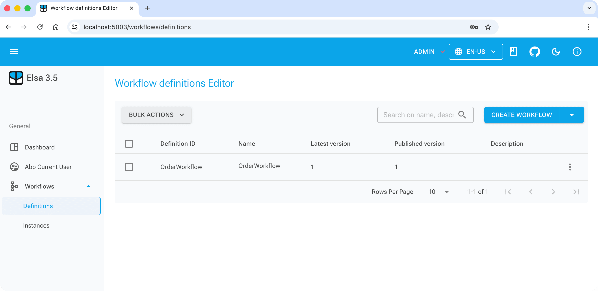

```json
//[doc-seo]
{
    "Description": "Integrate Elsa Workflows into your ABP applications with this Pro module. Learn installation and setup for seamless workflow management."
}
```

# Elsa Module (Pro)

> You must have an [ABP Team or a higher license](https://abp.io/pricing) to use this module.

This module integrates [Elsa Workflows](https://docs.elsaworkflows.io/) into ABP Framework applications and is designed to make it easy for developers to use Elsa's capabilities within their ABP-based projects. For creating, managing, and customizing workflows themselves, please refer to [the official Elsa documentation](https://docs.elsaworkflows.io/).

## How to Install

The Elsa module is not installed in [the startup templates](../solution-templates/layered-web-application) by default and must be installed manually. There are two ways of installing a module into your application and each one of these approaches is explained in the next sections.

### Using ABP CLI

Use the ABP CLI `add-module` command to add the Elsa module to an existing solution:

```bash
abp add-module Volo.Elsa
```

### Manual Installation

If you modified your solution structure, adding the module using ABP CLI might not work for you. In such cases, you can add the Elsa module into your solution manually.

To do this, add the packages listed below to the matching projects in your solution. For example, add the `Volo.Abp.Elsa.Application` package to your **{ProjectName}.Application.csproj** as shown below:

```xml
<PackageReference Include="Volo.Abp.Elsa.Application" Version="x.x.x" />
```

After adding the package references, open the module class of the project (e.g.: `{ProjectName}ApplicationModule`) and add the code below to the `DependsOn` attribute:

```csharp
[DependsOn(
  //...
  typeof(AbpElsaApplicationModule)
)]
```

### `AbpElsaAspNetCoreModule` and `AbpElsaIdentityModule`

Add these two modules to the project that hosts authentication. Add the `Volo.Abp.Elsa.AspNetCore` and `Volo.Abp.Elsa.Identity` packages to that project, then add `AbpElsaAspNetCoreModule` and `AbpElsaIdentityModule` to the `DependsOn` attribute of its module class:

```xml
<PackageReference Include="Volo.Abp.Elsa.AspNetCore" Version="x.x.x" />
<PackageReference Include="Volo.Abp.Elsa.Identity" Version="x.x.x" />
```

```csharp
[DependsOn(
  //...
  typeof(AbpElsaAspNetCoreModule),
  typeof(AbpElsaIdentityModule)
)]
```

## The Elsa Module

The ABP Elsa module provides the following integration points:

- `AbpElsaAspNetCoreModule` maps ABP permissions to the `permissions` claims expected by Elsa.
- Calling `UseAbpIdentity` replaces Elsa's user credential validator and access token issuer with implementations backed by the ABP Identity module. `AbpElsaIdentityModule` provides the required ABP module dependencies.
- `AbpElsaApplicationContractsModule` defines the permissions used by the Elsa Workflow API.

The module does not add its own workflow aggregates, application services or HTTP API controllers. Workflow definitions, instances and runtime data are managed by Elsa and must be configured through Elsa's own persistence providers. The ABP Entity Framework Core and MongoDB packages register empty module `DbContext` shells; they do not store workflow data or replace Elsa's workflow management and runtime stores.

The MVC, Blazor and MudBlazor packages do not embed Elsa Studio. Use the standalone Elsa Studio application described in the [Elsa Studio](#elsa-studio) section.

## Configure the Elsa Server

You need to configure Elsa in your ABP application to use its features. You can do that in the `ConfigureServices` method of your `YourElsaAppModule` class as shown below:

> For more information about configuring Elsa, please refer to [the official Elsa documentation](https://docs.elsaworkflows.io/).

```csharp
private void ConfigureElsa(ServiceConfigurationContext context, IConfiguration configuration)
{
    var connectionString = configuration.GetConnectionString("Default")!;
    context.Services
        .AddElsa(elsa => elsa
            .UseAbpIdentity(identity => // Use UseAbpIdentity instead of UseIdentity to integrate with ABP Identity module
            {
                identity.TokenOptions = options => options.SigningKey = "large-signing-key-for-signing-JWT-tokens";
            })
            .UseWorkflowManagement(management => management.UseEntityFrameworkCore(ef => ef.UseSqlServer(connectionString)))
            .UseWorkflowRuntime(runtime => runtime.UseEntityFrameworkCore(ef => ef.UseSqlServer(connectionString)))
            .UseScheduling()
            .UseJavaScript()
            .UseLiquid()
            .UseCSharp()
            .UseHttp(http => http.ConfigureHttpOptions = options => configuration.GetSection("Http").Bind(options))
            .UseWorkflowsApi()
            .AddActivitiesFrom<YourElsaAppModule>()
            .AddWorkflowsFrom<YourElsaAppModule>()
        );
}
```

The example binds Elsa's HTTP activity options from the `Http` configuration section. `BaseUrl` is the public URL of the workflow server and `BasePath` is the path used for HTTP endpoint activities:

```json
{
  "Http": {
    "BaseUrl": "https://localhost:5001",
    "BasePath": "/api/workflows"
  }
}
```

Do not hard-code the signing key in production. Store a sufficiently long key in a secure configuration source and assign it to `identity.TokenOptions`.

### Configure Authentication

An ABP host normally accepts OpenIddict access tokens, while Elsa Identity issues its own access tokens for the Elsa Studio login. Register the composite authentication scheme so the same workflow API can accept both token types:

```csharp
private void ConfigureAuthentication(ServiceConfigurationContext context)
{
    context.Services.ForwardIdentityAuthenticationForBearer(
        AbpElsaJwtBearerDefaults.AuthenticationScheme
    );
    context.Services.AddElsaJwtBearer(
        OpenIddictValidationAspNetCoreDefaults.AuthenticationScheme
    );
}
```

`ForwardIdentityAuthenticationForBearer` forwards bearer requests from the application cookie to the composite Elsa scheme. The argument passed to `AddElsaJwtBearer` is the existing bearer scheme that the composite handler tries in addition to Elsa's own scheme. Use the scheme configured by your application if it is different from `OpenIddictValidationAspNetCoreDefaults.AuthenticationScheme`.

Enable the Elsa endpoints and workflow middleware after authentication and authorization in the application initialization pipeline:

```csharp
app.UseAuthentication();
app.UseAbpOpenIddictValidation();
app.UseAuthorization();

app.UseWorkflowsApi();
app.UseWorkflows();
```

## Elsa Database Migration

Elsa uses its own database contexts and migration system. The ABP Elsa module does not define workflow aggregate roots or entities, so you don't add Elsa tables to your application's ABP migration `DbContext`. Configure the Elsa workflow management and runtime stores instead:

```csharp
.UseWorkflowManagement(management => management.UseEntityFrameworkCore(ef => ef.UseSqlServer(connectionString)))
.UseWorkflowRuntime(runtime => runtime.UseEntityFrameworkCore(ef => ef.UseSqlServer(connectionString)))
```

With the Entity Framework Core configuration shown above, Elsa runs its embedded migrations by default. Automatic migrations are convenient during development. For production, review Elsa's migration options and use a controlled deployment strategy before disabling automatic migrations.

> See [Elsa's database configuration guide](https://docs.elsaworkflows.io/getting-started/database-configuration) and [EF Core migrations guide](https://docs.elsaworkflows.io/guides/persistence/ef-migrations) for provider and migration options.

## Elsa Module Permissions

The Elsa Workflow API endpoints check permissions. The ABP Elsa module defines these permissions for the host side. They are not available to tenant users.

You can use the ABP Permission Management module to grant individual Elsa permissions or the `*` wildcard permission. When `*` is granted, the claims contributor emits only the wildcard instead of adding every individual permission.

`AbpElsaAspNetCoreModule` checks the granted permissions and adds them to the current user's `permissions` claims:



You can also grant individual permissions to a host role or user. Elsa Server reads the resulting claims and allows or denies access:



## Elsa Studio

[Elsa Studio](https://docs.elsaworkflows.io/application-types/elsa-studio) is a **standalone** web application that allows you to design, manage, and execute workflows. It is built using **Blazor Server/WebAssembly**.

`ElsaDemoApp.Studio.WASM` is a sample Blazor WebAssembly project that demonstrates how to use Elsa Studio with an Elsa Server hosted in an ABP application.

> Elsa Studio has its own layout and theme, and you can't integrate it into an ABP Blazor project for now.



Please check the [Elsa Workflows - Sample Workflow Demo](../samples/elsa-workflows-demo.md) document to download its source code for review.

Configure Studio with the workflow server's Elsa API URL. The default Elsa API base path is `/elsa/api`:

```json
{
  "Backend": {
    "Url": "https://localhost:5001/elsa/api"
  }
}
```

### Elsa Studio Authentication

Elsa Studio supports two authentication methods:

* Password Flow Authentication
* Code Flow Authentication

Configure the claim types used by Elsa Studio before choosing an authentication flow:

```csharp
builder.Services.Configure<IdentityTokenOptions>(options =>
{
    options.NameClaimType = "preferred_username";
    options.RoleClaimType = "role";
});
```

#### Elsa Studio - Password Flow Authentication

`AbpElsaIdentityModule` integrates with the [ABP Identity module](./identity-pro.md) to check the Elsa Studio *username* and *password* against host-side ABP Identity users.

You need to replace `UseIdentity` with `UseAbpIdentity` when configuring Elsa in your Elsa server project as follows:

```csharp
context.Services
    .AddElsa(elsa => elsa
        .UseAbpIdentity(identity =>
        {
            identity.TokenOptions = options => options.SigningKey = "large-signing-key-for-signing-JWT-tokens";
        })
    );
```

After that, add the following code to use Elsa Identity as the login method in your Elsa Studio client project:

```csharp
builder.Services.AddLoginModule().UseElsaIdentity();
```

Then, you can log in to the Elsa Studio application with the host admin credentials:



Once you have logged in, you can define and manage workflows and view their execution instances:



#### Elsa Studio - Code Flow Authentication

ABP applications use [OpenIddict](./openiddict-pro.md) for authentication. So, you can use the [Authorization Code Flow](https://oauth.net/2/grant-types/authorization-code/) to authenticate Elsa Studio.

To do that, you can add the code block below to your Elsa Studio client project:

```csharp
builder.Services.AddLoginModule().UseOpenIdConnect(connectConfiguration =>
{
    var authority = configuration["AuthServer:Authority"]!.TrimEnd('/'); // Your Server URL
    connectConfiguration.AuthEndpoint = $"{authority}/connect/authorize";
    connectConfiguration.TokenEndpoint = $"{authority}/connect/token";
    connectConfiguration.EndSessionEndpoint = $"{authority}/connect/endsession";
    connectConfiguration.ClientId = configuration["AuthServer:ClientId"]!;
    connectConfiguration.Scopes = ["openid", "profile", "email", "phone", "roles", "offline_access", "ElsaDemoAppServer"];
});
```

After that, Elsa Studio will redirect to your ABP application's login page, then redirect back to Elsa Studio after the successful login.

The ABP authentication server must also contain a public OpenIddict application for Studio. The sample's data seed reads the following configuration and registers `https://localhost:5003/signin-oidc` as the redirect URI:

```json
{
  "OpenIddict": {
    "Applications": {
      "ElsaStudio_BlazorWasm": {
        "ClientId": "ElsaStudio_BlazorWasm",
        "RootUrl": "https://localhost:5003"
      }
    }
  }
}
```

If your solution uses a different OpenIddict data-seeding implementation, register an equivalent public client with the authorization-code and refresh-token grants, including the Studio redirect URI, post-logout redirect URI and API scope.

## Elsa Workflows - Sample Workflow Demo

ABP provides a complete demo application that shows how to use the Elsa module in an ABP application. If you get stuck, download the demo to review the integration points. See the [Elsa Workflows - Sample Workflow Demo](../samples/elsa-workflows-demo.md) page for more information.
