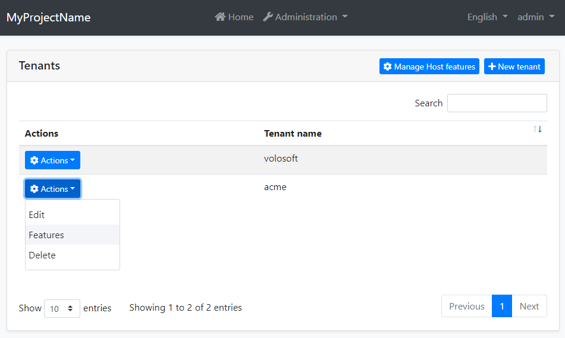
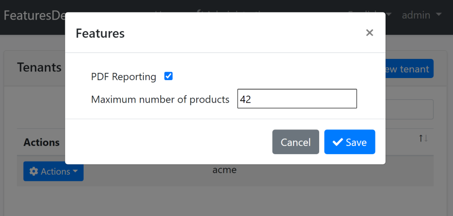

```json
//[doc-seo]
{
    "Description": "Learn how to implement and manage feature flags in your application using the ABP Framework's Feature Management module, with installation and customization options."
}
```

# Feature Management Module

The Feature Management module persists feature values and implements the `IFeatureStore` interface defined by the [Feature System](../framework/infrastructure/features.md). It also provides management services and reusable user interfaces for reading, changing and resetting values for a feature provider.

> This document covers only the feature management module which persists feature values to a database. See [the features](../framework/infrastructure/features.md) document for more about the feature system.

## How to Install

This module comes as pre-installed (as NuGet/NPM packages). You can continue to use it as package and get updates easily, or you can include its source code into your solution (see `get-source` [CLI](../cli) command) to develop your custom module.

### The Source Code

The source code of this module can be accessed [here](https://github.com/abpframework/abp/tree/dev/modules/feature-management). The source code is licensed with [MIT](https://choosealicense.com/licenses/mit/), so you can freely use and customize it.

## User Interface

### Feature Management Dialog

Feature management module provides a reusable dialog to manage features related to an object. For example, the [Tenant Management Module](./tenant-management.md) uses it to manage features of tenants in the Tenant Management page.



When you click *Actions* -> *Features* for a tenant, the feature management dialog is opened. An example screenshot from this dialog with two features defined:



In this dialog, you can enable, disable or set values for the features for a tenant.

### Host Feature Management

The MVC, Blazor and MudBlazor packages add a **Feature Management** group to the Setting Management page. The group is available on the host side to users granted the `FeatureManagement.ManageHostFeatures` permission. It opens the same reusable dialog with the tenant provider (`T`) and an empty provider key, which represents host feature values.

For Angular applications, register the setting-tab contributor in the application configuration:

````ts
import { ApplicationConfig } from '@angular/core';
import { provideFeatureManagementConfig } from '@abp/ng.feature-management';

export const appConfig: ApplicationConfig = {
  providers: [provideFeatureManagementConfig()],
};
````

`provideFeatureManagementConfig` adds the host Feature Management tab to Setting Management and protects it with the same `FeatureManagement.ManageHostFeatures` policy. The current application templates already register this provider.

### Reusing the Feature Management Dialog

All UI implementations accept a provider name and an optional provider key. The built-in provider names are `D` for default values, `C` for configuration values, `E` for editions and `T` for tenants. Default and configuration values are read-only, while edition, tenant and custom providers can persist values.

#### MVC

Create an `abp.ModalManager` for the module page and pass the provider information when opening it:

````js
const featureManagementModal = new abp.ModalManager(
  abp.appPath + 'FeatureManagement/FeatureManagementModal'
);

featureManagementModal.open({
  providerName: 'T',
  providerKey: tenantId,
  providerKeyDisplayName: tenantName,
});
````

#### Blazor and MudBlazor

Render the `FeatureManagementModal` component and call its `OpenAsync` method:

````razor
@using Volo.Abp.FeatureManagement.Blazor.Components

<FeatureManagementModal @ref="FeatureManagementModal" />

@code {
    private FeatureManagementModal FeatureManagementModal = default!;

    private Task OpenFeaturesAsync(Guid tenantId, string tenantName)
    {
        return FeatureManagementModal.OpenAsync("T", tenantId.ToString(), tenantName);
    }
}
````

For a MudBlazor application, use the `Volo.Abp.FeatureManagement.Blazor.MudBlazor.Components` namespace. The component has the same `OpenAsync(providerName, providerKey, providerKeyDisplayName)` contract.

#### Angular

`FeatureManagementComponent` is a standalone component exported from `@abp/ng.feature-management`:

````ts
import { Component, signal } from '@angular/core';
import { FeatureManagementComponent } from '@abp/ng.feature-management';

@Component({
  selector: 'app-tenant-features',
  imports: [FeatureManagementComponent],
  templateUrl: './tenant-features.component.html',
})
export class TenantFeaturesComponent {
  readonly visible = signal(false);
  tenantId = '';
}
````

````html
<abp-feature-management
  [visible]="visible()"
  (visibleChange)="visible.set($event)"
  providerName="T"
  [providerKey]="tenantId"
/>
````

Use `eFeatureManagementComponents.FeatureManagement` as the component key when replacing the dialog through the Angular component replacement system.

## IFeatureManager

`IFeatureManager` is the main service provided by this module. It reads and changes feature values for registered feature management providers. `IFeatureManager` is typically used by the *Feature Management Dialog*. However, you can inject it if you need to set a feature value directly.

> If you just want to read feature values, use the `IFeatureChecker` as explained in the [Features document](../framework/infrastructure/features.md).

**Example: Get/set a feature's value for a tenant**

````csharp
using System;
using System.Threading.Tasks;
using Volo.Abp.DependencyInjection;
using Volo.Abp.FeatureManagement;

namespace Demo
{
    public class MyService : ITransientDependency
    {
        private readonly IFeatureManager _featureManager;

        public MyService(IFeatureManager featureManager)
        {
            _featureManager = featureManager;
        }

        public async Task SetFeatureDemoAsync(Guid tenantId, string value)
        {
            await _featureManager
                .SetForTenantAsync(tenantId, "Feature1", value);
            
            var currentValue = await _featureManager
                .GetOrNullForTenantAsync("Feature1", tenantId);
        }
    }
}
````

`SetAsync` and the provider-specific extension methods validate the value against the feature definition's value validator. By default, setting a value equal to the fallback value clears the explicit provider value; pass `forceToSet: true` when an explicit value must be kept even if it currently matches the fallback. Use `DeleteAsync(providerName, providerKey)` to reset all values for a provider object to their fallbacks.

## Feature Management Providers

Features Management Module is extensible, just like the [features system](../framework/infrastructure/features.md).  You can extend it by defining feature management providers. There are 4 pre-built feature management providers registered in the following order:

* `DefaultValueFeatureManagementProvider`: Gets the value from the default value of the feature definition. It can not set the default value since default values are hard-coded on the feature definition.
* `ConfigurationFeatureManagementProvider`: Gets the value from the [IConfiguration service](../framework/fundamentals/configuration.md).
* `EditionFeatureManagementProvider`: Gets or sets the feature values for an edition. Edition is a group of features assigned to tenants. Edition system has not implemented by the Tenant Management module. You can implement it yourself or purchase the ABP [SaaS Module](https://abp.io/modules/Volo.Saas) which implements it and also provides more SaaS features, like subscription and payment.
* `TenantFeatureManagementProvider`: Gets or sets the features values for tenants.

`IFeatureManager` uses these providers on get/set methods. Typically, every feature management provider defines extension methods on the `IFeatureManager` service (like `SetForTenantAsync` defined by the tenant feature management provider).

If you want to create your own provider, implement the `IFeatureManagementProvider` interface or inherit from the `FeatureManagementProvider` base class:

````csharp
public class CustomFeatureProvider : FeatureManagementProvider
{
    public const string ProviderName = "Custom";

    public override string Name => ProviderName;

    public CustomFeatureProvider(IFeatureManagementStore store)
        : base(store)
    {
    }
}
````

`FeatureManagementProvider` base class makes the default implementation (using the `IFeatureManagementStore`) for you. You can override base methods as you need. Every provider must have a unique name, which is `Custom` in this example (keep it short since it is saved to database for each feature value record).

Once you create your provider class, you should register it using the `FeatureManagementOptions` [options class](../framework/fundamentals/options.md):

````csharp
Configure<FeatureManagementOptions>(options =>
{
    options.Providers.Add<CustomFeatureProvider>();
    options.ProviderPolicies[CustomFeatureProvider.ProviderName] =
        "MyApp.Features.Manage";
});
````

The order of the providers are important. Providers are executed in the reverse order. That means the `CustomFeatureProvider` is executed first for this example. You can insert your provider in any order in the `Providers` list.

The `ProviderPolicies` entry is required when the custom provider is managed through `IFeatureAppService` or one of the reusable dialogs. Map the provider name to an authorization policy that grants access to the corresponding provider object. The application service rejects get, update and reset operations when no policy is mapped.

The management application service exposes get, update and reset operations through `IFeatureAppService`. The HTTP API maps the same operations to `GET`, `PUT` and `DELETE` requests at `/api/feature-management/features`, using `providerName` and `providerKey` to identify the managed object.

## Custom Value Validators

Feature definitions can use custom `IValueValidator` implementations. When those definitions are persisted or returned by the management API, the module must be able to reconstruct the validator from its serialized name. Define a parameterless validator and register a matching factory during pre-configuration:

````csharp
[Serializable]
[ValueValidator("URL")]
public class UrlValueValidator : ValueValidatorBase
{
    public override bool IsValid(object? value)
    {
        return Uri.TryCreate(value?.ToString(), UriKind.Absolute, out _);
    }
}
````

````csharp
public override void PreConfigureServices(ServiceConfigurationContext context)
{
    context.Services.PreConfigure<ValueValidatorFactoryOptions>(options =>
    {
        options.ValueValidatorFactory.Add(
            new ValueValidatorFactory<UrlValueValidator>("URL")
        );
    });
}
````

The factory name must match the name supplied by `ValueValidatorAttribute`. The module registers factories for the built-in `NULL`, `BOOLEAN`, `NUMERIC` and `STRING` validators.

## Database Providers

The Entity Framework Core and MongoDB packages persist the same three record types: feature groups, feature definitions and feature values.

### Common

#### Table / Collection Prefix and Schema

All tables and collections use the `Abp` prefix by default. Set the static `AbpFeatureManagementDbProperties.DbTablePrefix` property to change the prefix. `AbpFeatureManagementDbProperties.DbSchema` changes the schema for database providers that support schemas.

#### Connection String

The module uses `AbpFeatureManagement` as the connection string name. If this connection string is not configured, it falls back to the `Default` connection string. See the [connection strings](../framework/fundamentals/connection-strings.md) documentation for details.

### Entity Framework Core

The Entity Framework Core provider maps the following tables:

* **AbpFeatureGroups**
* **AbpFeatures**
* **AbpFeatureValues**

### MongoDB

The MongoDB provider maps the following collections:

* **AbpFeatureGroups**
* **AbpFeatures**
* **AbpFeatureValues**

## See Also

* [Features](../framework/infrastructure/features.md)
