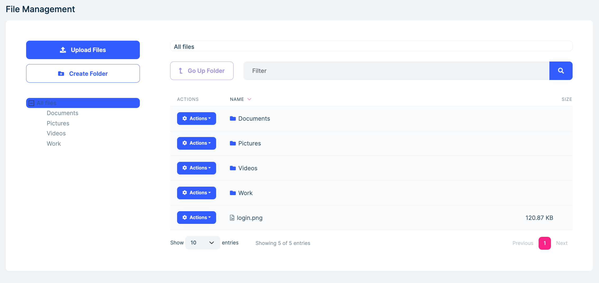

```json
//[doc-seo]
{
    "Description": "Discover the File Management Module for ABP Framework, enabling efficient file uploads, downloads, and organization with multi-tenancy support."
}
```

# File Management Module (Pro)

> You must have an [ABP Team or a higher license](https://abp.io/pricing) to use this module.

This module is used to upload, download and organize files in a hierarchical folder structure. It is also compatible to multi-tenancy and you can determine total size limit for your tenants.

This module is based on the [BLOB Storing](../framework/infrastructure/blob-storing) system, so it can use different storage providers to store the file contents.

See [the module description page](https://abp.io/modules/Volo.FileManagement) for an overview of the module features.

## How to Install

File Management module is not installed in [the startup templates](../solution-templates/layered-web-application). So, it needs to be installed manually. There are two ways of installing a module into your application.

### 1. Using ABP CLI

ABP CLI allows adding a module to a solution using `add-module` command. You can check its [documentation](../cli#add-module) for more information. So, file management module can be added using the command below;

```bash
abp add-module Volo.FileManagement
```

### 2. Manual Installation

If you modified your solution structure, adding module using ABP CLI might not work for you. In such cases, file management module can be added to a solution manually.

In order to do that, add packages listed below to matching project on your solution. For example, `Volo.FileManagement.Application` package to your **{ProjectName}.Application.csproj** like below;

```xml
<PackageReference Include="Volo.FileManagement.Application" Version="x.x.x" />
```

After adding the package reference, open the module class of the project (eg: `{ProjectName}ApplicationModule`) and add the below code to the `DependsOn` attribute.

```csharp
[DependsOn(
  //...
  typeof(FileManagementApplicationModule)
)]
```

> If you are using Blazor Web App, add the `Volo.FileManagement.Blazor.WebAssembly` package to the **{ProjectName}.Blazor.Client.csproj** project and the `Volo.FileManagement.Blazor.Server` package to the **{ProjectName}.Blazor.csproj** project.

If your project is using `EntityFrameworkCore`, you need to add following configuration to `OnModelCreating` method at your `DbContext`.

If your project is using `MongoDB`, you need to add following configuration to `CreateModel` method at your `DbContext`.

```csharp
builder.ConfigureFileManagement();
```

> If you are using EntityFrameworkCore, do not forget to add a new migration and update your database.

File Management module's MVC user interface depends on following npm packages. add `@volo/file-management` npm package to your `package.json` file.

```json
{
  "dependencies": {
    "@volo/file-management": "~x.x.x"
  }
}
```

> After adding packages, you need to run `abp install-libs` command in the folder of your `Web` project.

#### Angular UI

For a standalone Angular application, register the File Management menu configuration in `app.config.ts`:

```ts
import { ApplicationConfig } from '@angular/core';
import { provideFileManagementConfig } from '@volo/abp.ng.file-management/config';

export const appConfig: ApplicationConfig = {
  providers: [provideFileManagementConfig()],
};
```

Lazy-load the File Management routes in `app.routes.ts`:

```ts
import { Routes } from '@angular/router';

export const APP_ROUTES: Routes = [
  {
    path: 'file-management',
    loadChildren: () =>
      import('@volo/abp.ng.file-management').then(m => m.createRoutes()),
  },
];
```

The `createRoutes` function accepts `entityActionContributors`, `toolbarActionContributors`, `entityPropContributors` and `xsrfHeaderName`. These contributors target `eFileManagementComponents.FolderContent`. See the Angular guides for [entity actions](../framework/ui/angular/entity-action-extensions.md), [page toolbars](../framework/ui/angular/page-toolbar-extensions.md) and [table columns](../framework/ui/angular/data-table-column-extensions.md).

Use `withUppyOptions` with `provideFileManagementConfig` when you need to customize the Angular uploader's Uppy options. The startup templates already register the provider and lazy route when the module is selected.

Please visit [document on feature libraries](../framework/ui/angular/feature-libraries.md) to learn how you can install and set it up in your Angular application.

## Setting BLOB Provider

File Management module is based on the [BLOB Storing](../framework/infrastructure/blob-storing) system as defined before, and it uses `FileManagementContainer` as a BLOB container.

You must set a BLOB provider for `FileManagementContainer`.

```csharp
Configure<AbpBlobStoringOptions>(options =>
{
    options.Containers.Configure<FileManagementContainer>(c =>
    {
        c.UseDatabase(); // You can use FileSystem or Azure providers also.
    });
});
```

Please check the [BLOB Storage Providers documentation](../framework/infrastructure/blob-storing#blob-storage-providers) for more information about providers and how to use them.

File contents are stored with the file descriptor's ID as the BLOB name. Renaming or moving a file only changes its descriptor. Deleting a file removes both the descriptor and its BLOB. Deleting a directory recursively deletes its subdirectories, file descriptors and file BLOBs, so treat directory deletion as a destructive operation.

The descriptor database and the configured BLOB provider are separate resources. A custom workflow that calls the domain services directly should handle failures between metadata and BLOB operations; a database transaction cannot roll back an external BLOB provider.

## Packages

This module follows the [module development best practices guide](../framework/architecture/best-practices) and consists of several NuGet and NPM packages. See the guide if you want to understand the packages and relations between them.

You can visit [File Management module package list page](https://abp.io/packages?moduleName=Volo.FileManagement) to see list of packages related with this module.

## User Interface

### Menu Items

File Management module adds the following items to the "Main" menu, under the "Administration" menu item:

- **File Management**: List, view all folder structure and files.

`FileManagementMenuNames` class has the constants for the menu item names.

### Pages

#### File Management

File Management page is used to create folders, upload files and view the list of folders and files that stored in the application.



##### Folders

You can create a new folder by clicking `Create Folder` button that located at top left on the page. The folder will be created at active directory.

You can move a folder to another directory on the left tree view.

You can rename a folder by clicking `Actions -> Rename` on the table.

##### Files

You can upload files by clicking `Upload Files` button that located at top left on the page. This will open a new modal for selecting your local files to upload. The files will be uploaded at active directory.

You can move files by clicking `Actions -> Move` on the table.

You can rename a file by clicking `Actions -> Rename` on the table.

The **Download** action first requests a short-lived download token and then navigates to the download endpoint. The **Preview** action is available for supported image files. The **Delete** action removes the stored content in addition to its file descriptor.

The built-in UIs require an explicit overwrite choice when a file with the same name already exists in the current directory. Their upload pre-checks validate names, detect duplicates and check the current storage quota before the file content is sent. The upload HTTP API does not require this pre-check, and `CreateFileInputWithStream.OverrideExisting` defaults to `true`. A direct API client should call the pre-check endpoint and set `OverrideExisting` explicitly when it needs the same protection.

###### File Sharing

To share a file, click `Actions -> Share` in the table. Once sharing is enabled, you can copy the shared link directly from the table.

> Anyone with the shared link will be able to access the file while sharing is enabled.

Shared links use a protected token that identifies the tenant and file. The token has no built-in expiration time; disabling sharing or deleting the file makes the link unavailable. Disabling sharing is not permanent link revocation: re-enabling the same file makes previously issued links valid again, and individual links cannot be revoked. Treat the URL as a secret. Persist the ASP.NET Core Data Protection key ring across restarts and deployments, and configure every application instance that serves these links to use the same key store and application name.

### Share URL Origin in Tiered Applications

MVC, Blazor and MudBlazor use a UI-specific option when they build copied share URLs. Configure the option when the HTTP API is hosted at a different public origin than the UI:

```csharp
Configure<FileManagementWebOptions>(options =>
{
    options.FileDownloadRootUrl = "https://api.example.com";
});
```

Use `FileManagementBlazorOptions` for the standard Blazor UI or `FileManagementBlazorMudBlazorOptions` for the MudBlazor UI. For copied share URLs, MVC falls back to the browser origin, while the Blazor UIs fall back to `NavigationManager.BaseUri`. These options only change copied share URLs. MVC authenticated downloads use the same-origin download endpoint; the Blazor UIs resolve the download origin from the File Management remote service configuration.

### Resource-Based Permissions

The module supports both module-wide permissions and resource permissions for individual directories and files. Users with a module-wide create, update, delete or view permission can perform that operation throughout File Management. A user without the corresponding module-wide permission can perform it when a matching resource permission is granted.

Directory resource permissions are inherited by descendants. For example, `View` on a directory grants view access to its descendant directories and files, while `Add` grants creation in that directory and its descendants. File-level `View`, `Edit`, `Move` and `Delete` grants apply to the selected file. Creating an item at the root still requires the module-wide create permission because the root is not a directory resource.

The `ManagePermissions` permissions show a **Permissions** action in the MVC, standard Blazor and Angular UIs. This action opens the Resource Permission Management UI for the selected directory or file. The MudBlazor UI does not currently provide this action. File sharing is controlled separately by `FileManagement.FileDescriptor.Share`; a resource permission does not grant sharing access.

### HTTP API and Download Tokens

The directory API is rooted at `/api/file-management/directory-descriptor` and exposes get, list, content, create, rename, move and delete operations. The file API is rooted at `/api/file-management/file-descriptor` and exposes list, upload pre-check, upload, content, rename, move, delete, storage information, download and sharing operations.

Rename and move inputs carry the descriptor's concurrency stamp. API clients should return the latest stamp received from a descriptor or directory-content response so concurrent changes are detected instead of silently overwritten.

Authenticated clients download a private file in two steps:

1. Call `GET /api/file-management/file-descriptor/download/{id}/token`. This operation checks the module-wide or resource `View` permission.
2. Navigate to `GET /api/file-management/file-descriptor/download/{id}?token=...`.

The download endpoint is anonymous because the token is the credential. A token is bound to one file and tenant, expires after 60 seconds and can be reused during that interval. Do not log or expose it. Public shared files use the separate anonymous `GET /api/file-management/file-descriptor/share?shareToken=...` endpoint.

## Data Seed

This module doesn't seed any data.

## Internals

### Domain Layer

#### Aggregates

This module follows the [Entity Best Practices & Conventions](../framework/architecture/best-practices/entities.md) guide.

##### Directory and File Descriptors

- `DirectoryDescriptor` (aggregate root): Represents a folder.
- `FileDescriptor` (aggregate root): Represents a file.

#### Repositories

This module follows the [Repository Best Practices & Conventions](../framework/architecture/best-practices/repositories.md) guide.

Following custom repositories are defined for this module:

- `IDirectoryDescriptorRepository`
- `IFileDescriptorRepository`

#### Domain Services

This module follows the [Domain Services Best Practices & Conventions](../framework/architecture/best-practices/domain-services.md) guide.

##### DirectoryManager

`DirectoryManager` is used to manage your folders like create, rename, move and delete.

##### FileManager

`FileManager` is used to manage your files like create, rename, move and delete.

### Settings

This module doesn't define any setting.

### Features

You can enable or disable this module and set a maximum storage size for each tenant. The module defines these features:

- `FileManagement.Enable`: Enables the module. The default is `true`.
- `FileManagement.StorageSize`: Sets the numeric quota from `1` through `8000`. The default is `1`.
- `FileManagement.StorageSizeUnit`: Selects `Byte`, `Kilobyte`, `Megabyte`, `Gigabyte` or `Terabyte`. The default is `Terabyte`.

The default quota is therefore 1 TB. Usage is calculated from file descriptors in the current tenant context. An upload is rejected when the existing usage plus the incoming content reaches or exceeds the configured maximum.

Quota checking reads the current total before storing a file; it does not reserve capacity or lock concurrent uploads. If the quota is a strict security or billing boundary, serialize uploads for a tenant or add an application-level reservation mechanism around the upload operation.

### Application Layer

#### Application Services

- `DirectoryDescriptorAppService` (implements `IDirectoryDescriptorAppService`): Implements the use cases of the file management UI.
- `FileDescriptorAppService` (implements `IFileDescriptorAppService`): Implements the use cases of the file management UI.

### File Icon Configuration

`FileIconOption` maps file extensions to Font Awesome classes or image URLs. Configure it in a module to add an extension, replace a built-in mapping or change the default icon:

```csharp
Configure<FileIconOption>(options =>
{
    options.SetFileIcon(
        "cad",
        new FileIconInfo("fa-solid fa-cube", FileIconType.FontAwesome));
    options.SetDefaultIcon(
        new FileIconInfo("/images/file.svg", FileIconType.Url));
});
```

The MVC, standard Blazor and Angular UIs render the `IconInfo` returned by the application service and therefore use this configuration. The MudBlazor UI currently selects Material icons from the file extension and is not affected by `FileIconOption`.

### Extending the Entities

`DirectoryDescriptor` and `FileDescriptor` support the [Module Entity Extensions](../framework/architecture/modularity/extending/module-entity-extensions.md) system. Configure extra properties in the `Domain.Shared` project before the database model is created:

```csharp
ObjectExtensionManager.Instance.Modules()
    .ConfigureFileManagement(fileManagement =>
    {
        fileManagement.ConfigureDirectoryDescriptor(directory =>
        {
            directory.AddOrUpdateProperty<string>("Classification");
        });

        fileManagement.ConfigureFileDescriptor(file =>
        {
            file.AddOrUpdateProperty<string>("ExternalId");
        });
    });
```

The module maps these extra properties through its extensible input and output DTOs and applies the corresponding EF Core object-extension mappings. Add the matching UI extension when the property must be editable or visible in a built-in UI.

### Database Providers

#### Common

##### Table/Collection Prefix & Schema

All tables/collections use the `Fm` prefix by default. Set static properties on the `FileManagementDbProperties` class if you need to change the table prefix or set a schema name (if supported by your database provider).

##### Connection String

This module uses `FileManagement` for the connection string name. If you don't define a connection string with this name, it fallbacks to the `Default` connection string.

See the [connection strings](../framework/fundamentals/connection-strings.md) documentation for details.

#### Entity Framework Core

##### Tables

- **FmDirectoryDescriptors**
- **FmFileDescriptors**

#### MongoDB

##### Collections

- **FmDirectoryDescriptors**
- **FmFileDescriptors**

### Permissions

See the `FileManagementPermissions` class members for all permissions defined for this module.

## Distributed Events

This module doesn't explicitly publish a custom distributed event. It defines `DirectoryDescriptorEto` and `FileDescriptorEto` mappings for ABP's standard distributed entity events. Automatic entity events are disabled by default; enable the selectors in the application that owns the File Management data when consumers need create, update or delete notifications:

```csharp
Configure<AbpDistributedEntityEventOptions>(options =>
{
    options.AutoEventSelectors.Add<DirectoryDescriptor>();
    options.AutoEventSelectors.Add<FileDescriptor>();
});
```

This publishes the standard `EntityCreatedEto<T>`, `EntityUpdatedEto<T>` and `EntityDeletedEto<T>` envelopes with the corresponding ETO payload. See the [distributed event bus documentation](../framework/infrastructure/event-bus/distributed) for delivery and handler configuration.
