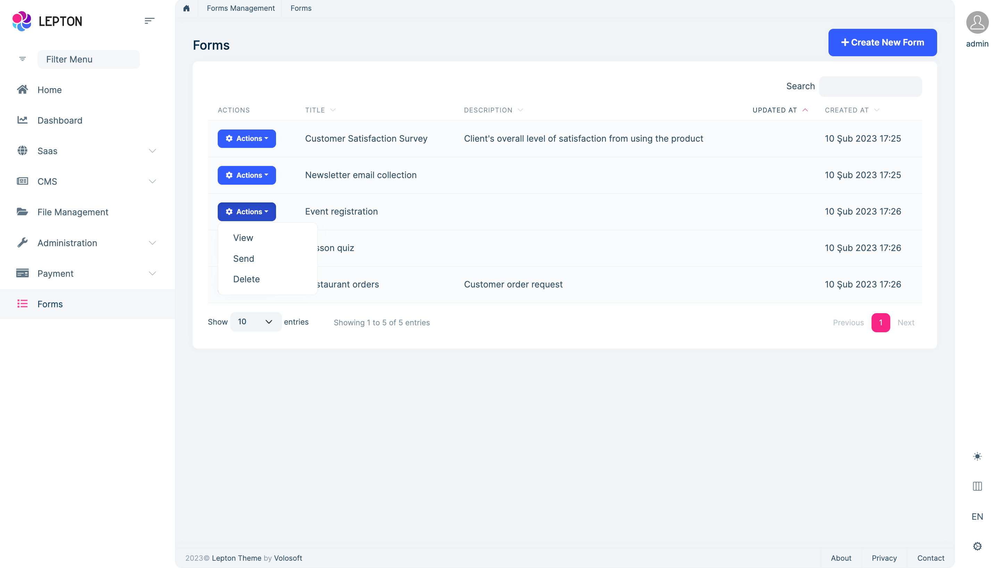
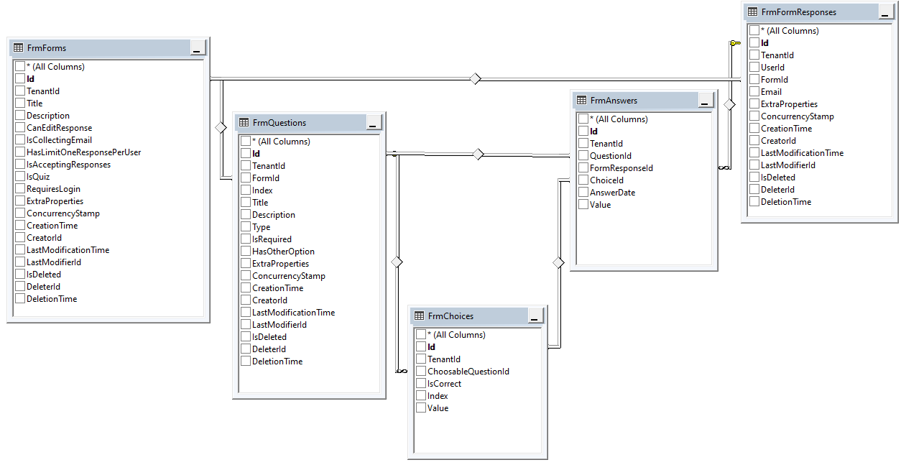

# Forms Module (Pro)

> You must have an ABP Team or a higher license to use this module.

This module allows you to create questionnaires  to gather information. The forms module can store responses as they come in and you can export the data to a CSV file. You can share your form with others with your form unique link. You can request authentication or allow anonymous reply. It is similar to the Google Form application. Usage area is quite wide, you can create surveys, manage event registrations, collect email addresses for a newsletter, create a quiz, and even receive an order request.

See [the module description page](https://abp.io/modules/Volo.Forms) for an overview of the module features.

## How to install

The form module doesn't come pre-installed. You need to install it manually. There are 2 ways of installing it:

* **Via ABP CLI:** Open a command line window in your solution folder (in the folder where the `* .sln` file is located) and type the following command:

  ```bash
  abp add-module Volo.Forms
  ```
* **Via ABP Suite:** Open ABP Suite and select your project. Then go to the modules page from the top menu. Find **Forms** card and click add as project (with source-code) or add as package (without source-code).


## Packages

This module follows the [module development best practices guide](../framework/architecture/best-practices) and consists of several NuGet and NPM packages. See the guide if you want to understand the packages and relations between them.

You can visit the [forms module package list page](https://abp.io/packages?moduleName=Volo.Forms) to see list of packages related with this module.

## User interface

### Menu items

SaaS module adds the following item to the root main menu.

* **Forms**: Add a new form, manage your form questions, delete your form.


The `FormsMenus`  class has the constant variable for the menu item name.

### Pages

#### Forms

Forms page is used to manage the forms. You can view the form contents, send it to others or delete it from the actions menu.



To see the other features of the Forms module, visit [the module description page](https://abp.io/modules/Volo.Forms).

## Data seed

This module adds a sample initial form (see [the data seed system](../framework/infrastructure/data-seeding.md)) to the database when you run the `.DbMigrator` application:

* **Form title:** "Test Form"
* **Form description:** "Test Description"

## Internals

### Domain layer

#### Aggregates

This module follows the [Entity Best Practices & Conventions](../framework/architecture/best-practices/entities.md) guide.

- ##### Form

  - The main aggregate root of the form entities. The form options, title and description is being stored on this entity.

- ##### QuestionBase

  - It stores questions of the form. This entity is dependent to form entity by `FormId`.

- ##### FormResponse

  - Each form submit is a new form response record. The form response has answer records.

#### Repositories

This module follows the [Repository Best Practices & Conventions](../framework/architecture/best-practices/repositories.md) guide.

Following custom repositories are defined for this module:

* `IFormRepository`
* `IQuestionRepository`
* `IChoiceRepository`
* `IResponseRepository`

#### Domain services

This module follows the [Domain Services Best Practices & Conventions](../framework/architecture/best-practices/domain-services.md) guide.

##### QuestionManager

`QuestionManager` is used to manage the questions of your form.

### Application layer

#### Application services

- `FormApplicationService` 
- `QuestionAppService`
- `ResponseAppService`

### Database providers

#### Common

##### Table / collection prefix & schema

All tables/collections use the `Frm` prefix by default. Set static properties on the `FormsDbProperties` class if you need to change the table prefix or set a schema name (if supported by your database provider).

##### Connection string

This module uses `Forms` for the connection string name. If you don't define a connection string with this name, it fallbacks to the `Default` connection string.

See the [connection strings](../framework/fundamentals/connection-strings.md) documentation for details.

#### Entity Framework Core / MongoDB

##### Tables / Collections

- **FrmForms**: Form list.
- **FrmQuestions**: Questions of the forms.
- **FrmAnswers**: Answers of the form response.
- **FrmChoices**: Choices of questions.
- **FrmFormResponses**: A new form response is being created each time user submits the form.


##### Entity Relationships

### Permissions

See the `FormsPermissions` class members for all permissions defined for this module.


### Angular UI

Forms module doesn't support Angular UI for now.

### Blazor UI

Forms module doesn't support Blazor UI. 

### Blazor-Server UI

Forms module support Blazor-Server. Blazor-Server uses Razor pages and it's almost the same with the MVC version. 


## Distributed Events

This module doesn't define any additional distributed event. See the [standard distributed events](../framework/infrastructure/event-bus/distributed).