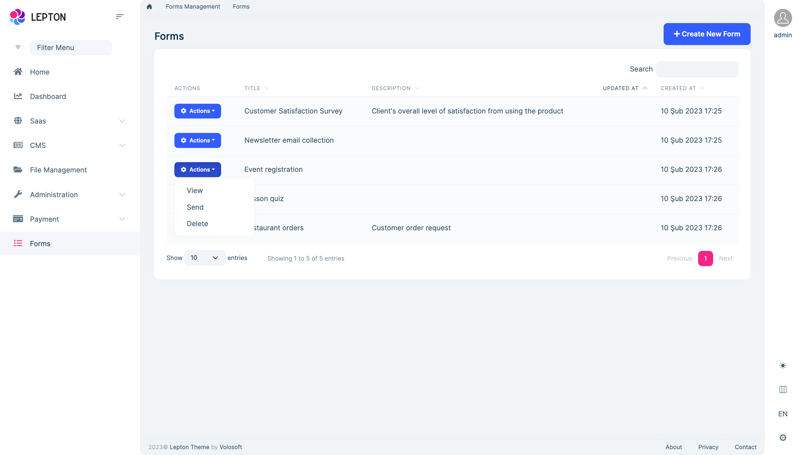
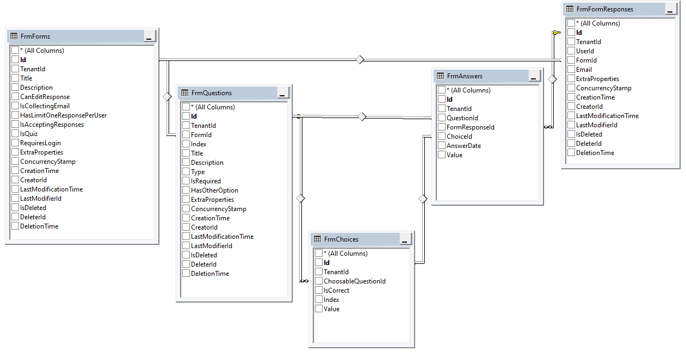

```json
//[doc-seo]
{
    "Description": "The Forms Module (Pro) enables easy creation and management of questionnaires, allowing data collection, export to CSV, and sharing via unique links."
}
```

# Forms Module (Pro)

> You must have an [ABP Team or a higher license](https://abp.io/pricing) to use this module.

The Forms module allows you to create questionnaires, collect responses and export the results to CSV. A form can accept anonymous responses or require authentication, collect email addresses and allow respondents to edit their responses. You can share a form by using its unique link or sending an invitation email.

See [the module description page](https://abp.io/modules/Volo.Forms) for an overview of the module features.

## How to Install

The Forms module isn't pre-installed. You can install it in one of the following ways:

* **ABP CLI:** Open a command-line terminal in the solution folder (the folder containing the solution file) and run the following command:

  ```bash
  abp add-module Volo.Forms
  ```

* **ABP Suite:** Open ABP Suite, select your solution and go to the modules page. Find the **Forms** card and add it as source code or as a package.

## Packages

This module follows the [module development best practices guide](../framework/architecture/best-practices) and consists of several NuGet packages. See the guide if you want to understand the packages and their relationships.

Visit the [Forms module package list](https://abp.io/packages?moduleName=Volo.Forms) to see the packages provided by this module.

## User Interface

### Menu Item

The module adds a **Forms** item under the **Administration** menu when the current user has the `Forms.Form` permission. The page is used to create forms, manage their questions and settings, share them and inspect their responses.

The `FormsMenus` class contains the menu item names.

### Forms Page

The Forms page lists the forms that you can manage. Its actions menu opens the form designer, opens the invitation dialog or deletes the form. Use the designer to manage questions and settings or preview the form. The **Responses** tab opens the response page, where you can inspect and export responses.



### Question Types

The built-in form designer supports the following question types:

* Short text
* Multiple choice
* Checkboxes
* Dropdown list

Questions and choices are displayed in their configured order. Multiple-choice and checkbox questions can also include an **Other** option.

### Response Settings

New forms accept responses by default. The other response settings are disabled by default.

| Setting | Behavior |
| --- | --- |
| `RequiresLogin` | The packaged MVC page redirects anonymous users to the login page. `GetQuestionsAsync` and response submission also reject anonymous users. The anonymous `GetAsync` endpoint still returns the form details, including its questions, so it is not an authorization boundary for question data. |
| `HasLimitOneResponsePerUser` | Rejects a second response from the same authenticated user. This setting is automatically disabled when `RequiresLogin` is disabled. |
| `IsCollectingEmail` | In the packaged MVC response flow, displays the email field and requires a non-empty value when a response is created or updated. |
| `CanEditResponse` | In the packaged MVC response flow, allows a saved response to be updated. If login is required, that flow only updates the current user's response. A direct update API client must send the target response's actual `FormId`; the application service uses the supplied form ID when it checks these settings and ownership. |
| `IsAcceptingResponses` | Enables or disables response entry on the packaged MVC form page. |
| `IsQuiz` | Stores the quiz-mode flag. The packaged module doesn't calculate a quiz score. |

### Sharing and Routing

The public form page uses the `/Forms/{formId}/ViewForm` route. When login is required, this route redirects an anonymous visitor to the account login page and uses the form route as the return URL.

By default, the share dialog builds the form link from the current request. Configure `FormRoutingOptions` in the host module when forms must be shared through a dedicated application:

```csharp
Configure<FormRoutingOptions>(options =>
{
    options.HostUrl = "https://forms.example.com/";
    options.OnlyViewInHostProject = true;
});
```

`HostUrl` becomes the base URL for links generated by the share dialog. When `OnlyViewInHostProject` is `true` and `HostUrl` has a value, the form route returns a not-found result if the current display URL does not start with the configured `HostUrl`. `OnlyViewInHostProject` has no effect when `HostUrl` is empty.

The invitation action sends the configured subject and body through ABP's `IEmailSender`. See the [email sending documentation](../framework/infrastructure/emailing.md) to configure an email provider.

### CSV Export

The response page can export a requested response page to a `{form-title}.csv` file. The packaged download action requests responses sorted by ID and doesn't send the page or filter state, so it exports the default maximum of 10 responses. API clients can set `MaxResultCount` to `0` to export all matching responses. The export:

* uses UTF-8 with a byte-order mark;
* uses the current UI culture and quotes all fields;
* writes `Date` as the first column and then the question titles in their configured order;
* writes one row per response and uses the response's last modification time, or its creation time when it hasn't been modified; and
* contains answer values, but doesn't include the separately collected email value.

Response answers can contain personal or confidential data. Grant form-management and export access only to trusted users, and store downloaded CSV files according to your application's data-handling requirements.

## Feature and Permissions

The module defines the `Volo.Forms.Enable` feature. It is enabled by default. Disabling it prevents the Forms application services from being used, and all Forms permissions require this feature.

See the [Feature System documentation](../framework/infrastructure/features.md) for feature configuration and the [Feature Management module](feature-management.md) for managing feature values.

The module defines the following permissions:

| Permission | User interface and application task |
| --- | --- |
| `Forms.Form` | Opens the Forms administration page and its form and question management UI. It also protects form operations such as sharing, response inspection and CSV export. |
| `Forms.Form.Delete` | Deletes a form. |
| `Forms.Response` | Displays the response-management tab and response results in the packaged UI. |
| `Forms.Response.Delete` | Deletes an individual response or all responses of a form. |

## UI Support

The module provides an MVC/Razor Pages UI in the `Volo.Forms.Web` package. It doesn't provide an Angular or Blazor WebAssembly UI package. Since the packaged UI uses Razor Pages, it can also be hosted by a Blazor Server application that supports Razor Pages.

## Internals

### Domain Layer

#### Aggregates

This module follows the [Entity Best Practices & Conventions](../framework/architecture/best-practices/entities.md) guide.

* `Form` is the aggregate root that stores the form title, description and response settings.
* `QuestionBase` is the base aggregate root for form questions. A question references its form through `FormId`; the concrete question type stores its choices when applicable.
* `FormResponse` is the aggregate root for a form submission and owns its answer collection.

#### Repositories

This module follows the [Repository Best Practices & Conventions](../framework/architecture/best-practices/repositories.md) guide and defines the following custom repositories:

* `IFormRepository`
* `IQuestionRepository`
* `IChoiceRepository`
* `IResponseRepository`

#### Domain Services

This module follows the [Domain Services Best Practices & Conventions](../framework/architecture/best-practices/domain-services.md) guide.

`QuestionManager` creates, updates and deletes questions and their choices, including their stored display order.

### Application Layer

The module defines the following application services:

* `FormAppService` manages forms, form settings, questions, sharing and response exports.
* `QuestionAppService` updates, reads and deletes individual questions.
* `ResponseAppService` reads, creates, updates and deletes form responses.

### Database Providers

#### Connection String

This module uses `Forms` as its connection string name. If a connection string with this name isn't defined, it falls back to the `Default` connection string.

See the [connection strings](../framework/fundamentals/connection-strings.md) documentation for details.

#### Entity Framework Core

Entity Framework Core tables use the `Frm` prefix by default. Set the static `FormsDbProperties.DbTablePrefix` and `FormsDbProperties.DbSchema` properties to change the table prefix or schema.

The module creates the following tables by default:

* `FrmForms`
* `FrmQuestions`
* `FrmChoices`
* `FrmFormResponses`
* `FrmAnswers`



#### MongoDB

The MongoDB provider doesn't apply the Entity Framework Core `Frm` table prefix or schema settings. It configures the following collections:

* `Forms`
* `Questions`
* `Choices`
* `Checkboxes`
* `ChoiceMultiples`
* `DropdownLists`
* `ShortTexts`
* `FormResponses`

Answers are embedded in their `FormResponse` document instead of being stored in a separate `Answers` collection.

## Distributed Events

This module doesn't define additional distributed events. See the [standard distributed events](../framework/infrastructure/event-bus/distributed).
