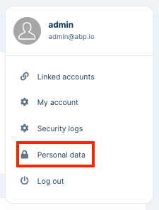
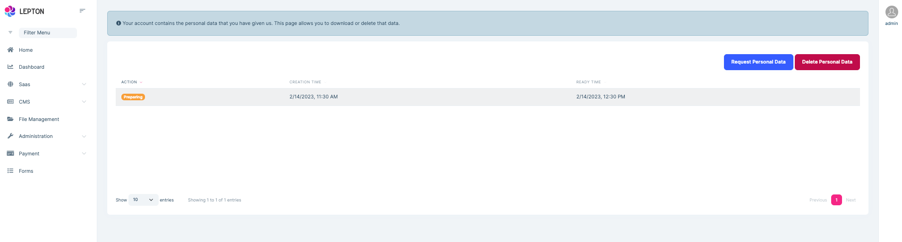
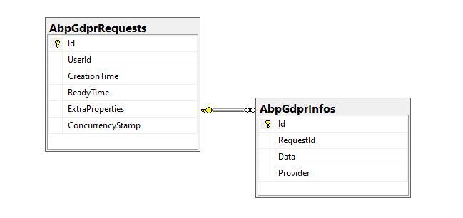
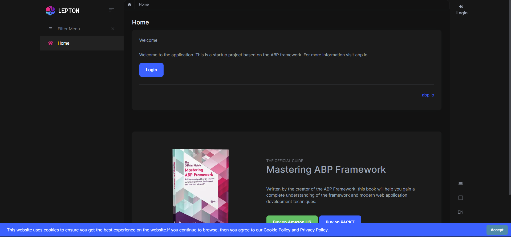

```json
//[doc-seo]
{
    "Description": "Learn how to manage user data with the GDPR module, enabling personal data downloads and deletions in your ABP applications."
}
```

# GDPR Module (Pro)

> You must have an [ABP Team or a higher license](https://abp.io/pricing) to use this module.

This module allows users to request a download of their personal data and request deletion of their personal data and account.

> The GDPR module uses distributed events from the `Volo.Abp.Gdpr.Abstractions` package. Participating modules collect their own data and publish prepared-data events. The GDPR module stores each prepared payload and later returns the available payloads in a ZIP archive.

See [the module description page](https://abp.io/modules/Volo.Gdpr) for an overview of the module features.

## How to install

The GDPR module is pre-installed in the [Application](../solution-templates/layered-web-application) and [Application (Single Layer) templates](../solution-templates/single-layer-web-application). So, no need to manually install it. 

If you need to install it manually, there are 2 ways of installing it:

* **Via ABP CLI:** Open a command-line terminal in your solution folder (in the folder where the `*.sln` file is located) and type the following command:

```bash
abp add-module Volo.Gdpr
```

* **Via ABP Suite:** [Run ABP Suite](../suite/how-to-start.md), select your project, go to the **modules** page from the top menu and find the **GDPR** card and click the **add as project (with source-code)** or **add as package (without source-code)** button to add the module into your project.

## Packages

This module follows the [module development best practices guide](../framework/architecture/best-practices) and consists of several NuGet and NPM packages. See the guide if you want to understand the packages and the relations between them.

You can visit the [Gdpr module package list page](https://abp.io/packages?moduleName=Volo.Abp.Gdpr) to see a list of packages related to this module.

## User interface

### Menu items

The GDPR module adds the following item to the "User" profile menu.

* **Personal Data**: Personal data management page. You can request your personal data, list all personal data requests, download available data and request deletion of personal data and the account.



The `GdprMenuNames.PersonalData` constant contains the menu item name.

### Pages

#### Personal Data

The "Personal Data" page is used to manage personal data requests. You can view past requests, check the latest request, create a new request, download available data or request deletion of personal data and the account.



The GDPR module is designed for distributed architectures. It publishes different events for the two user actions:

- `GdprUserDataRequestedEto` is published when the user requests a data download. Collectors respond with `GdprUserDataPreparedEto`.
- `GdprUserDataDeletionRequestedEto` is published when the user requests deletion.

You can subscribe to these events to implement custom data collection and deletion logic in your modules. See the [Distributed Events](#distributed-events) section for more details.

> To see the other features of the GDPR module, visit [the module description page](https://abp.io/modules/Volo.Gdpr).

### Authorization

The module doesn't define a grantable GDPR permission. Its application service requires an authenticated user, and list and token operations verify that the request belongs to the current user. The download action is the exception: it allows anonymous access with the short-lived bearer token issued to the request owner. Keep this token confidential and use HTTPS.

## Options

### AbpGdprOptions

`AbpGdprOptions` can be configured in the `ConfigureServices` method of your [module](../framework/architecture/modularity/basics.md). 

Example:

```csharp
Configure<AbpGdprOptions>(options =>
{
    //Set options here...
});
```

`AbpGdprOptions` properties:

* `RequestTimeInterval` (default: 1 day): Defines the minimum interval measured from the latest stored personal-data request. You can configure this property to increase or decrease that interval. The `IsNewRequestAllowedAsync` application-service method reports whether the current request is allowed.
* `MinutesForDataPreparation` (default: 60 minutes): Sets the earliest time at which the archive can be downloaded. This is a time window for distributed collectors, not a collector-completion check. Set it long enough for your event transport and slowest collector.

### AbpCookieConsentOptions

`AbpCookieConsentOptions` is used to configure the options of the [**Cookie Consent**](#cookie-consent) and can be configured in the `ConfigureServices` method of your [module](../framework/architecture/modularity/basics.md).

Example:

```csharp
Configure<AbpCookieConsentOptions>(options => 
{
    options.IsEnabled = true;
    options.CookiePolicyUrl = "/CookiePolicy";
    options.PrivacyPolicyUrl = "/PrivacyPolicy";
    options.Expiration = TimeSpan.FromDays(180);
});
```

`AbpCookieConsentOptions` properties:

* `IsEnabled` (default: false): This flag enables or disables the **Cookie Consent** feature.
* `CookiePolicyUrl`: It defines the cookie policy page URL. When it's set, "Cookie Policy" page URL is automatically added to the cookie consent statement. Thus, users can check the cookie policy before accepting the cookie consent. You can set it as a local address like `/CookiePolicy` or full URL like `https://example.com/cookie-policy`.
* `PrivacyPolicyUrl`: It defines the privacy policy page URL. When it's set, the "Privacy Policy" page URL is automatically added to the cookie consent statement. Thus, users can check the privacy policy before accepting the cookie consent. You can set it as a local address like `/PrivacyPolicy` or full URL like `https://example.com/privacy-policy`.
* `Expiration`: It defines the cookie expiration for the Cookie Consent. By default, when the cookie consent is accepted, it sets a `.AspNet.Consent` cookie with 6 months expiration.

## Internals

### Domain layer

#### Aggregates

This module follows the [Entity Best Practices & Conventions](../framework/architecture/best-practices/entities.md) guide.

##### GdprRequest

The main aggregate root of the GDPR requests. This aggregate root stores general information about the request and a list of `GdprInfo`s (personal data) collected from other modules.

* `GdprRequest` (aggregate root): Represents a GDPR request made by users.
  * `UserId`: Id of the user who made the request.
  * `ReadyTime`: Indicates the earliest time at which the archive can be downloaded. It is calculated by adding `AbpGdprOptions.MinutesForDataPreparation` to the request creation time.
  * `Infos` (collection): Contains the prepared personal-data payloads received for the request.

#### Entities

##### GdprInfo

This entity is used to store the collected data from a module/provider.

* `GdprInfo` (entity): Represents the personal data of a user.
  * `RequestId`: Id of the GDPR request.
  * `Data`: Uses to store personal data.
  * `Provider`: Identifies the collector or provider that prepared the personal data. It is an arbitrary identifier supplied with the prepared-data event and doesn't have to be a module name.

#### Repositories

This module follows the [Repository Best Practices & Conventions](../framework/architecture/best-practices/repositories.md) guide.

The following custom repositories are defined for this module:

* `IGdprRequestRepository`

#### Event Handlers

##### GdprUserDataEventHandler

Triggered by the personal data providers in the application. Saves the collected data to the database.

### Application layer

#### Application services

* `GdprRequestAppService` (implements `IGdprRequestAppService`): Implements the use cases of the personal data page.

### Database providers

#### Common

##### Table / collection prefix & schema

Set static properties on the `GdprDbProperties` class if you need to change the table prefix or set a schema name (if supported by your database provider).

##### Connection string

This module uses `AbpGdpr` for the connection string name. If you don't define a connection string with this name, it fallbacks to the `Default` connection string.

See the [connection strings](../framework/fundamentals/connection-strings.md) documentation for details.

#### Entity Framework Core / MongoDB

##### Tables / Collections

- **GdprRequests**
- **GdprInfo**

##### Entity Relationships



## Angular UI

### Installation

To configure the application to use the GDPR module, import `provideGdprConfig` from `@volo/abp.ng.gdpr/config` and append it to the root `ApplicationConfig.providers` array.

```ts
// app.config.ts
import {
  provideGdprConfig,
  withCookieConsentOptions,
} from '@volo/abp.ng.gdpr/config';

export const appConfig: ApplicationConfig = {
  providers: [
    provideGdprConfig(
      withCookieConsentOptions({
        cookiePolicyUrl: '/gdpr-cookie-consent/cookie',
        privacyPolicyUrl: '/gdpr-cookie-consent/privacy',
      }),
    ),
  ],
};
```

The cookie-consent configuration accepts `isEnabled`, `cookiePolicyUrl`, `privacyPolicyUrl` and `expireDate`. Cookie consent is enabled when `isEnabled` is omitted; an explicit `false` disables it. `expireDate` is a JavaScript `Date` and defaults to six months from initialization when omitted.

The GDPR module should be imported and lazy-loaded in your routing array. It exports a `createRoutes` function from `@volo/abp.ng.gdpr`. Available route options are listed below.

```ts
// app.routes.ts
const APP_ROUTES: Routes = [
  // other route definitions
  {
    path: 'gdpr',
    loadChildren: () =>
      import('@volo/abp.ng.gdpr').then(c => c.createRoutes(/* options here */)),
  },
];
```

> If you have generated your project via the startup template, you do not have to do anything, because it already has both files configured.

<h4 id="h-gdpr-module-options">Options</h4>

You can modify the look and behavior of the module page by passing these options to the `createRoutes` function:

- **createFormPropContributors:** Changes the personal-data table columns. Please check [Data Table Column Extensions for Angular](../framework/ui/angular/data-table-column-extensions.md) for details.
- **toolbarActionContributors:** Changes the page toolbar. Please check [Page Toolbar Extensions for Angular](../framework/ui/angular/page-toolbar-extensions.md) for details.

The personal-data page is also replaceable. Use `eGdprComponents.PersonalData` as the replacement key. See [Component Replacement](../framework/ui/angular/component-replacement.md) for the replacement API.

## Distributed Events

The GDPR module collects data asynchronously so it can work with distributed and microservice solutions. A data request creates a `GdprRequest` and publishes an event for collectors.

### GdprUserDataRequestedEto

This [Event Transfer Object](../framework/infrastructure/event-bus/distributed#event-transfer-object) contains the user and request identifiers. To include data owned by your module, subscribe to this ETO and publish a `GdprUserDataPreparedEto` with the same request identifier, your provider name and the collected data.

### GdprUserDataPreparedEto

The GDPR module handles this [Event Transfer Object](../framework/infrastructure/event-bus/distributed#event-transfer-object), serializes its data and adds it to the matching request. Each stored prepared-data event becomes one JSON entry when the ZIP archive is generated.

`ReadyTime` is only the download time gate. The module does not track an expected collector count or wait for an explicit "all collectors completed" signal. At or after `ReadyTime`, the archive contains the prepared-data events stored at that moment; it can be incomplete or empty when collectors are delayed or fail. Monitor event delivery and choose `MinutesForDataPreparation` for the slowest expected collector.

Before downloading, an authenticated request owner obtains a download token. The token expires after 60 minutes. After a request presents a matching token and request identifier, the service removes the token before checking `ReadyTime`, so an early sequential attempt consumes it. A mismatched request identifier doesn't consume the token. The cache read and removal are separate operations, so this isn't a concurrency-safe single-use guarantee. The download endpoint accepts the request identifier and token without an authenticated session; use HTTPS and keep the token out of application and proxy logs.

A successful download does not remove the stored `GdprRequest` or its `GdprInfo` data. Define a retention and cleanup policy appropriate for the personal data collected by your application.

### GdprUserDataDeletionRequestedEto

This [Event Transfer Object](../framework/infrastructure/event-bus/distributed#event-transfer-object) is published when a user requests deletion of personal data and the account. The GDPR module first deletes its stored requests and prepared payloads for the current user, then publishes the event for participating modules.

When the standard Identity Pro module is installed, its built-in subscriber anonymizes the identity user's personal fields, deactivates the user and deletes the identity-user record. Other participating modules remain responsible for their own data. Subscribe to the event to implement additional deletion or anonymization logic for application-specific data.

Treat deletion as a distributed workflow. A successful GDPR API response does not by itself prove that every subscriber has completed its module-specific deletion. Make handlers idempotent, monitor failed event deliveries and define how your application revokes active sessions and tokens when the account is deleted.

## Cookie Consent



Cookie Consent displays a banner and stores the user's acceptance in the consent cookie. It doesn't automatically block nonessential cookies, browser storage or tracking scripts. Your application must prevent those operations until consent when its policy requires that behavior.

This feature is enabled by default for the [Application](../solution-templates/layered-web-application) and [Application Single Layer](../solution-templates/single-layer-web-application) Startup Templates. You can easily enable/disable showing Cookie Consent by configuring the `AbpCookieConsentOptions`

If you want to override the texts in the Cookie Consent component, you just need to define the following localization keys in your localization resource files and change text as you wish:

```json
{
    "ThisWebsiteUsesCookie": "This website uses cookies to ensure you get the best experience on the website.",
    "CookieConsentAgreePolicies": "If you continue to browse, then you agree to our {0} and {1}.",
    "CookieConsentAgreePolicy": "If you continue to browse, then you agree to our {0}."
}
```

> Refer to the [Localization documentation](../framework/fundamentals/localization.md) for more info about defining localization resources and overriding existing localization entries that comes from pre-built modules.

### Configuring Cookie Consent

To enable cookie consent in your application, follow these two steps:

**1. Configure the service in your module class (inside the `ConfigureServices` method):**

```csharp
context.Services.AddAbpCookieConsent(options =>
{
    options.IsEnabled = true;
    options.CookiePolicyUrl = "/CookiePolicy";
    options.PrivacyPolicyUrl = "/PrivacyPolicy";
});
```

**2. Add the middleware (`UseAbpCookieConsent`) to the request pipeline (in the `OnApplicationInitialization` method):**

```diff
public override void OnApplicationInitialization(ApplicationInitializationContext context)
{
        var app = context.GetApplicationBuilder();
        //...
 
+       app.UseAbpCookieConsent();
        app.UseCorrelationId();
        app.UseRouting();
        app.MapAbpStaticAssets();
        app.UseAbpSecurityHeaders();
        app.UseAuthentication();

        //...
}
```

Once configured, a cookie consent banner will be shown at the bottom of the page. It includes links to your _Cookie Policy_ and _Privacy Policy_, helping inform users and support GDPR compliance.
