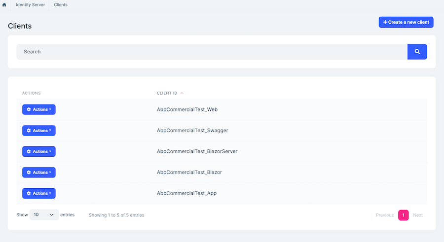
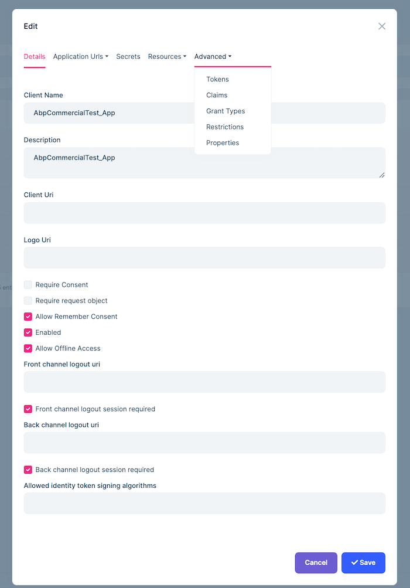
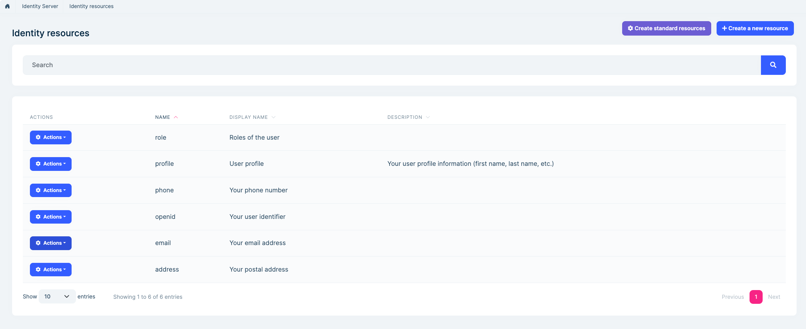
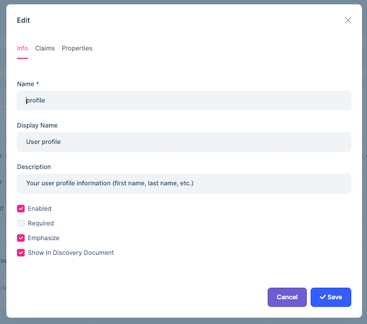
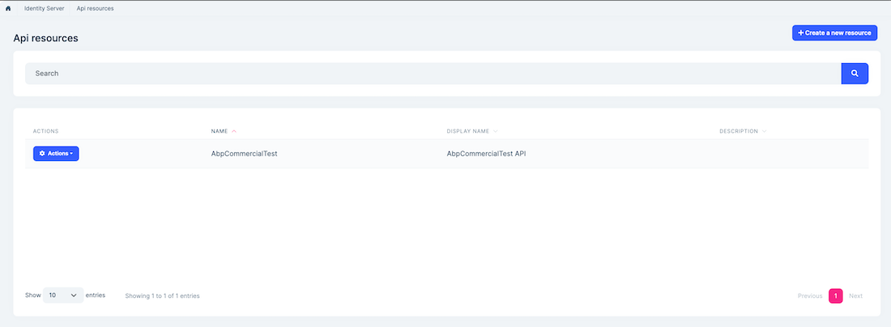
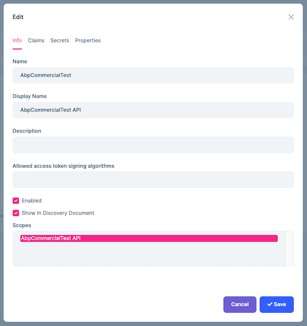

```json
//[doc-seo]
{
    "Description": "Explore the Identity Server Module (Pro) for ABP Framework, enabling easy management of clients, identity resources, and API resources."
}
```

# Identity Server Module (Pro)

> You must have an [ABP Team or a higher license](https://abp.io/pricing) to use this module.

This module provides integration and management functionality for Identity Server;

* Built on the [IdentityServer4 ](http://docs.identityserver.io/en/latest/) library.
* Manage **Clients**, **Identity resources** and **API resources** in the system. 
* Set **permissions** for clients.
* Create **standard identity resources** (like role, profile) easily.
* Create custom **identity resources**.
* Manage **API resources**.
* Manage **API scopes**.

> **Legacy module:** Current ABP startup templates use the [OpenIddict module](./openiddict.md). This IdentityServer4 administration module remains available for existing applications that still use the [open-source IdentityServer integration](identity-server.md), but it is not installed in newly generated applications.

See [the module description page](https://abp.io/modules/Volo.identityserver.Ui) for an overview of the module features.

## How to Install

This module was pre-installed in startup templates before ABP v6.0. Current templates use OpenIddict. Install this module only in an application that uses IdentityServer4, and don't install the IdentityServer and OpenIddict provider modules together.

## Packages

This module follows the [module development best practices guide](../framework/architecture/best-practices) and consists of several NuGet and NPM packages. See the guide if you want to understand the packages and relations between them.

You can visit the [Identity Server module package list](https://abp.io/packages?moduleName=Volo.IdentityServer.Ui) to see the related packages.

## User Interface

### Menu Items

Identity Server module adds the following items to the "Main" menu, under the "Administration" menu item:

* **Clients**: Client management page.
* **Identity resources**: Identity resource management page.
* **API resources**: API resource management page.
* **API scopes**: API scope management page.

`AbpIdentityServerMenuNames` class has the constants for the menu item names.

### Pages

#### Client Management

Clients page is used to manage Identity Server clients. A client represent applications that can request tokens from your Identity Server.



You can create new clients or edit existing clients in this page:



New client secrets submitted during create or update are SHA-256 hashed before they are stored. Configure the consuming client with the original secret value, not the stored hash, and retain the original value in your secret-management system because it cannot be recovered from the hash.

#### Identity Resource Management

Identity resource page is used to manage identity resources of Identity Server. Identity resources are data like user ID, name, or email address of a user.



You can create a new identity resource or edit an existing identity resource in this page:



This page allows creating standard identity resources (role, profile, phone, openid, email and address) using "Create standard resources" button.

#### API Resource Management

Identity Server module allows to manage API resources. To allow clients to request access tokens for APIs, you need to define API resources.



You can create a new API resource or edit an existing API resource in this page:



New API resource secrets submitted during update are also SHA-256 hashed before persistence. The consumer must use the original secret value.

#### API Scope Management

API scopes define the scopes that clients can request. The API scopes page allows you to create, update and delete scopes independently from API resources.

## Data Seed

The domain package provides `IIdentityResourceDataSeeder`, which a legacy application can call from its IdentityServer data seed contributor when the `.DbMigrator` application runs (see the [data seed system](../framework/infrastructure/data-seeding.md)):

* Creates standard identity resources which are role, profile, phone, openid, email and address.

You can delete or edit created standard identity resources in the identity resource management page. You can also re-create standard identity resources in the identity resource management page using "Create standard resources" button. 

## Options

### AbpIdentityServerBuilderOptions

`AbpIdentityServerBuilderOptions` can be configured in `PreConfigureServices` method of your Identity Server [module](../framework/architecture/modularity/basics.md). Example:

````csharp
public override void PreConfigureServices(ServiceConfigurationContext context)
{
	PreConfigure<AbpIdentityServerBuilderOptions>(builder =>
	{
    	//Set options here...		
	});
}
````

`AbpIdentityServerBuilderOptions` properties:

* `UpdateJwtSecurityTokenHandlerDefaultInboundClaimTypeMap` (default: true): Updates `JwtSecurityTokenHandler.DefaultInboundClaimTypeMap` to be compatible with Identity Server claims.
* `UpdateAbpClaimTypes` (default: true): Updates `AbpClaimTypes` to be compatible with identity server claims.
* `IntegrateToAspNetIdentity` (default: true): Integrate to ASP.NET Identity.
* `AddDeveloperSigningCredential` (default: true): Set false to suppress AddDeveloperSigningCredential() call on the IIdentityServerBuilder.
* `AddIdentityServerCookieAuthentication` (default: true): Adds IdentityServer's default cookie authentication handlers. Set it to `false` when the host registers and configures these handlers itself.

`IIdentityServerBuilder` can be configured in `PreConfigureServices` method of your Identity Server [module](../framework/architecture/modularity/basics.md). Example:

````csharp
public override void PreConfigureServices(ServiceConfigurationContext context)
{
	PreConfigure<IIdentityServerBuilder>(builder =>
	{
    	builder.AddSigningCredential(...);	
	});
}
````

## Internals

### Domain Layer

#### Aggregates

This module follows the [Entity Best Practices & Conventions](../framework/architecture/best-practices/entities.md) guide.

##### ApiResource

API Resources are needed for allowing clients to request access tokens.

* `ApiResource` (aggregate root): Represents an API resource in the system.
  * `ApiResourceSecret` (collection): secrets of the API resource.
  * `ApiResourceScope` (collection): scope names associated with the API resource.
  * `ApiResourceClaim` (collection): claims of the API resource.

##### ApiScope

* `ApiScope` (aggregate root): Represents an API scope.
  * `ApiScopeClaim` (collection): Claims included for the scope.
  * `ApiScopeProperty` (collection): Custom properties of the scope.
  
##### Client

Clients represent applications that can request tokens from your Identity Server.

* `Client` (aggregate root): Represents an Identity Server client application.
  * `ClientScope` (collection): Scopes of the client.
  * `ClientSecret` (collection): Secrets of the client.
  * `ClientGrantType` (collection): Grant types of the client.
  * `ClientCorsOrigin` (collection): CORS origins of the client.
  * `ClientRedirectUri` (collection): redirect URIs of the client.
  * `ClientPostLogoutRedirectUri` (collection): Logout redirect URIs of the client.
  * `ClientIdPRestriction` (collection): Provider restrictions of the client.
  * `ClientClaim` (collection): Claims of the client.
  * `ClientProperty` (collection): Custom properties of the client.

##### PersistedGrant

Persisted Grants stores AuthorizationCodes, RefreshTokens and UserConsent.

* `PersistedGrant` (aggregate root): Represents PersistedGrant for identity server.

##### DeviceFlowCodes

* `DeviceFlowCodes` (aggregate root): Stores device authorization data until it expires.

##### IdentityResource

Identity resources are data like user ID, name, or email address of a user.

* `IdentityResource` (aggregate root): Represents an Identity Server identity resource.
  * `IdentityResourceClaim` (collection): Claims of the identity resource.

#### Repositories

This module follows the [Repository Best Practices & Conventions](../framework/architecture/best-practices/repositories.md) guide.

Following custom repositories are defined for this module:

* `IApiResourceRepository`
* `IApiScopeRepository`
* `IClientRepository`
* `IDeviceFlowCodesRepository`
* `IPersistentGrantRepository`
* `IIdentityResourceRepository`

#### Domain Services

This module follows the [Domain Services Best Practices & Conventions](../framework/architecture/best-practices/domain-services.md) guide.

Identity Server module doesn't contain any domain service but overrides services below;

* `AbpProfileService` (Used when `AbpIdentityServerBuilderOptions.IntegrateToAspNetIdentity` is true)
* `AbpClaimsService`
* `AbpCorsPolicyService`

### Settings

This module doesn't define any settings.

### Application Layer

#### Application Services

* `ClientAppService` (implements `IClientAppService`): Implements client management and client permission operations.
* `IdentityServerClaimTypeAppService` (implements `IIdentityServerClaimTypeAppService`): Gets the available claim types.
* `ApiResourceAppService` (implements `IApiResourceAppService`): Implements API resource management.
* `ApiScopeAppService` (implements `IApiScopeAppService`): Implements API scope management.
* `IdentityResourceAppService` (implements `IIdentityResourceAppService`): Implements the use cases of the Identity resource management UI.

### Database Providers

#### Common

##### Table/Collection Prefix & Schema

All tables/collections use the `IdentityServer` prefix by default. Set static properties on the `AbpIdentityServerDbProperties` class if you need to change the table prefix or set a schema name (if supported by your database provider).

##### Connection String

This module uses `AbpIdentityServer` for the connection string name. If you don't define a connection string with this name, it fallbacks to the `Default` connection string.

See the [connection strings](../framework/fundamentals/connection-strings.md) documentation for details.

IdentityServer configuration is host data. The built-in EF Core and MongoDB contexts ignore the current tenant, and the EF Core model isn't added to a tenant-only database.

#### Entity Framework Core

##### Tables

* **IdentityServerApiResources**
  * IdentityServerApiResourceSecrets
  * IdentityServerApiResourceScopes
  * IdentityServerApiResourceClaims
  * IdentityServerApiResourceProperties
* **IdentityServerApiScopes**
  * IdentityServerApiScopeClaims
  * IdentityServerApiScopeProperties
* **IdentityServerClients**
	* IdentityServerClientScopes
	* IdentityServerClientSecrets
	* IdentityServerClientGrantTypes
	* IdentityServerClientCorsOrigins
	* IdentityServerClientRedirectUris
	* IdentityServerClientPostLogoutRedirectUris
	* IdentityServerClientIdPRestrictions
	* IdentityServerClientClaims
	* IdentityServerClientProperties
* **IdentityServerPersistedGrants**
* **IdentityServerDeviceFlowCodes**
* **IdentityServerIdentityResources**
	* IdentityServerIdentityResourceClaims
	* IdentityServerIdentityResourceProperties

#### MongoDB

##### Collections

* **IdentityServerApiResources**
* **IdentityServerApiScopes**
* **IdentityServerClients**
* **IdentityServerPersistedGrants**
* **IdentityServerDeviceFlowCodes**
* **IdentityServerIdentityResources**

### Permissions

The module defines separate read, create, update and delete permissions for clients, identity resources, API resources and API scopes. Client management also has a permission for managing the permissions granted to a client. See the `AbpIdentityServerPermissions` class for the exact permission names.

### Angular UI

#### Installation

In order to configure the application to use the identity server, you first need to import `provideIdentityServerConfig` from `@volo/abp.ng.identity-server/config` to root configuration. Then, you will need to append it to the `appConfig` array.

```js
// app.config.ts
import { provideIdentityServerConfig } from '@volo/abp.ng.identity-server/config';

export const appConfig: ApplicationConfig = {
  providers: [
    // ...
    provideIdentityServerConfig()
  ],
};
```

The Identity Server module should be lazy-loaded in your routing configuration. Import and call the `createRoutes` function from `@volo/abp.ng.identity-server`. Available options are listed below.

```js
// app.routes.ts
const APP_ROUTES: Routes = [
  // other route definitions
  {
    path: 'identity-server',
    loadChildren: () =>
      import('@volo/abp.ng.identity-server').then(c => c.createRoutes(/* options here */)),
  },
];
```

> Applications generated from a legacy IdentityServer startup template already have both files configured.

<h4 id="h-identity-server-module-options">Options</h4>

You can modify the look and behavior of the module pages by passing the following options to the `createRoutes` function:

- **entityActionContributors:** Changes grid actions. Please check [Entity Action Extensions for Angular](../framework/ui/angular/entity-action-extensions.md) for details.
- **toolbarActionContributors:** Changes page toolbar. Please check [Page Toolbar Extensions for Angular](../framework/ui/angular/page-toolbar-extensions.md) for details.
- **entityPropContributors:** Changes table columns. Please check [Data Table Column Extensions for Angular](../framework/ui/angular/data-table-column-extensions.md) for details.
- **createFormPropContributors:** Changes create form fields. Please check [Dynamic Form Extensions for Angular](../framework/ui/angular/dynamic-form-extensions.md) for details.
- **editFormPropContributors:** Changes edit form fields. Please check [Dynamic Form Extensions for Angular](../framework/ui/angular/dynamic-form-extensions.md) for details.


#### Services / Models

Identity Server module services and models are generated via `generate-proxy` command of the [ABP CLI](../cli). If you need the module's proxies, you can run the following command in the Angular project directory:

```bash
abp generate-proxy --module identityServer
```

#### Replaceable Components

`eIdentityServerComponents` enum provides all replaceable component keys. It is available for import from `@volo/abp.ng.identity-server`.

Please check [Component Replacement document](../framework/ui/angular/component-replacement.md) for details.


#### Remote Endpoint URL

The Identity Server module remote endpoint URL can be configured in the environment files.

```js
export const environment = {
  // other configurations
  apis: {
    default: {
      url: 'default url here',
    },
    AbpIdentityServer: {
      url: 'Identity Server remote url here'
    }
    // other api configurations
  },
};
```

The Identity Server module remote URL configuration shown above is optional. If you don't set a URL, the `default.url` will be used as fallback.


## CORS Cache Invalidation

When a `Client` or `ClientCorsOrigin` changes in the current process, local entity-change handlers invalidate the cached set of allowed CORS origins. Applications don't need to clear this cache after using the module's repositories or application services.
