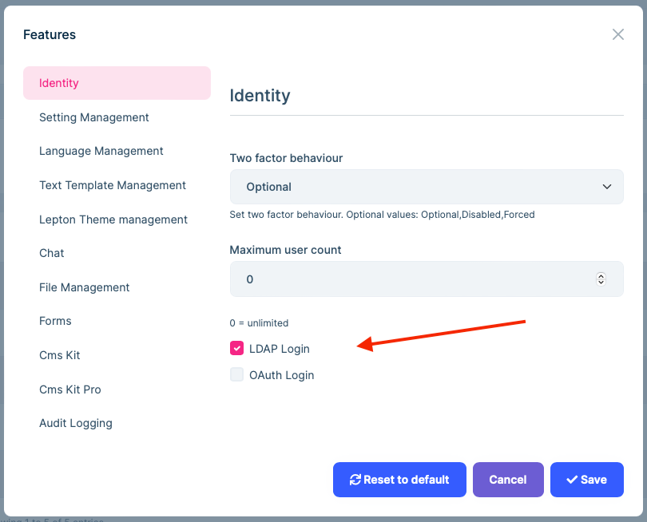
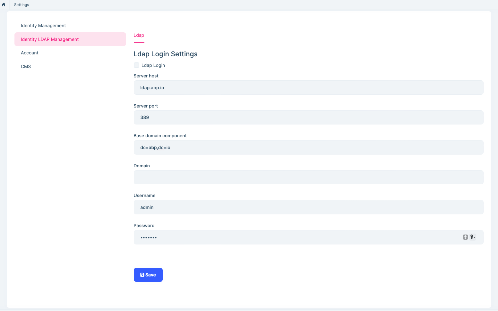
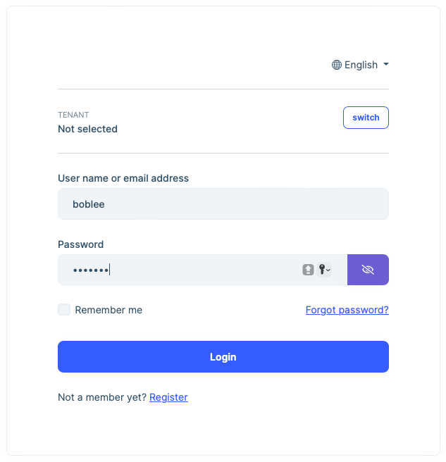

# LDAP External Login Provider

## Introduction

> You must have an ABP Team or a higher license to use this module & its features.

The Identity PRO module has built-in `LdapExternalLoginProvider` and `OpenLdapManager` services. It implements LDAP authentication and gets user info for [external login](https://github.com/abpframework/abp/issues/4977).

The cross-platform [LdapForNet](https://www.nuget.org/packages/LdapForNet/) library is used for Windows LDAP authentication. See [LdapForNet GitHub repository](https://github.com/flamencist/ldap4net) for more information.

> You must have an ABP Team or a higher license to use this module & its features.

## How to enable LDAP external login?

You need to enable the LDAP login feature and configure related settings.





Then you can enter the LDAP username and password on the login page for external login.



## Customize built-in services

The default `OpenLdapManager` service uses `$"cn={userName},{BaseDc}"` to normalize user name, and use `$"(&(uid={userName}))"` to search for users, use `mail` as attribute name to get email.

> The value of `BaseDc` is the setting of the "Base domain component".

If your **username** has a prefix or a specific format, you can override the `NormalizeUserNameAsync` method of `OpenLdapManager` to handle it. You can also customize the `GetUserFilterAsync` and `GetUserEmailAsync` methods.

```cs
[Dependency(ReplaceServices = true)]
[ExposeServices(typeof(OpenLdapManager), typeof(ILdapManager), typeof(LdapManager))]
public class VoloOpenLdapManager : OpenLdapManager
{
    public VoloOpenLdapManager(ILdapSettingProvider ldapSettingProvider)
        : base(ldapSettingProvider)
    {

    }

    protected override async Task<string> NormalizeUserNameAsync(string userName)
    {
        // or "userName@domain 
        // await LdapSettingProvider.GetDomainAsync()
        return Task.FromResult($"Volo\\{userName}");
    }

    protected override Task<string> GetUserFilterAsync(string userName)
    {
        // Default is $"cn={userName},{LdapOptions.BaseDc}"
        return return Task.FromResult($"(&(objectClass=user)(sAMAccountName={userName}))");
    }

    protected override Task<string> GetUserEmailAsync(LdapEntry ldapEntry)
    {
        return Task.FromResult(ldapEntry.ToDirectoryEntry().GetAttribute("mail")?.GetValue<string>());
    }
}
```

Besides, `$"uid={userName}, {BaseDc}"` is used in the built-in `LdapExternalLoginProvider` service to normalize the username; you have to change it together.

```cs
public class VoloLdapExternalLoginProvider : LdapExternalLoginProvider
{
    public VoloLdapExternalLoginProvider(
        IGuidGenerator guidGenerator,
        ICurrentTenant currentTenant,
        IdentityUserManager userManager,
        IIdentityUserRepository identityUserRepository,
        OpenLdapManager ldapManager,
        ILdapSettingProvider ldapSettingProvider,
        IFeatureChecker featureChecker,
        ISettingProvider settingProvider,
        IOptions<IdentityOptions> identityOptions)
        : base(guidGenerator,
            currentTenant,
            userManager,
            identityUserRepository,
            ldapManager,
            ldapSettingProvider,
            featureChecker,
            settingProvider,
            identityOptions)
    {

    }

    protected override async Task<string> NormalizeUserNameAsync(string userName)
    {
        // Default is $"uid={userName}, {BaseDc}"
        // or "userName@domain 
        // await LdapSettingProvider.GetDomainAsync()
        return Task.FromResult($"Volo\\{userName}");
    }
}
```

Replace the default implementation with `VoloLdapExternalLoginProvider`.

```cs
public override void ConfigureServices(ServiceConfigurationContext context)
{
    //...
    Configure<AbpIdentityOptions>(options =>
    {
        options.ExternalLoginProviders.Remove(LdapExternalLoginProvider.Name);
        options.ExternalLoginProviders.Add<VoloLdapExternalLoginProvider>(LdapExternalLoginProvider.Name);
    });
    //...
}
```

## LDAP test application

Testing the LDAP configuration using your ABP application might be time-consuming.
The following simple Dotnet Console App is for testing your LDAP configuration. 
Before configuring your LDAP settings, you can test the information via this app to see if it works.

[ABP Ldap Test Application](https://github.com/abpframework/abp-samples/tree/master/AbpLdapSample)


