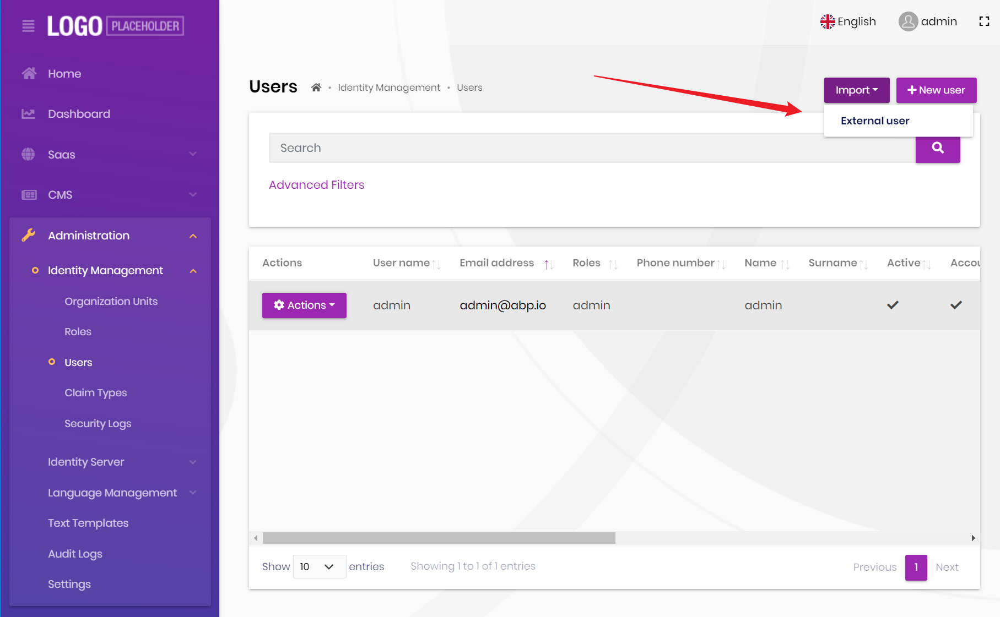
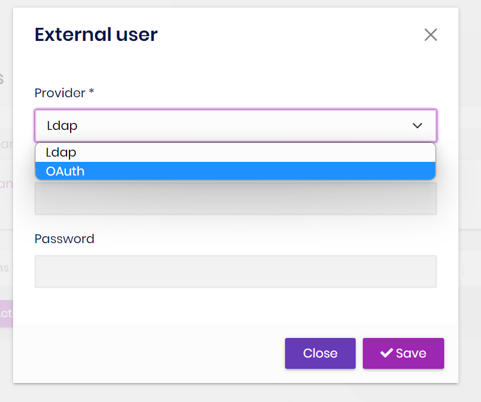
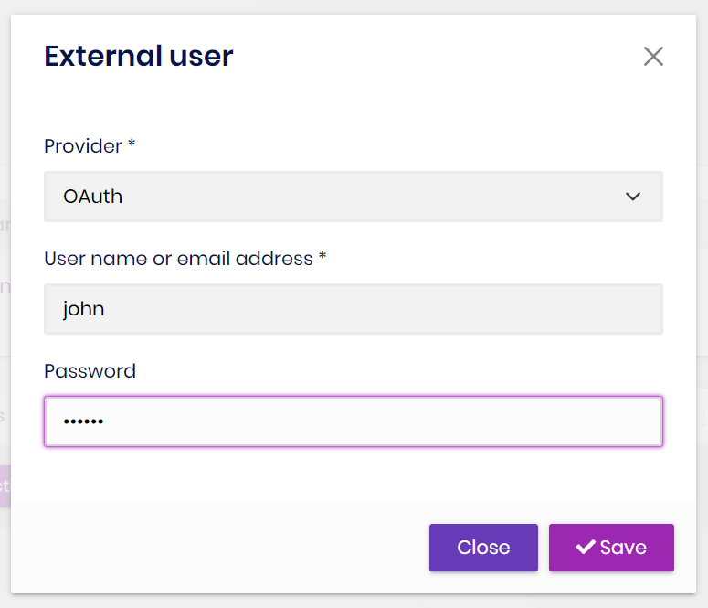

```json
//[doc-seo]
{
    "Description": "Learn how to import external users into the ABP Framework using LDAP or OAuth providers with our step-by-step guide."
}
```

# Import External Users

## Introduction

> You must have an [ABP Team or a higher license](https://abp.io/pricing) to use this module & its features.

The Identity PRO module has built-in `LdapExternalLoginProvider` and `OAuthExternalLoginProvider` services. They not only support external login but also import users.

## How to import users from an external login provider?

1. Click the `Import` button on the `Users` page of the Identity Pro module.



2. Select `external login provider`



3. Enter the correct `username` and `password` to complete the import.



## Existing User Matching

Before creating an account, the import workflow searches by username and email. If it finds an external user, the selected provider updates that user. If it finds a local user, the import is rejected instead of converting or overwriting the local account.

With [Shared User Accounts](../account/shared-user-accounts.md), this lookup covers the Host and all tenants. A Host-context import therefore cannot create a second identity for a username or email that already belongs to another tenant.
