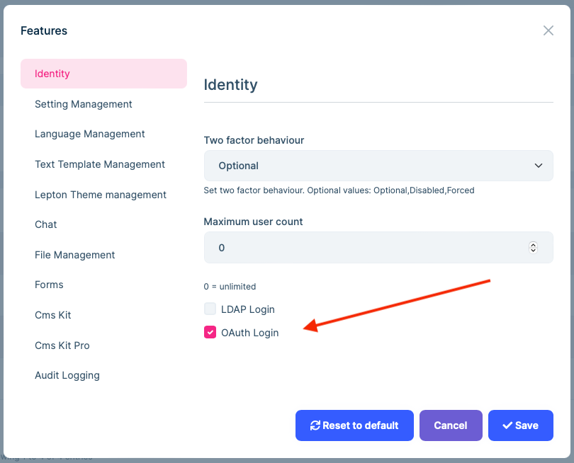
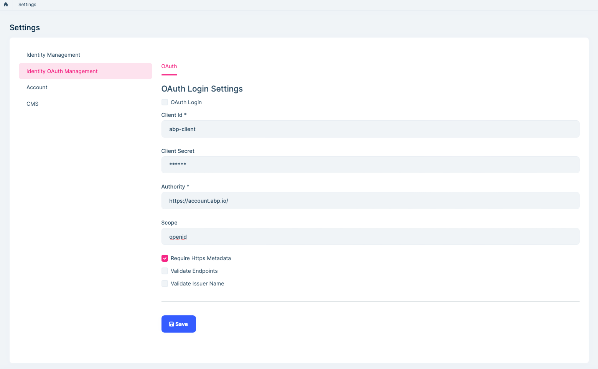

# OAuth Resource Owner Password (ROP) External login Provider

## Introduction

> You must have an ABP Team or a higher license to use this module & its features.

The Identity PRO module has built-in `OAuthExternalLoginProvider` service. It implements OAuth Resource Owner Password authentication and gets user info for [external login](https://github.com/abpframework/abp/issues/4977).

## How to enable OAuth external login?

You need to enable the OAuth login feature and configure related settings.

Then you can enter the user name and password on the login page for oauth external login.

## Resources

https://oauth.net/2/grant-types/password/
