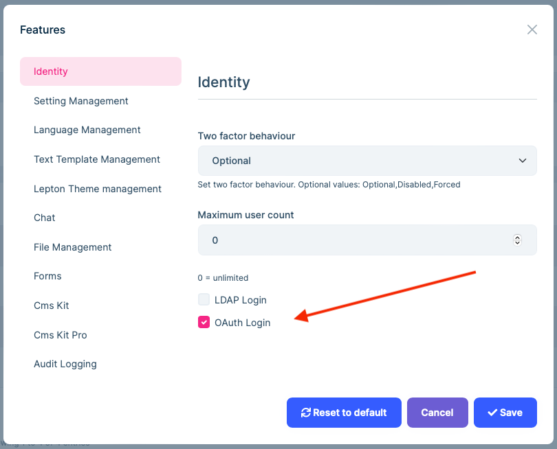
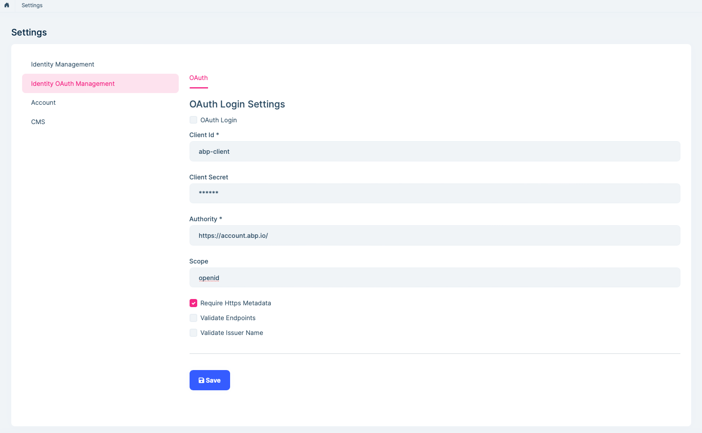
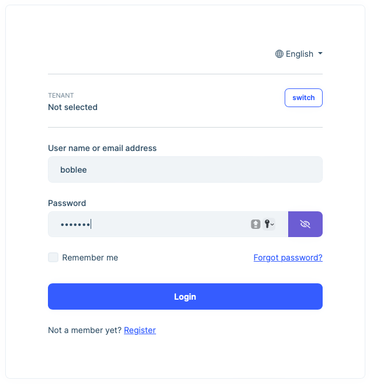

```json
//[doc-seo]
{
    "Description": "Learn how to enable OAuth Resource Owner Password authentication for external logins in the ABP Framework's Identity PRO module."
}
```

# OAuth Resource Owner Password (ROP) External login Provider

## Introduction

> You must have an [ABP Team or a higher license](https://abp.io/pricing) to use this module & its features.

The Identity PRO module has built-in `OAuthExternalLoginProvider` service. It implements OAuth Resource Owner Password authentication and gets user info for [external login](https://github.com/abpframework/abp/issues/4977).

## How to enable OAuth external login?

You need to enable the OAuth login feature and configure related settings.





Then you can enter the user name and password on the login page for oauth external login.



## Mapping User Claims

`AbpOAuthExternalLoginProviderOptions` maps claims returned by the user-info endpoint to the imported or updated Identity user. The defaults use ABP claim types for name, surname, email, email verification, phone number, phone verification and user id. Configure the mappings when the provider returns different claim names:

```csharp
Configure<AbpOAuthExternalLoginProviderOptions>(options =>
{
    options.NameClaimType = "given_name";
    options.SurnameClaimType = "family_name";
    options.EmailClaimType = "email";
    options.EmailConfirmedClaimType = "email_verified";
    options.PhoneNumberClaimType = "phone_number";
    options.PhoneNumberConfirmedClaimType = "phone_number_verified";
    options.ProviderKeyClaimType = "sub";
});
```

The email claim is required. Other mapped claims are optional. `CanObtainUserInfoWithoutPassword` defaults to `false`.

## Resources

[OAuth 2.0 Resource Owner Password Credentials](https://oauth.net/2/grant-types/password/)
