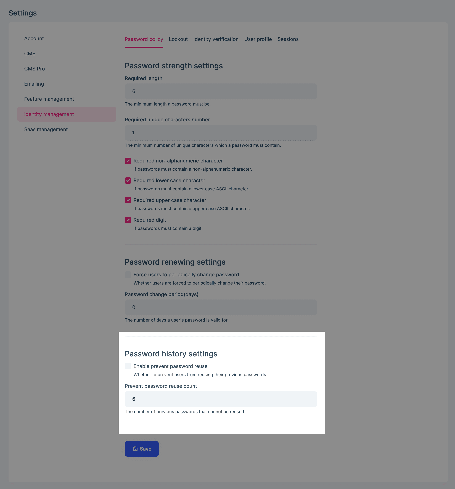
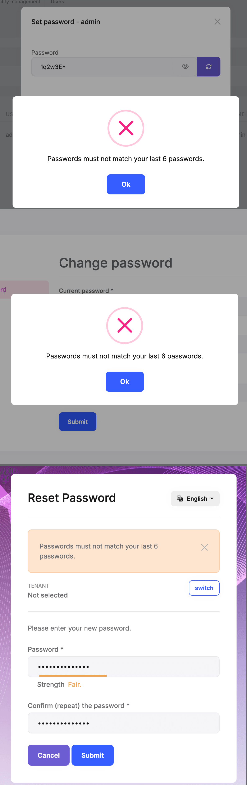

```json
//[doc-seo]
{
    "Description": "Learn how to configure password reuse prevention and password history retention in the ABP Identity Pro module."
}
```

# Password History

## Introduction

> You must have an ABP Team or a higher license to use this module & its features.

The Identity Pro module has a built-in password history function that allows you to enforce password reuse policies for users within your application. It keeps hashes of previously used passwords and checks the configured history window whenever a user or administrator changes or resets a password.

## Password History Settings

You need to enable the password history and configure related settings:



* **Enable prevent password reuse**: Whether to prevent users from reusing their previous passwords.
* **Prevent password reuse count**: The number of previous passwords that cannot be reused. The settings API accepts values from `1` through `128`.

When you enable password history with a positive reuse count, users and administrators cannot reuse a password in that window when changing or resetting a password.



## History Record Retention

By default, the module keeps only the number of records configured by **Prevent password reuse count**. Set `AbpIdentityPasswordHistoryOptions.KeepAllRecords` to `true` if your retention policy requires every recorded password hash to remain in the database:

```csharp
Configure<AbpIdentityPasswordHistoryOptions>(options =>
{
    options.KeepAllRecords = true;
});
```

`KeepAllRecords` changes database retention only. Password validation still checks only the configured reuse-count window.

History pruning is evaluated after a successful password add, change or reset records a new hash. Lowering **Prevent password reuse count** does not immediately delete existing history records.

> The settings UI and API do not accept `0`. If the underlying setting is bypassed and written as `0`, reuse validation is disabled, but new history records continue to be stored and are not pruned by the reuse count.
