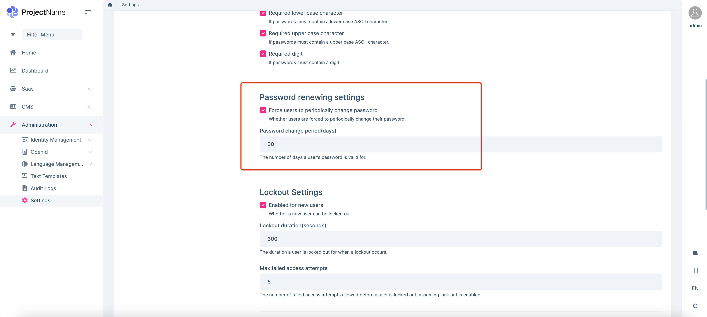

# Periodic Password Change (Password Aging)

## Introduction

> You must have an ABP Team or a higher license to use this module & its features.

The Identity PRO module has a built-in password aging function.

## Password renewing settings

You need to enable the periodic password change and configure related settings:

* **Force users to periodically change password**: Whether users are forced to periodically change their password.
* **Password change period**: The number of days a user's password is valid for.

If the password is aging, the user must change his/her password the next time he/she logs in：

