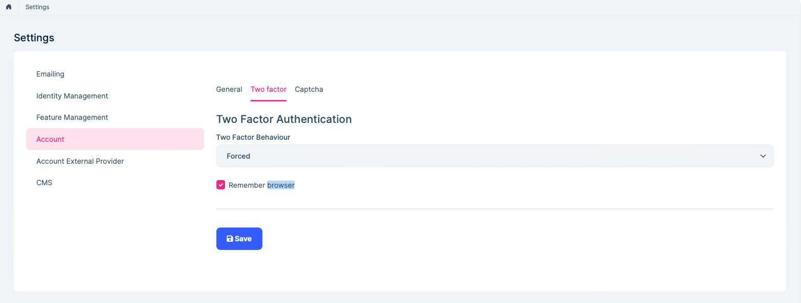
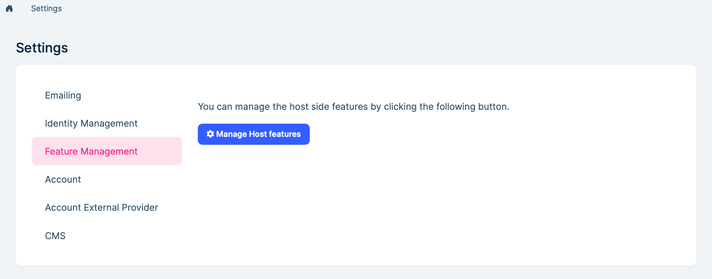
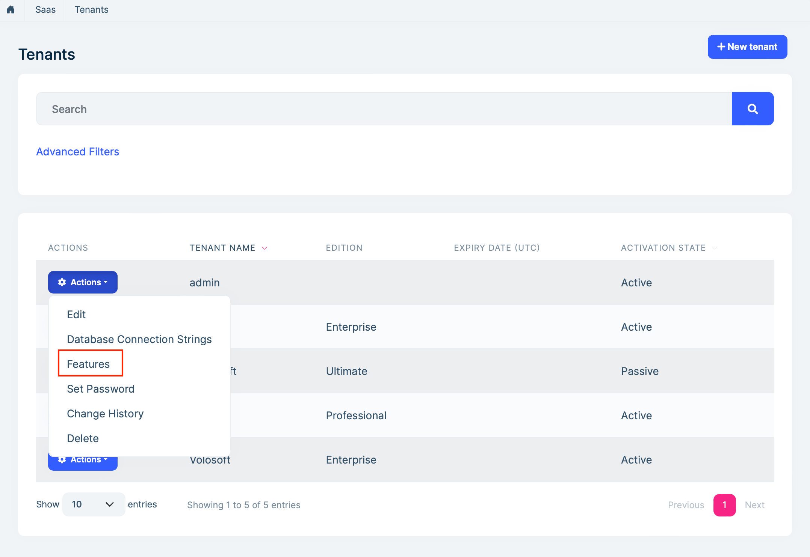
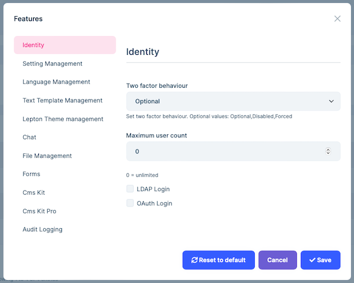
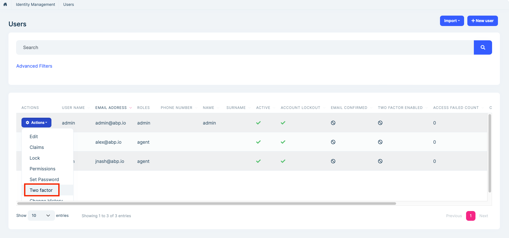
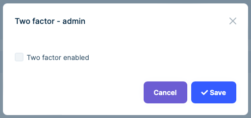
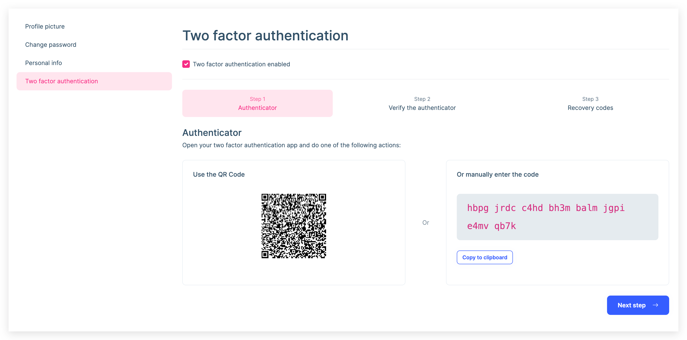
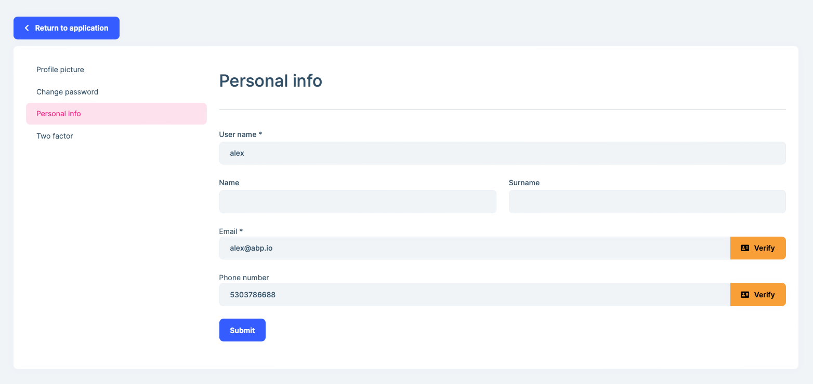
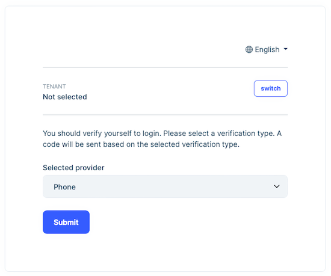
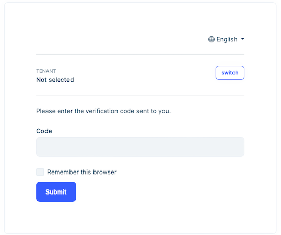

# Two Factor Authentication

> You must have an ABP Team or a higher license to use this module & its features.

Two-factor authentication (**2FA**) is a specific type of multi-factor authentication (MFA) that requires the authenticating party to produce two separate identifying factors to verify your identity. The first factor is something you know "**username & password**" and the second factor is something you have "**mobile device or email**" to verify authentication requests. 2FA protects against phishing, social  engineering and password brute-force attacks and secures your logins  from attackers exploiting weak or stolen credentials.

**ABP** handles **two-factor authentication** at three different layers:

- **Host** admin side
- **Tenant** admin side
- **User** side

## Two-factor authentication setting

### Host

The User of the host with the required permissions can set two-factor authentication to **force**, **disable**, or **optional** for all users and tenants.

- **Forced**: Users must perform two-factor authentication when logging in. End users cannot disable two-factor authentication. Also, all users are forced to login with 2FA. The admin user cannot set user-specific two-factor authentication. This setting is configurable only to host users, tenant admin can set two-factor authentication for its own users.
- **Disabled:** In this case, users will not be able to perform two-factor authentication. Therefore, end users cannot enable two-factor authentication personally. At the same time, the admin user cannot set user-specific two-factor authentication. This setting is configurable only to host users, tenant admin can set two-factor authentication for its users.
- **Optional:** In this case, 2FA is at the user's decision. Users can optionally enable 2FA for themselves. This setting is  configurable only to host users, tenant admin can set two-factor authentication for its users.

You can change 2FA behavior for all users of the host from the account section `https://hostname/SettingManagement` page:



Here, if we set the two-factor authentication behavior to **force** or **disable**, this feature will be hidden from users wherever the 2FA setting is shown. For example, when this feature is set to be disabled, we can no longer set the 2FA per user on the `https://hostname/Identity/Users` page.

When we set the two-factor authentication behavior as **optional**, we see two more options as shown in the below image.


- **Allow users to change their Two Factor:** If this option is not selected, users will not be able to change two-factor authentication behavior for their accounts. But the user of the host with the necessary permissions can change two-factor authentication behavior per user. 

- **Remember browser:**  When selected, users are provided with the option of "**Remember this browser**" check box during verification. Once a user logins with the 2FA on a browser/device, website will not ask for a verification code for that browser for a specific period of time, hence only username & password credentials will be required to login.

In addition, we can change two-factor authentication behavior across host by going to the SaaS > Tenants page (`https://hostname/Saas/Host/Tenants`) from the menu and clicking the **Manage Host features** button.



All 2FA settings for the host side will be applied **only to the host users**. If we want to change 2FA setting for **a specific tenant**,  this can be done from SaaS > Tenants `https://hostname/Saas/Host/Tenants` page. Click the **Actions** button of a tenant and see the **Features**.



In the features modal, you can change the 2FA behavior for the selected tenant.



### Tenant Admin Side

If the host admin leaves the 2FA as **optional**, the tenants can choose whether to use 2FA or not. 
The tenant admin can **force** their users to use 2FA or **disable** this setting for their users or leave them to set it by leaving it as **optional**.

The tenant admin can change the two-factor authentication behavior affecting all tenant users under the **Account** tab on`https://hostname/SettingManagement` page. Besides, the tenant admin can change this behavior for a specific user from `https://hostname/Identity/Users` page.





### User side

If the 2FA is set as **optional** by the admin user of the tenant/host, all users of the host/tenant can change the 2FA behavior of their account from the `https://hostname/Account/Manage` page. There is another setting that affects this behavior:  **Two factor enabled** option. This option must be checked to let users change their 2FA setting. Otherwise, users will not be able to change 2FA setting.



## Verification providers

There are 3 verification providers available for 2FA out of the box:

- **Authenticator TOTP(Time-based One-time Password Algorithm):** This approach can be used together with any compliant authenticator app including:
  * [Microsoft Authenticator](https://www.microsoft.com/en-us/security/mobile-authenticator-app)
  * [Google Authenticator](https://play.google.com/store/apps/details?id=com.google.android.apps.authenticator2)

  Please refer to the steps in the `account/manage` page to enable it.

- **Email Verification:** This is available if the user has a verified email address. Since email sending is disabled in **DEBUG** mode, you can see the security code in **logs**. On **RELEASE** mode, a real e-mail will be sent if the email [settings](../../framework/infrastructure/emailing.md#email-settings) have been configured.  **Be aware that if the user has no verified email address then no verification email will be sent!** This setting is stored on `EmailConfirmed` field of the user entity. The following code will be executed if the selected provider is `Email`.

  ```csharp
  await EmailSender.SendAsync(await UserManager.GetEmailAsync(user), L["EmailSecurityCodeSubject"], message);
  ```

- **SMS Verification:** This is available if the user has a confirmed phone number. This setting is stored on `PhoneNumberConfirmed` field of the user entity. You need to add a SMS vendor to be able to send SMS. There is the [Twilio SMS module](../twilio-sms.md)  for ABP. If you purchase a subscription from [Twilio](https://www.twilio.com/) and add the Twilio SMS module you will be able to send SMS verification code. On the other hand you can also add your own SMS provider by implementing `ISmsSender` interface. If you are on DEBUG mode, no SMS will be sent, you can see the SMS verification code in **logs**. The following code will be executed if the selected provider is `SMS`.

  ```csharp
  await SmsSender.SendAsync(await UserManager.GetPhoneNumberAsync(user), message);
  ```

### Why don't users receive a verification code even 2FA enabled?

Although the 2FA setting is enabled, users may not be able to use 2FA. This is because the user does not have a **verified e-mail or phone number**. The verification code cannot be sent to an unverified address for security measures. Ensure that **Verified** label next to email or phone number to ensure that corresponding user can receive verification code.



## 2FA From the End Users' Perspective

A user whose two-factor authentication setting is **enabled** and email/phone number is verified can receive verification code. After entering the correct username and password combination, the user will be prompted to choose an authentication provider from a dropdown list:



> If both the e-mail and phone number of the user are verified, it will appear in two options as **verification provider** on this screen. If the 2FA setting is enabled, but there is no verified **e-mail address** or **phone number**, the user will directly login without the 2FA check.

Then a **verification code** is sent to via the selected provider and the user enters the code on the below page:



**Remember this browser** option will only be shown if it's enabled by admin. Clicking on the **Remember this browser** check box will exempt you from needing to use 2FA to log on when using the same device and browser. Enabling 2FA and clicking on **Remember this browser** will provide you with strong 2FA protection from malicious users trying to access your account, as long as they don't have access to your device. You can do this on any private device you regularly use. By setting **Remember this browser**, you get the added security of 2FA from devices you don't regularly use, and you get the convenience on not having to go through 2FA on your own devices. After users enter the correct security code, they will be able to successfully log into the application. 

After clicking the **Remember this browser** check box, a cookie with the name `Identity.TwoFactorRememberMe` will be sent to the client with a default timeout of 14 days. You can override these values as shown below:

```csharp
Configure<CookieAuthenticationOptions>(IdentityConstants.TwoFactorRememberMeScheme, options =>
{
     options.ExpireTimeSpan = TimeSpan.FromDays(30); //override the timeout
     options.Cookie.Name = "MyRememberMeCookieName"; //override the cookie name
});
```
