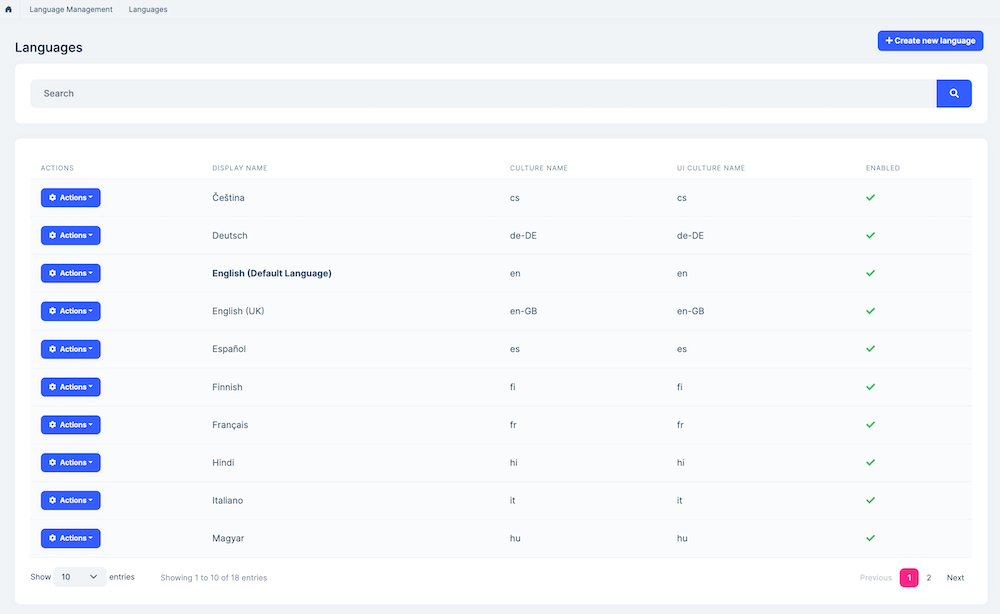
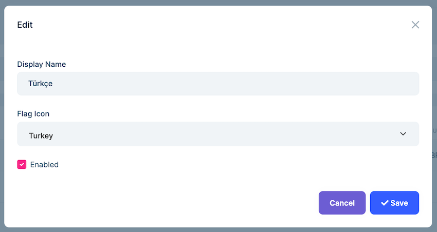
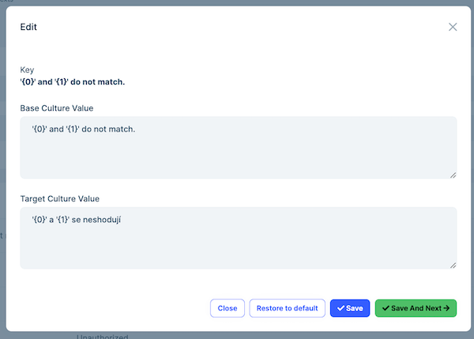

# Language Management Module (Pro)

> You must have an ABP Team or a higher license to use this module.

This module implements the Language management system of an application;

* Manage **languages** in the system.
* Translate texts in the UI.
* Enable/disable **languages**.
* Select **default language** in the UI.

See [the module description page](https://abp.io/modules/Volo.LanguageManagement) for an overview of the module features.

## How to Install

The language management module is pre-installed in [the startup templates](../solution-templates). So, no need to manually install it.

## Packages

This module follows the [module development best practices guide](../framework/architecture/best-practices) and consists of several NuGet and NPM packages. Please look at the guide if you want to understand the packages and the relations between them.

You can visit [Language Management module package list page](https://abp.io/packages?moduleName=Volo.LanguageManagement) to see the list of packages related to this module.

## User Interface

### Menu Items

The language management module adds the following items to the "Main" menu, under the "Administration" menu item:

* **Languages**: Language management page.
* **Language Texts**: Language text management page.

`LanguageManagementMenuNames` class has the constants for the menu item names.

### Pages

#### Languages

The languages page is used to manage languages in the system. 



You can create a new language or edit an existing language in this page:



* **Enabled** languages can be selected as the system language.

#### Language Texts

The language texts page is used to manage texts in different languages.


You can translate a text for a language or edit the already existing translation in this page.



## Data Seed

This module adds some initial data (see [the data seed system](../framework/infrastructure/data-seeding.md)) to the database when you run the `.DbMigrator` application:

* Creates language records configured using `AbpLocalizationOptions`.

If you want to change the seeded language list, see the next section.

## Internals

### Domain Layer

#### Aggregates

This module follows the [Entity Best Practices & Conventions](../framework/architecture/best-practices/entities.md) guide.

##### Language

* `Language` (aggregate root): Represents a language in the system.
* `LanguageText` (aggregate root): Represents a language text in the system.

#### Repositories

This module follows the [Repository Best Practices & Conventions](../framework/architecture/best-practices/repositories.md) guide.

Following custom repositories are defined for this module:

* `ILanguageRepository`
* `ILanguageTextRepository`

#### Domain Services

This module doesn't define any domain service.

### Settings

This module doesn't define any setting.

### Application Layer

#### Application Services

* `LanguageAppService` (implements `ILanguageAppService`): Implements the use cases of the language management UI.
* `LanguageTextAppService` (implements `ILanguageTextAppService`): Implements the use cases of the language texts management UI. 

### Database Providers

#### Common

##### Table/Collection Prefix & Schema

All tables/collections use the `Abp` prefix by default. Set static properties on the `LanguageManagementDbProperties` class if you need to change the table prefix or set a schema name (if supported by your database provider).

##### Connection String

This module uses `AbpLanguageManagement` for the connection string name. If you don't define a connection string with this name, it fallbacks to the `Default` connection string.

See the [connection strings](../framework/fundamentals/connection-strings.md) documentation for details.

#### Entity Framework Core

##### Tables

* **AbpLanguages**
* **AbpLanguageTexts**

#### MongoDB

##### Collections

* **AbpLanguages**
* **AbpLanguageTexts**

### Permissions

See the `LanguageManagementPermissions` class members for all permissions defined for this module.


### Angular UI

#### Installation

To configure the application to use the `LanguageManagementModule`, you first need to import `LanguageManagementConfigModule` from `@volo/abp.ng.language-management/config` to root module. `LanguageManagementConfigModule` has a static `forRoot` method which you should call for a proper configuration.

```js
// app.module.ts
import { LanguageManagementConfigModule } from '@volo/abp.ng.language-management/config';

@NgModule({
  imports: [
    // other imports
    LanguageManagementConfigModule.forRoot(),
    // other imports
  ],
  // ...
})
export class AppModule {}
```

The `LanguageManagementModule` should be imported and lazy-loaded in your routing module. It has a static `forLazy` method for configuration. Available options are listed below. It is available for import from `@volo/abp.ng.language-management`.

```js
// app-routing.module.ts
const routes: Routes = [
  // other route definitions
  {
    path: 'language-management',
    loadChildren: () =>
      import('@volo/abp.ng.language-management').then(m => m.LanguageManagementModule.forLazy(/* options here */)),
  },
];

@NgModule(/* AppRoutingModule metadata */)
export class AppRoutingModule {}
```

> If you have generated your project via the startup template, you do not have to do anything because it already has both `LanguageManagementConfigModule` and `LanguageManagementModule`.

<h4 id="h-language-management-module-options">Options</h4>

You can modify the look and behavior of the module pages by passing the following options to `LanguageManagementModule.forLazy` static method:

- **entityActionContributors:** Changes grid actions. Please check [Entity Action Extensions for Angular](../framework/ui/angular/entity-action-extensions.md) for details.
- **toolbarActionContributors:** Changes page toolbar. Please check [Page Toolbar Extensions for Angular](../framework/ui/angular/page-toolbar-extensions.md) for details.
- **entityPropContributors:** Changes table columns. Please check [Data Table Column Extensions for Angular](../framework/ui/angular/data-table-column-extensions.md) for details.
- **createFormPropContributors:** Changes create form fields. Please check [Dynamic Form Extensions for Angular](../framework/ui/angular/dynamic-form-extensions.md) for details.
- **editFormPropContributors:** Changes create form fields. Please check [Dynamic Form Extensions for Angular](../framework/ui/angular/dynamic-form-extensions.md) for details.

#### Services / Models

Language Management module services and models are generated via `generate-proxy` command of the [ABP CLI](../cli). If you need the module's proxies, you can run the following command in the Angular project directory:

```bash
abp generate-proxy --module languageManagement
```


#### Replaceable Components

`eLanguageManagementComponents` enum provides all replaceable component keys. It is available for import from `@volo/abp.ng.language-management`.

Please check [Component Replacement document](../framework/ui/angular/component-replacement.md) for details.


#### Remote Endpoint URL

The Language Management module remote endpoint URL can be configured in the environment files.

```js
export const environment = {
  // other configurations
  apis: {
    default: {
      url: 'default url here',
    },
    LanguageManagement: {
      url: 'Language Management remote url here'
    }
    // other api configurations
  },
};
```

The Language Management module remote URL configuration shown above is optional. If you don't set a URL, the `default.url` will be used as a fallback.

## Distributed Events


This module defines the following ETOs (Event Transfer Objects) to allow you to subscribe to changes on the entities of the module;

- `LanguageEto` is published on changes done on a `Language` entity.
- `LanguageTextEto` is published on changes done on a `LanguageText` entity.

**Example: Get notified when a new tenant has been created**

```
public class MyHandler :
    IDistributedEventHandler<EntityCreatedEto<LanguageEto>>,
    ITransientDependency
{
    public async Task HandleEventAsync(EntityCreatedEto<LanguageEto> eventData)
    {
        LanguageEto language = eventData.Entity;
        // TODO: ...
    }
}
```


`LanguageEto` and `LanguageTextEto` are configured to publish the events automatically. You should be able to configure yourself for the others. See the [Distributed Event Bus document](https://github.com/abpframework/abp/blob/rel-7.3/docs/en/Distributed-Event-Bus.md) to learn details of the pre-defined events.

> Subscribing to distributed events is especially useful for distributed scenarios (like microservice architecture). If you are building a monolithic application or listening events in the same process that runs the Tenant Management Module, then subscribing to the [local events](https://github.com/abpframework/abp/blob/rel-7.3/docs/en/Local-Event-Bus.md) can be more efficient and easier.
