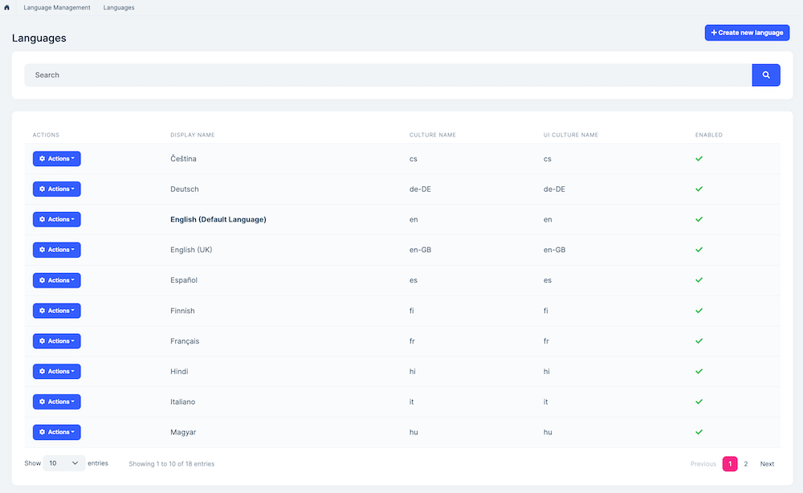
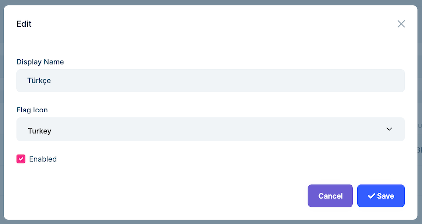
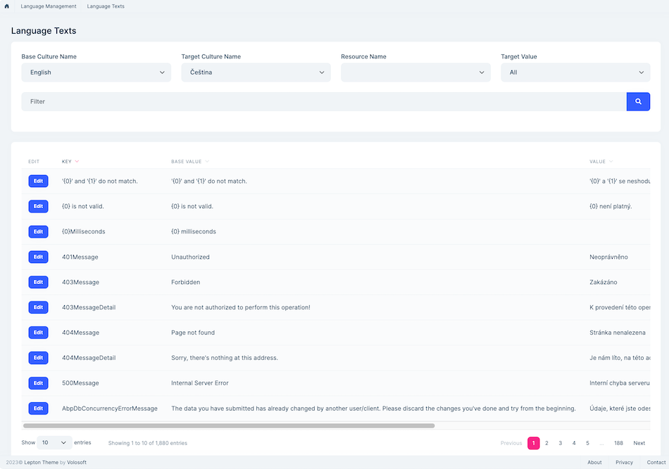
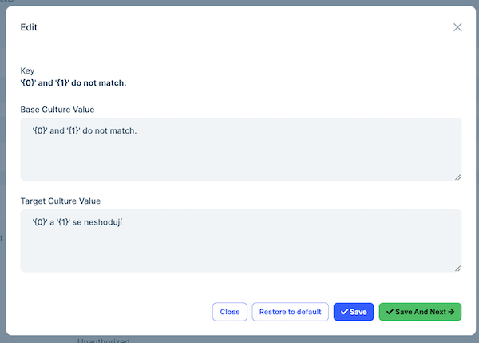

```json
//[doc-seo]
{
    "Description": "Learn to manage languages, translate UI texts, and set defaults effortlessly with the ABP Framework's Language Management Module (Pro)."
}
```

# Language Management Module (Pro)

> You must have an [ABP Team or a higher license](https://abp.io/pricing) to use this module.

This module implements the Language management system of an application;

* Manage **languages** in the system.
* Translate texts in the UI.
* Enable/disable **languages**.
* Select **default language** in the UI.

See [the module description page](https://abp.io/modules/Volo.LanguageManagement) for an overview of the module features.

The `LanguageManagement.Enable` feature is enabled by default. The module's permissions, application services and menu items require this feature.

## How to Install

The language management module is pre-installed in [the startup templates](../solution-templates). So, no need to manually install it.

## Packages

This module follows the [module development best practices guide](../framework/architecture/best-practices) and consists of several NuGet and NPM packages. Please look at the guide if you want to understand the packages and the relations between them.

You can visit [Language Management module package list page](https://abp.io/packages?moduleName=Volo.LanguageManagement) to see the list of packages related to this module.

## User Interface

### Permissions

The module defines the following permissions. All of them require the `LanguageManagement.Enable` feature.

| Permission | Multi-tenancy side | Description |
| --- | --- | --- |
| `LanguageManagement.Languages` | Host and tenant | View the language list. |
| `LanguageManagement.Languages.Create` | Host | Create a language. |
| `LanguageManagement.Languages.Edit` | Host | Change a language's display name and enabled state. |
| `LanguageManagement.Languages.Delete` | Host | Delete a language. |
| `LanguageManagement.Languages.ChangeDefault` | Host and tenant | Set the default language for the current tenant context. |
| `LanguageManagement.LanguageTexts` | Host and tenant | View localization texts and restore an override to its default value. |
| `LanguageManagement.LanguageTexts.Edit` | Host and tenant | Create or update localization-text overrides. |

### Menu Items

The language management module adds the following items to the "Main" menu, under the "Administration" menu item:

* **Languages**: Language management page.
* **Language Texts**: Language text management page.

`LanguageManagementMenuNames` class has the constants for the menu item names.

### Pages

#### Languages

The languages page is used to manage languages in the system. 



You can create a new language or edit an existing language in this page:



* **Enabled** languages can be selected as the system language.

Language definitions are global: tenants use the same language list, while each tenant can select its own default language. Setting a default language writes the framework's `Abp.Localization.DefaultLanguage` setting for the current tenant context.

The culture name and UI culture name are selected when a language is created and can't be changed from the update operation. Creating a language is rejected when another language with the same culture name already exists. Editing a language changes only its display name, enabled state and configured extra properties.

The module replaces the framework's `ILanguageProvider` with a database-backed provider. If the database contains at least one enabled language, those enabled records are the available languages. If it contains no enabled language, the provider falls back to the languages configured in `AbpLocalizationOptions`.

#### Language Texts

The language texts page is used to manage texts in different languages.



You can translate a text for a language or edit the already existing translation in this page.



The page works with backend localization resources registered in `AbpLocalizationOptions` or discovered through the external localization store. UI-only strings stored exclusively in frontend locale files aren't included.

You can select a base culture, target culture and resource, filter by key or value and show only entries whose target value is empty. The base-culture list includes fallback values from the resource's default culture and parent cultures. The target value represents only the selected target culture, without default-culture, parent-culture or base-resource fallback values.

An edited text is stored as an override for the current tenant context. **Restore to default** deletes that context's override so the normal localization contributors and fallback rules provide the value again. Text changes invalidate the related distributed cache entry; restarting the application isn't required.

### UI Extension Points

The MVC UI uses `languageManagement.language` and `languageManagement.texts` as its [entity action extension](../framework/ui/mvc-razor-pages/entity-action-extensions.md) keys. The language list also uses `languageManagement.language` for [data table column extensions](../framework/ui/mvc-razor-pages/data-table-column-extensions.md).

The standard Blazor (Blazorise) UI exposes entity actions and table columns through the `LanguageManagement` and `LanguageTextManagement` page component types. See the Blazor [entity action](../framework/ui/blazor/entity-action-extensions.md) and [data table column](../framework/ui/blazor/data-table-column-extensions.md) extension documents. The MudBlazor UI doesn't currently expose the same entity-action and table-column dictionaries.

## Data Seed

This module adds some initial data (see [the data seed system](../framework/infrastructure/data-seeding.md)) to the database when you run the `.DbMigrator` application:

* Creates language records configured using `AbpLocalizationOptions`.

Language records are seeded only in the host context because the language list is global. The seeder inserts missing culture/UI-culture pairs; it doesn't update or remove existing records when the configured list changes.

If you want to change the seeded language list, see the [Localization](../framework/fundamentals/localization.md#Supported-Languages) document.

## Internals

### Dynamic and External Localization

The module adds a dynamic contributor to every backend localization resource. Tenant-specific `LanguageText` overrides take precedence when the resource is localized, and changing an override invalidates its resource/culture cache entry.

The module also implements the framework's external localization store. By default, application initialization starts a background synchronization that saves the application's static resource metadata and compatible localization texts to that store. Application startup doesn't wait for this synchronization to finish. You can disable it for a regular application host as follows:

`AbpExternalLocalizationOptions` is defined in the `Volo.Abp.LanguageManagement.External` namespace.

```csharp
Configure<AbpExternalLocalizationOptions>(options =>
{
    options.SaveToExternalStore = false;
});
```

`SaveToExternalStore` is automatically disabled in a data-migration environment. Disabling it stops the startup synchronization; it doesn't disable reading resources from the external localization store or applying existing `LanguageText` overrides.

### Domain Layer

#### Aggregates

This module follows the [Entity Best Practices & Conventions](../framework/architecture/best-practices/entities.md) guide.

##### Language

* `Language` (aggregate root): Represents a language in the system.
* `LanguageText` (aggregate root): Represents a language text in the system.

##### Dynamic Localization

* `LocalizationResourceRecord` (aggregate root): Represents a localization resource in the system.
* `LocalizationTextRecord` (aggregate root): Represents all texts of a localization resource in the system.

The `Language` aggregate supports the module entity extension system through `ConfigureLanguageManagement(...).ConfigureLanguage(...)`. See the [module entity extensions](../framework/architecture/modularity/extending/module-entity-extensions.md) document for the general configuration pattern.

#### Repositories

This module follows the [Repository Best Practices & Conventions](../framework/architecture/best-practices/repositories.md) guide.

Following custom repositories are defined for this module:

* `ILanguageRepository`
* `ILanguageTextRepository`
* `ILocalizationResourceRecordRepository`
* `ILocalizationTextRecordRepository`

#### Domain Services

* `LanguageManager`: Creates language records and rejects duplicate culture names.

### Settings

This module doesn't define any setting.

### Application Layer

#### Application Services

* `LanguageAppService` (implements `ILanguageAppService`): Implements the use cases of the language management UI.
* `LanguageTextAppService` (implements `ILanguageTextAppService`): Implements the use cases of the language texts management UI. 

### Database Providers

#### Common

##### Table/Collection Prefix & Schema

All tables/collections use the `Abp` prefix by default. Set static properties on the `LanguageManagementDbProperties` class if you need to change the table prefix or set a schema name (if supported by your database provider).

##### Connection String

This module uses `AbpLanguageManagement` for the connection string name. If you don't define a connection string with this name, it fallbacks to the `Default` connection string.

See the [connection strings](../framework/fundamentals/connection-strings.md) documentation for details.

#### Entity Framework Core

##### Tables

* **AbpLanguages**
* **AbpLanguageTexts**
* **AbpLocalizationResources**
* **AbpLocalizationTexts**

#### MongoDB

##### Collections

* **AbpLanguages**
* **AbpLanguageTexts**
* **AbpLocalizationResources**
* **AbpLocalizationTexts**

### Angular UI

#### Installation

To configure the application to use the language management module, import `provideLanguageManagementConfig` from `@volo/abp.ng.language-management/config` and append it to the root `providers` array. The module's locale loader should also be registered in the existing `provideAbpCore` configuration so Angular can load locale data for languages added at runtime.

```ts
// app.config.ts
import { ApplicationConfig } from '@angular/core';
import { provideAbpCore, withOptions } from '@abp/ng.core';
import { provideLanguageManagementConfig } from '@volo/abp.ng.language-management/config';
import { registerLocale } from '@volo/abp.ng.language-management/locale';
import { environment } from '../environments/environment';

export const appConfig: ApplicationConfig = {
  providers: [
    // ...
    provideAbpCore(
      withOptions({
        environment,
        registerLocaleFn: registerLocale(),
      }),
    ),
    provideLanguageManagementConfig(),
  ],
};

```

The language management module should be imported and lazy-loaded in your routing array. It exports a `createRoutes` function from `@volo/abp.ng.language-management`. Available options are listed below.

```ts
// app.routes.ts
import { Routes } from '@angular/router';

const APP_ROUTES: Routes = [
  // ...
  {
    path: 'language-management',
    loadChildren: () =>
      import('@volo/abp.ng.language-management').then(c => c.createRoutes()),
  },
];
```

> If you have generated your project via the startup template, you do not have to do anything because it already has both configurations implemented.

<h4 id="h-language-management-module-options">Options</h4>

You can modify the look and behavior of the module pages by passing the following options to the `createRoutes` function:

- **entityActionContributors:** Changes grid actions. Please check [Entity Action Extensions for Angular](../framework/ui/angular/entity-action-extensions.md) for details.
- **toolbarActionContributors:** Changes page toolbar. Please check [Page Toolbar Extensions for Angular](../framework/ui/angular/page-toolbar-extensions.md) for details.
- **entityPropContributors:** Changes table columns. Please check [Data Table Column Extensions for Angular](../framework/ui/angular/data-table-column-extensions.md) for details.
- **createFormPropContributors:** Changes create form fields. Please check [Dynamic Form Extensions for Angular](../framework/ui/angular/dynamic-form-extensions.md) for details.
- **editFormPropContributors:** Changes edit form fields. Please check [Dynamic Form Extensions for Angular](../framework/ui/angular/dynamic-form-extensions.md) for details.

#### Services / Models

Language Management module services and models are generated via `generate-proxy` command of the [ABP CLI](../cli). If you need the module's proxies, you can run the following command in the Angular project directory:

```bash
abp generate-proxy --module languageManagement
```


#### Replaceable Components

`eLanguageManagementComponents` enum provides all replaceable component keys. It is available for import from `@volo/abp.ng.language-management`.

The available keys are:

* `eLanguageManagementComponents.Languages`
* `eLanguageManagementComponents.LanguageTexts`

Please check [Component Replacement document](../framework/ui/angular/component-replacement.md) for details.


#### Remote Endpoint URL

The Language Management module remote endpoint URL can be configured in the environment files.

```ts
export const environment = {
  // other configurations
  apis: {
    default: {
      url: 'default url here',
    },
    LanguageManagement: {
      url: 'Language Management remote url here',
    },
    // other api configurations
  },
};
```

The Language Management module remote URL configuration shown above is optional. If you don't set a URL, the `default.url` will be used as a fallback.

## Distributed Events


The module maps its entities to the following Event Transfer Objects (ETOs):

- `Language` maps to `LanguageEto`.
- `LanguageText` maps to `LanguageTextEto`.

Registering an ETO mapping doesn't enable automatic distributed entity events by itself. Add the entity types to `AbpDistributedEntityEventOptions.AutoEventSelectors` if your application should publish these events automatically:

```csharp
Configure<AbpDistributedEntityEventOptions>(options =>
{
    options.AutoEventSelectors.Add<Language>();
    options.AutoEventSelectors.Add<LanguageText>();
});
```

**Example: Get notified when a language has been created**

```csharp
public class MyHandler :
    IDistributedEventHandler<EntityCreatedEto<LanguageEto>>,
    ITransientDependency
{
    public async Task HandleEventAsync(EntityCreatedEto<LanguageEto> eventData)
    {
        LanguageEto language = eventData.Entity;
        // TODO: ...
    }
}
```


The module already configures the `Language` to `LanguageEto` and `LanguageText` to `LanguageTextEto` mappings. Language entity changes also publish `LanguageChangedEto`, which consumers can use to refresh their language list. See the [Distributed Event Bus](../framework/infrastructure/event-bus/distributed) document for details of the pre-defined entity events.

> Subscribing to distributed events is especially useful for distributed scenarios (like microservice architecture). If you are building a monolithic application or listening for events in the same process that runs the Language Management Module, subscribing to the [Local Event Bus](../framework/infrastructure/event-bus/local) can be simpler.
