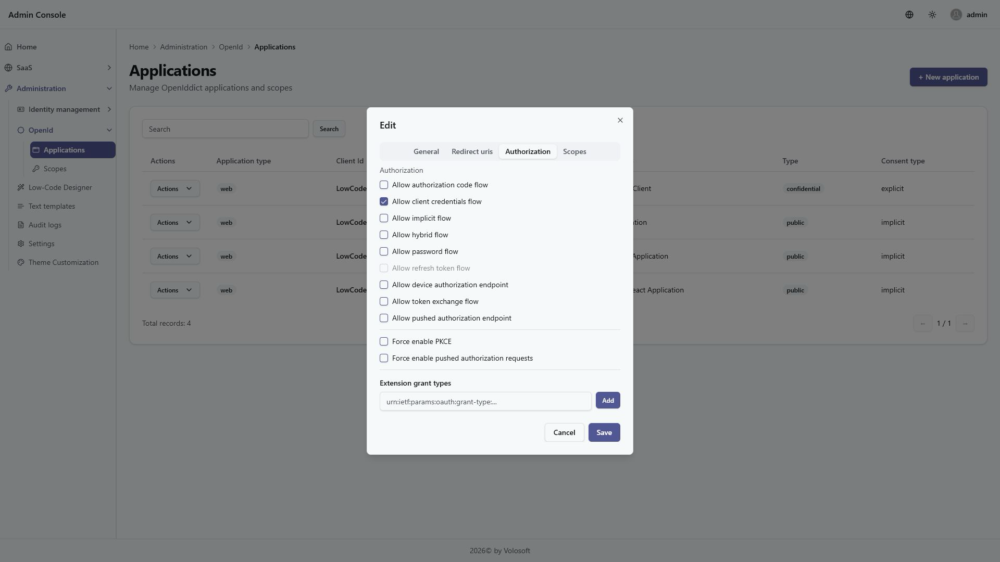
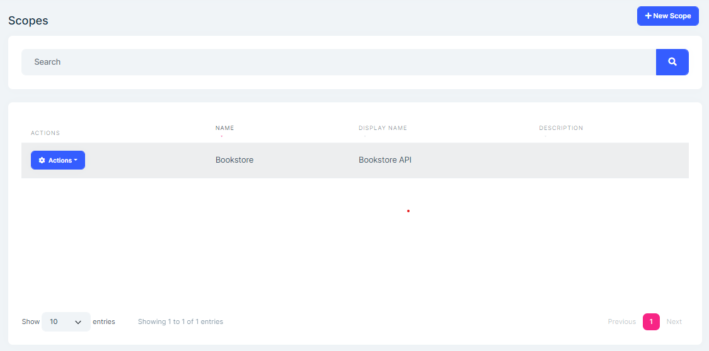
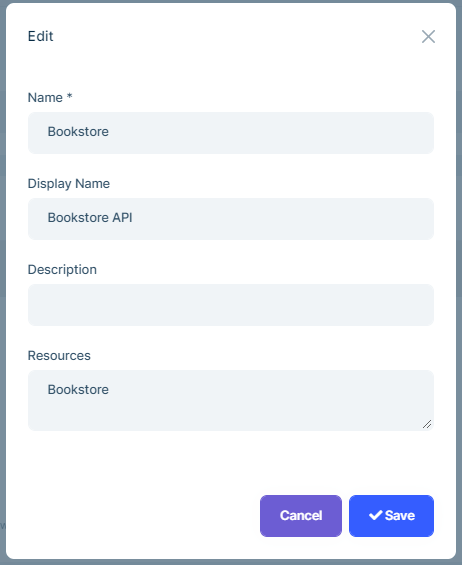

```json
//[doc-seo]
{
    "Description": "Manage OpenIddict applications, scopes, client permissions, credentials, flows, and token lifetimes with the ABP OpenIddict Pro module."
}
```

# OpenIddict Module (Pro)

> You must have an [ABP Team or a higher license](https://abp.io/pricing) to use this module.

The OpenIddict Pro module adds application and scope administration to ABP's [open-source OpenIddict module](./openiddict.md). It provides management UI and APIs for MVC, Angular, Blazor and MudBlazor applications.

The two modules have different responsibilities:

- The **OpenIddict module** implements the OpenIddict server integration, token validation, stores, persistence, token cleanup and low-level configuration.
- The **OpenIddict Pro module** manages the applications and scopes consumed by that server.

See the [OpenIddict module](./openiddict.md) for server endpoints, flows, certificates, validation, token cleanup, aggregates, stores and database configuration.

## How to Install

To add OpenIddict Pro to an existing solution, use ABP Suite or run the following command in the solution directory:

```bash
abp add-module Volo.OpenIddict.Pro
```

See the [module page](https://abp.io/modules/Volo.OpenIddict.Pro) for an overview and the [package list](https://abp.io/packages?moduleName=Volo.OpenIddict.Pro) for the current NuGet and NPM packages.

If you are replacing IdentityServer, follow the [IdentityServer to OpenIddict migration guide](../release-info/migration-guides/identityserver-to-openiddict.md).

## User Interface

The module provides the same application and scope management workflows for:

- MVC / Razor Pages
- Angular
- Blazor with Blazorise
- Blazor with MudBlazor

Server and WebAssembly wrapper packages are available for both Blazor UI families.

The module adds **OpenId** under the **Administration** menu, with **Applications** and **Scopes** child items. The menu entries and all module permissions are available on the host side only.

### Application Management

The Applications page manages clients that request tokens from the OpenIddict server.

The list shows the application type, client ID, display name, client type, consent type and available actions.

You can create, filter, update and delete applications.

The create and edit dialog groups general settings, URIs, authorization flows and scopes into tabs.

The application form manages:

- **Application type**: Web or Native.
- **Client identity**: Client ID, display name, client URI and logo URI.
- **Client type**: Public or Confidential.
- **Consent type**: Explicit, External, Implicit or Systematic.
- **Credentials**: A client secret or a JSON Web Key Set (JWKS) for `private_key_jwt` authentication.
- **Flows**: Authorization Code, Implicit, Hybrid, Password, Client Credentials, Refresh Token, Token Exchange and Device Authorization.
- **Endpoints and requirements**: End Session, Pushed Authorization, PKCE and enforced Pushed Authorization Requests (PAR).
- **URIs**: Redirect, post-logout redirect and front-channel logout URIs.
- **Permissions**: Allowed scopes and extension grant types.

The management service derives the OpenIddict grant-type, endpoint and response-type permissions from these selections. For example, enabling Hybrid flow also enables Authorization Code and Implicit flows, and enforcing PAR enables the Pushed Authorization endpoint.

Redirect, post-logout redirect and front-channel logout values must be absolute URIs.

#### Client Credentials

Public clients cannot have a client secret or JWKS. Confidential clients must have at least one credential:

- Use a strong client secret for `client_secret` authentication.
- Use a JWKS containing the client's public signing keys for `private_key_jwt` authentication.

Client secrets are write-only. The management API never returns the stored secret, and leaving the secret empty while editing keeps the existing value. Switching an application to Public removes its stored client secret and JWKS. An empty JWKS value explicitly removes the JWKS only when another confidential-client credential remains.

Keep client secrets and private keys outside source control. The JWKS field is intended for public signing keys; never paste a private key into it.

#### PKCE and Pushed Authorization Requests

Use **Force PKCE** to require Proof Key for Code Exchange for a client.

Use **Allow Pushed Authorization Endpoint** to permit PAR requests. Enabling **Force Pushed Authorization** both permits the endpoint and requires PAR for that client.

#### Token Lifetime Overrides

The **Token Lifetime** action configures per-application overrides for:

- Access token
- Authorization code
- Device code
- Identity token
- Refresh token
- User code
- Request token
- Issued token

Enter positive values in seconds. Leave a field empty to remove the application override and use the server default. These values change only the selected application; configure server-wide defaults in the [OpenIddict module](./openiddict.md).

#### Generate an Access Token

The **Generate Access Token** action sends a Client Credentials request to the configured OpenIddict server. The action is available only when all of the following conditions are met:

- The current user has the `OpenIddictPro.Application.GenerateAccessToken` permission.
- The application is Confidential.
- Client Credentials flow is enabled.
- Every requested scope is assigned to the application.

The action asks for the client secret at request time because stored secrets cannot be read back. A JWKS-only client must request its token outside this UI by creating its own `private_key_jwt` client assertion.

The application service reads the token server base URL from `AuthServer:Authority` and sends the request to its `/connect/token` endpoint:

```json
{
  "AuthServer": {
    "Authority": "https://auth.example.com"
  }
}
```

The result displays the access token, token type, expiration in seconds and granted scope. Treat both the entered secret and returned access token as sensitive data: do not log them or include them in screenshots, tickets or source files.

### Creating a Client Credentials Application

Use a client credentials application when a machine-to-machine client, automation process or MCP client needs to call protected APIs without an interactive user.

1. Open **Administration** > **OpenId** > **Applications**.
2. Click **New Application**.
3. Enter a unique **Client ID**, such as `InternalAutomationClient`.
4. Select **Confidential client**.
5. Enter a strong **Client Secret** and store it securely.
6. Enable **Allow client credentials flow**.
7. Select the API scopes the client is allowed to request.
8. Save the application.



If the protected API also uses ABP permissions, open the application's **Actions** menu, select **Permissions**, and grant permissions for the **Client (OpenIddict Applications)** provider. Scope assignment controls OAuth access; ABP permission assignment controls the operations that the client principal can perform.

You can use the **Generate Access Token** action or call the token endpoint directly:

```bash
curl -X POST "https://localhost:<auth-server-port>/connect/token" \
  -H "Content-Type: application/x-www-form-urlencoded" \
  -d "grant_type=client_credentials" \
  -d "client_id=InternalAutomationClient" \
  -d "client_secret=<client-secret>" \
  -d "scope=<api-scope>"
```

Use the returned `access_token` as a bearer token:

```text
Authorization: Bearer <access-token>
```

In a non-tiered solution, the authority is normally the backend host. In a tiered or microservice solution, use the Auth Server URL.

### Scope Management

Scopes define the API access that applications can request.



You can create, filter, update and delete scopes.



A scope has a unique **Name** and optional **Display Name**, **Description** and **Resources**. Resources identify the API audiences associated with the scope.

The application editor also offers the built-in `address`, `email`, `phone`, `profile` and `roles` scopes. These built-in choices are not seeded or managed as Pro scope records, and the scope service rejects attempts to create or rename a managed scope to one of those names.

## Permissions

All OpenIddict Pro permissions are host-only.

| Permission | Task |
| --- | --- |
| `OpenIddictPro.Application` | View applications and the Applications menu |
| `OpenIddictPro.Application.Create` | Create applications |
| `OpenIddictPro.Application.Update` | Update applications and token lifetime overrides |
| `OpenIddictPro.Application.Delete` | Delete applications |
| `OpenIddictPro.Application.ManagePermissions` | Manage ABP permissions for a client application |
| `OpenIddictPro.Application.GenerateAccessToken` | Generate a Client Credentials access token |
| `OpenIddictPro.Scope` | View scopes and the Scopes menu |
| `OpenIddictPro.Scope.Create` | Create scopes |
| `OpenIddictPro.Scope.Update` | Update scopes |
| `OpenIddictPro.Scope.Delete` | Delete scopes |

When the Audit Logging UI module is installed, its typed **View Change History** permissions add a Change History action for applications and scopes.

## HTTP APIs

The module exposes administration APIs under these route groups:

| Route group | Operations |
| --- | --- |
| `/api/openiddict/applications` | List, get, create, update and delete applications |
| `/api/openiddict/applications/{id}/token-lifetime` | Get or set per-client token lifetime overrides |
| `/api/openiddict/applications/{id}/generate-access-token` | Generate a Client Credentials access token |
| `/api/openiddict/scopes` | List, get, create, update and delete scopes |
| `/api/openiddict/scopes/all` | Get managed and built-in scopes for application assignment |

The application services enforce the permissions and validation rules described above. The published .NET and Angular proxy packages provide typed clients for these APIs.

## Angular

The Angular package is `@volo/abp.ng.openiddictpro`. Current standalone applications register its configuration provider in `app.config.ts`:

```typescript
import { provideOpeniddictproConfig } from '@volo/abp.ng.openiddictpro/config';

export const appConfig = {
  providers: [provideOpeniddictproConfig()],
};
```

Add its lazy routes in `app.routes.ts`:

```typescript
{
  path: 'openiddict',
  loadChildren: () =>
    import('@volo/abp.ng.openiddictpro').then(module => module.createRoutes()),
}
```

`createRoutes` accepts `entityActionContributors`, `toolbarActionContributors`, `entityPropContributors`, `createFormPropContributors` and `editFormPropContributors`. The Applications component is declared for all five contributor types; the Scopes component is declared for entity action contributors.

The replaceable component keys are:

- `eOpenIddictProComponents.Applications`
- `eOpenIddictProComponents.Scopes`

See the Angular guides for [extension points](../framework/ui/angular/extensions-overall.md), [dynamic form extensions](../framework/ui/angular/dynamic-form-extensions.md) and [component replacement](../framework/ui/angular/component-replacement.md).

## Persistence

OpenIddict Pro does not add a separate application or scope schema. Its EF Core and MongoDB provider packages reuse the open-source OpenIddict entities, mappings, `AbpOpenIddict` connection-string name and host-only storage model.

Configure the tables, collections, schema, connection string and database providers through the [OpenIddict module](./openiddict.md).
