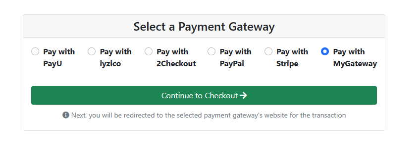

# Creating a Custom Payment Gateway

> You must have an ABP Team or a higher license to use this module.

This document explains creating custom a payment gateway that's different than the existing ones in the [Payment Module](payment#packages).

## Creating Core Operations

- Create **MyPaymentGateway.cs** and implement `IPaymentGateway`

  ```csharp
  public class MyPaymentGateway : IPaymentGateway, ITransientDependency
    {
        private readonly IPaymentRequestRepository paymentRequestRepository;

        public MyPaymentGateway(IPaymentRequestRepository paymentRequestRepository)
        {
            this.paymentRequestRepository = paymentRequestRepository;
        }

        public async Task<PaymentRequestStartResult> StartAsync(PaymentRequest paymentRequest, PaymentRequestStartInput input)
        {
            var totalPrice = paymentRequest.Products.Sum(x => x.TotalPrice);

            var checkoutLink = // Some operations here

            return new PaymentRequestStartResult
            {
                CheckoutLink = checkoutLink + "returnUrl=" + input.ReturnUrl
            };
        }

        public async Task<PaymentRequest> CompleteAsync(Dictionary<string, string> parameters)
        {
            var token = parameters["token"]; // You can get any parameter from your gateway provides. Example: token, id, hash etc. 

            var result = ;// provider.Validate(token); Validate the payment here

            var paymentRequest = await paymentRequestRepository.FindAsync(result.Id);

            paymentRequest.SetState(PaymentRequestState.Completed); // completed or anything else according to your result.

            return paymentRequest;
        }

        public Task HandleWebhookAsync(string payload, Dictionary<string, string> headers)
        {
            // You can leave unimplemented if you not configure webhooks.
            throw new System.NotImplementedException();
        }

        public bool IsValid(PaymentRequest paymentRequest, Dictionary<string, string> properties)
        {
            // You can check some custom logic here to make this gateway available or not.
            return true;
        }
    }
  ```

- You should configure your gateway in `PaymentOptions`

  ```csharp
  Configure<PaymentOptions>(options =>
    {
        options.Gateways.Add(new PaymentGatewayConfiguration(
            "MyGateway",
            LocalizableString.Create<PaymentResource>("MyGateway"),
            isSubscriptionSupported: false,
            typeof(MyPaymentGateway)
            ));
    });
  ```

## Creating the UI
There are 2 types of pages that are supported by default. You can define a pre-payment page and post-payment page.

- Create **PreCheckout.cshtml** and **PreCheckout.cshtml.cs**

  ```html
  @model PreCheckoutModel

  <h3>Pre Checkout</h3>
  <form method="post">
      <button class="btn btn-success" asp-page-handler="ContinueToCheckout">
          Continue to Checkout
          <i class="fa fa-long-arrow-right"></i>
      </button>
  </form>
  ```

  ```csharp
  public class PreCheckoutModel : AbpPageModel
  {
      [BindProperty] public Guid PaymentRequestId { get; set; }

      public virtual ActionResult OnGet()
      {
          // GET operation is not supported here. All the selected gateway requests will be sent as POST.
          return BadRequest();
      }

      public virtual async Task OnPostAsync()
      {
          // You can get the payment request from the database by using `PaymentRequestId` and render something on the UI side.
      }

      public virtual async Task<IActionResult> OnPostContinueToCheckout()
      {
          return Redirect("the-actual-checkout-link-of-gateway");
      }
  }
  ```

- Create **PostCheckout.cshtml** and **PostCheckout.cshtml.cs**

  ```html
  @model PostCheckoutModel

  <h3>Operation Done</h3>
  ```

- Configure your pages in `PaymentWebOptions`

  ```csharp
  Configure<PaymentWebOptions>(options =>
  {
      options.Gateways.Add(new PaymentGatewayWebConfiguration(
          name: "MyGateway",
          prePaymentUrl: "/MyGateway/PreCheckout", // This page will be opened before checkout.
          isSubscriptionSupported: false,
          postPaymentUrl: "/MyGateway/PostCheckout" // This page will be opened after checkout.
          ));
  });
  ```

Your custom gateway will be listed in the public payment gateway selection page. If there is only one payment gateway, this page will be skipped.

