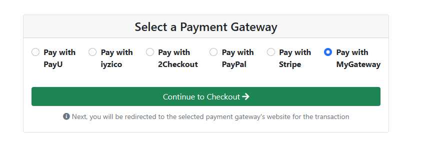

```json
//[doc-seo]
{
    "Description": "Learn how to create a custom payment gateway in ABP Framework, enhancing your application's payment flexibility and integration."
}
```

# Creating a Custom Payment Gateway

> You must have an [ABP Team or a higher license](https://abp.io/pricing) to use this module.

This document explains how to create a custom payment gateway that is different from the built-in gateways in the [Payment Module](payment#packages).

## Creating Core Operations

- Create **MyPaymentGateway.cs** in the **Domain** layer of your project and implement `IPaymentGateway`. The gateway client in this example represents your provider-specific SDK adapter.

  ```csharp
  using System;
  using System.Collections.Generic;
  using System.Linq;
  using System.Threading.Tasks;
  using Volo.Abp.DependencyInjection;
  using Volo.Payment.Gateways;
  using Volo.Payment.Requests;

  public interface IMyGatewayClient
  {
      Task<string> CreateCheckoutAsync(
          Guid paymentRequestId,
          float totalPrice,
          string currency,
          string returnUrl,
          string cancelUrl);

      Task<MyGatewayPaymentResult> VerifyAsync(
          IReadOnlyDictionary<string, string> parameters);

      Task ValidateAndHandleWebhookAsync(
          string payload,
          IReadOnlyDictionary<string, string> headers);
  }

  public interface IMyGatewayTransactionRepository
  {
      Task<bool> TryBindAsync(
          string providerTransactionId,
          Guid paymentRequestId);
  }

  public record MyGatewayPaymentResult(
      Guid PaymentRequestId,
      bool IsPaid,
      float Amount,
      string Currency,
      string ProviderTransactionId,
      string FailureReason);

  public class MyPaymentGateway : IPaymentGateway, ITransientDependency
  {
      private readonly IPaymentRequestRepository _paymentRequestRepository;
      private readonly IMyGatewayClient _gatewayClient;
      private readonly IMyGatewayTransactionRepository _gatewayTransactionRepository;

      public MyPaymentGateway(
          IPaymentRequestRepository paymentRequestRepository,
          IMyGatewayClient gatewayClient,
          IMyGatewayTransactionRepository gatewayTransactionRepository)
      {
          _paymentRequestRepository = paymentRequestRepository;
          _gatewayClient = gatewayClient;
          _gatewayTransactionRepository = gatewayTransactionRepository;
      }

      public bool IsValid(
          PaymentRequest paymentRequest,
          Dictionary<string, string> properties)
      {
          return paymentRequest.Products.Count > 0;
      }

      public async Task<PaymentRequestStartResult> StartAsync(
          PaymentRequest paymentRequest,
          PaymentRequestStartInput input)
      {
          var checkoutLink = await _gatewayClient.CreateCheckoutAsync(
              paymentRequest.Id,
              paymentRequest.Products.Sum(product => product.TotalPrice),
              paymentRequest.Currency,
              input.ReturnUrl,
              input.CancelUrl);

          return new PaymentRequestStartResult
          {
              CheckoutLink = checkoutLink
          };
      }

      public async Task<PaymentRequest> CompleteAsync(
          Dictionary<string, string> parameters)
      {
          var result = await _gatewayClient.VerifyAsync(parameters);
          var paymentRequest = await _paymentRequestRepository.GetAsync(
              result.PaymentRequestId);

          if (result.IsPaid)
          {
              var expectedAmount = paymentRequest.Products.Sum(
                  product => product.TotalPrice);

              if (result.PaymentRequestId != paymentRequest.Id ||
                  result.Amount != expectedAmount ||
                  !string.Equals(
                      result.Currency,
                      paymentRequest.Currency,
                      StringComparison.OrdinalIgnoreCase) ||
                  string.IsNullOrWhiteSpace(result.ProviderTransactionId))
              {
                  throw new InvalidOperationException(
                      "The provider payment does not match the payment request.");
              }

              if (!await _gatewayTransactionRepository.TryBindAsync(
                      result.ProviderTransactionId,
                      paymentRequest.Id))
              {
                  throw new InvalidOperationException(
                      "The provider transaction is already bound to another payment request.");
              }

              paymentRequest.Complete();
          }
          else
          {
              paymentRequest.Failed(result.FailureReason);
          }

          return await _paymentRequestRepository.UpdateAsync(paymentRequest);
      }

      public Task HandleWebhookAsync(
          string payload,
          Dictionary<string, string> headers)
      {
          return _gatewayClient.ValidateAndHandleWebhookAsync(payload, headers);
      }
  }
  ```

  `IsValid` controls whether the gateway is offered for a specific payment request. `StartAsync` passes the request currency to the provider adapter together with the amount. `CompleteAsync` verifies the provider response and reconciles the request identifier, amount, currency, and provider transaction identifier before changing the request state. `HandleWebhookAsync` must validate the webhook signature or equivalent authenticity proof before processing its payload.

  `IMyGatewayTransactionRepository` is application-owned; it isn't part of the Payment module. Implement `TryBindAsync` as an atomic insert-or-match operation. For this one-time gateway, add unique database constraints for both the provider transaction identifier and the payment request identifier, accept an existing row only when the same pair is retried, and execute the binding and payment-request update in the same unit of work. This persists the provider transaction identifier while rejecting cross-request replay and a different transaction for an already-bound request.

  The Payment HTTP API forwards `POST /api/payment/{paymentMethod}/webhook` to `HandleWebhookAsync`. Configure the provider to use this URL with your gateway name as `paymentMethod`, for example `/api/payment/MyGateway/webhook`. Always validate the provider signature before processing the payload.

- You should also configure `PaymentOptions` for your gateway in the **Domain** layer of your project as shown below.

  Add `using Volo.Abp.Localization;` to the module class file for `FixedLocalizableString`.

  ```csharp
  Configure<PaymentOptions>(options =>
  {
      options.Gateways.Add(new PaymentGatewayConfiguration(
          "MyGateway",
          new FixedLocalizableString("MyGateway"),
          isSubscriptionSupported: false,
          typeof(MyPaymentGateway)
      ));
  });
  ```

## Creating the UI
Two page types are supported by default: a pre-payment page and a post-payment page.

- Create **Pages/MyGateway/PreCheckout.cshtml** and **Pages/MyGateway/PreCheckout.cshtml.cs**.

  ```html
  @page "/MyGateway/PreCheckout"
  @model PreCheckoutModel

  <h3>Pre Checkout</h3>
  <form method="post">
      <input type="hidden" asp-for="PaymentRequestId" />
      <button type="submit" class="btn btn-success" asp-page-handler="ContinueToCheckout">
          Continue to Checkout
          <i class="fa fa-long-arrow-right"></i>
      </button>
  </form>
  ```

  ```csharp
  using System;
  using System.Threading.Tasks;
  using Microsoft.AspNetCore.Mvc;
  using Microsoft.Extensions.Options;
  using Volo.Abp.AspNetCore.Mvc.UI.RazorPages;
  using Volo.Payment;
  using Volo.Payment.Requests;

  public class PreCheckoutModel : AbpPageModel
  {
      private readonly IOptions<PaymentWebOptions> _paymentWebOptions;
      private readonly IPaymentRequestAppService _paymentRequestAppService;

      [BindProperty]
      public Guid PaymentRequestId { get; set; }

      public PreCheckoutModel(
          IOptions<PaymentWebOptions> paymentWebOptions,
          IPaymentRequestAppService paymentRequestAppService)
      {
          _paymentWebOptions = paymentWebOptions;
          _paymentRequestAppService = paymentRequestAppService;
      }

      public virtual ActionResult OnGet()
      {
          return BadRequest();
      }

      public virtual IActionResult OnPost()
      {
          return Page();
      }

      public virtual async Task<IActionResult> OnPostContinueToCheckoutAsync()
      {
          await _paymentWebOptions.SetAsync();
          var rootUrl = _paymentWebOptions.Value.RootUrl.TrimEnd('/');

          var result = await _paymentRequestAppService.StartAsync(
              "MyGateway",
              new PaymentRequestStartDto
              {
                  PaymentRequestId = PaymentRequestId,
                  ReturnUrl = rootUrl + "/MyGateway/PostCheckout",
                  CancelUrl = rootUrl
              });

          return Redirect(result.CheckoutLink);
      }
  }
  ```

  The gateway selection page preserves the POST method when it redirects to the pre-payment URL. `OnPost` handles that initial request and displays the page. The `ContinueToCheckout` handler starts the payment only after the user submits the pre-payment form.

- Create **Pages/MyGateway/PostCheckout.cshtml** and **Pages/MyGateway/PostCheckout.cshtml.cs**.

  ```html
  @page "/MyGateway/PostCheckout"
  @model PostCheckoutModel

  <h3>Operation Done</h3>
  ```

  ```csharp
  using System.Collections.Generic;
  using System.Linq;
  using System.Threading.Tasks;
  using Microsoft.AspNetCore.Mvc;
  using Volo.Abp.AspNetCore.Mvc.UI.RazorPages;
  using Volo.Payment.Requests;

  [IgnoreAntiforgeryToken]
  public class PostCheckoutModel : AbpPageModel
  {
      private readonly IPaymentRequestAppService _paymentRequestAppService;

      public PostCheckoutModel(
          IPaymentRequestAppService paymentRequestAppService)
      {
          _paymentRequestAppService = paymentRequestAppService;
      }

      public virtual async Task<IActionResult> OnGetAsync()
      {
          var parameters = Request.Query.ToDictionary(
              item => item.Key,
              item => item.Value.ToString());

          return await CompleteAsync(parameters);
      }

      public virtual async Task<IActionResult> OnPostAsync()
      {
          var form = await Request.ReadFormAsync();
          var parameters = form.ToDictionary(
              item => item.Key,
              item => item.Value.ToString());

          return await CompleteAsync(parameters);
      }

      private async Task<IActionResult> CompleteAsync(
          Dictionary<string, string> parameters)
      {
          var paymentRequest = await _paymentRequestAppService.CompleteAsync(
              "MyGateway",
              parameters);

          return paymentRequest.State == PaymentRequestState.Completed
              ? Page()
              : BadRequest("The payment was not completed.");
      }
  }
  ```

  Keep only the callback method used by your provider. If the provider sends an external POST request to the Razor Page, keep `[IgnoreAntiforgeryToken]` and rely on the gateway's provider-signature validation instead of an antiforgery token. Redirect to a success page only after `CompleteAsync` returns the `Completed` state.

- Configure your pages using `PaymentWebOptions` in **Web** layer of your project.

  ```csharp
  Configure<PaymentWebOptions>(options =>
  {
      options.Gateways.Add(new PaymentGatewayWebConfiguration(
          name: "MyGateway",
          prePaymentUrl: "/MyGateway/PreCheckout", // This page will be opened before checkout.
          isSubscriptionSupported: false,
          postPaymentUrl: "/MyGateway/PostCheckout" // This page will be opened after checkout.
          ));
  });
  ```

Your custom gateway will be listed in the public payment gateway selection page. If there is only one payment gateway, this page will be skipped.

