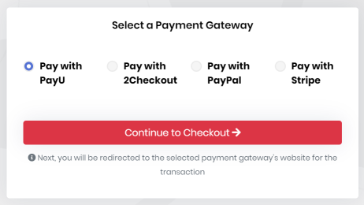
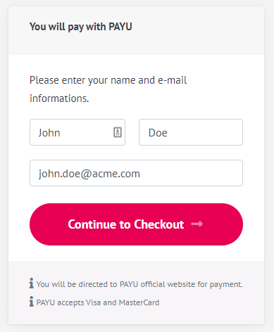
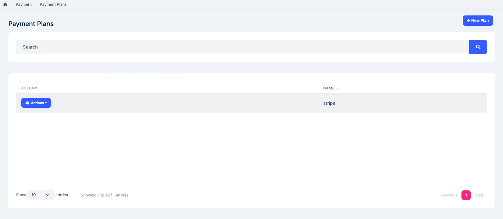
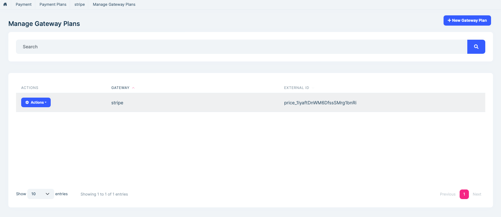
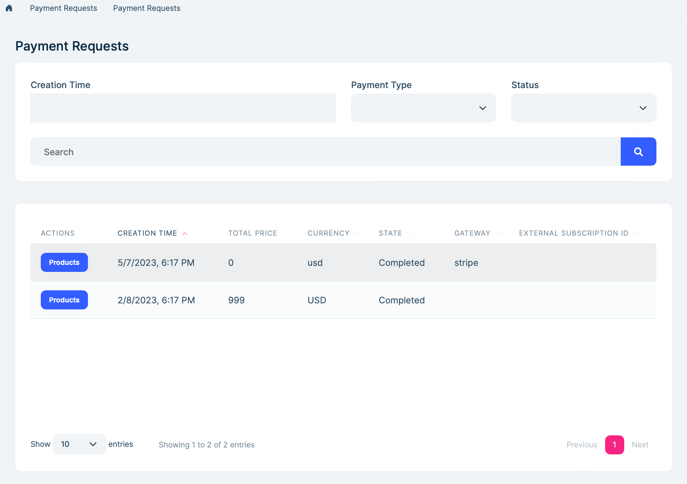
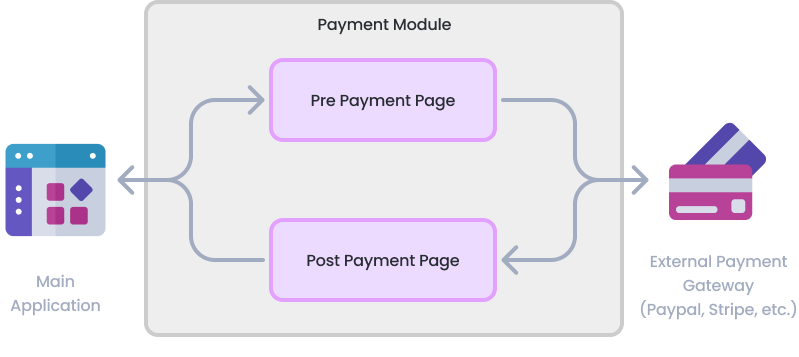
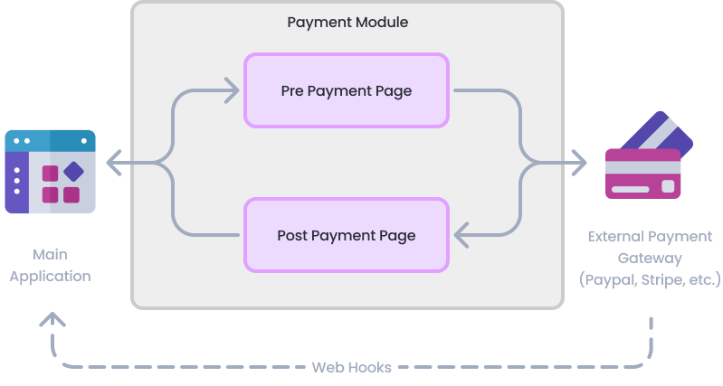

# Payment Module (Pro)

> You must have an ABP Team or a higher license to use this module.

Payment module implements payment gateway integration of an application. It provides one time payment and recurring payment options. 

* Supports [Stripe](https://stripe.com/), [PayPal](https://www.paypal.com/), [2Checkout](https://www.2checkout.com/), [PayU](https://corporate.payu.com/), [Iyzico](https://www.iyzico.com/en) and [Alipay](https://global.alipay.com/) payment gateways.

See [the module description page](https://abp.io/modules/Volo.Payment) for an overview of the module features.

## How to install

Payment module is not installed in [the startup templates](../solution-templates/layered-web-application). So, it needs to be installed manually. There are two ways of installing a module into your application.


### Using ABP CLI

ABP CLI allows adding a module to a solution using ```add-module``` command. You can check its [documentation](../cli#add-module) for more information. So, payment module can be added using the command below;

```bash
abp add-module Volo.Payment
```

### Manual Installation

If you modified your solution structure, adding module using ABP CLI might not work for you. In such cases,  payment module can be added to a solution manually.

In order to do that, add packages listed below to matching project on your solution. For example, ```Volo.Payment.Application``` package to your **{ProjectName}.Application.csproj** like below;

```json
<PackageReference Include="Volo.Payment.Application" Version="x.x.x" />
```

After adding the package reference, open the module class of the project (eg: `{ProjectName}ApplicationModule`) and add the below code to the `DependsOn` attribute.

```csharp
[DependsOn(
  //...
  typeof(AbpPaymentApplicationModule)
)]
```

> If you are using Blazor Web App, you need to add the `Volo.Payment.Admin.Blazor.WebAssembly` package to the **{ProjectName}.Blazor.Client.csproj** project and ad the `Volo.Payment.Admin.Blazor.Server` package to the **{ProjectName}.Blazor.csproj** project.

### Supported Gateway Packages

In order to use a Payment Gateway, you need to add related NuGet packages to your related project as explained in Manual Installation section above and add ```DependsOn``` to your related module. For example, if you don't want to use PayU, you don't have to use its NuGet packages. 

After adding packages of a payment gateway to your application, you also need to configure global payment module options and options for the payment modules you have added. See the Options section below.

### Creating a custom payment gateway
If you require a different payment gateway than existing ones, you can create a custom payment gateway by your own. 2 steps are required to create a custom payment gateway. First is creating a payment gateway object that implements `IPaymentGateway`. This interface exposes core payment operations without any UI. Second step is creating UI for the payment gateway. This UI is used to redirect user to payment gateway and validate payment.

Follow the [instructions here](payment-custom-gateway) to create a custom payment gateway.

## Packages

This module follows the [module development best practices guide](../framework/architecture/best-practices) and consists of several NuGet and NPM packages. See the guide if you want to understand the packages and relations between them.

You can visit [Payment module package list page](https://abp.io/packages?moduleName=Volo.Payment) to see list of packages related with this module.

## User interface

### Public Pages

#### Payment gateway selection

This page allows selecting a payment gateway. If there is one payment gateway configured for final application, this page will be skipped.



#### PayU prepayment page

This page is used to send Name, Surname and Email Address of user to PayU.



### Admin Pages

### Angular UI

#### Installation

In order to configure the application to use the `PaymentModule`, you first need to import `PaymentAdminConfigModule` from `@volo/abp.ng.payment/admin/config` to the root module. `PaymentAdminConfigModule` has a static `forRoot` method which you should call for a proper configuration:

```js
// app.module.ts
import { PaymentAdminConfigModule } from '@volo/abp.ng.payment/admin/config';

@NgModule({
  imports: [
    // other imports
    PaymentAdminConfigModule.forRoot(),
    // other imports
  ],
  // ...
})
export class AppModule {}
```

The `PaymentAdminModule` should be imported and lazy-loaded in your routing module as below:

```js
// app-routing.module.ts
const routes: Routes = [
  // other route definitions
  {
  path: 'payment',
  loadChildren: () =>
    import('@volo/abp.ng.payment/admin').then(m => m.PaymentAdminModule.forLazy()),
  },
];

@NgModule(/* AppRoutingModule metadata */)
export class AppRoutingModule {}
```

#### Payment plans page
Payment plans for subscriptions can be managed on this page. You can connect external subscriptions for each gateway to a plan.





#### Payment request list
This page lists all the payment request operations in application.



## Options

### PaymentOptions

`PaymentOptions` is used to store list of payment gateways. You don't have to configure this manually for existing payment gateways. You can, however, add a new gateway like below;

````csharp
Configure<PaymentOptions>(options =>
{
	options.Gateways.Add(
		new PaymentGatewayConfiguration(
			"MyPaymentGatewayName",
			new FixedLocalizableString("MyPaymentGatewayName"),
			typeof(MyPaymentGateway)
		)
	);
});
````

`AbpIdentityAspNetCoreOptions` properties:

* `PaymentGatewayConfigurationDictionary`: List of gateway configuration.
  * ```Name```: Name of payment gateway.
  * ```DisplayName```: DisplayName of payment gateway.
  * ```PaymentGatewayType```: type of payment gateway.
  * ```Order```: Order of payment gateway.

### PaymentWebOptions

```PaymentWebOptions``` is used to configure web application related configurations.

* ```CallbackUrl```: Final callback URL for internal payment gateway modules to return. User will be redirected to this URL on your website.
* ```RootUrl```: Root URL of your website.
* ```GatewaySelectionCheckoutButtonStyle```: CSS style to add Checkout button on gateway selection page. This class can be used for tracking user activity via 3rd party tools like Google Tag Manager.
* ```PaymentGatewayWebConfigurationDictionary```:  Used to store web related payment gateway configuration.
  * ```Name```: Name of payment gateway.
  * ```PrePaymentUrl```: URL of the page before redirecting user to payment gateway for payment.
  * ```PostPaymentUrl```: URL of the page when user redirected back from payment gateway to your website. This page is used to validate the payment mostly.
  * ```Order```: Order of payment gateway for gateway selection page.
  * ```Recommended```: Is payment gateway is recommended or not. This information is displayed on payment gateway selection page.
  * ```ExtraInfos```: List of informative strings for payment gateway. These texts are displayed on payment gateway selection page.

### PayuOptions

```PayuOptions``` is used to configure PayU payment gateway options.

* ```Merchant```: Merchant code for PayU account.
* ```Signature```: Signature of Merchant.
* ```LanguageCode```: Language of the order. This will be used for notification email that are sent to the client, if available.
* ```CurrencyCode```: Currency code of order (USD, EUR, etc...).
* ```VatRate```: Vat rate of order.
* ```PriceType```: Price type of order (GROSS or NET).
* ```Shipping```: A positive number indicating the price of shipping.
* ```Installment```: The number of installments. It can be an integer between 1 and 12.
* ```TestOrder```: Is the order a test order or not (true or false).
* ```Debug```: Writes detailed log on PAYU side.

### PayuWebOptions

```PayuWebOptions``` is used to configure PayU payment gateway web options.

* ```Recommended```: Is payment gateway is recommended or not. This information is displayed on payment gateway selection page.
* ```ExtraInfos```: List of informative strings for payment gateway. These texts are displayed on payment gateway selection page.
* ```PrePaymentCheckoutButtonStyle```: Css style to add Checkout button on PayU prepayment page. This class can be used for tracking user activity via 3rd party tools like Google Tag Manager.

### TwoCheckoutOptions

```TwoCheckoutOptions``` is used to configure TwoCheckout payment gateway options.

* ```Signature```: Signature of Merchant's 2Checkout account.
* ```CheckoutUrl```: 2Checkout checkout URL (it must be set to https://secure.2checkout.com/order/checkout.php).
* ```LanguageCode```: Language of the order. This will be used for notification email that are sent to the client, if available.
* ```CurrencyCode```: Currency code of order (USD, EUR, etc...).

### TwoCheckoutWebOptions

```TwoCheckoutWebOptions``` is used to configure TwoCheckout payment gateway web options.

* ```Recommended```: Is payment gateway is recommended or not. This information is displayed on payment gateway selection page.
* ```ExtraInfos```: List of informative strings for payment gateway. These texts are displayed on payment gateway selection page.

### StripeOptions

```StripeOptions```: is used to configure Stripe payment gateway options.

* ```PublishableKey```: Publishable Key for Stripe account.
* ```SecretKey```: Secret Key for Stripe account.
* `WebhookSecret`: Used for handling webhooks. You can get if from [Stripe Dashboard](https://dashboard.stripe.com/webhooks). If you don't use subscription & recurring payment it's not necessary.
* ```Currency```: Currency code of order (USD, EUR, etc..., see [Stripe docs](https://stripe.com/docs/currencies) for the full list). Its default value is USD.
* ```Locale```: Language of the order. Its default value is 'auto'.
* ```PaymentMethodTypes```:  A list of the types of payment methods (e.g., card) this Checkout session can accept. See https://stripe.com/docs/payments/checkout/payment-methods. Its default value is 'card'.

### StripeWebOptions

```StripeWebOptions``` is used to configure Stripe payment gateway web options.

* ```Recommended```: Is payment gateway is recommended or not. This information is displayed on payment gateway selection page.
* ```ExtraInfos```: List of informative strings for payment gateway. These texts are displayed on payment gateway selection page.

### PayPalOptions

```PayPalOptions``` is used to configure PayPal payment gateway options.

* ```ClientId```: Client Id for the PayPal account.
* ```Secret``` Secret for the PayPal account.
* ```CurrencyCode```: Currency code of order (USD, EUR, etc...).
* ```Environment```: Payment environment. ("Sandbox" or "Live", default value is "Sandbox")
* ```Locale```: PayPal-supported language and locale to localize PayPal checkout pages. See https://developer.paypal.com/docs/api/reference/locale-codes/.

### PayPalWebOptions

```PayPalWebOptions``` is used to configure PayPal payment gateway web options.

* ```Recommended```: Is payment gateway is recommended or not. This information is displayed on payment gateway selection page.
* ```ExtraInfos```: List of informative strings for payment gateway. These texts are displayed on payment gateway selection page.

### IyzicoOptions

```IyzicoOptions``` is used to configure Iyzico payment gateway options.

* ```BaseUrl```: Base API URL for the Iyzico (ex: https://sandbox-api.iyzipay.com). 
* ```ApiKey``` Api key for the Iyzico account.
* ```SecretKey ``` Secret for the Iyzico account.
* ```Currency```: Currency code for the order (USD, EUR, GBP and TRY can be used).
* ```Locale```: Language of the order.
* ```InstallmentCount```: Installment count value. For single installment payments it should be 1 (valid values: 1, 2, 3, 6, 9, 12).

### IyzicoWebOptions

```IyzicoWebOptions``` is used to configure Iyzico payment gateway web options.

* ```Recommended```: Is payment gateway is recommended or not. This information is displayed on payment gateway selection page.
* ```ExtraInfos```: List of informative strings for payment gateway. These texts are displayed on payment gateway selection page.
* ```PrePaymentCheckoutButtonStyle```: CSS style to add Checkout button on Iyzico prepayment page. This class can be used for tracking user activity via 3rd party tools like Google Tag Manager.

### AlipayOptions

```AlipayOptions``` is used to configure Alipay payment gateway options。 **Alipay gateway only supports CNY currency**.

* ```Protocol```：Protocol for the Alipay (ex: https).
* ```GatewayHost```: Gateway host for the Aliapy.
* ```SignType```: Sign type for the Alipay.
* ```AppId```: AppId for the Alipay account.
* ```MerchantPrivateKey```: Merchant private key of the Alipay account.
* ```MerchantCertPath```Merchant cert path of the Alipay account.
* ```AlipayCertPath```: Alipay cert path of the Alipay account.
* ```AlipayRootCertPath```: Alipay root cert path of the Alipay account.
* ```AlipayPublicKey```: Alipay public key of the Alipay account.
* ```NotifyUrl```: Notify url of the Alipay.
* ```EncryptKey```: Encrypt key of the Alipay.

#### AlipayWebOptions

* ```Recommended```: Is payment gateway is recommended or not. This information is displayed on payment gateway selection page.
* ```ExtraInfos```: List of informative strings for payment gateway. These texts are displayed on payment gateway selection page.
* ```PrePaymentCheckoutButtonStyle```: CSS style to add Checkout button on Iyzico prepayment page. This class can be used for tracking user activity via 3rd party tools like Google Tag Manager.

> You can check the [Alipay document](https://opendocs.alipay.com/open/02np97) for more details.

Instead of configuring options in your module class, you can configure it in your appsettings.json file like below;

```json
"Payment": {
    "Payu": {
      "Merchant": "TEST",
      "Signature": "SECRET_KEY",
      "LanguageCode": "en",
      "CurrencyCode": "USD",
      "VatRate": "0",
      "PriceType": "GROSS",
      "Shipping": "0",
      "Installment": "1",
      "TestOrder": "1",
      "Debug": "1"
    },
    "TwoCheckout": {
      "Signature": "SECRET_KEY",
      "CheckoutUrl": "https://secure.2checkout.com/order/checkout.php",
      "LanguageCode": "en",
      "CurrencyCode": "USD",
      "TestOrder": "1"
    },
    "PayPal": {
      "ClientId": "CLIENT_ID",
      "Secret": "SECRET",
      "CurrencyCode": "USD",
      "Environment": "Sandbox",
      "Locale": "en_US"
    },
    "Stripe": {
      "PublishableKey": "PUBLISHABLE_KEY",
      "SecretKey": "SECRET_KEY",
      "PaymentMethodTypes": ["alipay"]
    },
    "Iyzico": {
      "ApiKey": "API_KEY",
      "SecretKey": "SECRET_KEY",
      "BaseUrl": "https://sandbox-api.iyzipay.com",
      "Locale": "en",
      "Currency": "USD"
    },
    "Alipay": {
      "AppId": "APP_ID",
      "GatewayHost": "openapi.alipaydev.com",
      "AlipayPublicKey": "ALIPAY_PUBLIC_KEY",
      "MerchantPrivateKey": "MERCHANT_PRIVATE_KEY"
    }
  }
```

## Internals

### Domain layer

#### Aggregates

This module follows the [Entity Best Practices & Conventions](../framework/architecture/best-practices/entities.md) guide.

##### PaymentRequest

A payment request represents a request for a payment in the application.

* `PaymentRequest` (aggregate root): Represents a payment request in the system.
  * `Products` (collection): List of products for payment request.
  * `State` : State of payment request (can be Waiting, Completed, Failed or Refunded).
  * `Currency` : Currency code of payment request (USD, EUR, etc...).
  * `Gateway` : Name of payment gateway used for this payment request.
  * ```FailReason```: Reason for failed payment requests.

##### Plan

A plan is used for subscription payments. Contains PlanGateway list to configure each gateway.

- `Plan` (aggregate root): Represents a plan for recurring payments.
  - `PlanGateways` (collection): List of gateway plans.
  - `Name` : An optional name of plan.
- `GatewayPlan` (entity): Represents a gateway configuration for a plan.
  - `PlanId`: Represents a plan belong to.
  - `Gateway`: Represents a gateway belong to. It has to be unique.
  - `ExternalId`: Stores a unique configuration of gateway for subscrtiption, such as priceId, planId, subscriptionId or productId etc.

#### Repositories

This module follows the [Repository Best Practices & Conventions](../framework/architecture/best-practices/repositories.md) guide.

Following custom repositories are defined for this module:

* `IPaymentRequestRepository`
* `IPlanRepository`

### Application layer

#### Application services

* `PaymentRequestAppService` (implements `IPaymentRequestAppService`): Used to create payment requests and access payment request details.
* `GatewayAppService` (implements `IGatewayAppService`): Used to provide payment gateway list to UI.
* `PlanAppService` (implements `IPlanAppService`): Used to manage Subscription Plans.

### Database providers

#### Common

##### Table / collection prefix & schema

All tables/collections use the `Pay` prefix by default. Set static properties on the `PaymentDbProperties` class if you need to change the table prefix or set a schema name (if supported by your database provider).

##### Connection string

This module uses `AbpPayment` for the connection string name. If you don't define a connection string with this name, it fallbacks to the `Default` connection string.

See the [connection strings](../framework/fundamentals/connection-strings.md) documentation for details.

#### Entity Framework Core

##### Tables

* **PayPaymentRequests**
  * **AbpRoleClaims**
    * PayPaymentRequestProducts
* **PayPlans**
* **PayGatewayPlans**

#### MongoDB

##### Collections

* **PayPaymentRequests**
* **PayPlans**

## Entity Extensions

[Module entity extension](../framework/architecture/modularity/extending/module-entity-extensions.md) system is a **high-level** extension system that allows you to **define new properties** for existing entities of the dependent modules. It automatically **adds properties to the entity**, **database**, **HTTP API and user interface** in a single point.

To extend entities of the payment module, open your `YourProjectNameModuleExtensionConfigurator` class inside of your `DomainShared` project and change the `ConfigureExtraProperties` method like shown below.

```csharp
public static void ConfigureExtraProperties()
{
    OneTimeRunner.Run(() =>
    {
        ObjectExtensionManager.Instance.Modules()
            .ConfigurePayment(payment =>
            {
                payment.ConfigurePlan(plan => // extend the Plan entity
                {
                    plan.AddOrUpdateProperty<string>( //property type: string
                      "PlanDescription", //property name
                      property => {
                        //validation rules
                        property.Attributes.Add(new RequiredAttribute()); //adds required attribute to the defined property

                        //...other configurations for this property
                      }
                    );
                });
              
              payment.ConfigureGatewayPlan(gatewayPlan => // extend the GatewayPlan entity
                {
                    gatewayPlan.AddOrUpdateProperty<string>( //property type: string
                      "GatewayPlanDescription", //property name
                      property => {
                        //validation rules
                        property.Attributes.Add(new RequiredAttribute()); //adds required attribute to the defined property
                        property.Attributes.Add(
                          new StringLengthAttribute(MyConsts.MaximumDescriptionLength) {
                            MinimumLength = MyConsts.MinimumDescriptionLength
                          }
                        );

                        //...other configurations for this property
                      }
                    );
                });     
            });
    });
}
```

* `ConfigurePayment(...)` method is used to configure the entities of the payment module.

* `payment.ConfigurePlan(...)` is used to configure the **Plan** entity of the payment module. You can add or update your extra properties of the
**Plan** entity. 

* `payment.ConfigureGatewayPlan(...)` is used to configure the **GatewayPlan** entity of the payment module. You can add or update your extra properties of the **GatewayPlan** entity. 

* You can also set some validation rules for the property that you defined. In the above sample, `RequiredAttribute` and `StringLengthAttribute` were added for the property named **"GatewayPlanDescription"**. 

* When you define the new property, it will automatically add to **Entity**, **HTTP API** and **UI** for you. 
  * Once you define a property, it appears in the create and update forms of the related entity. 
  * New properties also appear in the datatable of the related page.

## Distributed Events

- `Volo.Payment.PaymentRequestCompleted` (**PaymentRequestCompletedEto**): Published when a payment is completed. 
  
  - `Id`: Represents PaymentRequest entity Id.
  - `Gateway`: Represents the gateway which payment was done with.
  - `Currency`: Represents the currency of payment.
  - `Products` (collection): Represents which products are included in PaymentRequest.
  
- `Volo.Payment.SubscriptionCanceled` (**SubscriptionCanceledEto**): Published when a subscription is stopped or canceled.

  - `PaymentRequestId`: Represents PaymentRequest entity Id.
  - `State`: Represents state of PaymentRequest, such as `Waiting`, `Completed`, `Failed` or `Refunded`.
  - `Currency`: Represents the currency of payment.
  - `Gateway`: Represents the gateway which payment was done with.
  - `FailReason`: Represents a fail reason which is provided by gateway.
  - `ExternalSubscriptionId`: Represents subscription Id of Gateway.
  - `PeriodEndDate`: Represents end date of subscription. _Subscriptions may canceled but lasts until end of last period._

- `Volo.Payment.SubscriptionCreated` (**SubscriptionCreatedEto**): Published when a subscription is created.

  - `PaymentRequestId`: Represents PaymentRequest entity Id.
  - `State`: Represents state of PaymentRequest, such as `Waiting`, `Completed`, `Failed` or `Refunded`.
  - `Currency`: Represents the currency of payment.
  - `Gateway`: Represents the gateway which payment was done with.
  - `ExternalSubscriptionId`: Represents subscription Id of Gateway.
  - `PeriodEndDate`: Represents end date of subscription. _Subscriptions may canceled but lasts until end of last period._

- `Volo.Payment.RecurringPaymentUpdated` (**SubscriptionUpdatedEto**): Published when a subscription is updated in application or in payment gateway dashboard. If subscription is updated from gateway dashboard, this event will be published right after webhook delivery.

  - `PaymentRequestId`: Represents PaymentRequest entity Id.
  - `State`: Represents state of PaymentRequest, such as `Waiting`, `Completed`, `Failed` or `Refunded`.
  - `Currency`: Represents the currency of payment.
  - `Gateway`: Represents the gateway which payment was done with.
  - `ExternalSubscriptionId`: Represents subscription Id of Gateway.
  - `PeriodEndDate`: Represents end date of subscription. _Subscriptions may canceled but lasts until end of last period._

  
> Couldn't find what you need? Check out the [standard distributed events](../framework/infrastructure/event-bus/distributed).

## One-Time Payments

This module implements one-time payments;

* Supports [Stripe](https://stripe.com/), [PayPal](https://www.paypal.com/), [2Checkout](https://www.2checkout.com/), [PayU](https://corporate.payu.com/) and [Iyzico](https://www.iyzico.com/en) payment gateways.

You can get one-time payments from your customers using one or more payment gateways supported by the payment module. Payment module works in a very simple way for one-time payments. It creates a local payment request record and redirects customer to payment gateway (PayPal, Stripe etc...) for processing the payment. When the customer pays on the payment gateway, payment module handles the external payment gateway's response and validates the payment to see if it is really paid or not. If the payment is validated, payment module redirects customer to main application which initiated the payment process at the beginning.

Image below demonstrates the flow of a payment process;



Each payment gateway implementation contains PrePayment and PostPayment pages. 

PrePayment page asks users for extra information if requested by the external payment gateway. For example, 2Checkout doesn't require any extra information, so PrePayment page for 2Checkout redirects user to 2Checkout without asking any extra information. 

PostPayment page is responsible for validation of the response of the external payment gateway. When a user completes the payment, user is redirected to PostPayment page for that payment gateway and PostPayment page validates the status of the payment. If the payment is succeeded, status of the payment request is updated and user is redirected to main application.

Note: It is main application's responsibility to handle if a payment request is used more than one time. For example if PostPayment page generates a URL like https://mywebsite.com/PaymentSucceed?PaymentRequestId={PaymentRequestId}, this URL can be visited more than onec manually by end users. If you already delivered your product for a given PaymentRequestId, you shouldn't deliver it when this URL is visited second time.

### Creating One-Time Payment

In order to initiate a payment process, inject `IPaymentRequestAppService`, create a payment request using it's `CreateAsync` method and redirect user to gateway selection page with the created payment request's Id. Here is a sample Razor Page code which starts a payment process on it's OnPost method.

> Redirection of the gateway selection page has to be a **POST** request. If you implement it as a **GET** request, you will get an error. You can use `LocalRedirectPreserveMethod` to keep the method as POST in the redirected request.

```c#
public class IndexModel: PageModel
{
    private readonly IPaymentRequestAppService _paymentRequestAppService;

    public IndexModel(IPaymentRequestAppService paymentRequestAppService)
    {
        _paymentRequestAppService = paymentRequestAppService;
    }

    public virtual async Task<IActionResult> OnPostAsync()
    {
        var paymentRequest = await _paymentRequestAppService.CreateAsync(new PaymentRequestCreateDto()
        {
            Currency= "USD",
            Products = new List<PaymentRequestProductCreateDto>()
            {
                new PaymentRequestProductCreateDto
                {
                    Code = "Product_01",
                    Name = "LEGO Super Mario",
                    Count = 2,
                    UnitPrice = 60,
                    TotalPrice = 200
                }
            }
        });
        
        return LocalRedirectPreserveMethod("/Payment/GatewaySelection?paymentRequestId=" + paymentRequest.Id);
    }
}
```

If the payment is successful, payment module will return to configured ```PaymentWebOptions.CallbackUrl```. The main application can take necessary actions for a successful payment (Activating a user account, triggering a shipment start process etc...).

## Subscriptions

This module also implements recurring payments;

* Supports only [Stripe](https://stripe.com/) for now.

You can start a subscription and get recurring payment from your customers using payment gateways supported by this module. It works different from one-time payment. Payment module works with events over webhooks of selected gateway. It creates a local payment request record like one-time payment, but it tracks that payment request in every period that customer pays and publishes events for cancels, updates and continues.



### Enabling WebHooks

Configuring Web Hooks is highly important for subscriptions otherwise your application won't be able to get subscription changes, such as canceled or updated states. Each gateway has its own configuration:

#### Stripe

1. Go to [WebHooks on Stripe Dashboard](https://dashboard.stripe.com/webhooks)
2. Create a new webhook via using **Add endpoint** button.
   - **Endpoint URL**:  `yourdomain.com/api/payment/stripe/webhook`
   - **Events to send**: 
     - `customer.subscription.created`
     - `customer.subscription.deleted`
     - `customer.subscription.updated`
     - `checkout.session.completed` (optional) _If you don't set this, payment will be proceed with callback._
3. Stripe will create a webhook secret key. Copy that and configure it as `WebhookSecret` under [StripeOptions](#stripeoptions).

### Configuring Plans

Before starting a recurring payment, **Plan** and **GatewayPlan** must be configured properly. 

1. Go to your payment gateway (Stripe) dashboard and create product & pricing.
2. Create a **Plan** entity in your application.
3. Go to 'Manage Gateway Plans' section and create a new **GatewayPlan** for gateway and paste price or product id as `ExternalId`.

### Creating a Tenant-Edition Subscription

Follow [saas](saas.md#tenant-edition-subscription) documentation.

### Creating a Recurring Payment

Creating a recurring payment almost same as creating a payment. Setting `PaymentType` property as **Recurring** and passing `PlanId` are enough to start a recurring payment request. If given Plan has multiple GatewayPlan, user will be able to choose gateway to pay.

> Redirection of the gateway selection page has to be a **POST** request. If you implement it as a **GET** request, you will get an error. You can use `LocalRedirectPreserveMethod` to keep the method as POST in the redirected request.

```csharp
public class SubscriptionModel : PageModel
{
    private IPaymentRequestAppService PaymentRequestAppService { get; }

    public SubscriptionModel(IPaymentRequestAppService paymentRequestAppService)
    {
        PaymentRequestAppService = paymentRequestAppService;
    }

    public virtual async Task<IActionResult> OnPostAsync()
    {
        var paymentRequest = await PaymentRequestAppService.CreateAsync(
            new PaymentRequestCreateDto()
            {
                Products =
                {
                    new PaymentRequestProductCreateDto
                    {
                        PaymentType = PaymentType.Subscription,
                        Name = "Enterprise Plan",
                        Code = "EP",
                        Count = 1,
                        // Place your created PlanId below.
                        PlanId = DemoAppData.Plan_2_Id, 
                    }
                }
            });

        return LocalRedirectPreserveMethod("/Payment/GatewaySelection?paymentRequestId=" + paymentRequest.Id);
    }
}
```

> To track that subscription is continuing or canceled, you should keep the SubscriptionId, all events contain it. 
