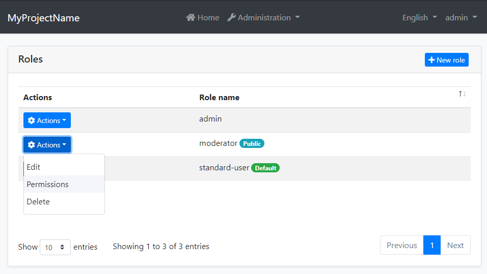
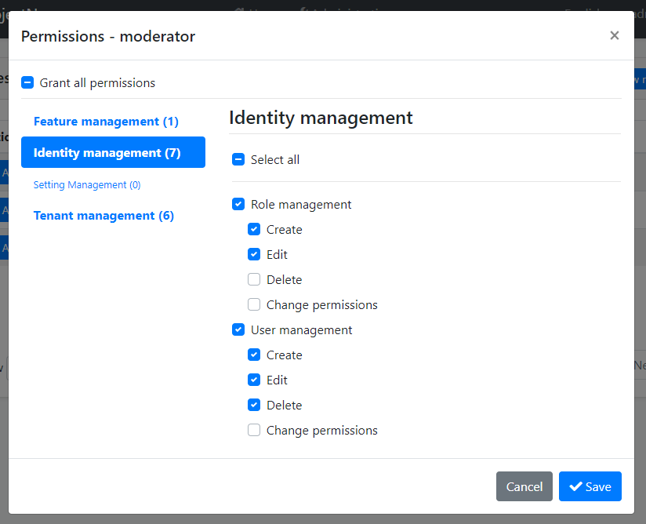
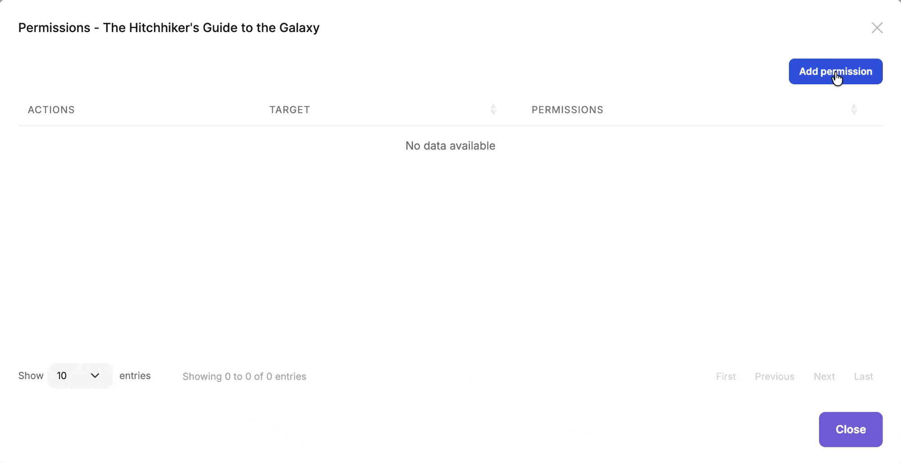

```json
//[doc-seo]
{
    "Description": "Learn how to manage permissions in your application using the ABP Framework's Permission Management Module, including installation and source code access."
}
```

# Permission Management Module

This module implements the `IPermissionStore` and `IResourcePermissionStore` to store and manage permission values in a database.

> This document covers only the permission management module which persists permission values to a database. See the [Authorization document](../framework/fundamentals/authorization/index.md) to understand the authorization and permission systems.

## How to Install

This module comes as pre-installed (as NuGet/NPM packages). You can continue to use it as package and get updates easily, or you can include its source code into your solution (see `get-source` [CLI](../cli) command) to develop your custom module.

### The Source Code

The source code of this module can be accessed [here](https://github.com/abpframework/abp/tree/dev/modules/permission-management). The source code is licensed with [MIT](https://choosealicense.com/licenses/mit/), so you can freely use and customize it.

## User Interface

### Permission Management Dialog

Permission management module provides a reusable dialog to manage permissions related to an object. For example, the [Identity Module](identity.md) uses it to manage permissions of users and roles. The following image shows Identity Module's Role Management page:



When you click *Actions* -> *Permissions* for a role, the permission management dialog is opened. An example screenshot from this dialog:



In this dialog, you can grant permissions for the selected role. The tabs in the left side represents main permission groups and the right side contains the permissions defined in the selected group.

#### Reusing the Permission Management Dialog

The standard permission management dialog is reusable for any registered permission management provider. The provider name and key identify the object whose permissions are being managed.

##### MVC / Razor Pages

Use `abp.ModalManager` to open the built-in modal page:

````javascript
var permissionModal = new abp.ModalManager(
    abp.appPath + 'AbpPermissionManagement/PermissionManagementModal'
);

permissionModal.open({
    providerName: 'R',
    providerKey: roleName,
    providerKeyDisplayName: roleName
});
````

##### Blazor

Add the `PermissionManagementModal` component to the page and call its `OpenAsync` method:

````razor
@using Volo.Abp.PermissionManagement.Blazor.Components

<PermissionManagementModal @ref="PermissionModal" />

@code {
    private PermissionManagementModal PermissionModal { get; set; }

    private Task OpenPermissionsAsync(string roleName)
    {
        return PermissionModal.OpenAsync("R", roleName, roleName);
    }
}
````

The MudBlazor package provides the same component API in the `Volo.Abp.PermissionManagement.Blazor.MudBlazor.Components` namespace.

##### Angular

Import the standalone `PermissionManagementComponent` into your component:

````typescript
import { Component } from '@angular/core';
import { PermissionManagementComponent } from '@abp/ng.permission-management';

@Component({
  selector: 'app-role-actions',
  templateUrl: './role-actions.component.html',
  imports: [PermissionManagementComponent],
})
export class RoleActionsComponent {
  roleName = 'admin';
  permissionsVisible = false;

  openPermissions() {
    this.permissionsVisible = true;
  }
}
````

Then add the component to the template. It owns the modal, so you only need to control its `visible` value:

````html
<button type="button" (click)="openPermissions()">Permissions</button>

<abp-permission-management
  providerName="R"
  [providerKey]="roleName"
  [entityDisplayName]="roleName"
  [(visible)]="permissionsVisible"
/>
````

The reusable dialog calls `IPermissionAppService`. The provider must be registered and mapped to an authorization policy as described in the [Permission Management Providers](#permission-management-providers) section. For non-admin users, only permissions that the current user already has are editable, and update requests are filtered by the same rule. Users with the built-in admin role are not subject to this editability filter.

Use `entityDisplayName` to customize the modal title and `hideBadges` to hide the granted-provider badges. The component emits `visibleChange`, so the two-way `[(visible)]` binding keeps the caller's visibility state synchronized.

### Resource Permission Management Dialog

In addition to standard permissions, this module provides a reusable dialog for managing **resource-based permissions** on specific resource instances. This allows administrators to grant or revoke permissions for users, roles and clients on individual resources (e.g., a specific document, project, or any entity).



The dialog displays all resource permissions defined for the resource type and allows granting them to specific users, roles or clients for the selected resource instance.

You can integrate this dialog into your own application to manage permissions for your custom entities and resources. See the following sections to learn how to use the component in each UI framework.

#### MVC / Razor Pages

First, add the `resource-permission-management-modal.js` script to your page. This script registers the `ResourcePermissionManagement` modal class used by `abp.ModalManager`:

````html
@section scripts
{
    <abp-script src="/Pages/MyBook/Index.js"/>
    <abp-script src="/Pages/AbpPermissionManagement/resource-permission-management-modal.js" />
}
````

Then use the `abp.ModalManager` to open the resource permission management dialog:

````javascript
var _resourcePermissionsModal = new abp.ModalManager({
    viewUrl: abp.appPath + 'AbpPermissionManagement/ResourcePermissionManagementModal',
    modalClass: 'ResourcePermissionManagement'
});

// Open the modal for a specific resource
_resourcePermissionsModal.open({
    resourceName: 'MyApp.Document',
    resourceKey: documentId,
    resourceDisplayName: documentTitle
});
````

#### Blazor

Use the `ResourcePermissionManagementModal` component's `OpenAsync` method to open the dialog:

````razor
@using Volo.Abp.PermissionManagement.Blazor.Components

<ResourcePermissionManagementModal @ref="ResourcePermissionModal" />

@code {
    private ResourcePermissionManagementModal ResourcePermissionModal { get; set; }

    private async Task OpenPermissionsModal()
    {
        await ResourcePermissionModal.OpenAsync(
            resourceName: "MyApp.Document",
            resourceKey: Document.Id.ToString(),
            resourceDisplayName: Document.Title
        );
    }
}
````

The MudBlazor package provides the same component API in the `Volo.Abp.PermissionManagement.Blazor.MudBlazor.Components` namespace.

#### Angular

Import the standalone `ResourcePermissionManagementComponent` into your component:

````typescript
import { Component } from '@angular/core';
import { ResourcePermissionManagementComponent } from '@abp/ng.permission-management';

@Component({
  selector: 'app-document-actions',
  templateUrl: './document-actions.component.html',
  imports: [ResourcePermissionManagementComponent],
})
export class DocumentActionsComponent {
  documentId = '42';
  documentTitle = 'Permission Management Guide';
  resourcePermissionsVisible = false;

  openPermissions() {
    this.resourcePermissionsVisible = true;
  }
}
````

Render the component directly. It owns the modal and requires `resourceName` and `resourceKey` inputs:

````html
<button type="button" (click)="openPermissions()">Permissions</button>

<abp-resource-permission-management
  resourceName="MyApp.Document"
  [resourceKey]="documentId"
  [resourceDisplayName]="documentTitle"
  [(visible)]="resourcePermissionsVisible"
/>
````

## IPermissionManager

`IPermissionManager` is the main service provided by this module. It is used to read and change the global permission values. `IPermissionManager` is typically used by the *Permission Management Dialog*. However, you can inject it if you need to set a permission value.

> If you just want to read/check permission values for the current user, use the `IAuthorizationService` or the `[Authorize]` attribute as explained in the [Authorization document](../framework/fundamentals/authorization/index.md).

**Example: Grant permissions to roles and users using the `IPermissionManager` service**

````csharp
public class MyService : ITransientDependency
{
    private readonly IPermissionManager _permissionManager;

    public MyService(IPermissionManager permissionManager)
    {
        _permissionManager = permissionManager;
    }

    public async Task GrantRolePermissionDemoAsync(
        string roleName, string permission)
    {
        await _permissionManager
            .SetForRoleAsync(roleName, permission, true);
    }

    public async Task GrantUserPermissionDemoAsync(
        Guid userId, string permission)
    {
        await _permissionManager
            .SetForUserAsync(userId, permission, true);
    }
}
````

The OpenIddict integration also provides `SetForClientAsync` for client permissions.

## IResourcePermissionManager

`IResourcePermissionManager` is the service for programmatically managing resource-based permissions. It is typically used by the *Resource Permission Management Dialog*. However, you can inject it when you need to grant, revoke, or query permissions for specific resource instances.

> If you just want to check resource permission values for the current user, use the `IResourcePermissionChecker` service as explained in the [Resource-Based Authorization](../framework/fundamentals/authorization/resource-based-authorization.md) document.

**Example: Grant and revoke resource permissions programmatically**

````csharp
public class DocumentPermissionService : ITransientDependency
{
    private readonly IResourcePermissionManager _resourcePermissionManager;

    public DocumentPermissionService(
        IResourcePermissionManager resourcePermissionManager)
    {
        _resourcePermissionManager = resourcePermissionManager;
    }

    public async Task GrantViewPermissionToUserAsync(
        Guid documentId, 
        Guid userId)
    {
        await _resourcePermissionManager.SetAsync(
            permissionName: "MyApp_Document_View",
            resourceName: "MyApp.Document",
            resourceKey: documentId.ToString(),
            providerName: "U", // User
            providerKey: userId.ToString(),
            isGranted: true
        );
    }

    public async Task GrantEditPermissionToRoleAsync(
        Guid documentId, 
        string roleName)
    {
        await _resourcePermissionManager.SetAsync(
            permissionName: "MyApp_Document_Edit",
            resourceName: "MyApp.Document",
            resourceKey: documentId.ToString(),
            providerName: "R", // Role
            providerKey: roleName,
            isGranted: true
        );
    }

    public async Task RevokeUserPermissionsAsync(
        Guid documentId, 
        Guid userId)
    {
        await _resourcePermissionManager.DeleteAsync(
            resourceName: "MyApp.Document",
            resourceKey: documentId.ToString(),
            providerName: "U",
            providerKey: userId.ToString()
        );
    }
}
````

## IResourcePermissionStore

The `IResourcePermissionStore` interface is responsible for retrieving resource permission values from the database. This module provides the default implementation that stores permissions in the database.

You can query the store directly if needed:

````csharp
public class MyService : ITransientDependency
{
    private readonly IResourcePermissionStore _resourcePermissionStore;

    public MyService(IResourcePermissionStore resourcePermissionStore)
    {
        _resourcePermissionStore = resourcePermissionStore;
    }

    public async Task<string[]> GetGrantedResourceKeysAsync(string permissionName)
    {
        // Get all resource keys where the permission is granted
        return await _resourcePermissionStore.GetGrantedResourceKeysAsync(
            "MyApp.Document",
            permissionName);
    }
}
````

## Cleaning Up Resource Permissions

When a resource is deleted, you should clean up its associated permissions to avoid orphaned permission records in the database. Query all grants for the resource and delete the returned entities:

````csharp
public class DocumentService : ITransientDependency, IUnitOfWorkEnabled
{
    private readonly IDocumentRepository _documentRepository;
    private readonly IResourcePermissionGrantRepository _resourcePermissionGrantRepository;

    public DocumentService(
        IDocumentRepository documentRepository,
        IResourcePermissionGrantRepository resourcePermissionGrantRepository)
    {
        _documentRepository = documentRepository;
        _resourcePermissionGrantRepository = resourcePermissionGrantRepository;
    }

    public virtual async Task DeleteDocumentAsync(Guid id)
    {
        await _documentRepository.DeleteAsync(id);

        var grants = await _resourcePermissionGrantRepository.GetPermissionsAsync(
            "MyApp.Document",
            id.ToString()
        );

        await _resourcePermissionGrantRepository.DeleteManyAsync(
            grants,
            autoSave: true
        );
    }
}
````

`IUnitOfWorkEnabled` keeps the resource deletion and grant cleanup in the same unit of work. `ResourcePermissionGrant` is a multi-tenant entity, so repository queries are scoped by the current tenant data filter. If cleanup runs from the host or a background process, switch `ICurrentTenant` to the resource owner's tenant before calling `GetPermissionsAsync` and `DeleteManyAsync`; otherwise the query will not return that tenant's grants.

The `providerName` and `providerKey` arguments of `IResourcePermissionManager.DeleteAsync` identify one exact provider and key; a `null` provider key is not a wildcard. The Identity integration cleans up user and role grants, and the OpenIddict integration cleans up client grants when those entities are deleted. For your custom entities, you are responsible for removing all resource grants when the resource is deleted.

## Application Service and HTTP API

`IPermissionAppService` exposes the management operations under the `api/permission-management/permissions` route. Standard permission `GET` and `PUT` operations require the authorization policy mapped to the requested provider in `PermissionManagementOptions.ProviderPolicies`.

Standard and resource update operations handle omitted permissions differently:

* The standard permission `PUT` operation changes only the permission entries included in `UpdatePermissionsDto`. For non-admin users, entries the current user does not have are ignored.
* The resource permission `PUT` operation treats `UpdateResourcePermissionsDto.Permissions` as the complete desired set for the selected resource, provider, and provider key. Manageable permissions omitted from the list are revoked. Each resource permission is filtered by its `ManagementPermissionName` before it can be returned or changed.

## Seeding Permission Grants

Use `IPermissionDataSeeder` in a data seed contributor to add initial permission grants for a provider and key:

````csharp
public class MyPermissionDataSeedContributor
    : IDataSeedContributor, ITransientDependency
{
    private readonly IPermissionDataSeeder _permissionDataSeeder;

    public MyPermissionDataSeedContributor(
        IPermissionDataSeeder permissionDataSeeder)
    {
        _permissionDataSeeder = permissionDataSeeder;
    }

    public Task SeedAsync(DataSeedContext context)
    {
        return _permissionDataSeeder.SeedAsync(
            RolePermissionValueProvider.ProviderName,
            "admin",
            new[]
            {
                "MyApp.Books",
                "MyApp.Books.Create"
            },
            context.TenantId
        );
    }
}
````

The seeder is additive and tenant-aware. It inserts grants that do not exist for the selected provider, key, and tenant; it does not revoke existing grants that are absent from the input.

## Permission Management Providers

Permission Management Module is extensible, just like the [permission system](../framework/fundamentals/authorization/index.md). You can extend it by defining permission management providers.

[Identity Module](identity.md) defines the following permission management providers:

* `UserPermissionManagementProvider`: Manages user-based permissions.
* `RolePermissionManagementProvider`: Manages role-based permissions.

The OpenIddict integration also registers a provider for client permissions.

`IPermissionManager` uses these providers when you get/set permissions. You can define your own provider by implementing the `IPermissionManagementProvider` or inheriting from the `PermissionManagementProvider` base class.

**Example:**

````csharp
public class CustomPermissionManagementProvider : PermissionManagementProvider
{
    public const string ProviderName = "Custom";

    public override string Name => ProviderName;

    public CustomPermissionManagementProvider(
        IPermissionGrantRepository permissionGrantRepository,
        IGuidGenerator guidGenerator,
        ICurrentTenant currentTenant)
        : base(
            permissionGrantRepository,
            guidGenerator,
            currentTenant)
    {
    }
}
````

`PermissionManagementProvider` base class makes the default implementation (using the `IPermissionGrantRepository`) for you. You can override base methods as you need. Every provider must have a unique name, which is `Custom` in this example (keep it short since it is saved to database for each permission value record).

Once you create your provider class, you should register it using the `PermissionManagementOptions` [options class](../framework/fundamentals/options.md):

````csharp
Configure<PermissionManagementOptions>(options =>
{
    options.ManagementProviders.Add<CustomPermissionManagementProvider>();
    options.ProviderPolicies[CustomPermissionManagementProvider.ProviderName] =
        "MyApp.ManageCustomPermissions";
});
````

`IPermissionManager` enumerates `ManagementProviders` in registration order when it reads permission values. A write operation selects the registered provider whose `Name` matches the requested provider name. Every provider name must therefore be unique.

### Resource Permission Management Providers

Similar to standard permission management providers, you can create custom providers for resource permissions by implementing `IResourcePermissionManagementProvider` or inheriting from `ResourcePermissionManagementProvider`:

````csharp
public class CustomResourcePermissionManagementProvider 
    : ResourcePermissionManagementProvider
{
    public override string Name => "Custom";

    public CustomResourcePermissionManagementProvider(
        IResourcePermissionGrantRepository resourcePermissionGrantRepository,
        IGuidGenerator guidGenerator,
        ICurrentTenant currentTenant)
        : base(
            resourcePermissionGrantRepository,
            guidGenerator,
            currentTenant)
    {
    }
}
````

After creating the custom provider, you need to register your provider using the `PermissionManagementOptions` in your module class:

````csharp
Configure<PermissionManagementOptions>(options =>
{
    options.ResourceManagementProviders.Add<CustomResourcePermissionManagementProvider>();
});
````

#### Controlling Provider Availability

You can control whether a provider is active in a given context by overriding `IsAvailableAsync()`. When a provider returns `false`, it is completely excluded from all read, write, and UI listing operations. This is useful for host-only providers that should not be visible or writable in a tenant context.

````csharp
public class CustomResourcePermissionManagementProvider 
    : ResourcePermissionManagementProvider
{
    public override string Name => "Custom";

    // ...constructor...

    public override Task<bool> IsAvailableAsync()
    {
        // Only available for the host, not for tenants
        return Task.FromResult(CurrentTenant.Id == null);
    }
}
````

The same `IsAvailableAsync()` method is available on `IResourcePermissionProviderKeyLookupService`, which controls whether the provider appears in the UI provider picker:

````csharp
public class CustomResourcePermissionProviderKeyLookupService
    : IResourcePermissionProviderKeyLookupService, ITransientDependency
{
    public string Name => "Custom";
    public ILocalizableString DisplayName { get; }

    protected ICurrentTenant CurrentTenant { get; }

    public CustomResourcePermissionProviderKeyLookupService(ICurrentTenant currentTenant)
    {
        CurrentTenant = currentTenant;
    }

    public Task<bool> IsAvailableAsync()
    {
        return Task.FromResult(CurrentTenant.Id == null);
    }

    // ...SearchAsync implementations...
}
````

## Permission Value Providers

Permission value providers are used to determine if a permission is granted. They are different from management providers: **value providers** are used when *checking* permissions, while **management providers** are used when *setting* permissions.

> For standard permissions, see the [Authorization document](../framework/fundamentals/authorization/index.md) for details on permission value providers.

### Resource Permission Value Providers

Similar to the standard permission system, you can create custom value providers for resource permissions. ABP comes with three built-in resource permission value providers:

* `UserResourcePermissionValueProvider` (`U`): Checks permissions granted directly to users
* `RoleResourcePermissionValueProvider` (`R`): Checks permissions granted to roles
* `ClientResourcePermissionValueProvider` (`C`): Checks permissions granted directly to clients

You can create your own custom value provider by implementing the `IResourcePermissionValueProvider` interface or inheriting from the `ResourcePermissionValueProvider` base class:

````csharp
using System;
using System.Linq;
using System.Security.Principal;
using System.Threading.Tasks;
using Volo.Abp.Authorization.Permissions;
using Volo.Abp.Authorization.Permissions.Resources;

public class OwnerResourcePermissionValueProvider : ResourcePermissionValueProvider
{
    public override string Name => "Owner";

    public OwnerResourcePermissionValueProvider(
        IResourcePermissionStore permissionStore) 
        : base(permissionStore)
    {
    }

    public override async Task<PermissionGrantResult> CheckAsync(
        ResourcePermissionValueCheckContext context)
    {
        // Check if the current user is the owner of the resource
        var currentUserId = context.Principal?.FindUserId();
        if (currentUserId == null)
        {
            return PermissionGrantResult.Undefined;
        }

        // Your logic to determine if user is the owner
        var isOwner = await CheckIfUserIsOwnerAsync(
            currentUserId.Value, 
            context.ResourceName, 
            context.ResourceKey);

        return isOwner 
            ? PermissionGrantResult.Granted 
            : PermissionGrantResult.Undefined;
    }

    public override async Task<MultiplePermissionGrantResult> CheckAsync(
        ResourcePermissionValuesCheckContext context)
    {
        var permissionNames = context.Permissions
            .Select(permission => permission.Name)
            .Distinct()
            .ToArray();
        var result = new MultiplePermissionGrantResult(permissionNames);

        var currentUserId = context.Principal?.FindUserId();
        if (currentUserId == null ||
            !await CheckIfUserIsOwnerAsync(
                currentUserId.Value,
                context.ResourceName,
                context.ResourceKey))
        {
            return result;
        }

        foreach (var permissionName in permissionNames)
        {
            result.Result[permissionName] = PermissionGrantResult.Granted;
        }

        return result;
    }

    private Task<bool> CheckIfUserIsOwnerAsync(
        Guid userId, 
        string resourceName, 
        string resourceKey)
    {
        // Implement your ownership check logic
        throw new NotImplementedException();
    }
}
````

Register your custom provider in your module's `ConfigureServices` method:

````csharp
Configure<AbpPermissionOptions>(options =>
{
    options.ResourceValueProviders.Add<OwnerResourcePermissionValueProvider>();
});
````

## Database Providers

The module uses the `AbpPermissionManagement` connection string name. `AbpPermissionManagementDbProperties.DbTablePrefix` and `DbSchema` default to the common ABP database prefix and schema, and can be changed before configuring the database model.

With the default `Abp` prefix, the EF Core provider maps the following tables and the MongoDB provider maps collections with the same names:

* `AbpPermissionGrants`
* `AbpResourcePermissionGrants`
* `AbpPermissionGroups`
* `AbpPermissions`

In EF Core, the permission group and permission definition tables are mapped only when the model is configured as a host database.

## See Also

* [Authorization](../framework/fundamentals/authorization/index.md)
* [Resource-Based Authorization](../framework/fundamentals/authorization/resource-based-authorization.md)
