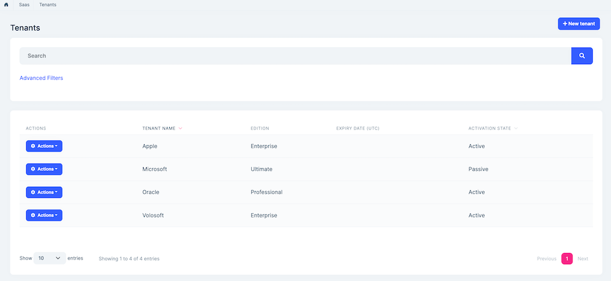
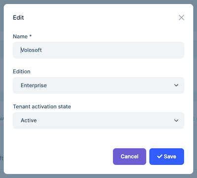
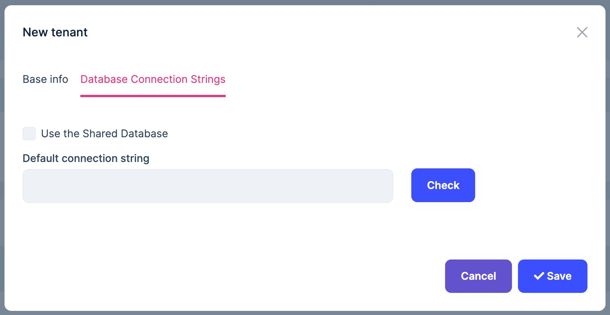
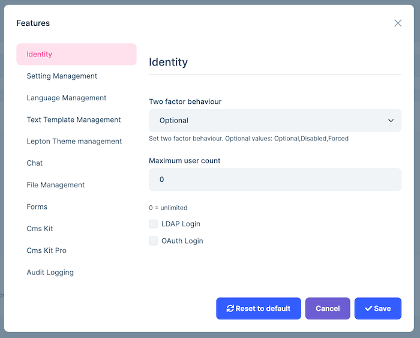
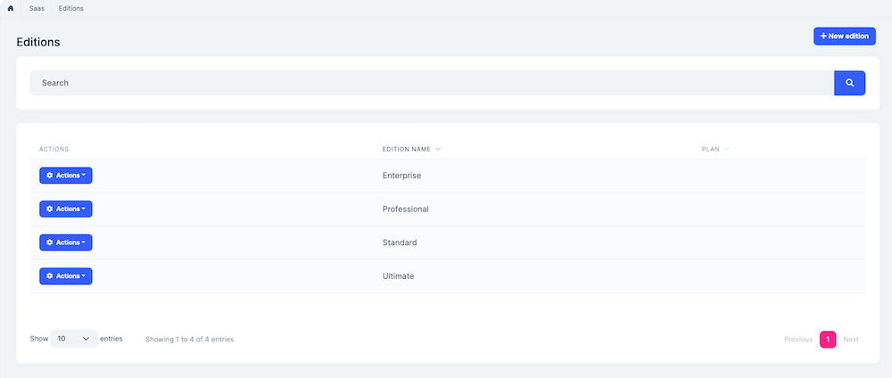
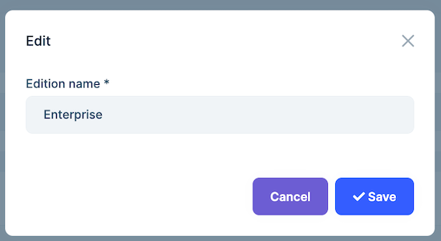

# SaaS Module (Pro)

> You must have an ABP Team or a higher license to use this module.

This module is used to manage your tenants and editions in multi-tenant applications;

* Manage **tenants** and **editions** in the system. A tenant is allowed to have one **edition**.
* Set **features** of tenants.
* Set **connection string** of tenants.
* Set **features** of editions and tenants.

See [the module description page](https://abp.io/modules/Volo.Saas) for an overview of the module features.

## How to install

Saas is pre-installed in [the startup templates](../solution-templates). So, no need to manually install it.

## Packages

This module follows the [module development best practices guide](../framework/architecture/best-practices) and consists of several NuGet and NPM packages. See the guide if you want to understand the packages and relations between them.

You can visit [SaaS module package list page](https://abp.io/packages?moduleName=Volo.Saas) to see list of packages related with this module.

## Tenant-Edition Subscription

SaaS module implements subscribing to Editions for Tenants using Payment module. To enable it, project must contain `Volo.Saas` and `Volo.Payment` modules and these modules must be configured as shown below.

### Configuration

Firstly, Payment module must be configured properly:

- Install `Volo.Payment` module.
  ```bash
  abp add-module Volo.Payment
  ```
  _Or you can install via using ABP Suite._

- Configure Saas module to use Payment.
  
  ```csharp
  Configure<AbpSaasPaymentOptions>(options =>
  {
      options.IsPaymentSupported = true;
  });
  ```

 - Follow the [subscriptions](payment#subscriptions) section of [Payment Module Documentation](payment#subscriptions). Complete [enabling webhooks](payment#enabling-webhooks) and [configuring plans](payment#configuring-plans) sections.

- Run the application and go to `Saas > Editions` page at your Web Application menu.

- Create or Edit an existing Edition. **Plan** dropdown must be visible if you've done earlier steps correctly. Pick a Plan for Edition.

### Usage

SaaS module doesn't contain a public facing list page for listing editions for new customers/tenants to subscribe.  First, you need to create such a page in your application. Then, when a new customer/tenant selects one of those Editions, you can create a subscription and redirect user to payment module as shown below. 

- Inject `ISubscriptionAppService` to create a subscription for a edition:

  ```csharp
   public class IndexModel : PageModel
   {
          protected ISubscriptionAppService SubscriptionAppService { get; }
          
          protected ICurrentTenant CurrentTenant { get; }
  
          public IndexModel(
              ISubscriptionAppService subscriptionAppService,
              ICurrentTenant currentTenant)
          {
              SubscriptionAppService = subscriptionAppService;
              CurrentTenant = currentTenant;
          }
  
          public async Task<IActionResult> OnPostAsync(Guid editionId)
          {
              var paymentRequest = await SubscriptionAppService.CreateSubscriptionAsync(editionId, CurrentTenant.GetId());
  
              return LocalRedirectPreserveMethod("/Payment/GatewaySelection?paymentRequestId=" + paymentRequest.Id);
          }
      }

When the payment is completed successfully, the tenant and edition relation will be updated according to subscription status. Make sure Payment Gateway Web Hooks are configured properly.

After all, payment module will redirect user to the callbackUrl if configured in [payment configuration](payment#paymentweboptions) with a paymentRequestId parameter. In this page, you can check the status of the payment request and show a success message to the user when the payment status is confirmed. Since the payment confirmation is asynchronous, you need to check the payment status repeatedly until it is confirmed.

## User interface

### Menu items

SaaS module adds the following items to the "Main" menu, under the "Administration" menu item:

* **Tenants**: Tenant management page.
* **Editions**: Edition management page.

`SaasHostMenuNames` and `SaasTenantMenuNames`  classes have the constants for the menu item names.

### Pages

#### Tenant management

Tenant page is used to manage tenants in the system. 



You can create a new tenant or edit a tenant in this page:



##### Connection String

You can manage connection string of a tenant in case you want to use a separate database for a specific tenant. If you want to use Host database for a tenant, select "Use the Shared Database" option.



##### Module Specific Connection Strings

You can also use the module-specific database connection string feature.

To use this feature, you should configure the module-specific database in the `ConfigureServices` method of your module class. For example, the following code configures the `Saas` module to use a separate database for each tenant.

```csharp
Configure<AbpDbConnectionOptions>(options => 
{
    options.Databases.Configure("Saas", database => 
    {
        database.IsUsedByTenants = true;
    });
});
```

You should select the "Use module specific database connection string" option, then you can determine your modules and their connection strings. Before adding you can check your connection by clicking "Check".


##### Tenant Features

You can set features of tenants.



#### Edition management

Editions page is used to manage the editions in your system.



You can create a new edition or edit an existing edition in this page:



##### Edition Features

You can set features of an edition in this page:


## Data seed

This module adds some initial data (see [the data seed system](../framework/infrastructure/data-seeding.md)) to the database when you run the `.DbMigrator` application:

* Creates an `Standard` edition.

## Internals

### Domain layer

#### Aggregates

This module follows the [Entity Best Practices & Conventions](../framework/architecture/best-practices/entities.md) guide.

##### Tenant

A tenant is generally represents a group of users who share a common access with specific privileges to the software instance.

* `Tenant` (aggregate root): Represents a tenant in the system.
  * `TenantConnectionString` (collection): Connection strings of a tenant.

##### Edition

An edition is typically a category of features of the application.

* `Edition` (aggregate root): Represents an edition in the system.

#### Repositories

This module follows the [Repository Best Practices & Conventions](../framework/architecture/best-practices/repositories.md) guide.

Following custom repositories are defined for this module:

* `ITenantRepository`
* `IEditionRepository`

#### Domain services

This module follows the [Domain Services Best Practices & Conventions](../framework/architecture/best-practices/domain-services.md) guide.

##### Tenant manager

`TenantManager` is used to create tenants, change and validate name of tenants.

### Application layer

#### Application services

* `TenantAppService` (implements `ITenantAppService`): Implements the use cases of the tenant management UI.
* `EditionAppService` (implement `IEditionAppService`): Implements the use cases of the edition management UI.
* `SubscriptionAppService` (implement`ISubscriptionAppService`): Implements the use cases of Tenant-Edition subscription. 

### Database providers

#### Common

##### Table / collection prefix & schema

All tables/collections use the `Saas` prefix by default. Set static properties on the `SaasDbProperties` class if you need to change the table prefix or set a schema name (if supported by your database provider).

##### Connection string

This module uses `Saas` for the connection string name. If you don't define a connection string with this name, it fallbacks to the `Default` connection string.

See the [connection strings](../framework/fundamentals/connection-strings.md) documentation for details.

#### Entity Framework Core

##### Tables

* **SaasTenants**
  * SaasTenantConnectionStrings
* **SaasEditions**

#### MongoDB

##### Collections

* **SaasTenants**
* **SaasEditions**

### Permissions

See the `SaasHostPermissions` class members for all permissions defined for this module.


### Angular UI

#### Installation

In order to configure the application to use the `SaasModule`, you first need to import `SaasConfigModule` from `@volo/abp.ng.saas/config` to root module. `SaasConfigModule` has a static `forRoot` method which you should call for a proper configuration.

```js
// app.module.ts
import { SaasConfigModule } from '@volo/abp.ng.saas/config';

@NgModule({
  imports: [
    // other imports
    SaasConfigModule.forRoot(),
    // other imports
  ],
  // ...
})
export class AppModule {}
```

The `SaasModule` should be imported and lazy-loaded in your routing module. It has a static `forLazy` method for configuration. Available options are listed below. It is available for import from `@volo/abp.ng.saas`.

```js
// app-routing.module.ts
const routes: Routes = [
  // other route definitions
  {
    path: 'saas',
    loadChildren: () =>
      import('@volo/abp.ng.saas').then(m => m.SaasModule.forLazy(/* options here */)),
  },
];

@NgModule(/* AppRoutingModule metadata */)
export class AppRoutingModule {}
```

> If you have generated your project via the startup template, you do not have to do anything, because it already has both `SaasConfigModule` and `SaasModule`.

<h4 id="h-saas-module-options">Options</h4>

You can modify the look and behavior of the module pages by passing the following options to `SaasModule.forLazy` static method:

- **entityActionContributors:** Changes grid actions. Please check [Entity Action Extensions for Angular](../framework/ui/angular/entity-action-extensions.md) for details.
- **toolbarActionContributors:** Changes page toolbar. Please check [Page Toolbar Extensions for Angular](../framework/ui/angular/page-toolbar-extensions.md) for details.
- **entityPropContributors:** Changes table columns. Please check [Data Table Column Extensions for Angular](../framework/ui/angular/data-table-column-extensions.md) for details.
- **createFormPropContributors:** Changes create form fields. Please check [Dynamic Form Extensions for Angular](../framework/ui/angular/dynamic-form-extensions.md) for details.
- **editFormPropContributors:** Changes create form fields. Please check [Dynamic Form Extensions for Angular](../framework/ui/angular/dynamic-form-extensions.md) for details.


#### Services / Models

Saas module services and models are generated via `generate-proxy` command of the [ABP CLI](../cli). If you need the module's proxies, you can run the following command in the Angular project directory:

```bash
abp generate-proxy --module saas
```

#### Replaceable Components

`eSaasComponents` enum provides all replaceable component keys. It is available for import from `@volo/abp.ng.saas`.

Please check [Component Replacement document](../framework/ui/angular/component-replacement.md) for details.


#### Remote Endpoint URL

The Saas module remote endpoint URLs can be configured in the environment files.

```js
export const environment = {
  // other configurations
  apis: {
    default: {
      url: 'default url here',
    },
    SaasHost: {
      url: 'SaasHost remote url here'
    },
    SaasTenant: {
      url: 'SaasTenant remote url here'
    },
    // other api configurations
  },
};
```

The Saas module remote URL configurations shown above are optional. If you don't set any URLs, the `default.url` will be used as fallback.


## Distributed Events


This module defines the following ETOs (Event Transfer Objects) to allow you to subscribe to changes on the entities of the module;

- `TenantEto` is published on changes done on a `Tenant` entity.
- `EditionEto` is published on changes done on an `Edition` entity.

**Example: Get notified when a new tenant has been created**

```
public class MyHandler :
    IDistributedEventHandler<EntityCreatedEto<TenantEto>>,
    ITransientDependency
{
    public async Task HandleEventAsync(EntityCreatedEto<TenantEto> eventData)
    {
        TenantEto tenant = eventData.Entity;
        // TODO: ...
    }
}
```


`TenantEto` and `EditionEto` are configured to automatically publish the events. You should configure yourself for the others. See the [Distributed Event Bus document](https://github.com/abpframework/abp/blob/rel-7.3/docs/en/Distributed-Event-Bus.md) to learn details of the pre-defined events.

> Subscribing to the distributed events is especially useful for distributed scenarios (like microservice architecture). If you are building a monolithic application, or listening events in the same process that runs the Tenant Management Module, then subscribing to the [local events](https://github.com/abpframework/abp/blob/rel-7.3/docs/en/Local-Event-Bus.md) can be more efficient and easier.

