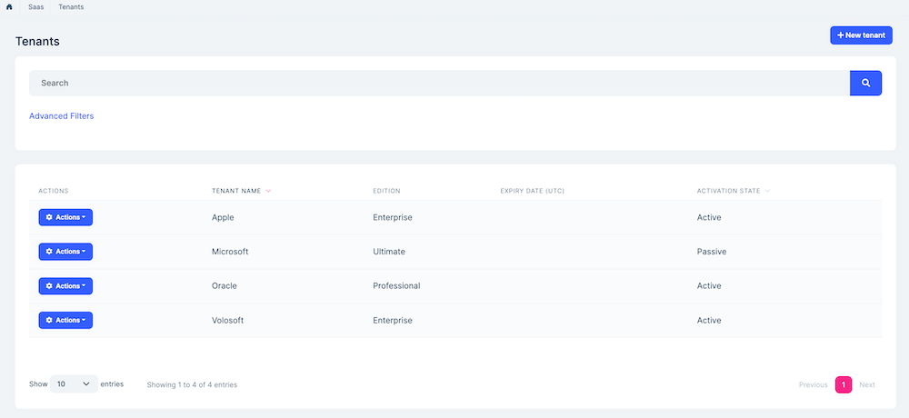
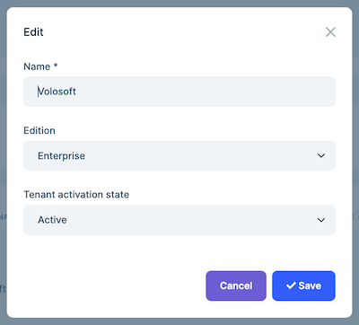
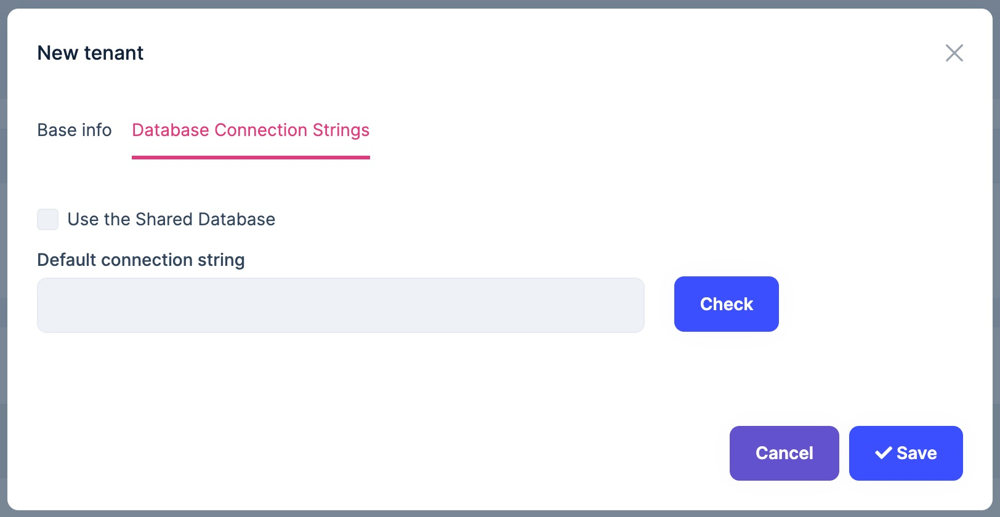
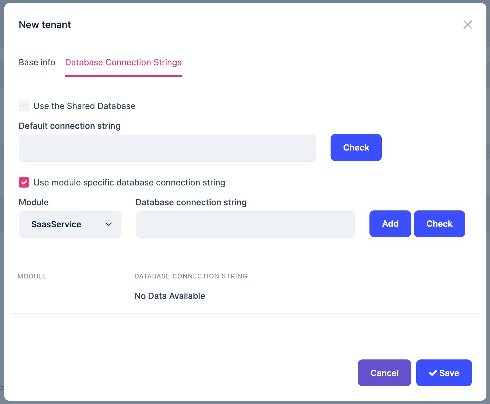
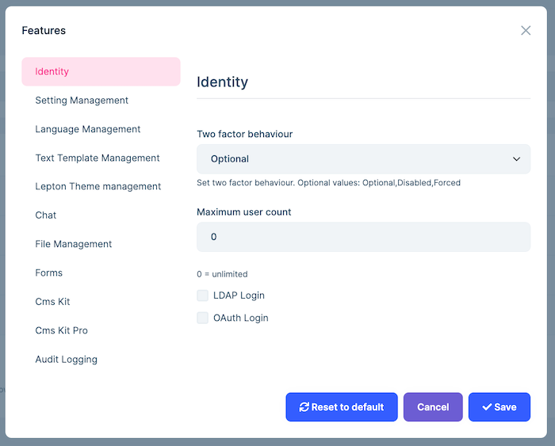
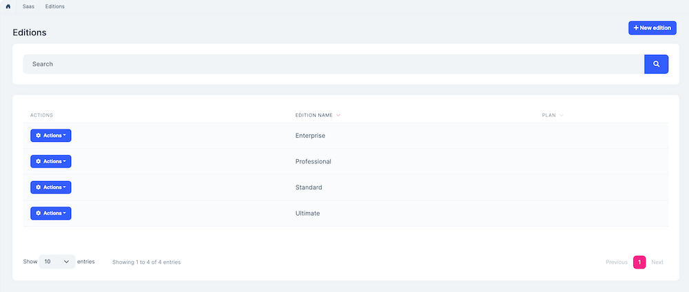
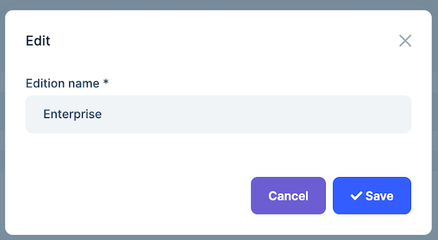

```json
//[doc-seo]
{
    "Description": "Manage tenants and editions in your multi-tenant applications with the ABP SaaS Module, enhancing your app's scalability and flexibility."
}
```

# SaaS Module (Pro)

> You must have an [ABP Team or a higher license](https://abp.io/pricing) to use this module.

This module is used to manage tenants and editions in multi-tenant applications:

- Manage **tenants** and **editions**. A tenant can have one edition.
- Assign application **features** to editions and tenants.
- Configure default and module-specific tenant **connection strings**.
- Control tenant activation and edition expiration.

See [the module description page](https://abp.io/modules/Volo.Saas) for an overview of the module features.

## How to Install

The SaaS module is pre-installed in the [startup templates](../solution-templates), so you don't need to install it manually.

## Packages

This module follows the [module development best practices guide](../framework/architecture/best-practices) and consists of several NuGet and NPM packages. See the guide if you want to understand the packages and relations between them.

See the [SaaS module package list](https://abp.io/packages?moduleName=Volo.Saas) for the related packages.

## Tenant-Edition Subscription

The SaaS module integrates with the Payment module to subscribe tenants to editions. The solution must contain both the `Volo.Saas` and `Volo.Payment` modules.

### Configuration

Configure the Payment module first:

- Install the `Volo.Payment` module:

  ```bash
  abp add-module Volo.Payment
  ```

  You can also install it with ABP Studio.

- Enable the Payment integration for the SaaS module:

  ```csharp
  Configure<AbpSaasPaymentOptions>(options =>
  {
      options.IsPaymentSupported = true;
  });
  ```

- Complete the Payment module's [subscription](payment.md#subscriptions), [webhook](payment.md#enabling-webhooks) and [plan](payment.md#configuring-plans) configuration.

- Run the application and open the `SaaS > Editions` page.

- Create an edition or edit an existing one, then select a Payment plan in the **Plan** field. An edition must have a plan before it can be used to create a subscription.

### Usage

The module doesn't provide a public edition catalog. Create that page in your application and call `ISubscriptionAppService` after an authenticated tenant selects an edition. The following same-process Razor Pages example derives the tenant ID from `ICurrentTenant` instead of accepting it from the request:

```csharp
[Authorize]
public class IndexModel : PageModel
{
    protected ISubscriptionAppService SubscriptionAppService { get; }
    protected ICurrentTenant CurrentTenant { get; }

    public IndexModel(
        ISubscriptionAppService subscriptionAppService,
        ICurrentTenant currentTenant)
    {
        SubscriptionAppService = subscriptionAppService;
        CurrentTenant = currentTenant;
    }

    public async Task<IActionResult> OnPostAsync(Guid editionId)
    {
        var paymentRequest = await SubscriptionAppService.CreateSubscriptionAsync(
            editionId,
            CurrentTenant.GetId()
        );

        return LocalRedirectPreserveMethod(
            "/Payment/GatewaySelection?paymentRequestId=" + paymentRequest.Id
        );
    }
}
```

Keep this operation behind an authenticated application endpoint and never bind an arbitrary tenant ID from public input. In a tiered solution, implement this orchestration in a trusted server-side application layer; the built-in SaaS subscription HTTP endpoint requires the host-side `Saas.Editions` permission.

Creating a payment request initializes a missing or expired `EditionEndDateUtc` to the current UTC time, but it doesn't assign the selected edition. A subscription-created event assigns the edition and period end. A subscription-updated event refreshes the period end and applies a new edition assignment when the Payment event supplies one. A cancellation keeps the edition assignment and sets its end date to the subscription's period end date. After that date, `Tenant.GetActiveEditionId()` no longer returns the edition.

Payment confirmation is asynchronous. Configure the gateway webhooks and use the Payment module's [callback URL](payment.md#paymentweboptions) and payment-request status flow to show the final result.

## User Interface

### Menu Items

The SaaS module adds a top-level **SaaS** group to the "Main" menu with the following items:

* **Tenants**: Tenant management page.
* **Editions**: Edition management page.

The `SaasHostMenuNames` class contains the host-side menu item name constants. The tenant-side `SaasTenantMenuNames` class currently contains only its group name.

### Pages

#### Tenant Management

The Tenants page is used to manage tenants in the system.



You can create a new tenant or edit a tenant in this page:



A tenant has one of the following activation states:

- `Active`: The tenant is active without an activation deadline.
- `ActiveWithLimitedTime`: The tenant is active through `ActivationEndDate` and becomes inactive after that time.
- `Passive`: The tenant is inactive.

An edition assignment can also have an `EditionEndDateUtc`. The stored `EditionId` is retained after this date, but `Tenant.GetActiveEditionId()` returns `null`. This lets subscription renewals retain the previous assignment while distinguishing an expired edition.

The module caches the dynamic edition claim used by feature resolution. `EditionDynamicClaimsPrincipalContributorCacheOptions.CacheAbsoluteExpiration` controls this distributed cache entry and defaults to one hour. Updating or deleting a tenant invalidates the entry, but the passage of `EditionEndDateUtc` alone doesn't. This cache setting doesn't control the lifetime of an already issued token or principal.

##### Connection String

You can manage a tenant's connection string when it should use a separate database. Select **Use the Shared Database** to remove the tenant-specific default and module-specific connection strings. Each connection then falls back to the corresponding host-side configuration.



##### Module-Specific Connection Strings

You can also use the module-specific database connection string feature.

To use this feature, configure the module-specific database in the `ConfigureServices` method of your module class. Only databases registered with `IsUsedByTenants = true` are available through the SaaS connection-string management API and UI. The following example makes the `Saas` database available:

```csharp
Configure<AbpDbConnectionOptions>(options =>
{
    options.Databases.Configure("Saas", database =>
    {
        database.IsUsedByTenants = true;
    });
});
```

Select **Use module specific database connection string** to configure these databases. Use the **Check** action to validate the supplied values before saving them.

The `Volo.Saas.EnableTenantBasedConnectionStringManagement` setting controls this feature and defaults to `true`. When it is disabled, the built-in UIs hide connection-string management, tenant creation ignores supplied connection strings, and update requests are rejected. The setting is available on the SaaS tab of the Settings page to users with the `Saas.SettingManagement` permission.

> Tenant connection strings are sensitive. The module persists and returns the values as supplied; it doesn't encrypt them before persistence. Restrict `Saas.Tenants.ManageConnectionStrings`, protect the database and event transport, and avoid logging connection-string payloads.



##### Tenant Features

You can set features for a tenant. A tenant-level value overrides the value assigned to its edition. If neither level has a value, feature resolution continues with the application's configuration and the feature's default value.



#### Edition Management

The Editions page is used to manage the editions in your system.



You can create a new edition or edit an existing edition in this page:



The application service validates edition display names for uniqueness. Before deleting an edition, you can move all of its tenants to another edition. Deleting an edition without choosing a replacement clears the edition assignment for its tenants.

##### Edition Features

You can set features of an edition on this page:


## Data Seed

Commercial startup templates include an application-level [data seed contributor](../framework/infrastructure/data-seeding.md) that calls `IEditionDataSeeder.CreateStandardEditionsAsync()` during the template's database migration and data-seeding flow. Layered applications run this flow from the `.DbMigrator` application, while no-layer applications run it from the host's database migration service. It creates the following host-side data:

- A `Standard` edition, if an edition with that name doesn't already exist.

When integrating the SaaS module into an existing solution, call this method from your own `IDataSeedContributor` if you want the same initial edition. Referencing the SaaS module alone doesn't execute this seeder.

## Internals

### Domain Layer

#### Aggregates

This module follows the [Entity Best Practices & Conventions](../framework/architecture/best-practices/entities.md) guide.

##### Tenant

A tenant generally represents a group of users that share access to the software with tenant-specific data and privileges.

* `Tenant` (aggregate root): Represents a tenant in the system.
  * `TenantConnectionString` (collection): Connection strings of a tenant.

##### Edition

An edition is a reusable set of application feature values that can be assigned to tenants.

* `Edition` (aggregate root): Represents an edition in the system.

#### Extending the Entities

The `Tenant` and `Edition` entities support the [Module Entity Extensions](../framework/architecture/modularity/extending/module-entity-extensions.md) system. Configure them in the `Domain.Shared` project before the database model is created. The following example adds an extra property to each entity:

```csharp
ObjectExtensionManager.Instance.Modules()
    .ConfigureSaas(saas =>
    {
        saas.ConfigureTenant(tenant =>
        {
            tenant.AddOrUpdateProperty<string>("ExternalId");
        });

        saas.ConfigureEdition(edition =>
        {
            edition.AddOrUpdateProperty<string>("CatalogCode");
        });
    });
```

The module maps the configured extra properties through its extensible application contracts. The built-in MVC, Blazor, MudBlazor and Angular UIs consume the module entity-extension metadata and display the properties in their supported tables and forms. Use the property `UI` options or an Angular UI contributor when you need to customize visibility, order or rendering.

#### Repositories

This module follows the [Repository Best Practices & Conventions](../framework/architecture/best-practices/repositories.md) guide.

The following custom repositories are defined for this module:

* `ITenantRepository`
* `IEditionRepository`

#### Domain Services

This module follows the [Domain Services Best Practices & Conventions](../framework/architecture/best-practices/domain-services.md) guide.

##### Tenant and Edition Managers

`TenantManager` creates tenants, changes and validates tenant names, and evaluates tenant activation. `EditionManager` validates edition display names, enforces a Payment plan for subscription editions, and moves tenants between editions.

### Application Layer

#### Application Services

- `TenantAppService` (implements `ITenantAppService`): Implements the tenant management use cases.
- `EditionAppService` (implements `IEditionAppService`): Implements the edition management use cases.
- `SubscriptionAppService` (implements `ISubscriptionAppService`): Creates Payment subscription requests for tenant-edition subscriptions.

### Database Providers

#### Common

##### Table/Collection Prefix & Schema

All tables/collections use the `Saas` prefix by default. Set static properties on the `SaasDbProperties` class if you need to change the table prefix or set a schema name (if supported by your database provider).

##### Connection String

This module uses `Saas` for the connection string name. If you don't define a connection string with this name, it falls back to the `Default` connection string.

See the [connection strings](../framework/fundamentals/connection-strings.md) documentation for details.

#### Entity Framework Core

##### Tables

- **SaasTenants**
  - SaasTenantConnectionStrings
- **SaasEditions**

SaaS metadata is host-side data. The EF Core model isn't added to a tenant-only database schema.

#### MongoDB

##### Collections

- **SaasTenants** (connection strings are embedded in the tenant document)
- **SaasEditions**

### Permissions

All SaaS permissions are host-side permissions:

- `Saas.SettingManagement`: Manages the SaaS settings.
- `Saas.Tenants`: Views tenant management.
  - `Saas.Tenants.Create`
  - `Saas.Tenants.Update`
  - `Saas.Tenants.Delete`
  - `Saas.Tenants.ManageFeatures`
  - `Saas.Tenants.ManageConnectionStrings`
  - `Saas.Tenants.SetPassword`
  - `Saas.Tenants.Impersonation`
  - `AuditLogging.ViewChangeHistory:Volo.Saas.Tenant`
- `Saas.Editions`: Views edition management.
  - `Saas.Editions.Create`
  - `Saas.Editions.Update`
  - `Saas.Editions.Delete`
  - `Saas.Editions.ManageFeatures`
  - `AuditLogging.ViewChangeHistory:Volo.Saas.Edition`

The two change-history permissions are disabled when [entity history](../framework/infrastructure/audit-logging.md#entity-history-selectors) isn't enabled for the corresponding entity.

Tenant impersonation is disabled in the MVC, Blazor and MudBlazor SaaS UI options by default. See the [impersonation documentation](account/impersonation.md) for the UI and Account module configuration required to enable it.

### Angular UI

#### Installation

Add `provideSaasConfig` from `@volo/abp.ng.saas/config` to the root application providers. It registers the menu routes, authentication filter and SaaS settings tab.

```ts
// app.config.ts
import { ApplicationConfig } from '@angular/core';
import { provideSaasConfig } from '@volo/abp.ng.saas/config';

export const appConfig: ApplicationConfig = {
  providers: [
    // ...
    provideSaasConfig(),
  ],
};
```

Lazy-load the UI with the `createRoutes` function from `@volo/abp.ng.saas`:

```ts
// app.routes.ts
import { Routes } from '@angular/router';

export const APP_ROUTES: Routes = [
  // ...
  {
    path: 'saas',
    loadChildren: () =>
      import('@volo/abp.ng.saas').then(c => c.createRoutes(/* options here */)),
  },
];
```

> If you have generated your project via the startup template, you do not have to do anything, because it already has both configurations implemented.

<h4 id="h-saas-module-options">Options</h4>

You can modify the look and behavior of the module pages by passing the following options to `createRoutes`:

- **entityActionContributors:** Changes grid actions. Please check [Entity Action Extensions for Angular](../framework/ui/angular/entity-action-extensions.md) for details.
- **toolbarActionContributors:** Changes page toolbar. Please check [Page Toolbar Extensions for Angular](../framework/ui/angular/page-toolbar-extensions.md) for details.
- **entityPropContributors:** Changes table columns. Please check [Data Table Column Extensions for Angular](../framework/ui/angular/data-table-column-extensions.md) for details.
- **createFormPropContributors:** Changes create form fields. Please check [Dynamic Form Extensions for Angular](../framework/ui/angular/dynamic-form-extensions.md) for details.
- **editFormPropContributors:** Changes edit form fields. Please check [Dynamic Form Extensions for Angular](../framework/ui/angular/dynamic-form-extensions.md) for details.

Each contributor map accepts the `eSaasComponents.Editions` and `eSaasComponents.Tenants` keys.

#### Services / Models

SaaS module services and models are generated via the `generate-proxy` command of the [ABP CLI](../cli). If you need the module's proxies, you can run the following command in the Angular project directory:

```bash
abp generate-proxy --module saas
```

#### Replaceable Components

`eSaasComponents` is available for import from `@volo/abp.ng.saas`. The following keys are wired to replaceable components:

- `eSaasComponents.Editions`: Editions page.
- `eSaasComponents.Tenants`: Tenants page.
- `eSaasComponents.ConnectionStrings` is also exported, but the current connection-strings template isn't wired to this replacement key.
- `eSaasComponents.SetTenantPassword`: Set-tenant-password modal content.

See the [Component Replacement](../framework/ui/angular/component-replacement.md) documentation for details.

#### Remote Endpoint URL

Configure the SaaS host endpoint in the environment when it is served from a different URL:

```ts
export const environment = {
  // Other configurations...
  apis: {
    default: {
      url: 'https://localhost:44300',
    },
    SaasHost: {
      url: 'https://localhost:44301',
    },
    // Other API configurations...
  },
};
```

The `SaasHost` entry is optional. If it isn't configured, the generated SaaS Angular services use `default.url`.

## Distributed Events

### Published Events

The tenant workflows explicitly publish the following integration events:

- `TenantCreatedEto` after a tenant is created. When `TenantAppService.CreateAsync` creates the tenant, the event's `Properties` dictionary contains `AdminEmail` and `AdminPassword` from the request. In the shared-user strategy, tenant creation also publishes `InviteUserToTenantRequestedEto`.
- `TenantConnectionStringUpdatedEto` for default and module-specific connection-string changes. Its `OldValue` and `NewValue` properties contain the connection-string values.
- `ApplyDatabaseMigrationsEto` when database migration is requested for a tenant.
- `InviteUserToTenantRequestedEto` and `UserPasswordChangeRequestedEto` for their corresponding tenant administration actions.

> Some of these events carry passwords or connection strings. Protect the event transport and storage, restrict subscribers, and don't log or retain complete payloads.

### Consumed Events

The module consumes `SubscriptionCreatedEto`, `SubscriptionUpdatedEto` and `SubscriptionCanceledEto` from the Payment module as described in [Tenant-Edition Subscription](#tenant-edition-subscription), and the following additional integration events:

- `CreateTenantEto` creates a tenant, then publishes `TenantCreatedEto` and an `InviteUserToTenantRequestedEto` that directly adds the invited user to the tenant.
- A host-side `AppliedDatabaseMigrationsEto` publishes an `ApplyDatabaseMigrationsEto` for each tenant that has a separate connection string for the migrated database. Events that already specify a tenant ID are ignored by this handler.

### Standard Entity Events

The module also maps `Tenant` to `TenantEto` and `Edition` to `EditionEto` for ABP's standard distributed entity events. Registering these mappings doesn't enable automatic entity events. Add the entity types to `AbpDistributedEntityEventOptions.AutoEventSelectors` in the application that owns the SaaS data when consumers need create, update or delete notifications:

```csharp
Configure<AbpDistributedEntityEventOptions>(options =>
{
    options.AutoEventSelectors.Add<Tenant>();
    options.AutoEventSelectors.Add<Edition>();
});
```

**Example: Subscribe to the opt-in tenant-created entity event**

```csharp
public class MyHandler :
    IDistributedEventHandler<EntityCreatedEto<TenantEto>>,
    ITransientDependency
{
    public async Task HandleEventAsync(EntityCreatedEto<TenantEto> eventData)
    {
        TenantEto tenant = eventData.Entity;
        // TODO: ...
    }
}
```

See the [Distributed Event Bus](../framework/infrastructure/event-bus/distributed) documentation for delivery, handlers and pre-defined entity events.

> Distributed events are especially useful in a distributed system. For same-process notifications in a monolithic application, the [Local Event Bus](../framework/infrastructure/event-bus/local) can be simpler.
