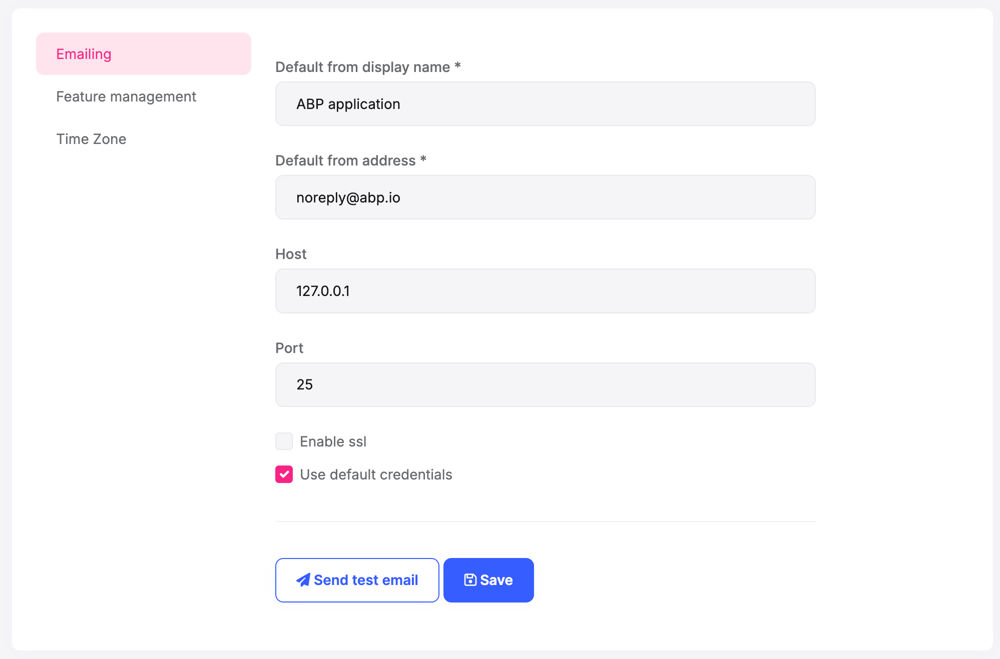
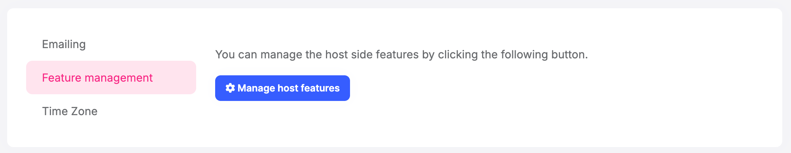
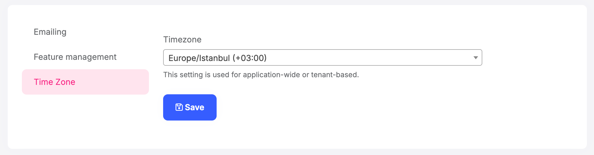
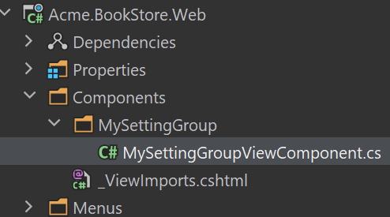
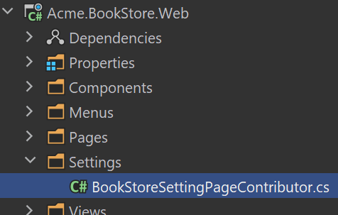
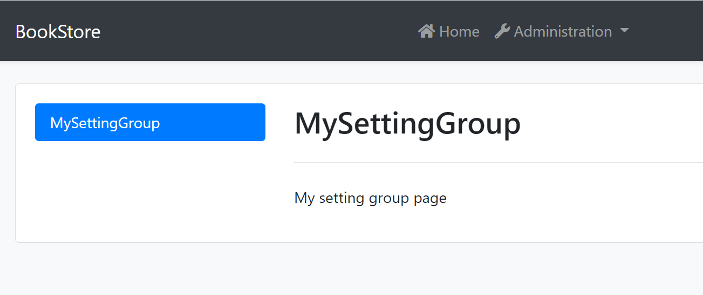
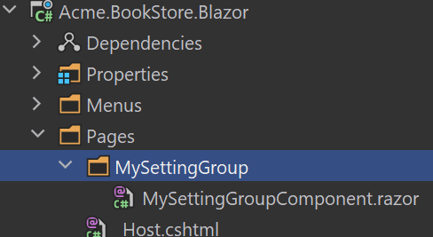
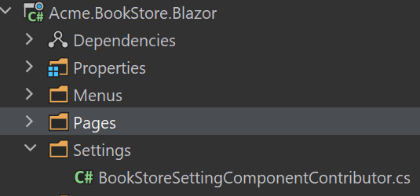
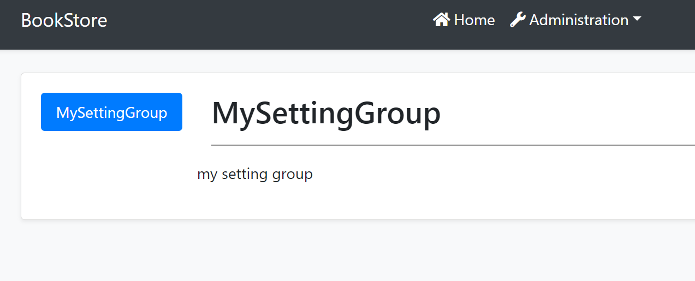
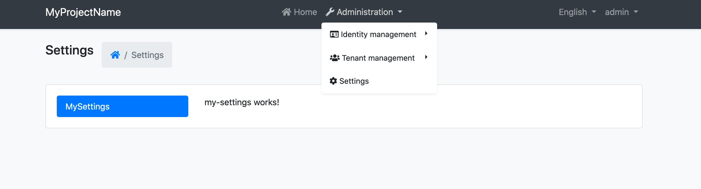

```json
//[doc-seo]
{
    "Description": "Learn how to manage application settings effortlessly with the ABP Framework's Setting Management Module and ISettingManager."
}
```

# Setting Management Module

Setting Management Module implements the `ISettingStore` (see [the setting system](../framework/infrastructure/settings.md)) to store the setting values in a database and provides the `ISettingManager` to manage (change) the setting values in the database.

> Setting Management module is already installed and configured for [the startup templates](../solution-templates). So, most of the times you don't need to manually add this module to your application.

## ISettingManager

`ISettingManager` is used to get and set the values for the settings. Examples:

````csharp
using System;
using System.Threading.Tasks;
using Volo.Abp.DependencyInjection;
using Volo.Abp.SettingManagement;

namespace Demo
{
    public class MyService : ITransientDependency
    {
        private readonly ISettingManager _settingManager;

        //Inject ISettingManager service
        public MyService(ISettingManager settingManager)
        {
            _settingManager = settingManager;
        }

        public async Task FooAsync()
        {
            Guid user1Id = ...;
            Guid tenant1Id = ...;

            //Get/set a setting value for the current user or the specified user
            
            string layoutType1 =
                await _settingManager.GetOrNullForCurrentUserAsync("App.UI.LayoutType");
            string layoutType2 =
                await _settingManager.GetOrNullForUserAsync("App.UI.LayoutType", user1Id);

            await _settingManager.SetForCurrentUserAsync("App.UI.LayoutType", "LeftMenu");
            await _settingManager.SetForUserAsync(user1Id, "App.UI.LayoutType", "LeftMenu");

            //Get/set a setting value for the current tenant or the specified tenant
            
            string layoutType3 =
                await _settingManager.GetOrNullForCurrentTenantAsync("App.UI.LayoutType");
            string layoutType4 =
                await _settingManager.GetOrNullForTenantAsync("App.UI.LayoutType", tenant1Id);
            
            await _settingManager.SetForCurrentTenantAsync("App.UI.LayoutType", "LeftMenu");
            await _settingManager.SetForTenantAsync(tenant1Id, "App.UI.LayoutType", "LeftMenu");

            //Get/set a global and default setting value
            
            string layoutType5 =
                await _settingManager.GetOrNullGlobalAsync("App.UI.LayoutType");
            string layoutType6 =
                await _settingManager.GetOrNullDefaultAsync("App.UI.LayoutType");

            await _settingManager.SetGlobalAsync("App.UI.LayoutType", "TopMenu");
        }
    }
}

````

So, you can get or set a setting value for different setting value providers (Default, Global, User, Tenant... etc).

The scoped `GetOrNull...` and `GetAll...` extension methods use fallback values by default. Pass `fallback: false` when you need only the value explicitly stored for the requested provider. Setting a value to `null` clears that provider's value.

For a non-encrypted inherited setting, setting a provider value to the same value as its fallback also clears the provider record by default. The comparison is case-insensitive. Pass `forceToSet: true` to a user- or tenant-scoped `Set...` method when you intentionally need to persist the same value as the fallback. `SetForTenantOrGlobalAsync` honors this parameter only when `tenantId` has a value; its global branch calls `SetGlobalAsync`, which does not expose the parameter. For encrypted settings, fallback-equal clearing does not apply to non-empty values because they are encrypted before comparison; an empty string can still be cleared when it equals the fallback. Pass `null` explicitly when you want to clear the provider value.

> Use the `ISettingProvider` instead of the `ISettingManager` if you only need to read the setting values, because it implements caching and supports all deployment scenarios. You can use the `ISettingManager` if you are creating a setting management UI.

### Setting Cache

Setting values are cached using the [distributed cache](../framework/fundamentals/caching.md) system. Always use the `ISettingManager` to change the setting values which manages the cache for you.

## Setting Management Providers

Setting Management module is extensible, just like the [setting system](../framework/infrastructure/settings.md).  You can extend it by defining setting management providers. There are 5 pre-built setting management providers registered it the following order:

* `DefaultValueSettingManagementProvider`: Gets the value from the default value of the setting definition. It can not set the default value since default values are hard-coded on the setting definition.
* `ConfigurationSettingManagementProvider`: Gets the value from the [IConfiguration service](../framework/fundamentals/configuration.md). It can not set the configuration value because it is not possible to change the configuration values on runtime.
* `GlobalSettingManagementProvider`: Gets or sets the global (system-wide) value for a setting.
* `TenantSettingManagementProvider`: Gets or sets the setting value for a tenant.
* `UserSettingManagementProvider`: Gets or sets the setting value for a user.

`ISettingManager` uses the setting management providers on get/set methods. Typically, every setting management provider defines extension methods on the `ISettingManager` service (like `SetForUserAsync` defined by the user setting management provider).

If you want to create your own provider, implement the `ISettingManagementProvider` interface or inherit from the `SettingManagementProvider` base class:

````csharp
public class CustomSettingProvider : SettingManagementProvider, ITransientDependency
{
    public override string Name => "Custom";

    public CustomSettingProvider(ISettingManagementStore store) 
        : base(store)
    {
    }
}
````

`SettingManagementProvider` base class makes the default implementation (using the `ISettingManagementStore`) for you. You can override base methods as you need. Every provider must have a unique name, which is `Custom` in this example (keep it short since it is saved to database for each setting value record).

Once you create your provider class, you should register it using the `SettingManagementOptions` [options class](../framework/fundamentals/options.md):

````csharp
Configure<SettingManagementOptions>(options =>
{
    options.Providers.Add<CustomSettingProvider>();
});
````

The order of the providers are important. Providers are executed in the reverse order. That means the `CustomSettingProvider` is executed first for this example. You can insert your provider in any order in the `Providers` list.

## Dynamic Setting Definitions

The module can persist setting definitions in addition to setting values. `SettingManagementOptions` controls this behavior:

* `SaveStaticSettingsToDatabase` is `true` by default. During application initialization, definitions contributed by code are synchronized with the `<DbTablePrefix>SettingDefinitions` table or collection (`AbpSettingDefinitions` by default).
* `IsDynamicSettingStoreEnabled` is `false` by default. Enable it to include persisted definitions in the setting definition store at runtime.

```csharp
Configure<SettingManagementOptions>(options =>
{
    options.IsDynamicSettingStoreEnabled = true;
});
```

Both options are disabled automatically in an ABP data migration environment. Static definitions continue to come from the application's setting definition providers when the dynamic store is disabled.

## Setting Management UI

The MVC, Blazor and MudBlazor packages provide built-in Email and Time Zone setting groups. The Angular configuration package provides the built-in Email group. Other modules can contribute their own groups to the same page. For example, the Feature Management module contributes the Feature Management group shown below.



> You can click the Send test email button to send a test email to check your email settings.

The Email group uses `IEmailSettingsAppService`. Reading and updating the settings requires the `SettingManagement.Emailing` permission. Sending a test email additionally requires `SettingManagement.Emailing.Test`. The operations are exposed under `/api/setting-management/emailing`, with the test operation at `/api/setting-management/emailing/send-test-email`.

Email operations also require the `SettingManagement.Enable` feature, which is `true` by default. For tenants, they additionally require its child feature, `SettingManagement.AllowChangingEmailSettings`, which is `false` by default. The read operation does not return the stored SMTP password. On update, a blank password leaves the existing password unchanged.





The Time Zone group uses `ITimeZoneSettingsAppService` and requires the `SettingManagement.TimeZone` permission. Its HTTP API is exposed at `/api/setting-management/timezone`; `GET /api/setting-management/timezone/timezones` returns the available IANA time zones. Updating the value to `Unspecified` clears the host-global or current-tenant value so the configured fallback is used.

The built-in MVC, Blazor and MudBlazor contributors add this group only when `IClock.SupportsMultipleTimezone` is `true`.

The page is extensible, so you can add groups for your application's settings.

### MVC UI

#### Create a setting View Component

Create `MySettingGroup` folder under the `Components` folder. Add a new view component. Name it as `MySettingGroupViewComponent`:



Open the `MySettingGroupViewComponent.cs` and change the whole content as shown below:

```csharp
public class MySettingGroupViewComponent : AbpViewComponent
{
    public virtual IViewComponentResult Invoke()
    {
        return View("~/Components/MySettingGroup/Default.cshtml");
    }
}
```

> You can also use the `InvokeAsync` method, In this example, we use the `Invoke` method.

#### Default.cshtml

Create a `Default.cshtml` file under the `MySettingGroup` folder.

Open the `Default.cshtml` and change the whole content as shown below:

```html
<div>
  <p>My setting group page</p>
</div>
```

#### BookStoreSettingPageContributor

Create a `BookStoreSettingPageContributor.cs` file under the `Settings` folder:



The content of the file is shown below:

```csharp
public class BookStoreSettingPageContributor : SettingPageContributorBase
{
    public BookStoreSettingPageContributor()
    {
        RequiredPermissions("BookStore.Settings");
    }

    public override Task ConfigureAsync(SettingPageCreationContext context)
    {
        context.Groups.Add(
            new SettingPageGroup(
                "Volo.Abp.MySettingGroup",
                "MySettingGroup",
                typeof(MySettingGroupViewComponent),
                order : 1
            )
        );

        return Task.CompletedTask;
    }
}
```

Derive from `SettingPageContributorBase` instead of directly implementing `ISettingPageContributor`. Use `RequiredPermissions`, `RequiredFeatures` and `RequiredTenantSideFeatures` in the constructor to declare the conditions for the group. The module batches these checks before calling `ConfigureAsync`.

`SettingPageGroup` also accepts an optional `parameter` for the view component. Groups are ordered by `order`, then by display name.

Open the `BookStoreWebModule.cs` file and add the following code:

```csharp
Configure<SettingManagementPageOptions>(options =>
{
    options.Contributors.Add(new BookStoreSettingPageContributor());
});
```

#### Run the Application

Navigate to `/SettingManagement` route to see the changes:



### Blazor UI

#### Create a Razor Component

Create `MySettingGroup` folder under the `Pages` folder. Add a new razor component. Name it as `MySettingGroupComponent`:



Open the `MySettingGroupComponent.razor` and change the whole content as shown below:

```csharp
<Row>
    <p>my setting group</p>
</Row>
```

#### BookStoreSettingComponentContributor

Create a `BookStoreSettingComponentContributor.cs` file under the `Settings` folder:



The content of the file is shown below:

```csharp
public class BookStoreSettingComponentContributor : ISettingComponentContributor
{
    public async Task ConfigureAsync(SettingComponentCreationContext context)
    {
        if (!await CheckPermissionsAsync(context))
        {
            return;
        }

        context.Groups.Add(
            new SettingComponentGroup(
                "Volo.Abp.MySettingGroup",
                "MySettingGroup",
                typeof(MySettingGroupComponent),
                order : 1
            )
        );
    }

    public async Task<bool> CheckPermissionsAsync(SettingComponentCreationContext context)
    {
        var authorizationService = context.ServiceProvider
            .GetRequiredService<IAuthorizationService>();

        return await authorizationService.IsGrantedAsync("BookStore.Settings");
    }
}
```

The settings page calls `ConfigureAsync` for every registered contributor, while menu visibility is checked separately with `CheckPermissionsAsync`. Perform the authorization check before adding the group, as in the example, and return the same result from `CheckPermissionsAsync`.

MudBlazor provides the equivalent `ISettingComponentContributor`, `SettingComponentCreationContext`, `SettingComponentGroup` and `SettingManagementComponentOptions` types in the `Volo.Abp.SettingManagement.Blazor.MudBlazor` namespace. Use those types for a MudBlazor UI. In both Blazor UI stacks, a group accepts an optional component `parameter` and is ordered by `order`, then by display name.

Open the `BookStoreBlazorModule.cs` file and add the following code:

```csharp
Configure<SettingManagementComponentOptions>(options =>
{
    options.Contributors.Add(new BookStoreSettingComponentContributor());
});
```

#### Run the Application

Navigate to `/setting-management` route to see the changes:



### Angular UI

#### Create a Component

Create a component with the following command:

```bash
yarn ng generate component my-settings
```

Register the module configuration and your setting tab in `app.config.ts`:

```ts
import { ApplicationConfig, inject, provideAppInitializer } from '@angular/core';
import {
  provideSettingManagementConfig,
  SettingTabsService,
} from '@abp/ng.setting-management/config';
import { MySettingsComponent } from './my-settings/my-settings.component';

function configureSettingTabs() {
  const settingTabs = inject(SettingTabsService);
  settingTabs.add([
    {
      name: 'MySettings',
      order: 1,
      requiredPolicy: 'BookStore.Settings',
      component: MySettingsComponent,
    },
  ]);
}

export const appConfig: ApplicationConfig = {
  providers: [
    provideSettingManagementConfig(),
    provideAppInitializer(configureSettingTabs),
  ],
};
```

`provideSettingManagementConfig` registers the route, the built-in Email tab and route visibility. The Administration -> Settings route is visible only when it has at least one visible tab and the `SettingManagement.Enable` feature is enabled. A tab can use `requiredPolicy` and `invisible` to control its own visibility.

The `@abp/ng.setting-management` package exports the `SettingManagementComponent`, `createRoutes` and the `eSettingManagementComponents.SettingManagement` key. Use the key with the [component replacement system](../framework/ui/angular/component-replacement.md) when you need to replace the complete Setting Management page. `SettingManagementModule.forLazy` and `SettingManagementConfigModule.forRoot` are obsolete; use `createRoutes` and `provideSettingManagementConfig` in standalone applications.

#### Run the Application

Navigate to `/setting-management` route to see the changes:



## Database Providers

The Entity Framework Core and MongoDB packages persist setting values and setting definition records.

### Common

`AbpSettingManagementDbProperties` exposes the common persistence configuration:

* `DbTablePrefix` is the prefix used for EF Core tables and MongoDB collections. It defaults to `AbpCommonDbProperties.DbTablePrefix`.
* `DbSchema` is the schema used by EF Core. MongoDB does not use this value.
* `ConnectionStringName` is `AbpSettingManagement`. Define this named connection string to place the module in a separate database; otherwise, it falls back to the `Default` connection string.

### Entity Framework Core

The Entity Framework Core provider maps the following tables with the default prefix:

* `AbpSettings`
* `AbpSettingDefinitions`

### MongoDB

The MongoDB provider maps the following collections with the default prefix:

* `AbpSettings`
* `AbpSettingDefinitions`

## See Also

* [Settings](../framework/infrastructure/settings.md)
