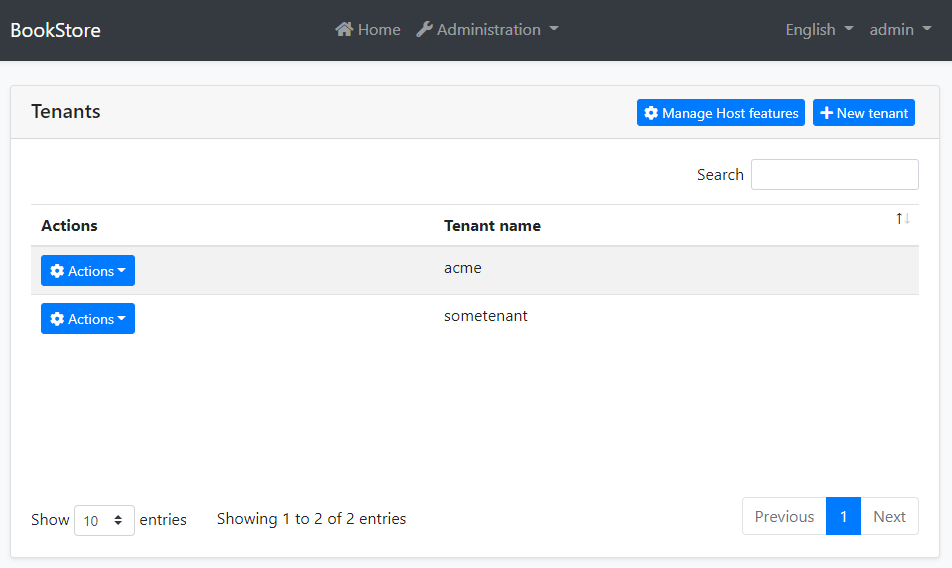
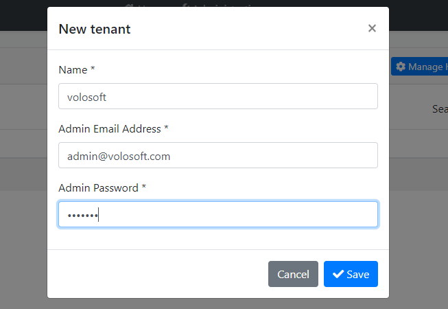
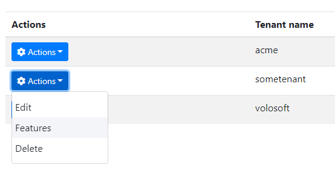

```json
//[doc-seo]
{
    "Description": "Explore the Tenant Management module in ABP Framework, enabling efficient multi-tenancy setup for your SaaS applications with easy tenant management."
}
```

# Tenant Management Module

[Multi-Tenancy](../framework/architecture/multi-tenancy) is one of the core features of ABP. It provides the fundamental infrastructure to build your own SaaS (Software-as-a-Service) solution. ABP's multi-tenancy system abstracts where your tenants are stored, by providing the `ITenantStore` interface. All you need to do is to implement that interface.

**The Tenant Management module is an implementation of the the `ITenantStore` interface. It stores tenants in a database. It also provides UI to manage your tenants and their [features](../framework/infrastructure/features.md).**

> Please **refer to the [Multi-Tenancy](../framework/architecture/multi-tenancy) documentation** to understand the multi-tenancy system of the ABP. This document focuses on the Tenant Management module.

## About the ABP SaaS Module

The [SaaS Module](https://abp.io/modules/Volo.Saas) is an alternative implementation of this module with more features and possibilities. It is distributed as a part of the [ABP](https://abp.io/) subscription.

## How to Install

This module comes as pre-installed (as NuGet/NPM packages) when you [create a new solution](https://abp.io/get-started) with the ABP. You can continue to use it as package and get updates easily, or you can include its source code into your solution (see `get-source` [CLI](../cli) command) to develop your custom module.

### The Source Code

The source code of this module can be accessed [here](https://github.com/abpframework/abp/tree/dev/modules/tenant-management). The source code is licensed with [MIT](https://choosealicense.com/licenses/mit/), so you can freely use and customize it.

## User Interface

This module adds "*Administration -> Tenant Management -> Tenants*" menu item to the main menu of the application, which opens the page shown below:



In this page, you see the all the tenants. You can create a new tenant as shown below:



In this modal;

* **Name**: The tenant name. Tenant names are normalized by the `ITenantNormalizer` service, so duplicate-name validation is case-insensitive by default. This validation is not a database uniqueness constraint. If you use subdomains for your tenants (like https://some-tenant.your-domain.com), this will be the subdomain name.
* **Admin Email Address**: Email address of the admin user for this tenant.
* **Admin Password**: The password of the admin user for this tenant.

When you click to *Actions* button near to a tenant, you will see the actions you can take:



### Managing the Tenant Features

The Features action opens a modal to enable/disable/set [features](../framework/infrastructure/features.md) for the related tenant. Here, an example modal:


### Managing the Host Features

*Manage Host features* button is used  to set features for the host side, if you use the features of your application also in the host side.

### Extending the Angular UI

For a standalone Angular application, register the Tenant Management menu configuration with `provideTenantManagementConfig` from the `@abp/ng.tenant-management/config` package:

```ts
import { ApplicationConfig } from '@angular/core';
import { provideTenantManagementConfig } from '@abp/ng.tenant-management/config';

export const appConfig: ApplicationConfig = {
  providers: [provideTenantManagementConfig()],
};
```

Lazy-load the module routes with `createRoutes` from `@abp/ng.tenant-management`:

```ts
import { Routes } from '@angular/router';

export const APP_ROUTES: Routes = [
  {
    path: 'tenant-management',
    loadChildren: () =>
      import('@abp/ng.tenant-management').then(m => m.createRoutes()),
  },
];
```

`createRoutes` accepts `entityActionContributors`, `toolbarActionContributors`, `entityPropContributors`, `createFormPropContributors` and `editFormPropContributors`. See the Angular guides for [entity actions](../framework/ui/angular/entity-action-extensions.md), [page toolbars](../framework/ui/angular/page-toolbar-extensions.md), [table columns](../framework/ui/angular/data-table-column-extensions.md) and [dynamic forms](../framework/ui/angular/dynamic-form-extensions.md).

The `eTenantManagementComponents.Tenants` key identifies the Tenants page for these contributors and for [component replacement](../framework/ui/angular/component-replacement.md).

## Distributed Events

`TenantAppService.CreateAsync` explicitly publishes a `TenantCreatedEto` after it persists a new tenant. Its `Properties` dictionary contains the `AdminEmail` and plain-text `AdminPassword` values supplied by the create request. Treat this event as sensitive: protect it in transit and at rest, and do not log or retain the complete payload. The Framework's EF Core migration/seeding and MongoDB seeding handlers can consume this event when they are configured by the application.

`TenantCreatedEto` and `EntityCreatedEto<TenantEto>` are separate distributed events. Enabling the automatic selector below publishes `EntityCreatedEto<TenantEto>` in addition to the explicitly published `TenantCreatedEto`. If you subscribe to both, ensure that non-idempotent handlers distinguish between them instead of treating them as the same notification.

The module also defines a `TenantEto` and pre-configures the mapping from `Tenant`. However, ABP does not automatically publish distributed entity-change events by default. Enable them in the application that owns Tenant Management if you want to subscribe to `EntityCreatedEto<TenantEto>`, `EntityUpdatedEto<TenantEto>` or `EntityDeletedEto<TenantEto>`:

```csharp
Configure<AbpDistributedEntityEventOptions>(options =>
{
    options.AutoEventSelectors.Add<Tenant>();
});
```

**Example: Subscribe to the opt-in entity-created event**

```cs
public class MyHandler :
    IDistributedEventHandler<EntityCreatedEto<TenantEto>>,
    ITransientDependency
{
    public async Task HandleEventAsync(EntityCreatedEto<TenantEto> eventData)
    {
        TenantEto tenant = eventData.Entity;
        // TODO: ...
    }
}
```

See the [Distributed Event Bus](../framework/infrastructure/event-bus/distributed) documentation for details of pre-defined entity events and automatic event selectors.

> Subscribing to distributed events is especially useful for distributed scenarios (like microservice architecture). If you are building a monolithic application, or listening for events in the same process that runs the Tenant Management module, subscribing to [local events](../framework/infrastructure/event-bus/local) can be more efficient and easier.

## Internals

This section can be used as a reference if you want to [customize](../framework/architecture/modularity/extending/customizing-application-modules-guide.md) this module without changing [its source code](https://github.com/abpframework/abp/tree/dev/modules/tenant-management).

### Domain Layer

#### Aggregates

* `Tenant`

#### Repositories

* `ITenantRepository`

#### Domain Services

* `TenantManager`

`TenantManager` normalizes names on create and rename, and uses `ITenantValidator` to reject duplicate normalized names during those operations.

### Application Layer

#### Application Services

* `TenantAppService`

In addition to tenant CRUD operations, `ITenantAppService` provides `GetDefaultConnectionStringAsync`, `UpdateDefaultConnectionStringAsync` and `DeleteDefaultConnectionStringAsync`. The HTTP API exposes these operations as `GET`, `PUT` and `DELETE` on `/api/multi-tenancy/tenants/{id}/default-connection-string`; the `PUT` request receives `defaultConnectionString` in the request body, as a JSON string with the `application/json` content type.

#### Permissions

- `AbpTenantManagement.Tenants`: Tenant management.
- `AbpTenantManagement.Tenants.Create`: Creating a new tenant.
- `AbpTenantManagement.Tenants.Update`: Editing an existing tenant.
- `AbpTenantManagement.Tenants.Delete`: Deleting an existing tenant.
- `AbpTenantManagement.Tenants.ManageFeatures`: Manage features of the tenants.
- `AbpTenantManagement.Tenants.ManageConnectionStrings`: Read, update or delete the default connection string of a tenant.

All Tenant Management permissions are available only on the host side.

### Database Configuration

`AbpTenantManagementDbProperties` exposes the common persistence configuration:

* `DbTablePrefix` is the prefix used for EF Core tables and MongoDB collections. It defaults to the common ABP database prefix.
* `DbSchema` is the schema used by EF Core. MongoDB does not use this value.
* `ConnectionStringName` is `AbpTenantManagement`. Define this named connection string to place the module in a separate database; otherwise, it falls back to the `Default` connection string.

See the [Connection Strings](../framework/fundamentals/connection-strings.md) documentation for named connection-string configuration and fallback behavior.

### Entity Framework Core Integration

* `TenantManagementDbContext` (implements `ITenantManagementDbContext`)

**Database Tables:**

* `AbpTenants`
* `AbpTenantConnectionStrings`

### MongoDB Integration

* `TenantManagementMongoDbContext` (implements `ITenantManagementMongoDbContext`)

**Database Collections:**

* `AbpTenants` (also includes the connection string)

## Notices

ABP supports the *database per tenant* approach. This module can store a tenant's default connection string through `ITenantAppService` and the corresponding HTTP API. Its built-in MVC, Blazor, MudBlazor and Angular UIs do not provide a connection-string management screen, and changing the stored value does not create or migrate the tenant database.

You can build your own UI and migration workflow on top of the application/API contract, or use the [ABP SaaS Module](./saas.md), which provides connection-string management and additional business features.

## See Also

* [Multi-Tenancy](../framework/architecture/multi-tenancy)
* [ABP SaaS Module](./saas.md)
