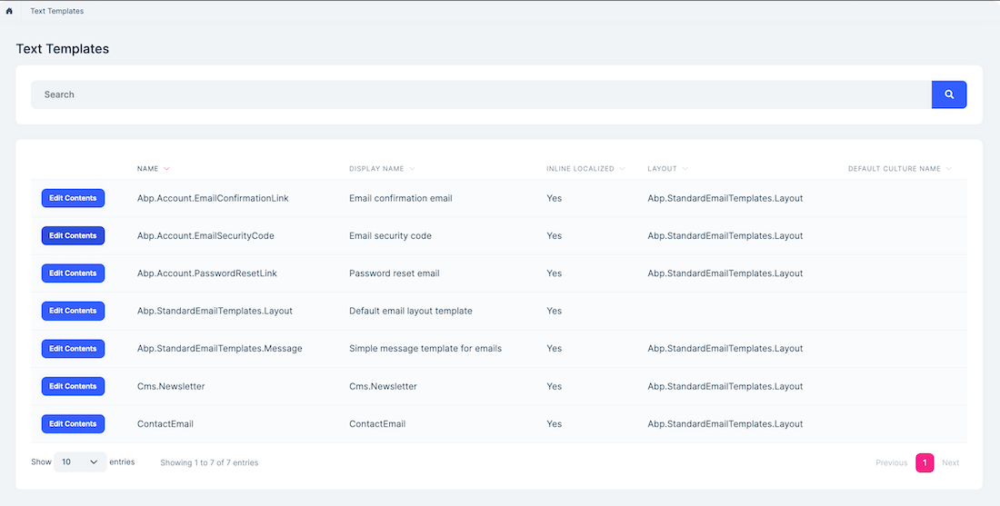
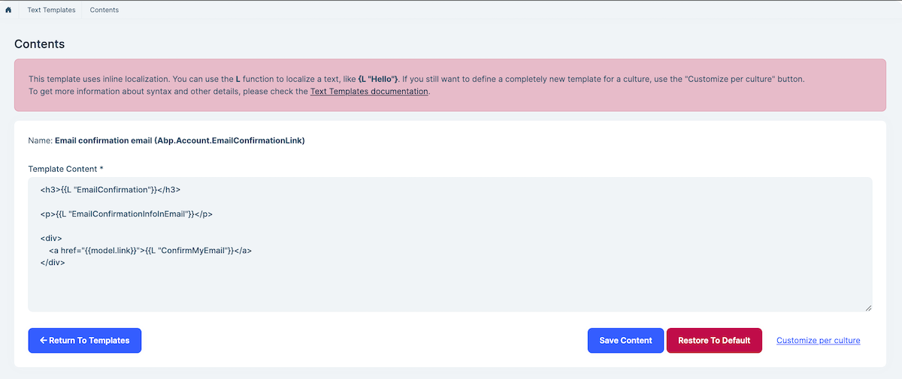
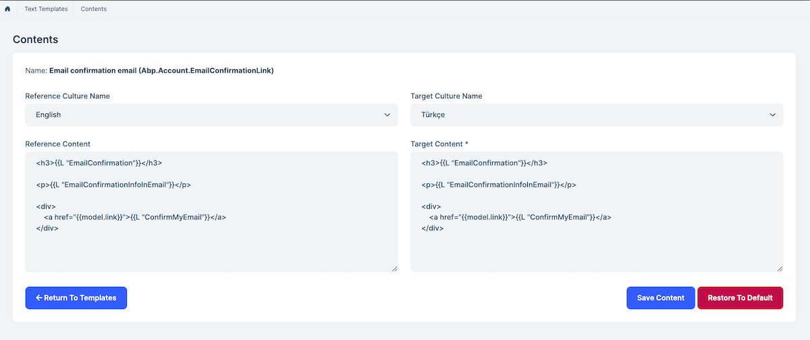

# Text Template Management Module (Pro)

> You must have an ABP Team or a higher license to use this module.

This module is used to store and edit template contents for [the text templating system](../framework/infrastructure/text-templating/index.md) of the ABP. So, you may need to understand it to better understand the purpose of this module.

There are different use cases of the text templating system. For example, [the Account Module](account.md) is using it to define templates for sending emails when it needs to send emails to users (like sending "password reset link" email). This module provides UI to easily edit these email templates.

See [the module description page](https://abp.io/modules/Volo.TextTemplateManagement) for an overview of the module features.

## How to Install

Text Template Management module is pre-installed in [the startup templates](../solution-templates). So, no need to manually install it.

### Existing Solutions

If you want to add the **Text Template Management** module to your existing solution, you can use the ABP CLI `add-module` command:

```bash
abp add-module Volo.TextTemplateManagement
```

## Packages

This module follows the [module development best practices guide](../framework/architecture/best-practices) and consists of several NuGet and NPM packages. See the guide if you want to understand the packages and relations between them.

You can visit [Text Template Management module package list page](https://abp.io/packages?moduleName=Volo.TextTemplateManagement) to see list of packages related with this module.

## User Interface

### Menu Items

Text Template Management module adds the following items to the "Main" menu, under the "Administration" menu item:

* **Text Templates**: List, view and filter text templates.

`TextTemplateManagementMainMenuNames` class has the constants for the menu item names.

### Pages

#### Text Templates

Text Templates page is used to view the list of templates defined in the application.



Click to the `Actions -> Edit Contents` to edit content for a template. There are two types of UI to edit a template content:

##### Editing Content for Inline Localized Templates

This kind of templates uses the `L` function to perform inline localization. In this way, it is easier to manage the template for different cultures.



##### Editing Contents for Culture-Specific Templates

This kind of templates provides different content for each culture. In this way, you can define a completely different content for a specific culture.




## Configure `TextTemplateManagementOptions`

`TextTemplateManagementOptions` can be used to configure the module. You can use the below code to configure it in the ConfigureServices method of your module (eg: BookStoreApplicationModule).

```csharp
Configure<TextTemplateManagementOptions>(options =>
{
	options.MinimumCacheDuration = TimeSpan.FromHours(1);
});
```

## Caching

[`DatabaseTemplateContentContributor`](#DatabaseTemplateContentContributor) caches template contents to increase performance. 

You can get cache store by injecting `IDistributedCache<string, TemplateContentCacheKey>`.

For more information, please check the [Caching](../framework/fundamentals/caching.md) guide.

### TemplateContentCacheKey

`TemplateContentCacheKey` is a special cache key for template contents.

It has `TemplateDefinitionName` and `Culture` properties.

## Data Seed

This module doesn't seed any data.

## Internals

### Domain Layer

#### Aggregates

This module follows the [Entity Best Practices & Conventions](../framework/architecture/best-practices/entities.md) guide.

##### TextTemplateContent

* `TextTemplateContent` (aggregate root): Represents a content of text template.

#### Repositories

This module follows the [Repository Best Practices & Conventions](../framework/architecture/best-practices/repositories.md) guide.

Following custom repositories are defined for this module:

* `ITextTemplateContentRepository`

#### Domain Services

This module follows the [Domain Services Best Practices & Conventions](../framework/architecture/best-practices/domain-services.md) guide.

##### DatabaseTemplateContentContributor

`DatabaseTemplateContentContributor` is used by `ITemplateContentProvider` to get template contents that stored in DB and Cache.

### Settings

This module doesn't define any setting.

### Application Layer

#### Application Services

* `TemplateDefinitionAppService` (implements `ITemplateDefinitionAppService`): Implements the use cases of the text template management UI.
* `TemplateContentAppService` (implements `ITemplateContentAppService`): Implements the use cases of the text template management UI.

### Database Providers

#### Common

##### Table/Collection Prefix & Schema

All tables/collections use the `Abp` prefix by default. Set static properties on the `TextTemplateManagementDbProperties` class if you need to change the table prefix or set a schema name (if supported by your database provider).

##### Connection String

This module uses `TextTemplateManagement` for the connection string name. If you don't define a connection string with this name, it fallbacks to the `Default` connection string.

See the [connection strings](../framework/fundamentals/connection-strings.md) documentation for details.

#### Entity Framework Core

##### Tables

* **AbpTextTemplateContents**

#### MongoDB

##### Collections

* **AbpTextTemplateContents**

### Permissions

See the `TextTemplateManagementPermissions` class members for all permissions defined for this module.


### Angular UI

#### Installation

In order to configure the application to use the `TextTemplateManagementModule`, you first need to import `TextTemplateManagementConfigModule` from `@volo/abp.ng.text-template-management/config` to root module. `TextTemplateManagementConfigModule` has a static `forRoot` method which you should call for a proper configuration.

```js
// app.module.ts
import { TextTemplateManagementConfigModule } from '@volo/abp.ng.text-template-management/config';

@NgModule({
  imports: [
    // other imports
    TextTemplateManagementConfigModule.forRoot(),
    // other imports
  ],
  // ...
})
export class AppModule {}
```

The `TextTemplateManagementModule` should be imported and lazy-loaded in your routing module. It has a static `forLazy` method for configuration. Available options are listed below. It is available for import from `@volo/abp.ng.text-template-management`.

```js
// app-routing.module.ts
const routes: Routes = [
  // other route definitions
  {
    path: 'text-template-management',
    loadChildren: () =>
      import('@volo/abp.ng.text-template-management').then(m => m.TextTemplateManagementModule.forLazy(/* options here */)),
  },
];

@NgModule(/* AppRoutingModule metadata */)
export class AppRoutingModule {}
```

> If you have generated your project via the startup template, you do not have to do anything, because it already has both `TextTemplateManagementConfigModule` and `TextTemplateManagementModule`.

<h4 id="h-text-template-management-module-options">Options</h4>

You can modify the look and behavior of the module pages by passing the following options to `TextTemplateManagementModule.forLazy` static method:

- **entityActionContributors:** Changes grid actions. Please check [Entity Action Extensions for Angular](../framework/ui/angular/entity-action-extensions.md) for details.
- **toolbarActionContributors:** Changes page toolbar. Please check [Page Toolbar Extensions for Angular](../framework/ui/angular/page-toolbar-extensions.md) for details.
- **entityPropContributors:** Changes table columns. Please check [Data Table Column Extensions for Angular](../framework/ui/angular/data-table-column-extensions.md) for details.


#### Services / Models

Text Template Management module services and models are generated via `generate-proxy` command of the [ABP CLI](../cli). If you need the module's proxies, you can run the following command in the Angular project directory:

```bash
abp generate-proxy --module textTemplateManagement
```


#### Replaceable Components

`eTextTemplateManagementComponents` enum provides all replaceable component keys. It is available for import from `@volo/abp.ng.text-template-management`.

Please check [Component Replacement document](../framework/ui/angular/component-replacement.md) for details.


#### Remote Endpoint URL

The Text Template Management module remote endpoint URL can be configured in the environment files.

```js
export const environment = {
  // other configurations
  apis: {
    default: {
      url: 'default url here',
    },
    TextTemplateManagement: {
      url: 'Text Template Management remote url here'
    }
    // other api configurations
  },
};
```

The Text Template Management module remote URL configuration shown above is optional. If you don't set a URL, the `default.url` will be used as fallback.


## Distributed Events

This module doesn't define any additional distributed event. See the [standard distributed events](../framework/infrastructure/event-bus/distributed).
