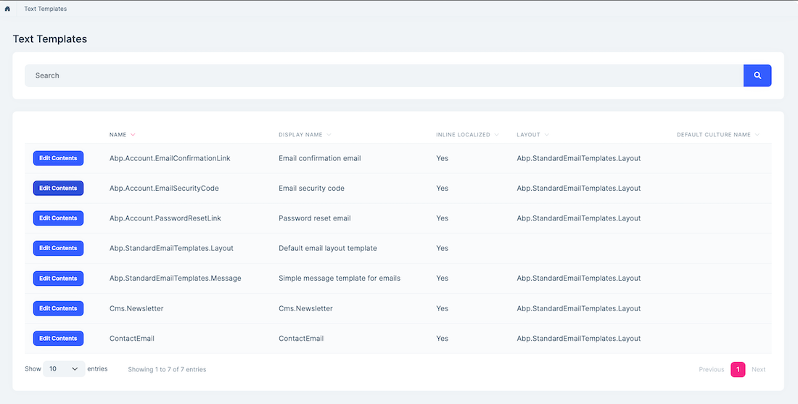
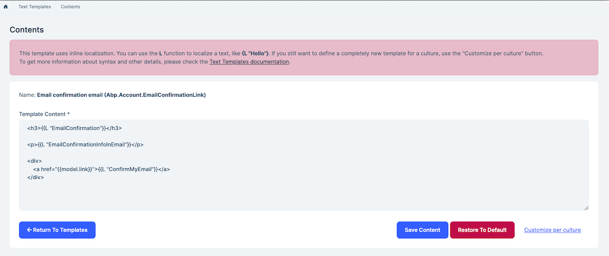
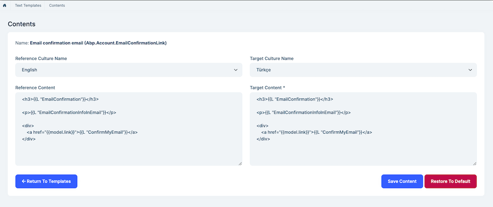

```json
//[doc-seo]
{
    "Description": "Manage and edit text templates effortlessly with the ABP Framework's Text Template Management Module, enhancing your application's communication features."
}
```

# Text Template Management Module (Pro)

> You must have an [ABP Team or a higher license](https://abp.io/pricing) to use this module.

This module stores and lets users edit content for ABP's [text templating system](../framework/infrastructure/text-templating/index.md). Read the text templating documentation to understand how applications define and render templates.

Applications use text templates for many purposes. For example, the [Account Module](account.md) defines templates for emails such as password reset messages. This module provides a UI for editing those templates.

See [the module description page](https://abp.io/modules/Volo.TextTemplateManagement) for an overview of the module features.

The `TextManagement.Enable` feature is enabled by default. The module's permissions, application services and menu items require this feature.

## How to Install

The Text Template Management module is pre-installed in [the startup templates](../solution-templates), so you do not need to install it manually.

### Existing Solutions

To add the **Text Template Management** module to an existing solution, use the ABP CLI `add-module` command:

```bash
abp add-module Volo.TextTemplateManagement
```

## Packages

This module follows the [module development best practices guide](../framework/architecture/best-practices) and consists of several NuGet and NPM packages. See the guide if you want to understand the packages and relations between them.

Visit the [Text Template Management module package list](https://abp.io/packages?moduleName=Volo.TextTemplateManagement) to see the packages related to this module.

## User Interface

### Menu Items

Text Template Management module adds the following items to the "Main" menu, under the "Administration" menu item:

* **Text Templates**: List, view and filter text templates.

`TextTemplateManagementMainMenuNames` class has the constants for the menu item names.

### Pages

#### Text Templates

The Text Templates page lists the templates defined in the application.



Click `Actions > Edit Contents` to edit a template. The module provides two editors:

##### Editing Content for Inline Localized Templates

This kind of templates uses the `L` function to perform inline localization. In this way, it is easier to manage the template for different cultures.



##### Editing Contents for Culture-Specific Templates

This kind of templates provides different content for each culture. In this way, you can define a completely different content for a specific culture.



Saved content is an override for the current tenant context. The host and each tenant have separate overrides; a tenant doesn't inherit an override saved in the host context. If no database override exists, the text templating system continues with the configured content contributors, such as the template's virtual-file content.

For a static template, the framework content provider first tries the requested regional culture and then its parent culture. An inline-localized template then falls back to its culture-independent content, while a culture-specific template falls back to its configured default culture.

Dynamic definitions use a different lookup order. When `IsDynamicTemplateStoreEnabled` is enabled and a definition exists only in the database, `DatabaseTemplateContentContributor` tries the requested culture, the definition's default culture (or `en` when it has no default), and then culture-independent content. This lookup can return content before the framework tries the requested culture's parent. **Restore to default** deletes the current tenant context's override for the selected template and culture, after which the applicable fallback path is used again.

### UI Extension Points

The MVC UI uses `textTemplateManagement.textDefinition` for both [entity action extensions](../framework/ui/mvc-razor-pages/entity-action-extensions.md) and [data table column extensions](../framework/ui/mvc-razor-pages/data-table-column-extensions.md).

The Blazorise UI exposes entity actions and table columns through the `TextTemplateManagement` page component type. See the Blazor [entity action](../framework/ui/blazor/entity-action-extensions.md) and [data table column](../framework/ui/blazor/data-table-column-extensions.md) extension documents.


## Configure `TextTemplateManagementOptions`

`TextTemplateManagementOptions` can be used to configure the module. The following example shows the default values:

```csharp
Configure<TextTemplateManagementOptions>(options =>
{
    options.MinimumCacheDuration = TimeSpan.FromHours(1);
    options.SaveStaticTemplatesToDatabase = true;
    options.IsDynamicTemplateStoreEnabled = false;
});
```

| Property | Description |
| --- | --- |
| `MinimumCacheDuration` | Sets the sliding expiration of cached template contents. The default is one hour. |
| `SaveStaticTemplatesToDatabase` | Starts synchronizing static template definitions and their virtual-file contents to the database during application initialization. The default is `true`. |
| `IsDynamicTemplateStoreEnabled` | Enables the database-backed dynamic template-definition store. The default is `false`. Static definitions take precedence when static and dynamic definitions share the same name. |

Both `SaveStaticTemplatesToDatabase` and `IsDynamicTemplateStoreEnabled` are disabled automatically in a data-migration environment. Disabling static synchronization doesn't disable saved content overrides.

## Caching

`DatabaseTemplateContentContributor` caches template contents to increase performance. Cache entries use the `MinimumCacheDuration` sliding expiration.

You can access the cache by injecting `IDistributedCache<string, TemplateContentCacheKey>`. `TemplateContentCacheKey` contains the template definition name and culture; ABP's distributed cache key normalization also isolates entries by the current tenant context. The application service removes the related cache entry when it persists a new override or deletes one through **Restore to default**, so an application restart isn't required.

For more information, please check the [Caching](../framework/fundamentals/caching.md) guide.

### TemplateContentCacheKey

`TemplateContentCacheKey` is a special cache key for template contents.

It has `TemplateDefinitionName` and `Culture` properties.

## Data Seed

This module doesn't define an `IDataSeedContributor`. The optional startup synchronization controlled by `SaveStaticTemplatesToDatabase` is separate from the data seed system.

## Internals

### Domain Layer

#### Entities and Aggregate Roots

This module follows the [Entity Best Practices & Conventions](../framework/architecture/best-practices/entities.md) guide.

##### Domain Model Types

* `TextTemplateContent` (aggregate root): Represents a tenant-aware template content override.
* `TextTemplateDefinitionRecord` (aggregate root): Stores synchronized template definition metadata.
* `TextTemplateDefinitionContentRecord` (entity): Stores a synchronized definition's file content.

#### Repositories

This module follows the [Repository Best Practices & Conventions](../framework/architecture/best-practices/repositories.md) guide.

The following custom repositories are defined for this module:

* `ITextTemplateContentRepository`
* `ITextTemplateDefinitionRecordRepository`
* `ITextTemplateDefinitionContentRecordRepository`

#### Template Content Contributor

`DatabaseTemplateContentContributor` is an `ITemplateContentContributor` used by `ITemplateContentProvider` to read tenant-aware content overrides and, when the dynamic definition store is enabled, synchronized definition content from the database and cache.

### Settings

This module doesn't define any setting.

### Application Layer

#### Application Services

* `TemplateDefinitionAppService` (implements `ITemplateDefinitionAppService`): Implements the use cases of the text template management UI.
* `TemplateContentAppService` (implements `ITemplateContentAppService`): Implements the use cases of the text template management UI.

### Database Providers

#### Common

##### Table/Collection Prefix & Schema

All tables/collections use the `Abp` prefix by default. Set static properties on the `TextTemplateManagementDbProperties` class if you need to change the table prefix or set a schema name (if supported by your database provider).

##### Connection String

This module uses `TextTemplateManagement` as the connection string name. If you don't define a connection string with this name, it falls back to the `Default` connection string.

See the [connection strings](../framework/fundamentals/connection-strings.md) documentation for details.

#### Entity Framework Core

##### Tables

* **AbpTextTemplateContents**
* **AbpTextTemplateDefinitionRecords**
* **AbpTextTemplateDefinitionContentRecords**

#### MongoDB

##### Collections

* **AbpTextTemplates**
* **AbpTextTemplateDefinitionRecords**
* **AbpTextTemplateDefinitionContentRecords**

### Permissions

All permissions require the `TextManagement.Enable` feature.

The module defines the following permissions:

| Permission | Purpose |
| --- | --- |
| `TextTemplateManagement.TextTemplates` | View and filter template definitions and read their contents. |
| `TextTemplateManagement.TextTemplates.EditContents` | Edit and restore template content. |
| `TextTemplateManagement.TextTemplates.EditNonSandboxedContents` | Additionally authorize editing templates rendered by a non-sandboxed engine, such as Razor. |

Whether a template is sandboxed is determined by `ITemplateRenderingEngine.IsSandboxed` on the engine that renders it. An unknown, unregistered or unresolved default engine is treated as non-sandboxed. Editing a non-sandboxed template requires **both** `EditContents` and `EditNonSandboxedContents`.

When the standard Permission Management data seeder runs, it grants all role-applicable permissions to the `admin` role. This includes `EditNonSandboxedContents`. If the administrators in your application shouldn't be allowed to edit executable template content, customize the seeding policy and remove any existing grant.

The Text Template Management UI surfaces this distinction:

- A warning banner is rendered above the editor for non-sandboxed templates.
- The save and restore buttons are disabled when the current user lacks `EditNonSandboxedContents` for a non-sandboxed template.

> Treat `EditNonSandboxedContents` as equivalent to granting shell access to the application server. Only assign it to fully trusted developers or operators.


### Angular UI

#### Installation

To configure the application to use the text template management module, import `provideTextTemplateManagementConfig` from `@volo/abp.ng.text-template-management/config` and add it to the root `providers` array.

```ts
// app.config.ts
import { provideTextTemplateManagementConfig } from '@volo/abp.ng.text-template-management/config';

export const appConfig: ApplicationConfig = {
  providers: [
    // ...
    provideTextTemplateManagementConfig(),
  ],
};
```

The text template management module should be imported and lazy-loaded in your routing array. It exports a `createRoutes` function from `@volo/abp.ng.text-template-management`. Available options are listed below.

```ts
// app.routes.ts
const APP_ROUTES: Routes = [
  // ...
  {
    path: 'text-template-management',
    loadChildren: () =>
      import('@volo/abp.ng.text-template-management').then(c => c.createRoutes()),
  },
];
```

> Startup templates already include both settings, so no additional configuration is needed.

<h4 id="h-text-template-management-module-options">Options</h4>

You can modify the look and behavior of the module pages by passing the following options to the `createRoutes` function:

- **entityActionContributors:** Changes grid actions. Please check [Entity Action Extensions for Angular](../framework/ui/angular/entity-action-extensions.md) for details.
- **toolbarActionContributors:** Changes page toolbar. Please check [Page Toolbar Extensions for Angular](../framework/ui/angular/page-toolbar-extensions.md) for details.
- **entityPropContributors:** Changes table columns. Please check [Data Table Column Extensions for Angular](../framework/ui/angular/data-table-column-extensions.md) for details.


#### Services / Models

The Text Template Management module's services and models are generated by the [ABP CLI](../cli) `generate-proxy` command. To generate the module's proxies, run the following command in the Angular project directory:

```bash
abp generate-proxy --module textTemplateManagement
```


#### Replaceable Components

`eTextTemplateManagementComponents` enum provides all replaceable component keys. It is available for import from `@volo/abp.ng.text-template-management`.

The available keys are:

* `eTextTemplateManagementComponents.TextTemplates`
* `eTextTemplateManagementComponents.TemplateContents`
* `eTextTemplateManagementComponents.InlineTemplateContent`

Please check [Component Replacement document](../framework/ui/angular/component-replacement.md) for details.


#### Remote Endpoint URL

The Text Template Management module remote endpoint URL can be configured in the environment files.

```ts
export const environment = {
  // other configurations
  apis: {
    default: {
      url: 'default url here',
    },
    TextTemplateManagement: {
      url: 'Text Template Management remote url here',
    },
    // other api configurations
  },
};
```

The Text Template Management module's remote URL configuration is optional. If you don't set a URL, `default.url` is used as a fallback.


## Distributed Events

This module doesn't define any additional distributed event. See the [standard distributed events](../framework/infrastructure/event-bus/distributed).
