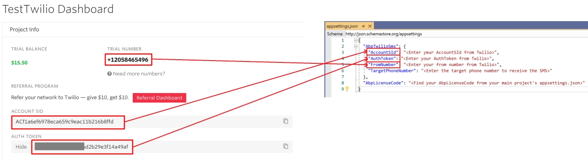

# Twilio SMS Module (Pro)

> You must have an ABP Team or a higher license to use this module.

[Twilio](https://www.twilio.com) is a cloud communication provider that makes it easy to send and receive SMS. ABP Twilio SMS module implements the SMS sending feature of `ISmsSender` interface with Twilio.

See [the module description page](https://abp.io/modules/Volo.Abp.Sms.Twilio) for an overview of the module features.

## Installation

It is suggested to use the [ABP CLI](../cli) to install this package.

Open a command line window in the folder of the project (.csproj file) and type the following command:

```bash
abp add-package Volo.Abp.Sms.Twilio
```

You can also check detailed installation guide [here](https://abp.io/package-detail/Volo.Abp.Sms.Twilio).

## Packages

This module follows the [module development best practices guide](../framework/architecture/best-practices) and depends on the below NuGet packages. See the guide if you want to understand the packages and relations between them.

You can visit [Twilio SMS module package list page](https://abp.io/packages?moduleName=Volo.Abp.Sms.Twilio) to see list of packages related with this module.

## Configuration

You can configure `Twilio SMS` module in several ways. It uses the [options pattern](https://docs.microsoft.com/en-us/aspnet/core/fundamentals/configuration/options) in ASP.NET Core.

### Configure by AbpTwilioSmsOptions

`AbpTwilioSmsOptions` can be used to configure the module. You can use the below code to configure it in the `ConfigureServices` method of your [module](../framework/architecture/modularity/basics.md) (eg: `BookStoreApplicationModule`).

```csharp
Configure<AbpTwilioSmsOptions>(options =>
{
	options.AccountSId = "***";
	options.AuthToken = "***";
	options.FromNumber = "***";
});
```

`AbpTwilioSmsOptions` properties:

- `AccountSId` : This is a security key of Twilio. You can get your `AccountSId` from [Twilio Console](https://www.twilio.com/console.).
- `AuthToken`: This is a security key of Twilio. You can get your `AuthToken` from [Twilio Console](https://www.twilio.com/console.).
- `FromNumber`: This is the sender number of SMS. You can get your `FromNumber` from [Twilio Console](https://www.twilio.com/console.).

Twilio allows you to create a free trial to test the SMS provider. Create an account https://www.twilio.com/try-twilio and get your credentials to test it.

### Configure by appsettings.json

You can configure the module with the `appsettings.json` file of the final project (eg: `Acme.BookStore.Web`)

**appsettings.json**:

```json
{
	"AbpTwilioSms": {
		"AccountSId": "<Enter your AccountSId from Twilio>",
		"AuthToken": "<Enter your AuthToken from Twilio>",
		"FromNumber": "<Enter your from number from Twilio>"
	}
}
```

Twilio allows you to create a free trial to send test SMS. Get your Twilio `AccountSId`, `AuthToken`, `FromNumberv` values from https://www.twilio.com/try-twilio. Enter these values in your `appsettings.json` or configure it via `AbpTwilioSmsOptions`.



## Sending SMS

See [SMS Sending](../framework/infrastructure/sms-sending.md) document of the ABP.