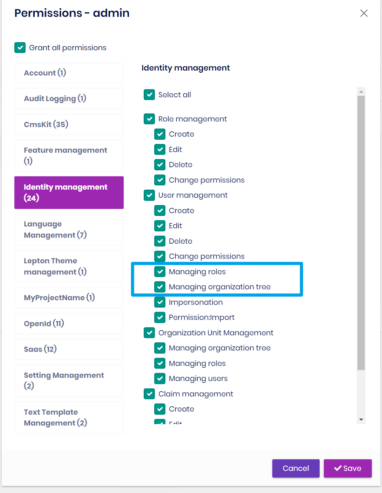

# ABP Version 6.0 Migration Guide

This document is a guide for upgrading ABP v5.3 solutions to ABP v6.0. There is a change in this version that may affect your applications, please read it carefully and apply the necessary changes to your application.

## Open-Source (Framework)

If you are using one of the open-source startup templates, then you can check the following sections to apply the related breaking changes:

### The IsActive property is Added

`IsActive` property is added to `IUserData`. This property is set to **true** by default. **Cmskit** and **Blog** modules are affected by this change. You need to add a new migration to your existing application if you are using any of these modules. Please see [#11417](https://github.com/abpframework/abp/pull/11417) for more info.

### Default behavior change in MultiTenancyMiddlewareErrorPageBuilder

If you have customized the `MultiTenancyMiddlewareErrorPageBuilder` of the `AbpMultiTenancyOptions`, the pipeline now returns **true** to stop the pipeline as the default behavior. See [AbpMultiTenancyOptions: Handle inactive and non-existent tenants](https://github.com/abpframework/abp/blob/dev/docs/en/Multi-Tenancy.md#abpmultitenancyoptions-handle-inactive-and-non-existent-tenants) for more info.

### Migrating to LeptonX Lite

LeptonX Lite is now being introduced and you can follow the guides below to migrate your existing applications:

- [Migrating to LeptonX MVC UI](../../ui-themes/lepton-x-lite/asp-net-core.md)
- [Migrating to LeptonX Angular UI](../../ui-themes/lepton-x-lite/angular.md)
- [Migrating to LeptonX Blazor UI](../../ui-themes/lepton-x-lite/blazor.md)

### Migrating to OpenIddict

After the [announcement of plan to replace the IdentityServer](https://github.com/abpframework/abp/issues/11989), we have successfully implemented [Openiddict](https://github.com/openiddict/openiddict-core) as a replacement for IdentityServer4 as an OpenID-Provider.

You can follow the [IdentityServer to OpenIddict Step by Step Guide](openiddict-step-by-step.md) for migrating your existing application in detail with a sample project.

## PRO

> Please check the **Open-Source (Framework)** section before reading this section. The listed topics might affect your application and you might need to take care of them.

If you are a paid-license owner and using the ABP's paid version, then please follow the following sections to get informed about the breaking changes and apply the necessary ones:

### Renamed UrlSortingMiddleware

There was a typo in **CMS.Kit.Pro.Public.Web** module. UrlSortingMiddleware is renamed to UrlshortingMiddleware. 

### Refining User Edit Permission

We have made some improvements in `Identity.Pro Module` to avoid users changing their roles to get more permissions. By default, the admin user will not have these new permissions. See the **Identity PRO Changes** section down below for more info.

### Introducing Language Management NPM package

The projects using the **Language Management module and not using Lepton theme** should add this new package in order to prevent `flag-icons.min.css cannot be found` in error. 

**package.json**:

```json
"dependencies": {
    "@volo/language-management": "^6.0.0"
}
```

> This was not a problem before since Lepton Theme had already flag-icon dependency.

### Migrating to LeptonX

LeptonX is now being introduced and you can follow the guides below to migrate your existing applications:

- [Migrating to LeptonX MVC UI](../../ui-themes/lepton-x/mvc.md)
- [Migrating to LeptonX Angular UI](../../ui-themes/lepton-x/angular.md)
- [Migrating to LeptonX Blazor UI](../../ui-themes/lepton-x/blazor.md)

### Migrating to OpenIdDict

You can follow the [IdentityServer to OpenIddict Step by Step Guide](pro/openiddict-step-by-step.md) for migrating your existing application in detail with sample projects.

For the microservice template, check the [Migrating Microservice Application to OpenIddict Guide](pro/openiddict-microservice.md).

### Identity PRO Changes

We created two new permissions in 6.0 to manage a user's `roles` and `organizations`:

```cs
IdentityPermissions.Users.ManageRoles
IdentityPermissions.Users.ManageOU
```
The admin's user does not have these permissions after the existing application is upgraded to 6.0, please remember to grant permissions to the relevant users.

