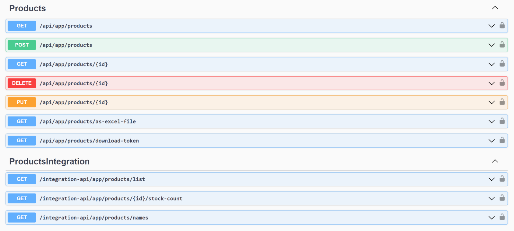

# ABP Version 8.0 Migration Guide

This document is a guide for upgrading ABP v7.x solutions to ABP v8.0. There are some changes in this version that may affect your applications, please read it carefully and apply the necessary changes to your application.

> ABP upgraded to .NET 8.0, so you need to move your solutions to .NET 8.0 if you want to use the ABP 8.0. You can check the [Migrate from ASP.NET Core 7.0 to 8.0](https://learn.microsoft.com/en-us/aspnet/core/migration/70-80) documentation.

## Open-Source (Framework)

### Upgraded to OpenIddict to 5.0.0

The 5.0 release of OpenIddict is a major release that introduces breaking changes.

See [OpenIddict 4.x to 5.x Migration Guide](openiddict4-to-5.md) for more information.

### Injected the `IDistributedEventBus` Dependency into the `IdentityUserManager`

In this version, `IDistributedEventBus` service has been injected to the `IdentityUserManager` service, to publish a distributed event when the email or username is changed for a user, this was needed because sometimes there may be scenarios where the old email/username is needed for the synchronization purposes. 

Therefore, you might need to update the `IdentityUserManager`'s constructor if you have overridden the class and are using it. 

> See the issue for more information: https://github.com/abpframework/abp/pull/17990

### Updated Method Signatures in the Bundling System

In this version, ABP introduced the CDN support for bundling. During the development, we have made some improvements on the bundling system and changed some method signatures.

See https://github.com/abpframework/abp/issues/17864 for more information.

### Replaced `IdentityUserLookupAppService` with the `IIdentityUserIntegrationService`

[Integration Services](../../framework/api-development/integration-services.md) are built for module-to-module (or microservice-to-microservice) communication rather than consumed from a UI or a client application as [Application Services](../../framework/architecture/domain-driven-design/application-services.md) are intended to do.

In that regard, we are discarding the `IIdentityUserLookupAppService` in the Identity Module and moving its functionality to the `IIdentityUserIntegrationService`. Therefore, if you have used that application service directly, use the integration service (`IIdentityUserIntegrationService`) instead. `IIdentityUserLookupAppService` will be removed in thes next versions, so you may need to create a similar service in your application.

> Notice that integration services have no authorization and are not exposed as HTTP API by default.
Also, if you have overridden the `IdentityUserLookupAppService` and `IdentityUserIntegrationService` classes in your application, you should update these classes' constructors as follows:

*IdentityUserLookupAppService.cs*
```csharp
    public IdentityUserLookupAppService(IIdentityUserIntegrationService identityUserIntegrationService)
    {
        IdentityUserIntegrationService = identityUserIntegrationService;
    }
```

*IdentityUserIntegrationService.cs*

```diff
    public IdentityUserIntegrationService(
        IUserRoleFinder userRoleFinder,
+       IdentityUserRepositoryExternalUserLookupServiceProvider userLookupServiceProvider)
    {
        UserRoleFinder = userRoleFinder;
+       UserLookupServiceProvider = userLookupServiceProvider;
    }
```

### MongoDB Event Bus Enhancements

In this version, we have made some enhancements in the transactional inbox/outbox pattern implementation and defined two new methods: `ConfigureEventInbox` and `ConfigureEventOutbox` for MongoDB Event Box collections.

If you call one of these methods in your DbContext class, then this introduces a breaking-change because if you do it, MongoDB collection names will be changed. Therefore, it should be carefully done since existing (non-processed) event records are not automatically moved to new collection and they will be lost. Existing applications with event records should rename the collection manually while deploying their solutions.

See https://github.com/abpframework/abp/pull/17723 for more information. Also, check the documentation for the related configurations: [Distributed Event Bus](../../framework/infrastructure/event-bus/distributed)

### Moved the CMS Kit Pages Feature's Routing to a `DynamicRouteValueTransformer`

In this version, we have made some improvements in the [CMS Kit's Pages Feature](../../modules/cms-kit/pages.md), such as moving the routing logic to a `DynamicRouteValueTransformer` and etc...

These enhancements led to some breaking changes as listed below that should be taken care of:

* Page routing has been moved to **DynamicRouteValueTransformer**. If you use `{**slug}` pattern in your routing, it might conflict with new CMS Kit routing.
* `PageConsts.UrlPrefix` has been removed, instead, the default prefix is *pages* for now. Still `/pages/{slug}` route works for backward compatibility alongside with `/{slug}` route. 

* **Endpoints changed:**  
  * `api/cms-kit-public/pages/{slug}` endpoint is changed to `api/cms-kit-public/pages/by-slug?slug={slug}`. Now multiple level of page URLs can be used and `/` characters will be transferred as URL Encoded in querysting to the HTTP API.
  * `api/cms-kit-public/pages` changed to `api/cms-kit-public/pages/home`

>_CmsKit Client Proxies are updated. If you don't send a **custom request** to this endpoint, **you don't need to take an action**_

### Added Integration Postfix for Auto Controllers

With this version on, the `Integration` suffix from controller names while generating [auto controllers](../../framework/api-development/auto-controllers.md) are not going to be removed, to differ the integration services from application services in the OpenAPI specification:



> This should not affect most of the applications since you normally do not depend on the controller names in the client side.

See https://github.com/abpframework/abp/issues/17625 for more information (how to preserve the existing behaviour, etc...).

### Revised the reCaptcha Generator for CMS Kit's Comment Feature

In this version, we have made improvements on the [CMS Kit's Comment Feature](../../modules/cms-kit/comments.md) and revised the reCaptcha generation process, and made a performance improvement.

This introduced some breaking changes that you should aware of:

* Lifetime of the `SimpleMathsCaptchaGenerator` changed from singleton to transient,
* Changed method signatures for `SimpleMathsCaptchaGenerator` class. (all of its methods are now async)

If you haven't override the comment view component, then you don't need to make any changes, however if you have overriden the component and used the `SimpleMathsCaptchaGenerator` class, then you should make the required changes as described.

### Disabled Logging for `HEAD` HTTP Methods

HTTP GET requests should not make any change in the database normally and audit log system of ABP doesn't save audit log objects for GET requests by default. You can configure the `AbpAuditingOptions` and set the `IsEnabledForGetRequests` to **true** if you want to record _GET_ requests as described in [the documentation](../../framework/infrastructure/audit-logging.md).

Prior to this version, only the _GET_ requests were not saved as audit logs. From this version on, also the _HEAD_ requests will not be saved as audit logs, if the `IsEnabledForGetRequests` explicitly set as **true**.

You don't need to make any changes related to that, however it's important to know this change.

### Obsolete the `AbpAspNetCoreIntegratedTestBase` Class

In this version, `AbpAspNetCoreAsyncIntegratedTestBase` class has been set as `Obsolete` and it's recommended to use `AbpWebApplicationFactoryIntegratedTest` instead.

### Use NoTracking for Readonly Repositories for EF Core 

In this version, ABP provides read-only [repository](../../framework/architecture/domain-driven-design/repositories.md) interfaces (`IReadOnlyRepository<...>` or `IReadOnlyBasicRepository<...>`) to explicitly indicate that your purpose is to query data, but not change it. If so, you can inject these interfaces into your services.

Entity Framework Core read-only repository implementation uses [EF Core's No-Tracking feature](https://learn.microsoft.com/en-us/ef/core/querying/tracking#no-tracking-queries). That means the entities returned from the repository will not be tracked by the EF Core [change tracker](https://learn.microsoft.com/en-us/ef/core/change-tracking/), because it is expected that you won't update entities queried from a read-only repository.

> This behavior works only if the repository object is injected with one of the read-only repository interfaces (`IReadOnlyRepository<...>` or `IReadOnlyBasicRepository<...>`). It won't work if you have injected a standard repository (e.g. `IRepository<...>`) then casted it to a read-only repository interface.

> See the issue for more information: https://github.com/abpframework/abp/pull/17421

### Use `IAbpDaprClientFactory` to Obtain `DaprClient`

From this version on, instead of injecting the `DaprClient` directly, using the `IAbpDaprClientFactory.CreateAsync` method to create `DaprClient` or `HttpClient` objects to perform operations on Dapr is recommended.

The documentation is already updated according to this suggestion and can be found at https://docs.abp.io/en/abp/8.0/Dapr/Index. So, if you want to learn more you can check the documentation or see the PR: https://github.com/abpframework/abp/pull/18117.

### Use Newer Versions of the SQL Server (SQL Server 14+)

Starting with EF Core 8.0, EF now generates SQL that is more efficient, but is unsupported on SQL Server 2014 and below. Therefore, if your database provider is SQL Server, then ensure that it's newer than SQL Server 2014. Otherwise, you may get errors due to database creation or while seeding initial data.

The error is similar to: `Microsoft.Data.SqlClient.SqlException (0x80131904)`.

> Check the [Entity Framework Core's Breaking Changes](https://learn.microsoft.com/en-us/ef/core/what-is-new/ef-core-8.0/breaking-changes#high-impact-changes) documentation for more info.

### Angular UI

#### Guards

From Angular Documentation;

> Class-based **`Route`** guards are deprecated in favor of functional guards.

- Angular has been using functional guards since version 14. According to this situation we have moved our guards to functional guards.

We have modified our modules to adaptate functional guards.

```diff
- import {AuthGuard, PermissionGuard} from '@abp/ng.core';
+ import {authGuard, permissionGuard} from '@abp/ng.core';

- canActivate: mapToCanActivate([AuthGuard, PermissionGuard])
+ canActivate: [authGuard, permissionGuard]
```

You can still use class based guards but we recommend it to use functional guards like us :)

### Upgraded NuGet Dependencies

You can see the following list of NuGet libraries that have been upgraded with .NET 8.0 upgrade, if you are using one of these packages explicitly, you may consider upgrading them in your solution:

| Package                                                    | Old Version | New Version |
| ---------------------------------------------------------- | ----------- | ----------- |
| aliyun-net-sdk-sts                                         | 3.1.0       | 3.1.2       |
| AsyncKeyedLock                                             | 6.2.1       | 6.2.2       |
| Autofac                                                    | 7.0.0       | 8.0.0       |
| Autofac.Extensions.DependencyInjection                     | 8.0.0       | 9.0.0       |
| Autofac.Extras.DynamicProxy                                | 6.0.1       | 7.1.0       |
| AutoMapper                                                 | 12.0.0      | 12.0.1      |
| AWSSDK.S3                                                  | 3.7.9.2     | 3.7.300.2   |
| AWSSDK.SecurityToken                                       | 3.7.1.151   | 3.7.300.2   |
| Azure.Messaging.ServiceBus                                 | 7.8.1       | 7.17.0      |
| Azure.Storage.Blobs                                        | 12.15.0     | 12.19.1     |
| Blazorise                                                  | 1.3.1       | 1.4.1       |
| Blazorise.Bootstrap5                                       | 1.3.1       | 1.4.1       |
| Blazorise.Icons.FontAwesome                                | 1.3.1       | 1.4.1       |
| Blazorise.Components                                       | 1.3.1       | 1.4.1       |
| Blazorise.DataGrid                                         | 1.3.1       | 1.4.1       |
| Blazorise.Snackbar                                         | 1.3.1       | 1.4.1       |
| Confluent.Kafka                                            | 1.8.2       | 2.3.0       |
| Dapper                                                     | 2.0.123     | 2.1.21      |
| Dapr.AspNetCore                                            | 1.9.0       | 1.12.0      |
| Dapr.Client                                                | 1.9.0       | 1.12.0      |
| Devart.Data.Oracle.EFCore                                  | 10.1.134.7  | 10.3.10.8   |
| DistributedLock.Core                                       | 1.0.4       | 1.0.5       |
| DistributedLock.Redis                                      | 1.0.1       | 1.0.2       |
| EphemeralMongo.Core                                        | 1.1.0       | 1.1.3       |
| EphemeralMongo6.runtime.linux-x64                          | 1.1.0       | 1.1.3       |
| EphemeralMongo6.runtime.osx-x64                            | 1.1.0       | 1.1.3       |
| EphemeralMongo6.runtime.win-x64                            | 1.1.0       | 1.1.3       |
| FluentValidation                                           | 11.0.1      | 11.8.0      |
| Hangfire.AspNetCore                                        | 1.8.2       | 1.8.6       |
| Hangfire.SqlServer                                         | 1.8.2       | 1.8.6       |
| HtmlSanitizer                                              | 5.0.331     | 8.0.746     |
| HtmlAgilityPack                                            | 1.11.42     | 1.11.54     |
| IdentityModel                                              | 6.0.0       | 6.2.0       |
| IdentityServer4.AspNetIdentity                             | 4.1.1       | 4.1.2       |
| JetBrains.Annotations                                      | 2022.1.0    | 2023.3.0    |
| LibGit2Sharp                                               | 0.26.2      | 0.28.0      |
| Magick.NET-Q16-AnyCPU                                      | 13.2.0      | 13.4.0      |
| MailKit                                                    | 3.2.0       | 4.3.0       |
| Markdig.Signed                                             | 0.26.0      | 0.33.0      |
| Microsoft.AspNetCore.Authentication.JwtBearer              | 7.0.10      | 8.0.0       |
| Microsoft.AspNetCore.Authentication.OpenIdConnect          | 7.0.10      | 8.0.0       |
| Microsoft.AspNetCore.Authorization                         | 7.0.10      | 8.0.0       |
| Microsoft.AspNetCore.Components                            | 7.0.10      | 8.0.0       |
| Microsoft.AspNetCore.Components.Authorization              | 7.0.10      | 8.0.0       |
| Microsoft.AspNetCore.Components.Web                        | 7.0.10      | 8.0.0       |
| Microsoft.AspNetCore.Components.WebAssembly                | 7.0.10      | 8.0.0       |
| Microsoft.AspNetCore.Components.WebAssembly.Authentication | 7.0.10      | 8.0.0       |
| Microsoft.AspNetCore.Components.WebAssembly.DevServer      | 7.0.10      | 8.0.0       |
| Microsoft.AspNetCore.Components.WebAssembly.Server         | 7.0.10      | 8.0.0       |
| Microsoft.AspNetCore.DataProtection.StackExchangeRedis     | 7.0.10      | 8.0.0       |
| Microsoft.AspNetCore.Mvc.NewtonsoftJson                    | 7.0.10      | 8.0.0       |
| Microsoft.AspNetCore.Mvc.Razor.RuntimeCompilation          | 7.0.10      | 8.0.0       |
| Microsoft.AspNetCore.Mvc.Versioning                        | 5.0.0       | 5.1.0       |
| Microsoft.AspNetCore.Razor.Language                        | 6.0.8       | 6.0.25      |
| Microsoft.AspNetCore.TestHost                              | 7.0.10      | 8.0.0       |
| Microsoft.AspNetCore.WebUtilities                          | 2.2.0       | 8.0.0       |
| Microsoft.Bcl.AsyncInterfaces                              | 7.0.0       | 8.0.0       |
| Microsoft.CodeAnalysis.CSharp                              | 4.2.0       | 4.5.0       |
| Microsoft.Data.Sqlite                                      | 7.0.0       | 8.0.0       |
| Microsoft.EntityFrameworkCore                              | 7.0.10      | 8.0.0       |
| Microsoft.EntityFrameworkCore.Design                       | 7.0.0       | 8.0.0       |
| Microsoft.EntityFrameworkCore.InMemory                     | 7.0.10      | 8.0.0       |
| Microsoft.EntityFrameworkCore.Proxies                      | 7.0.10      | 8.0.0       |
| Microsoft.EntityFrameworkCore.Relational                   | 7.0.10      | 8.0.0       |
| Microsoft.EntityFrameworkCore.Sqlite                       | 7.0.10      | 8.0.0       |
| Microsoft.EntityFrameworkCore.SqlServer                    | 7.0.0       | 8.0.0       |
| Microsoft.EntityFrameworkCore.Tools                        | 7.0.1       | 8.0.0       |
| Microsoft.Extensions.Caching.Memory                        | 7.0.0       | 8.0.0       |
| Microsoft.Extensions.Caching.StackExchangeRedis            | 7.0.0       | 8.0.0       |
| Microsoft.Extensions.Configuration.Binder                  | 7.0.0       | 8.0.0       |
| Microsoft.Extensions.Configuration.CommandLine             | 7.0.0       | 8.0.0       |
| Microsoft.Extensions.Configuration.EnvironmentVariables    | 7.0.0       | 8.0.0       |
| Microsoft.Extensions.Configuration.UserSecrets             | 7.0.0       | 8.0.0       |
| Microsoft.Extensions.DependencyInjection                   | 7.0.0       | 8.0.0       |
| Microsoft.Extensions.DependencyInjection.Abstractions      | 7.0.0       | 8.0.0       |
| Microsoft.Extensions.FileProviders.Composite               | 7.0.0       | 8.0.0       |
| Microsoft.Extensions.FileProviders.Embedded                | 7.0.0       | 8.0.0       |
| Microsoft.Extensions.FileProviders.Physical                | 7.0.0       | 8.0.0       |
| Microsoft.Extensions.FileSystemGlobbing                    | 7.0.0       | 8.0.0       |
| Microsoft.Extensions.Hosting                               | 7.0.0       | 8.0.0       |
| Microsoft.Extensions.Hosting.Abstractions                  | 7.0.0       | 8.0.0       |
| Microsoft.Extensions.Http                                  | 7.0.0       | 8.0.0       |
| Microsoft.Extensions.Http.Polly                            | 7.0.10      | 8.0.0       |
| Microsoft.Extensions.Identity.Core                         | 7.0.0       | 8.0.0       |
| Microsoft.Extensions.Localization                          | 7.0.0       | 8.0.0       |
| Microsoft.Extensions.Logging                               | 7.0.0       | 8.0.0       |
| Microsoft.Extensions.Logging.Console                       | 7.0.0       | 8.0.0       |
| Microsoft.Extensions.Options                               | 7.0.0       | 8.0.0       |
| Microsoft.Extensions.Options.ConfigurationExtensions       | 7.0.0       | 8.0.0       |
| Microsoft.NET.Test.Sdk                                     | 17.2.0      | 17.8.0      |
| Microsoft.VisualStudio.Web.CodeGeneration.Design           | 7.0.0       | 8.0.0       |
| Minio                                                      | 4.0.6       | 6.0.1       |
| MongoDB.Driver                                             | 2.19.1      | 2.22.0      |
| NEST                                                       | 7.14.1      | 7.17.5      |
| Newtonsoft.Json                                            | 13.0.1      | 13.0.3      |
| NSubstitute                                                | 4.3.0       | 5.1.0       |
| NuGet.Versioning                                           | 5.11.0      | 6.7.0       |
| NUglify                                                    | 1.20.0      | 1.21.0      |
| Npgsql.EntityFrameworkCore.PostgreSQL                      | 7.0.0       | 8.0.0       |
| NSubstitute.Analyzers.CSharp                               | 1.0.15      | 1.0.16      |
| Octokit                                                    | 0.50.0      | 9.0.0       |
| OpenIddict.Abstractions                                    | 4.8.0       | 5.0.0       |
| OpenIddict.Core                                            | 4.8.0       | 5.0.0       |
| OpenIddict.Server.AspNetCore                               | 4.8.0       | 5.0.0       |
| OpenIddict.Validation.AspNetCore                           | 4.8.0       | 5.0.0       |
| OpenIddict.Validation.ServerIntegration                    | 4.8.0       | 5.0.0       |
| Oracle.EntityFrameworkCore                                 | 7.21.8      | 8.21.121    |
| Polly                                                      | 7.2.3       | 8.2.0       |
| Pomelo.EntityFrameworkCore.MySql                           | 7.0.0       | 8.0.0       |
| Quartz                                                     | 3.4.0       | 3.7.0       |
| Quartz.Extensions.DependencyInjection                      | 3.4.0       | 3.7.0       |
| Quartz.Plugins.TimeZoneConverter                           | 3.4.0       | 3.7.0       |
| Quartz.Serialization.Json                                  | 3.3.3       | 3.7.0       |
| RabbitMQ.Client                                            | 6.3.0       | 6.6.0       |
| Rebus                                                      | 6.6.5       | 8.0.1       |
| Rebus.ServiceProvider                                      | 7.0.0       | 10.0.0      |
| Scriban                                                    | 5.4.4       | 5.9.0       |
| Serilog                                                    | 2.11.0      | 3.1.1       |
| Serilog.AspNetCore                                         | 5.0.0       | 8.0.0       |
| Serilog.Extensions.Hosting                                 | 3.1.0       | 8.0.0       |
| Serilog.Extensions.Logging                                 | 3.1.0       | 8.0.0       |
| Serilog.Sinks.Async                                        | 1.4.0       | 1.5.0       |
| Serilog.Sinks.Console                                      | 3.1.1       | 5.0.0       |
| Serilog.Sinks.File                                         | 4.1.0       | 5.0.0       |
| SharpZipLib                                                | 1.3.3       | 1.4.2       |
| Shouldly                                                   | 4.0.3       | 4.2.1       |
| SixLabors.ImageSharp.Drawing                               | 2.0.0       | 2.0.1       |
| Slugify.Core                                               | 3.0.0       | 4.0.1       |
| StackExchange.Redis                                        | 2.6.122     | 2.7.4       |
| Swashbuckle.AspNetCore                                     | 6.2.1       | 6.5.0       |
| System.Collections.Immutable                               | 7.0.0       | 8.0.0       |
| System.Linq.Dynamic.Core                                   | 1.3.3       | 1.3.5       |
| System.Security.Permissions                                | 7.0.0       | 8.0.0       |
| System.Text.Encoding.CodePages                             | 7.0.0       | 8.0.0       |
| System.Text.Encodings.Web                                  | 7.0.0       | 8.0.0       |
| System.Text.Json                                           | 7.0.0       | 8.0.0       |
| TimeZoneConverter                                          | 5.0.0       | 6.1.0       |
| xunit                                                      | 2.4.1       | 2.6.1       |
| xunit.extensibility.execution                              | 2.4.1       | 2.6.1       |
| xunit.runner.visualstudio                                  | 2.4.5       | 2.5.3       |

## PRO

> Please check the **Open-Source (Framework)** section before reading this section. The listed topics might affect your application and you might need to take care of them.

If you are a paid-license owner and using the ABP's paid version, then please follow the following sections to get informed about the breaking changes and apply the necessary ones:

### CMS Kit Pro: Moved Public Components Under the Common Projects

We have revised the project structure of the [CMS Kit Pro](../../modules/cms-kit-pro/index.md) module and decided to create common projects to share common components between the public and backoffice applications. Therefore, we have moved some components under these common projects and this development led to modification in the namespaces of the CMS Kit Pro components and their associated DTOs.

As a result, the following namespaces and sub-namespaces were changed as in the following and if you have used these components, you should make the related namespace changes in your application:

`Volo.CmsKit.Pro.Public.Web.Pages.Public.Shared.Components` -> `Volo.CmsKit.Pro.Web.Pages.Public.Shared.Components`

The client-proxy.js file was also updated as follows:

`client-proxies/cms-kit-pro-proxy.js` -> `client-proxies/cms-kit-pro-common-proxy.js`

### CMS Kit Pro: Changed Route Convention for Poll Feature

We have made some improvements on the [CMS Kit Pro's Poll Feature](../../modules/cms-kit-pro/poll.md) such as preventing adding more than one poll with the same date range to a widget, or not rendering a widget without any active poll. During the development, we revised the Poll Feature and noticed that the route convention was not following the _REST API Route URI Convention_ and this led us to update the routes.

You can see the following changes and if you are making a request to the following routes, you can change them as stated below:

```md
/api/cms-kit-public/poll/findbywidget -> /api/cms-kit-public/poll/by-available-widget-name

/api/cms-kit-public/poll/findbycode -> /api/cms-kit-public/poll/by-code

/api/cms-kit-public/poll/showresult -> /api/cms-kit-public/poll/result/{id}
```

### Switch Ocelot to YARP for the API Gateway (Microservice Solution Template)

Until this version, ABP was using the [Ocelot](https://github.com/ThreeMammals/Ocelot) for the API Gateway, in the [Microservice Startup Template](../../solution-templates/microservice/index.md). Since the Ocelot library is not actively maintained, we have searched for an alternative and decided to switch from Ocelot to [YARP](https://github.com/microsoft/reverse-proxy) for the API Gateway. 

You don't need to make any changes in your solution regarding this migration. However, if you want to migrate your existing microservice application's API Gateway from Ocelot to YARP, then you can read the [Migrating to YARP documentation](pro/migrating-to-yarp.md).

### Added the AccountAdminApplicationModule & AccountAdminHttpApiModule to Auth Server Project

In this version, the `Volo.Abp.Account.Pro.Admin.HttpApi` and `Volo.Abp.Account.Pro.Admin.HttpApi` packages have been added to the `AuthServer` project in the microservice startup template. 

*/apps/auth-server/src/MyCompanyName.MyProjectName.AuthServer/MyCompanyName.MyProjectName.AuthServer.csproj*:

```diff
<ItemGroup>
+    <PackageReference Include="Volo.Abp.Account.Pro.Admin.HttpApi" Version="8.0.*"/>
+    <PackageReference Include="Volo.Abp.Account.Pro.Admin.Application" Version="8.0.*"/>
</ItemGroup>
```

*/apps/auth-server/src/MyCompanyName.MyProjectName.AuthServer/MyProjectNameAuthServerModule.cs*:

```diff
[DependsOn(
    //other module definitions...
+   typeof(AbpAccountAdminApplicationModule),
+   typeof(AbpAccountAdminHttpApiModule),
)]
public class MyProjectNameAuthServerModule : AbpModule
{
}
```