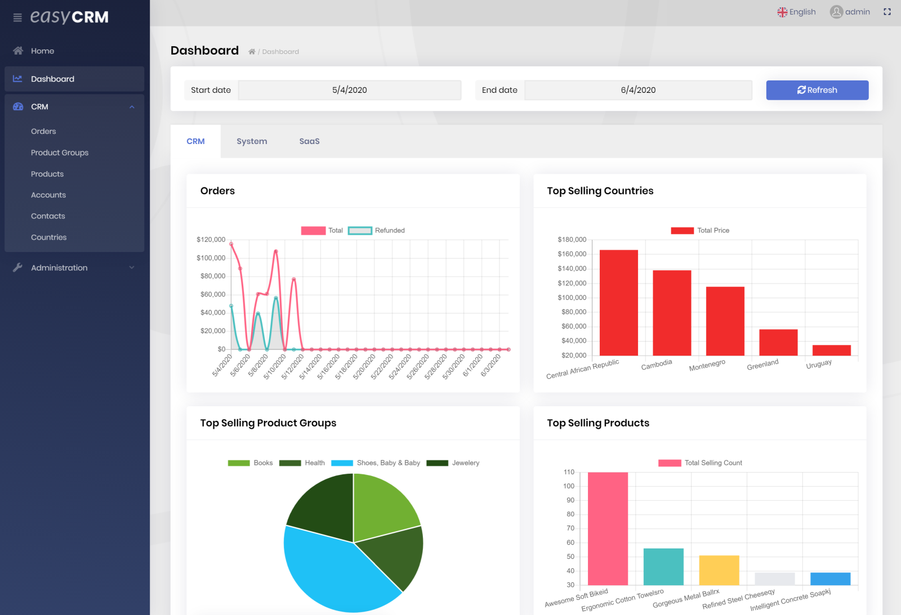

# Easy CRM - Sample ABP Project

This is a sample solution developed on top of ABP.

## Download

> **Note:** EasyCRM sample application is only for the **ABP customers**. Therefore, you need to have a commercial license to be able to download the source code.

* You can download the complete source-code from [https://abp.io/api/download/samples/easy-crm](https://abp.io/Account/Login?returnUrl=/api/download/samples/easy-crm)

## Demo

Visit [easycrm.abp.io](http://easycrm.abp.io/) to see this sample application in action. The online demo is with the ASP.NET Core MVC / Razor Pages UI, while the sample project is available with the Angular UI and Blazor too, when you download its source code.

## How To Run?

When you download and open the zip file, you will see two folders:

* **aspnet-core** folder contains the server side, the MVC (Razor Pages) UI and the Blazor UI.
* **angular** folder contains the Angular UI.

### Server Side / MVC (Razor Pages) Application

* Open the solution (inside the aspnet-core folder) in **Visual Studio 2019** or later (or with another IDE that supports ASP.NET Core).
* This project use `Sqlite`, the default database folder is located at appsettings (`"SqliteDbFolder": "sqliteDbs"`, this folder is located in the MVC project).
* Open the `appsettings.json` file in the `Volo.EasyCrm.Web` application and set `"UseDynamicDatabase": "false"`.
    > The MVC project is creating new database for each unique visitor. And the visitor id is stored at cookies. When you set `UseDynamicDatabase` as a `true`, you cannot run Blazor & Angular projects because they have no cookie implementation. Be aware it is set as `false` for running Blazor & Angular applications.
* Run the `Volo.EasyCrm.Web` application.
* You can login using `admin` as the user name and `1q2w3E*` as the password.
* Enjoy and check the source code!

### Angular UI

* First, follow all the steps above to run the server side and seed the sample data.
* Open a command prompt in the angular folder.
* Run the `yarn` command to install NPM packages (requires the [Yarn](https://yarnpkg.com/) package manager).
* Run the `yarn start` command to run the Angular application. It will automatically open the `localhost://4200` in your default browser once the application initialized.

### Blazor UI

* First, follow all the steps above to run the server side and seed the sample data.
* Run the `Volo.EasyCrm.Blazor` application.
