````json
//[doc-params]
{
    "UI": ["MVC", "Blazor", "BlazorServer", "NG"],
    "DB": ["EF", "Mongo"],
    "Tiered": ["Yes", "No"]
}
````

## Step 1: Creating an Azure Web App Service Environment

To create a new Azure Web App Service, choose one of the following options:

- [Create a new Azure Web App Service using the Azure Portal](#create-a-new-azure-web-app-service-using-the-azure-portal) (Recommended)

- [Create a new Azure Web App Service using the Terraform Template](terraform-web-app-service.md) (If you have experience with Terraform)

{{ if UI == "MVC" && Tiered == "No" }}

### Create a new Azure Web App service using the Azure Portal

1. Log in to the [Azure Portal](https://portal.azure.com/).

2. Click the **Create a resource** button.

3. Search for **Web App** and select **Web App** from the results.

    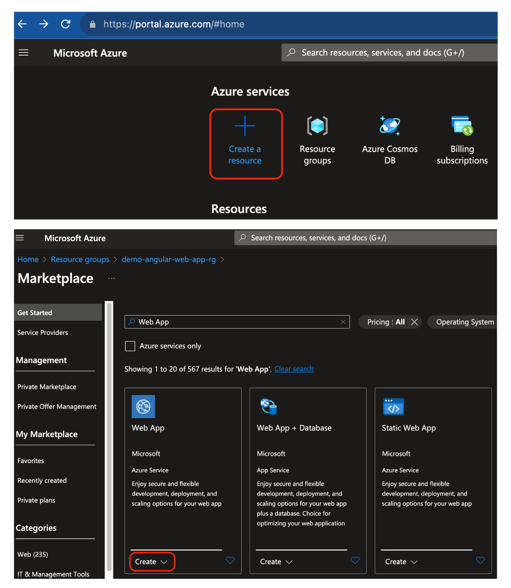

4. Click the **Create** button.

5. Fill in the required fields and click the **Review + create** button.

6. Click the **Create** button.

    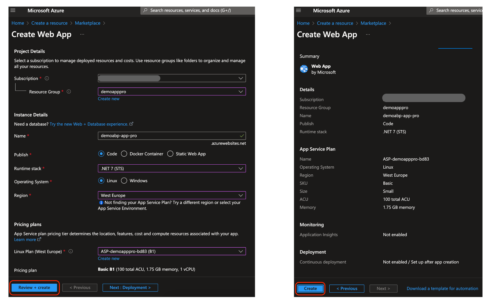

7. Wait for the deployment to complete.

    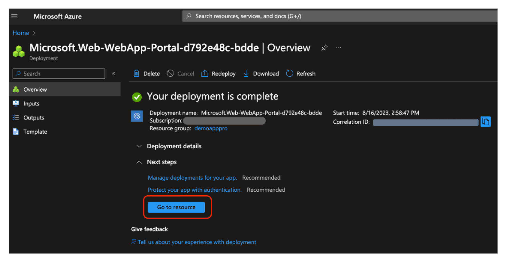

{{else}}

{{ if UI == "BlazorServer" || UI == "MVC" }}

### Create a new Azure Web App service using the Azure Portal

1. Log in to the [Azure Portal](https://portal.azure.com/).

2. Click the **Create a resource** button.

3. Search for **Web App** and select **Web App** from the results.

    

4. Click the **Create** button.

5. Fill in the required fields and click the **Review + create** button.

6. Click the **Create** button.

    

7. Wait for the deployment to complete.

    

{{ else if UI == 'NG' }}

### Create a new Azure Static Web App for Angular using the Azure Portal

1. Log in to the [Azure Portal](https://portal.azure.com/).

2. Click the **Create a resource** button.

3. Search for **Static Web App** and select **Static Web App** from the results.

    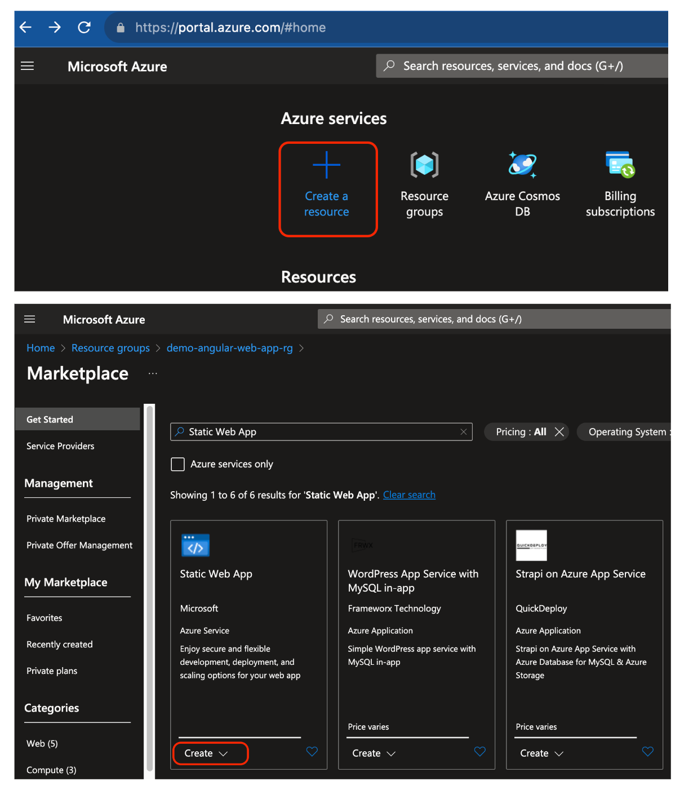

4. Click the **Create** button.

5. Fill in the required fields and click the **Review + create** button.

6. Click the **Create** button.

    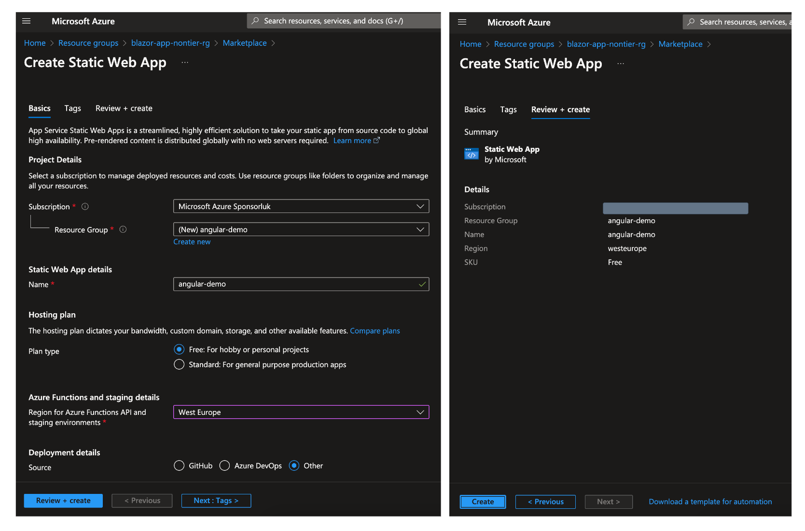

7. Wait for the deployment to complete.

    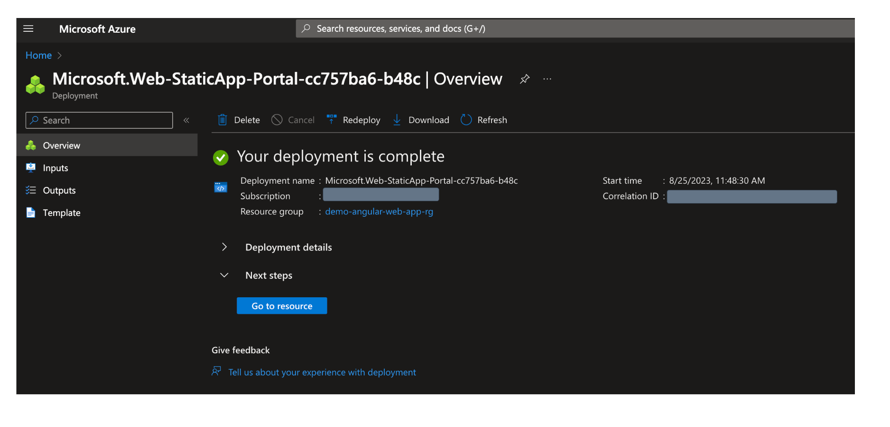

{{else}}

### Create a new Azure Static Web App for Blazor using the Azure Portal

1. Log in to the [Azure Portal](https://portal.azure.com/).

2. Click the **Create a resource** button.

3. Search for **Static Web App** and select **Static Web App** from the results.

    

4. Click the **Create** button.

5. Fill in the required fields and click the **Review + create** button.

6. Click the **Create** button.

    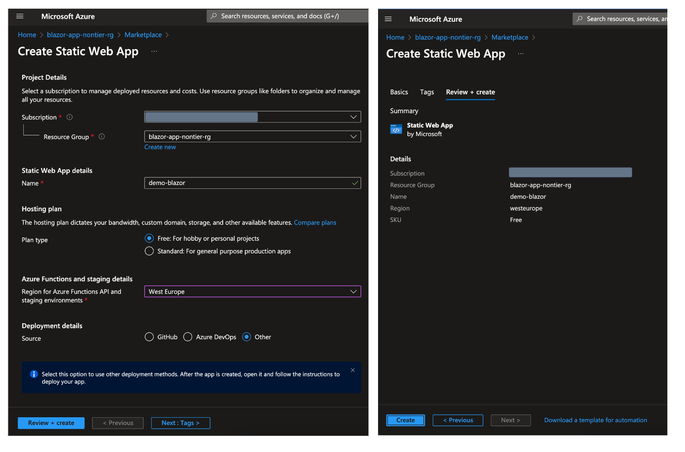

7. Wait for the deployment to complete.

    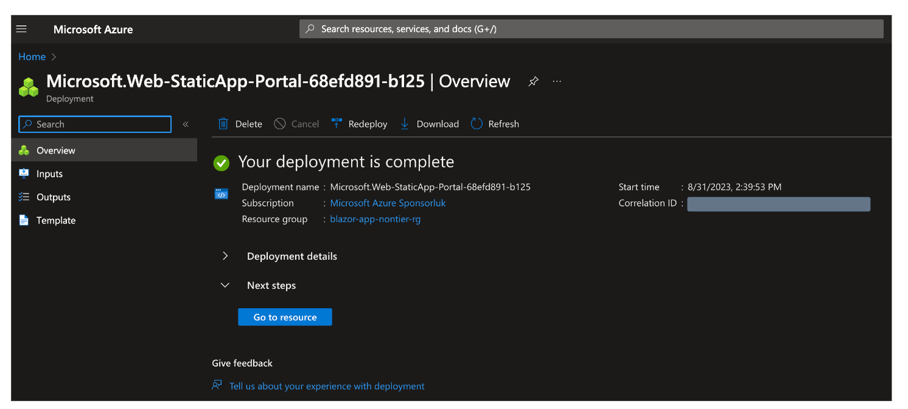

{{end}}

### Create a new Azure Web App Service for API application

1. You can create a new Azure Web App Service for an API application in the same resource group.

2. Click the **Create** button on the top of the resource group page.

3. Search for **Web App** and select **Web App** from the results.

    

4. Click the **Create** button.

5. Fill in the required fields and click the **Review + create** button.

6. Click the **Create** button.

    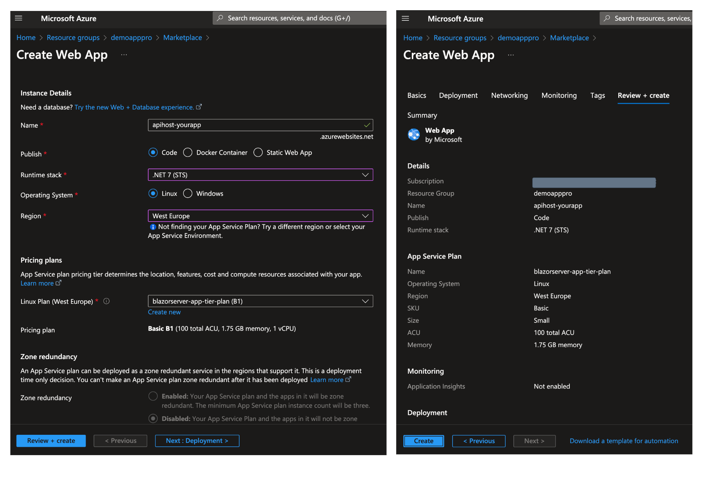

7. Wait for the deployment to complete.

    

{{ if Tiered == "Yes" && (UI == "MVC" || UI == "BlazorServer")}}

### Create a new Azure Web App Service for AuthServer application

Similar to the API application, you can create a new Azure Web App Service for an AuthServer application in the same resource group. 

Same as above, but you only need to modify the name of the web app service to **authserver-yourapp** in step 5.

### Create Azure Cache for Redis

1. Click the **Create** button on the top of the resource group page.

2. Search for **Redis Cache** and select **Redis Cache** from the results.

    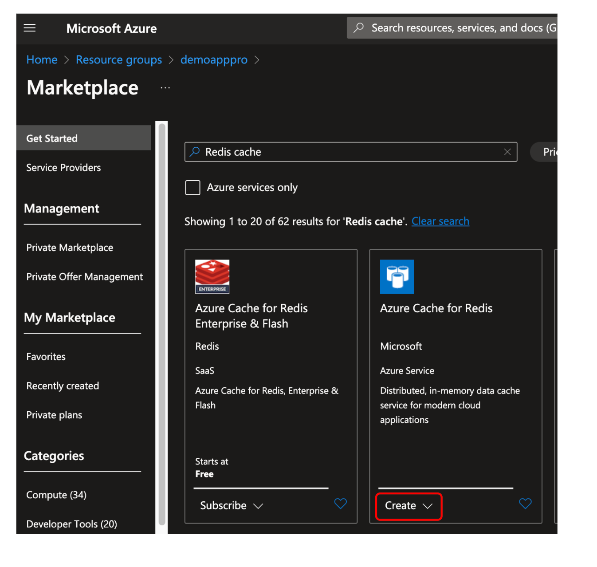

3. Click the **Create** button.

4. Fill in the required fields and click the **Review + create** button.

5. Click the **Create** button.

    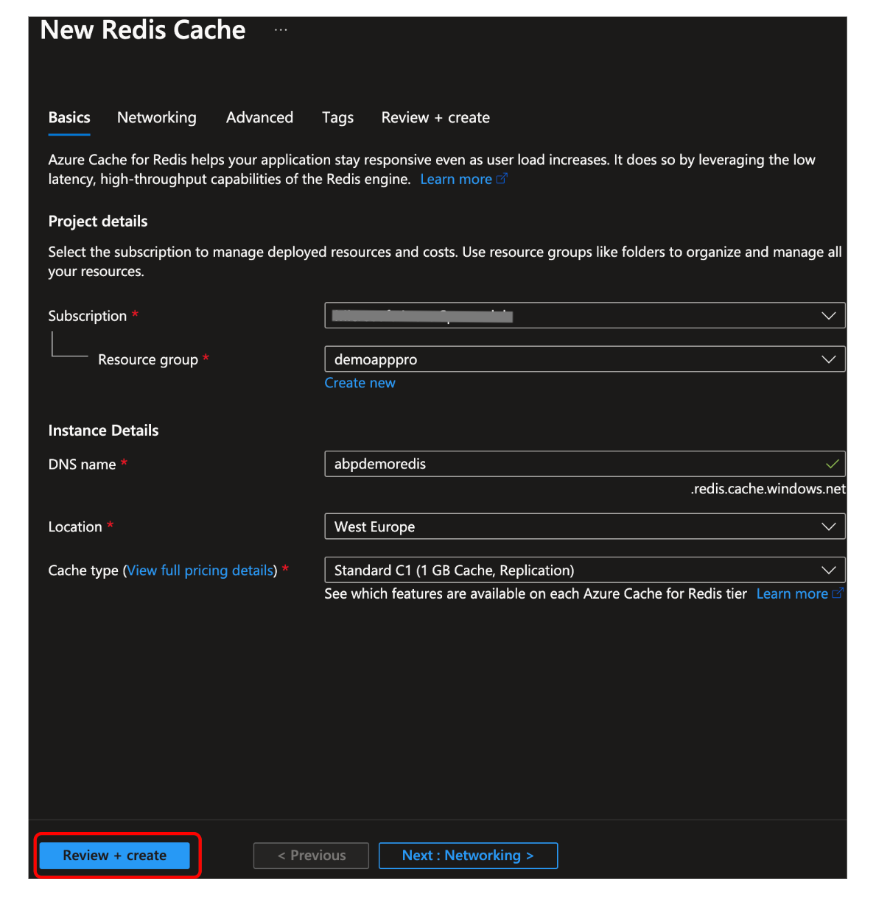

6. Wait for the deployment to complete.

    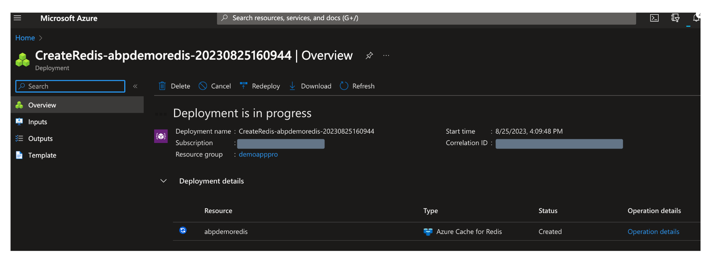

{{ end }}

{{ end }}

## What's next?

- [Customizing the Azure Web App Service](step2-configuration-application.md)
