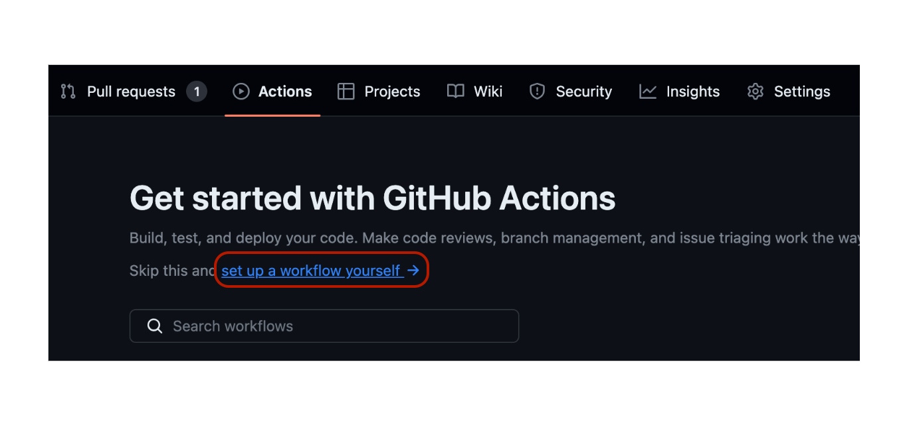
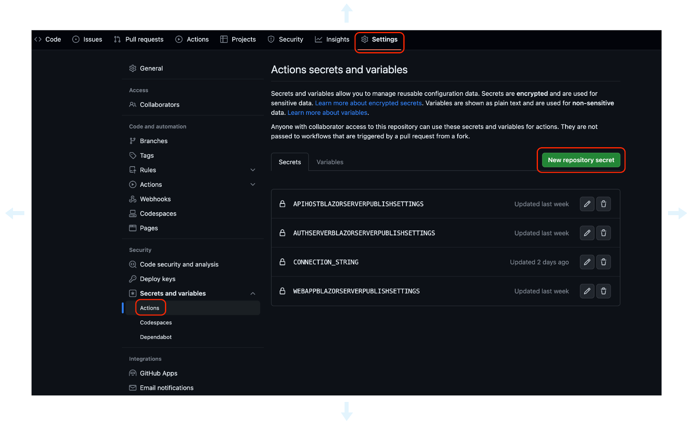
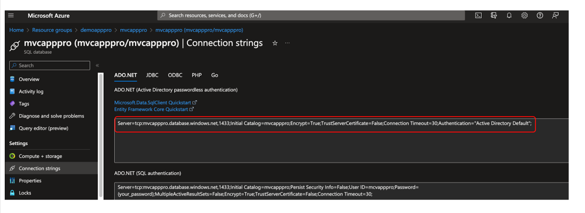
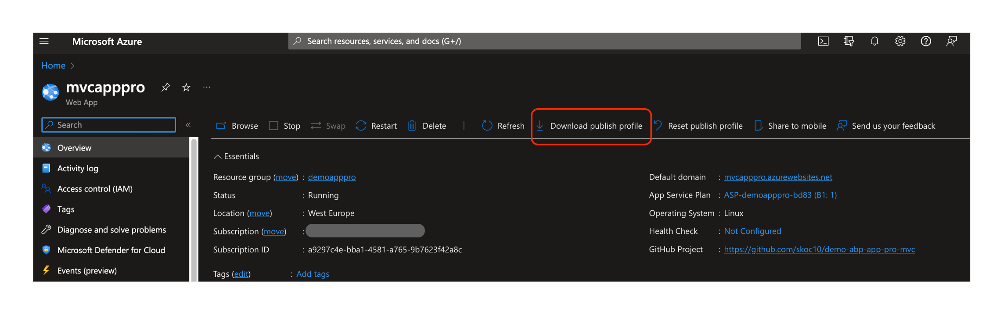
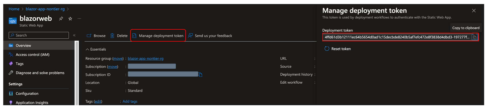
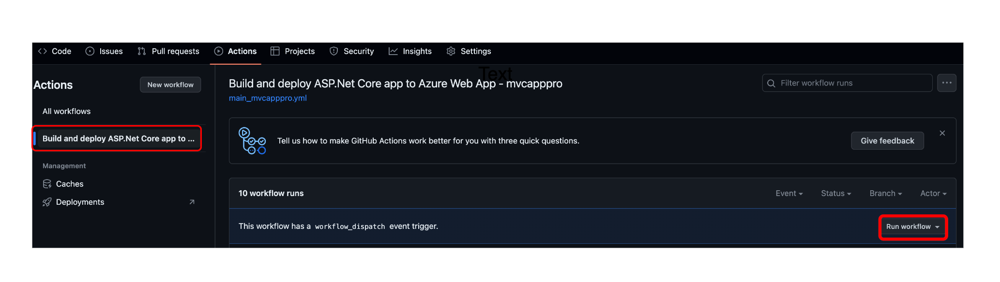
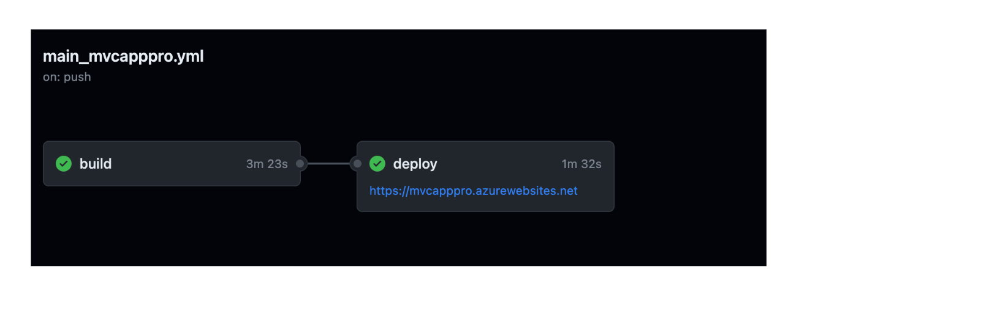
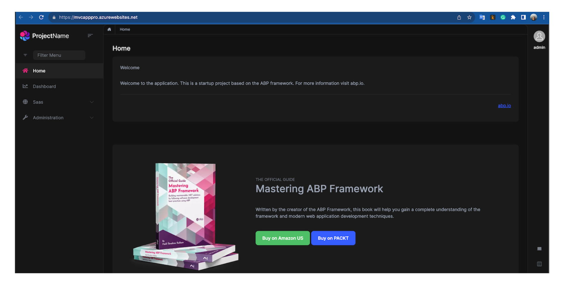

````json
//[doc-params]
{
    "UI": ["MVC", "Blazor", "BlazorServer", "NG"],
    "DB": ["EF", "Mongo"],
    "Tiered": ["Yes", "No"]
}
````

## Step 3: Deploying the ABP Application to Azure Web App Service

### Deploying the ABP Application to Azure Web App Service using GitHub Actions

1. Create a new GitHub repository for your project if you don't have one.

2. Push your project to the new GitHub repository.

3. Navigate to the **Actions** tab of your GitHub repository.

4. Click the **set up a workflow yourself** button.

    

5. Copy this content to the opened file and commit it.

{{if UI == "NG"}}

{%{

```yaml
# Docs for the Azure Web Apps Deploy action: https://github.com/Azure/webapps-deploy
# More GitHub Actions for Azure: https://github.com/Azure/actions

name: Build and deploy ASP.Net Core with Angular app to Azure Web App

on:
  push:
    branches:
      - main
  workflow_dispatch:

jobs:
  build-backend:
    runs-on: ubuntu-latest

    steps:
      - uses: actions/checkout@v4

      - name: Set up .NET Core
        uses: actions/setup-dotnet@v4
        with:
          dotnet-version: '8.x'
          include-prerelease: true

      - name: Install ABP CLI
        run: |
          dotnet tool install -g Volo.Abp.Cli
          abp install-libs
        shell: bash
    
      - name: Build with dotnet
        run: dotnet build --configuration Release
        working-directory: ./aspnet-core

      - name: Run migrations
        run: dotnet run -- "${{ secrets.CONNECTION_STRING }}"
        working-directory: ./aspnet-core/src/Demo.AzureAppsAngular.DbMigrator # Replace with your project name

      - name: dotnet publish apihost
        run: dotnet publish -c Release -o ${{env.DOTNET_ROOT}}/apihost
        working-directory: ./aspnet-core/src/Demo.AzureAppsAngular.HttpApi.Host # Replace with your project name

      - name: Generate authserver.pfx
        run: dotnet dev-certs https -v -ep ${{env.DOTNET_ROOT}}/apihost/authserver.pfx -p 2D7AA457-5D33-48D6-936F-C48E5EF468ED # Replace with your password

      - name: Upload artifact for apihost
        uses: actions/upload-artifact@v4
        with:
          name: .net-apihost
          path: ${{env.DOTNET_ROOT}}/apihost

  deploy-backend:
    runs-on: ubuntu-latest
    needs: build-backend
    environment:
      name: 'Production'
      url: ${{ steps.deploy-to-webapp-1.outputs.webapp-url }}

    steps:
      - name: Download artifact from apihost
        uses: actions/download-artifact@v1
        with:
          name: .net-apihost
          path: ./apihost

      - name: Deploy apihost
        id: deploy-to-webapp-1
        uses: azure/webapps-deploy@v3
        with:
          app-name: 'apihost-angular' # Replace with your app name
          slot-name: 'Production'
          publish-profile: ${{ secrets.apihostangularPublishSettings }} # Set your Azure Web App to publish your profile as a secret in your repository settings
          path: ./apihost

  build-deploy-frontend:
    runs-on: ubuntu-latest
    needs: deploy-backend
    name: Build and Deploy Angular App
    steps:
      - uses: actions/checkout@v3
        with:
          submodules: true
      - name: Build And Deploy
        id: builddeploy
        uses: Azure/static-web-apps-deploy@v1
        with:
          azure_static_web_apps_api_token: ${{ secrets.AZURE_STATIC_WEB_APPS_API_TOKEN_PROUD_STONE }} # Set your Azure Static Web App API token as a secret in your repository settings
          repo_token: ${{ secrets.GITHUB_TOKEN }} # Used for GitHub integrations (eg: PR comments)
          action: "upload"
          app_location: "angular" # App source code path
          api_location: "" # Api source code path - optional
          output_location: "dist/AzureAppsAngular" # Built app content directory - optional
```

}%}

{{ else if UI == "Blazor" }}

{%{

```yaml
# Docs for the Azure Web Apps Deploy action: https://github.com/Azure/webapps-deploy
# More GitHub Actions for Azure: https://github.com/Azure/actions

name: Build and deploy ASP.Net Core with Blazor to Azure Web App

on:
  push:
    branches:
      - main
  workflow_dispatch:

jobs:
  build-apihost:
    runs-on: ubuntu-latest

    steps:
      - uses: actions/checkout@v4

      - name: Set up .NET Core
        uses: actions/setup-dotnet@v4
        with:
          dotnet-version: '8.x'
          include-prerelease: true
      
      - name: Install ABP CLI
        run: |
          dotnet tool install -g Volo.Abp.Cli
          abp install-libs
        shell: bash
    
      - name: Build with dotnet
        run: dotnet build --configuration Release

      - name: Run migrations
        run: dotnet run -- "${{ secrets.CONNECTION_STRING }}"
        working-directory: ./src/demo.BlazorNonTierEfCore.DbMigrator # Replace with your project name

      - name: dotnet publish apihost
        run: dotnet publish -c Release -o ${{env.DOTNET_ROOT}}/apihost
        working-directory: ./src/demo.BlazorNonTierEfCore.HttpApi.Host # Replace with your project name

      - name: Generate authserver.pfx
        run: dotnet dev-certs https -v -ep ${{env.DOTNET_ROOT}}/apihost/authserver.pfx -p 2D7AA457-5D33-48D6-936F-C48E5EF468ED # Replace with your password
      
      - name: Upload artifact for apihost
        uses: actions/upload-artifact@v4
        with:
          name: .net-apihost
          path: ${{env.DOTNET_ROOT}}/apihost

  deploy-apihost:
    runs-on: ubuntu-latest
    needs: build-apihost
    environment:
      name: 'Production'

    steps:
      - name: Download artifact from apihost
        uses: actions/download-artifact@v4
        with:
          name: .net-apihost
          path: ./apihost

      - name: Deploy apihost
        id: deploy-to-webapp-2
        uses: azure/webapps-deploy@v3
        with:
          app-name: 'apihost-blazor' # Replace with your app name
          slot-name: 'Production'
          publish-profile: ${{ secrets.apihostblazorPublishSettings }} # Set your Azure Web App to publish your profile as a secret in your repository settings

  build-deploy-frontend:
    runs-on: ubuntu-latest
    needs: deploy-apihost
    name: Build and Deploy Job
    steps:
      - uses: actions/checkout@v3
        with:
          submodules: true
      - name: Build And Deploy
        id: builddeploy
        uses: Azure/static-web-apps-deploy@v1
        with:
          azure_static_web_apps_api_token: ${{ secrets.AZURE_STATIC_WEB_APPS_API_TOKEN_AMBITIOUS }} # Set your Azure Static Web App API token as a secret in your repository settings
          repo_token: ${{ secrets.GITHUB_TOKEN }} # Used for GitHub integrations (eg: PR comments)
          action: "upload"
          app_location: "src/demo.BlazorNonTierEfCore.Blazor" # App source code path
          api_location: "" # Api source code path - optional
          output_location: "wwwroot" # Built app content directory - optional
```

}%}

{{ else if UI == "BlazorServer" }}

{{ if Tiered == "No" }}

{%{

```yaml
# Docs for the Azure Web Apps Deploy action: https://github.com/Azure/webapps-deploy
# More GitHub Actions for Azure: https://github.com/Azure/actions

name: Build and deploy ASP.Net Core with BlazorServer to Azure Web App

on:
  push:
    branches:
      - main
  workflow_dispatch:

jobs:
  build:
    runs-on: ubuntu-latest

    steps:
      - uses: actions/checkout@v4

      - name: Set up .NET Core
        uses: actions/setup-dotnet@v4
        with:
          dotnet-version: '8.x'
          include-prerelease: true

      - name: Install ABP CLI
        run: |
          dotnet tool install -g Volo.Abp.Cli
          abp install-libs
        shell: bash
    
      - name: Build with dotnet
        run: dotnet build --configuration Release

      - name: Run migrations
        run: dotnet run -- "${{ secrets.CONNECTION_STRING }}" # Set your connection string as a secret in your repository settings
        working-directory: ./src/blazorservertierdemo.DbMigrator  # Replace with your project name

      - name: dotnet publish apihost
        run: dotnet publish -c Release -o ${{env.DOTNET_ROOT}}/apihost
        working-directory: ./src/blazorservertierdemo.HttpApi.Host # Replace with your project name

      - name: Generate authserver.pfx
        run: dotnet dev-certs https -v -ep ${{env.DOTNET_ROOT}}/apihost/authserver.pfx -p 2D7AA457-5D33-48D6-936F-C48E5EF468ED # Replace with your password

      - name: dotnet publish webapp
        run: dotnet publish -c Release -o ${{env.DOTNET_ROOT}}/webapp
        working-directory: ./src/blazorservertierdemo.Blazor # Replace with your project name

      - name: Upload artifact for apihost
        uses: actions/upload-artifact@v4
        with:
          name: .net-apihost
          path: ${{env.DOTNET_ROOT}}/apihost

      - name: Upload artifact for webapp
        uses: actions/upload-artifact@v4
        with:
          name: .net-webapp
          path: ${{env.DOTNET_ROOT}}/webapp

  deploy:
    runs-on: ubuntu-latest
    needs: build
    environment:
      name: 'Production'
      url: ${{ steps.deploy-to-webapp-3.outputs.webapp-url }}

      - name: Download artifact from apihost
        uses: actions/download-artifact@v4
        with:
          name: .net-apihost
          path: ./apihost

      - name: Deploy apihost
        id: deploy-to-webapp-2
        uses: azure/webapps-deploy@v3
        with:
          app-name: 'apihost-blazorserver' # Replace with your app name
          slot-name: 'Production'
          publish-profile: ${{ secrets.apihostblazorserverPublishSettings }} # Set your Azure Web App to publish your profile as a secret in your repository settings
          package: ./apihost

      - name: Download artifact from webapp
        uses: actions/download-artifact@v4
        with:
          name: .net-webapp
          path: ./webapp

      - name: Deploy webapp
        id: deploy-to-webapp-3
        uses: azure/webapps-deploy@v3
        with:
          app-name: 'webapp-blazorserver' # Replace with your app name
          slot-name: 'Production'
          publish-profile: ${{ secrets.webappblazorserverPublishSettings }} # Set your Azure Web App to publish your profile as a secret in your repository settings
          package: ./webapp
```

}%}

{{ else }}

{%{

```yaml
# Docs for the Azure Web Apps Deploy action: https://github.com/Azure/webapps-deploy
# More GitHub Actions for Azure: https://github.com/Azure/actions

name: Build and deploy ASP.Net Core with BlazorServer to Azure Web App

on:
  push:
    branches:
      - main
  workflow_dispatch:

jobs:
  build:
    runs-on: ubuntu-latest

    steps:
      - uses: actions/checkout@v4

      - name: Set up .NET Core
        uses: actions/setup-dotnet@v4
        with:
          dotnet-version: '8.x'
          include-prerelease: true

      - name: Install ABP CLI
        run: |
          dotnet tool install -g Volo.Abp.Cli
          abp install-libs
        shell: bash
    
      - name: Build with dotnet
        run: dotnet build --configuration Release

      - name: Run migrations
        run: dotnet run -- "${{ secrets.CONNECTION_STRING }}" # Set your connection string as a secret in your repository settings
        working-directory: ./src/blazorservertierdemo.DbMigrator  # Replace with your project name

      - name: dotnet publish authserver
        run: dotnet publish -c Release -o ${{env.DOTNET_ROOT}}/authserver
        working-directory: ./src/blazorservertierdemo.AuthServer # Replace with your project name

      - name: Generate authserver.pfx
        run: dotnet dev-certs https -v -ep ${{env.DOTNET_ROOT}}/authserver/authserver.pfx -p 2D7AA457-5D33-48D6-936F-C48E5EF468ED # Replace with your password

      - name: dotnet publish apihost
        run: dotnet publish -c Release -o ${{env.DOTNET_ROOT}}/apihost
        working-directory: ./src/blazorservertierdemo.HttpApi.Host # Replace with your project name

      - name: dotnet publish webapp
        run: dotnet publish -c Release -o ${{env.DOTNET_ROOT}}/webapp
        working-directory: ./src/blazorservertierdemo.Blazor # Replace with your project name

      - name: Upload artifact for authserver
        uses: actions/upload-artifact@v4
        with:
          name: .net-authserver
          path: ${{env.DOTNET_ROOT}}/authserver
      
      - name: Upload artifact for apihost
        uses: actions/upload-artifact@v4
        with:
          name: .net-apihost
          path: ${{env.DOTNET_ROOT}}/apihost

      - name: Upload artifact for webapp
        uses: actions/upload-artifact@v4
        with:
          name: .net-webapp
          path: ${{env.DOTNET_ROOT}}/webapp

  deploy:
    runs-on: ubuntu-latest
    needs: build
    environment:
      name: 'Production'
      url: ${{ steps.deploy-to-webapp-3.outputs.webapp-url }}

    steps:
      - name: Download artifact from authserver
        uses: actions/download-artifact@v4
        with:
          name: .net-authserver
          path: ./authserver

      - name: Deploy authserver
        id: deploy-to-webapp
        uses: azure/webapps-deploy@v3
        with:
          app-name: 'authserver-blazorserver' # Replace with your app name
          slot-name: 'Production'
          publish-profile: ${{ secrets.authserverblazorserverPublishSettings }} # Set your Azure Web App to publish your profile as a secret in your repository settings
          package: ./authserver

      - name: Download artifact from apihost
        uses: actions/download-artifact@v4
        with:
          name: .net-apihost
          path: ./apihost

      - name: Deploy apihost
        id: deploy-to-webapp-2
        uses: azure/webapps-deploy@v3
        with:
          app-name: 'apihost-blazorserver' # Replace with your app name
          slot-name: 'Production'
          publish-profile: ${{ secrets.apihostblazorserverPublishSettings }} # Set your Azure Web App to publish your profile as a secret in your repository settings
          package: ./apihost

      - name: Download artifact from webapp
        uses: actions/download-artifact@v4
        with:
          name: .net-webapp
          path: ./webapp

      - name: Deploy webapp
        id: deploy-to-webapp-3
        uses: azure/webapps-deploy@v3
        with:
          app-name: 'webapp-blazorserver' # Replace with your app name
          slot-name: 'Production'
          publish-profile: ${{ secrets.webappblazorserverPublishSettings }} # Set your Azure Web App publish your profile as a secret in your repository settings
```

}%}

{{end}}

{{ else if UI == "MVC" }}

{{ if Tiered == "No" }}

{%{

```yaml
# Docs for the Azure Web Apps Deploy action: https://github.com/Azure/webapps-deploy
# More GitHub Actions for Azure: https://github.com/Azure/actions

name: Build and deploy ASP.Net Core with MVC to Azure Web App

on:
push:
    branches:
    - main
workflow_dispatch:

jobs:
build:
    runs-on: ubuntu-latest

    steps:
    - uses: actions/checkout@v4

    - name: Set up .NET Core
        uses: actions/setup-dotnet@v4
        with:
        dotnet-version: '8.x'
        include-prerelease: true

    - name: Install ABP CLI
        run: |
          dotnet tool install -g Volo.Abp.Cli
          abp install-libs
        shell: bash
    
      - name: Build with dotnet
        run: dotnet build --configuration Release

    - name: Run migrations
        run: dotnet run -- "${{ secrets.CONNECTION_STRING }}" # Set your connection string as a secret in your repository settings
        working-directory: ./src/yourapp.DbMigrator # Replace with your project name

    - name: dotnet publish
        run: dotnet publish -c Release -o ${{env.DOTNET_ROOT}}/myapp
        working-directory: ./src/yourapp.Web # Replace with your project name

    - name: Generate authserver.pfx
        run: dotnet dev-certs https -v -ep ${{env.DOTNET_ROOT}}/myapp/authserver.pfx -p 2D7AA457-5D33-48D6-936F-C48E5EF468ED # Replace with your password

    - name: Upload artifact for deployment job
        uses: actions/upload-artifact@v4
        with:
        name: .net-app
        path: ${{env.DOTNET_ROOT}}/myapp

deploy:
    runs-on: ubuntu-latest
    needs: build
    environment:
    name: 'Production'
    url: ${{ steps.deploy-to-webapp.outputs.webapp-url }}

    steps:
    - name: Download artifact from build job
        uses: actions/download-artifact@v4
        with:
        name: .net-app

    - name: Deploy to Azure Web App
        id: deploy-to-webapp
        uses: azure/webapps-deploy@v3
        with:
        app-name: 'yourapp' # Replace with your azure web app name
        slot-name: 'Production'
        publish-profile: ${{ secrets.AZUREAPPSERVICE_PUBLISHPROFILE }} # Set your Azure Web App publish your profile as a secret in your repository settings
        package: .
```

}%}

{{ else }}

{%{

```yaml
# Docs for the Azure Web Apps Deploy action: https://github.com/Azure/webapps-deploy
# More GitHub Actions for Azure: https://github.com/Azure/actions

name: Build and deploy ASP.Net Core with MVC to Azure Web App

on:
  push:
    branches:
      - main
  workflow_dispatch:

jobs:
  build:
    runs-on: ubuntu-latest

    steps:
      - uses: actions/checkout@v4

      - name: Set up .NET Core
        uses: actions/setup-dotnet@v4
        with:
          dotnet-version: '8.x'
          include-prerelease: true

      - name: Install ABP CLI
        run: |
          dotnet tool install -g Volo.Abp.Cli
          abp install-libs
        shell: bash
    
      - name: Build with dotnet
        run: dotnet build --configuration Release

      - name: Run migrations
        run: dotnet run -- "${{ secrets.CONNECTION_STRING }}"   # Set your connection string as a secret in your repository settings
        working-directory: ./src/mvctierdemo.DbMigrator # Replace with your project name

      - name: dotnet publish authserver
        run: dotnet publish -c Release -o ${{env.DOTNET_ROOT}}/authserver
        working-directory: ./src/mvctierdemo.AuthServer # Replace with your project name

      - name: Generate authserver.pfx
        run: dotnet dev-certs https -v -ep ${{env.DOTNET_ROOT}}/authserver/authserver.pfx -p 2D7AA457-5D33-48D6-936F-C48E5EF468ED # Replace with your password

      - name: dotnet publish apihost
        run: dotnet publish -c Release -o ${{env.DOTNET_ROOT}}/apihost
        working-directory: ./src/mvctierdemo.HttpApi.Host # Replace with your project name

      - name: dotnet publish webapp
        run: dotnet publish -c Release -o ${{env.DOTNET_ROOT}}/webapp
        working-directory: ./src/mvctierdemo.Web # Replace with your project name

      - name: Upload artifact for authserver
        uses: actions/upload-artifact@v4
        with:
          name: .net-authserver
          path: ${{env.DOTNET_ROOT}}/authserver
      
      - name: Upload artifact for apihost
        uses: actions/upload-artifact@v4
        with:
          name: .net-apihost
          path: ${{env.DOTNET_ROOT}}/apihost

      - name: Upload artifact for webapp
        uses: actions/upload-artifact@v4
        with:
          name: .net-webapp
          path: ${{env.DOTNET_ROOT}}/webapp

  deploy:
    runs-on: ubuntu-latest
    needs: build
    environment:
      name: 'Production'
      url: ${{ steps.deploy-to-webapp-3.outputs.webapp-url }}

    steps:
      - name: Download artifact from apihost
        uses: actions/download-artifact@v4
        with:
          name: .net-apihost
          path: ./apihost

      - name: Deploy apihost
        id: deploy-to-webapp-2
        uses: azure/webapps-deploy@v3
        with:
          app-name: 'apihost-prodemo'
          slot-name: 'Production'
          publish-profile: ${{ secrets.apihostprodemoPublishSettings }} # Set your Azure Web App publish your profile as a secret in your repository settings
          package: ./apihost

      - name: Download artifact from authserver
        uses: actions/download-artifact@v4
        with:
          name: .net-authserver
          path: ./authserver

      - name: Deploy authserver
        id: deploy-to-webapp
        uses: azure/webapps-deploy@v3
        with:
          app-name: 'authserver-prodemo'
          slot-name: 'Production'
          publish-profile: ${{ secrets.authserverprodemoPublishSettings }} # Set your Azure Web App publish your profile as a secret in your repository settings
          package: ./authserver

      - name: Download artifact from webapp
        uses: actions/download-artifact@v4
        with:
          name: .net-webapp
          path: ./webapp

      - name: Deploy webapp
        id: deploy-to-webapp-3
        uses: azure/webapps-deploy@v3
        with:
          app-name: 'webapp-prodemo'
          slot-name: 'Production'
          publish-profile: ${{ secrets.webappprodemoPublishSettings }} # Set your Azure Web App publish your profile as a secret in your repository settings
          package: ./webapp
```

}%}

{{end}}

{{end}}


7. Navigate to the **Settings** tab of your GitHub repository.

8. Click the **Secrets** button.
    
9. Click the **New repository secret** button.

    

10. Add the following secrets:

  - **CONNECTION_STRING**: The connection string of your database.
    
    Example of Azure SQL connection string:
    
    

  - **AZUREAPPSERVICE_PUBLISHPROFILE**: The publish the profile of your Azure Web App Service. You can download it from the **Overview** tab of your Azure Web App Service.

    

{{ if UI == "NG" || UI == "Blazor"}}

  - **AZURE_STATIC_WEB_APPS_API_TOKEN_AMBITIOUS**: The API token of your Azure Static Web App. You can get it from the **Overview** tab of your Azure Static Web App.

    

{{end}}

11. Navigate to the **Actions** tab of your GitHub repository.

12. Click the **Deploy to Azure Web App** workflow.

    

13. Click the **Run workflow** button.

    

14. Navigate to the web app URL to see the deployed application.

    

> If deploying your application was unsuccessful, you can check the logs of the deployment by clicking the **Deploy to Azure Web App** workflow and then clicking the **deploy-to-webapp** job.

> If deployment is successful, but you get an error when you navigate to the web app url, you can check the logs of the web app by clicking the **Logs** button on the **Overview** tab of your Azure Web App Service.

> Finally, you have the CI/CD pipeline for your application. Every time you push your code to the main branch, your application will be deployed to Azure Web App Service automatically.


## What's next?

- [Docker Deployment using Docker Compose](../deployment-docker-compose.md)

- [IIS Deployment](../deployment-iis.md)
