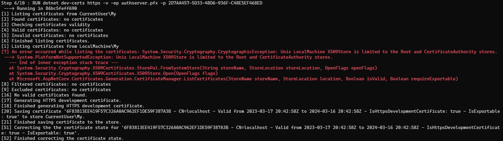

# Docker Deployment using Docker Compose

````json
//[doc-params]
{
    "UI": ["MVC", "Blazor", "BlazorServer", "NG"],
    "DB": ["EF", "Mongo"],
    "Tiered": ["Yes", "No"]
}
````

> This document assumes that you prefer to use **{{ UI_Value }}** as the UI framework and **{{ DB_Value }}** as the database provider. For other options, please change the preference at the top of this document.

This guide will guide you through how to build docker images for your application and run on localhost using `docker compose`. You will learn the provided build scripts and docker compose files in detail and how to modify them for the production environment.

## Building Docker Images

Each application contains a dockerfile called `Dockerfile.local` for building the docker image. As the naming implies, these Dockerfiles are not multi-stage Dockerfiles and require the project to be built in `Release` mode to create the image. Currently, if you are building your images using CI & CD pipeline, you either need to include the SDK to your pipeline before building the images or add your own [multi-stage dockerfiles](https://learn.microsoft.com/en-us/aspnet/core/host-and-deploy/docker/building-net-docker-images?view=aspnetcore-7.0).

Since they are not multi-staged Dockerfiles, if you want to build the images individually, you can navigate to the related to-be-hosted application folder and run the following command:

``````powershell
dotnet publish -c Release
``````

To populate the **Release** folder first, which will be used to build the docker images. Afterward,  you can run the following command:

```powershell
docker build -f Dockerfile.local -t mycompanyname/myappname:version .
```

To manually build your application image.

To ease the process, application templates provide a build script to build all the images with a single script under `etc/build` folder named `build-images-locally.ps1`. 
Based on your application name, UI and type, a build image script will be generated. 

{{ if UI == "MVC"}}

```powershell
param ($version='latest')

$currentFolder = $PSScriptRoot
$slnFolder = Join-Path $currentFolder "../../"

Write-Host "********* BUILDING DbMigrator *********" -ForegroundColor Green
$dbMigratorFolder = Join-Path $slnFolder "src/Acme.BookStore.DbMigrator"
Set-Location $dbMigratorFolder
dotnet publish -c Release
docker build -f Dockerfile.local -t acme/bookstore-db-migrator:$version .

Write-Host "********* BUILDING Web Application *********" -ForegroundColor Green
$webFolder = Join-Path $slnFolder "src/Acme.BookStore.Web"
Set-Location $webFolder
dotnet publish -c Release
docker build -f Dockerfile.local -t acme/bookstore-web:$version .

	{{ if Tiered == "Yes"}}
Write-Host "********* BUILDING Api.Host Application *********" -ForegroundColor Green
$hostFolder = Join-Path $slnFolder "src/Acme.BookStore.HttpApi.Host"
Set-Location $hostFolder
dotnet publish -c Release
docker build -f Dockerfile.local -t acme/bookstore-api:$version .

Write-Host "********* BUILDING AuthServer Application *********" -ForegroundColor Green
$authServerAppFolder = Join-Path $slnFolder "src/Acme.BookStore.AuthServer"
Set-Location $authServerAppFolder
dotnet publish -c Release
docker build -f Dockerfile.local -t acme/bookstore-authserver:$version .
	{{ end }}

### ALL COMPLETED
Write-Host "COMPLETED" -ForegroundColor Green
Set-Location $currentFolder
```

{{ end }}

{{ if UI == "NG"}}

```powershell
param ($version='latest')

$currentFolder = $PSScriptRoot
$slnFolder = Join-Path $currentFolder "../../"

Write-Host "********* BUILDING DbMigrator *********" -ForegroundColor Green
$dbMigratorFolder = Join-Path $slnFolder "src/Acme.BookStore.DbMigrator"
Set-Location $dbMigratorFolder
dotnet publish -c Release
docker build -f Dockerfile.local -t acme/bookstore-db-migrator:$version .

Write-Host "********* BUILDING Angular Application *********" -ForegroundColor Green
$angularAppFolder = Join-Path $slnFolder "../angular"
Set-Location $angularAppFolder
yarn
npm run build:prod
docker build -f Dockerfile.local -t acme/bookstore-angular:$version .

Write-Host "********* BUILDING Api.Host Application *********" -ForegroundColor Green
$hostFolder = Join-Path $slnFolder "src/Acme.BookStore.HttpApi.Host"
Set-Location $hostFolder
dotnet publish -c Release
docker build -f Dockerfile.local -t acme/bookstore-api:$version .

	{{ if Tiered == "Yes"}}
$authServerAppFolder = Join-Path $slnFolder "src/Acme.BookStore.AuthServer"
Set-Location $authServerAppFolder
dotnet publish -c Release
docker build -f Dockerfile.local -t acme/bookstore-authserver:$version .
	{{ end }}

### ALL COMPLETED
Write-Host "COMPLETED" -ForegroundColor Green
Set-Location $currentFolder
```

{{ end }}

{{ if UI == "Blazor" }}

```powershell
param ($version='latest')

$currentFolder = $PSScriptRoot
$slnFolder = Join-Path $currentFolder "../../"

Write-Host "********* BUILDING DbMigrator *********" -ForegroundColor Green
$dbMigratorFolder = Join-Path $slnFolder "src/Acme.BookStore.DbMigrator"
Set-Location $dbMigratorFolder
dotnet publish -c Release
docker build -f Dockerfile.local -t acme/bookstore-db-migrator:$version .

Write-Host "********* BUILDING Blazor Application *********" -ForegroundColor Green
$blazorFolder = Join-Path $slnFolder "src/Acme.BookStore.Blazor"
Set-Location $blazorFolder
dotnet publish -c Release -p:PublishTrimmed=false
docker build -f Dockerfile.local -t acme/bookstore-blazor:$version .

Write-Host "********* BUILDING Api.Host Application *********" -ForegroundColor Green
$hostFolder = Join-Path $slnFolder "src/Acme.BookStore.HttpApi.Host"
Set-Location $hostFolder
dotnet publish -c Release
docker build -f Dockerfile.local -t acme/bookstore-api:$version .
	{{ if Tiered == "Yes"}} 
$authServerAppFolder = Join-Path $slnFolder "src/Acme.BookStore.AuthServer"
Set-Location $authServerAppFolder
dotnet publish -c Release
docker build -f Dockerfile.local -t acme/bookstore-authserver:$version .
	{{ end }}
### ALL COMPLETED
Write-Host "COMPLETED" -ForegroundColor Green
Set-Location $currentFolder
```

{{ end }}

{{ if UI == "BlazorServer" }}

```powershell
param ($version='latest')

$currentFolder = $PSScriptRoot
$slnFolder = Join-Path $currentFolder "../../"

Write-Host "********* BUILDING DbMigrator *********" -ForegroundColor Green
$dbMigratorFolder = Join-Path $slnFolder "src/Acme.BookStore.DbMigrator"
Set-Location $dbMigratorFolder
dotnet publish -c Release
docker build -f Dockerfile.local -t acme/bookstore-db-migrator:$version .

Write-Host "********* BUILDING Blazor Application *********" -ForegroundColor Green
$blazorFolder = Join-Path $slnFolder "src/Acme.BookStore.Blazor"
Set-Location $blazorFolder
dotnet publish -c Release
docker build -f Dockerfile.local -t acme/bookstore-blazor:$version .

	{{ if Tiered == "Yes"}}
$authServerAppFolder = Join-Path $slnFolder "src/Acme.BookStore.AuthServer"
Set-Location $authServerAppFolder
dotnet publish -c Release
docker build -f Dockerfile.local -t acme/bookstore-authserver:$version .

Write-Host "********* BUILDING Api.Host Application *********" -ForegroundColor Green
$hostFolder = Join-Path $slnFolder "src/Acme.BookStore.HttpApi.Host"
Set-Location $hostFolder
dotnet publish -c Release
docker build -f Dockerfile.local -t acme/bookstore-api:$version .
	{{ end }}
### ALL COMPLETED
Write-Host "COMPLETED" -ForegroundColor Green
Set-Location $currentFolder
```

{{ end }}

The **image tag** is set to `latest` by default. You can update the `param $version` at the first line to set it as a tag for your images. 

You can examine all the provided Dockerfiles required to publish your application below;

### DBMigrator

DbMigrator is a console application that is used to migrate the database of your application and seed the initial important data to run your application. Such as pre-defined languages, admin user and role, OpenIddict applications and scopes.

`Dockerfile.local` is provided under this project as below;

```dockerfile
FROM mcr.microsoft.com/dotnet/aspnet:7.0
COPY bin/Release/net7.0/publish/ app/
WORKDIR /app
ENTRYPOINT ["dotnet", "BookStore.DbMigrator.dll"]
```

If you don't want to use the `build-images-locally.ps1` to build the images or to build this image individually and manually, navigate to **DbMigrator** folder and run:

```powershell
dotnet publish -c Release #Builds the projects in Release mode
docker build -f Dockerfile.local -t acme/bookstore-db-migrator:latest . #Builds the image with "latest" tag
```

{{ if UI == "MVC" }}

### MVC/Razor Pages

​	{{ if Tiered == "Yes" }}MVC/Razor Pages application is a server-side rendering application that uses Cookie authentication as the default scheme and OpenIdConnect as the default challenge scheme.

In the **WebModule** under authentication configuration, there is an extra configuration for containerized environment support:

```csharp
if (Convert.ToBoolean(configuration["AuthServer:IsContainerizedOnLocalhost"]))
{
    context.Services.Configure<OpenIdConnectOptions>("oidc", options =>
    {
        options.TokenValidationParameters.ValidIssuers = new[]
        {
            configuration["AuthServer:MetaAddress"].EnsureEndsWith('/'), 
            configuration["AuthServer:Authority"].EnsureEndsWith('/')
        };

        options.MetadataAddress = configuration["AuthServer:MetaAddress"].EnsureEndsWith('/') +
                                ".well-known/openid-configuration";

        var previousOnRedirectToIdentityProvider = options.Events.OnRedirectToIdentityProvider;
        options.Events.OnRedirectToIdentityProvider = async ctx =>
        {
            // Intercept the redirection so the browser navigates to the right URL in your host
            ctx.ProtocolMessage.IssuerAddress = configuration["AuthServer:Authority"].EnsureEndsWith('/') + "connect/authorize";

            if (previousOnRedirectToIdentityProvider != null)
            {
                await previousOnRedirectToIdentityProvider(ctx);
            }
        };
        var previousOnRedirectToIdentityProviderForSignOut = options.Events.OnRedirectToIdentityProviderForSignOut;
        options.Events.OnRedirectToIdentityProviderForSignOut = async ctx =>
        {
            // Intercept the redirection for signout so the browser navigates to the right URL in your host
            ctx.ProtocolMessage.IssuerAddress = configuration["AuthServer:Authority"].EnsureEndsWith('/') + "connect/logout";

            if (previousOnRedirectToIdentityProviderForSignOut != null)
            {
                await previousOnRedirectToIdentityProviderForSignOut(ctx);
            }
        };
    });

}
```

This is used when the **AuthServer is running on docker containers(or pods)** to configure the redirection URLs for the internal network and the web. The application must be redirected to real DNS (localhost in this case) when the `/authorize` and `/logout` requests over the browser but handle the token validation inside the isolated network without going out to the internet. `"AuthServer:MetaAddress"` appsetting should indicate the container/pod service name while the `AuthServer:Authority` should be pointing to real DNS for the browser to redirect.

The `appsettings.json` file does not contain `AuthServer:IsContainerizedOnLocalhost` and `AuthServer:MetaAddress` settings since they are used for orchestrated deployment scenarios, you can see these settings are overridden by the `docker-compose.yml` file.

`Dockerfile.local` is provided under this project as below;

```dockerfile
FROM mcr.microsoft.com/dotnet/aspnet:7.0
COPY bin/Release/net7.0/publish/ app/
WORKDIR /app
ENTRYPOINT ["dotnet", "Acme.BookStore.Web.dll"]
```

If you don't want to use the `build-images-locally.ps1` to build the images or to build this image individually and manually, navigate to the **Web** folder and run:

```powershell
dotnet publish -c Release #Builds the projects in Release mode
docker build -f Dockerfile.local -t acme/bookstore-web:latest . #Builds the image with "latest" tag
```

​	{{ end }}	{{ if Tiered == "No" }}MVC/Razor Pages application is a server-side rendering application that contains both the OpenID-provider and the Http.Api endpoints within self; it will be a single application to deploy. `Dockerfile.local` is provided under this project as below;

```dockerfile
FROM mcr.microsoft.com/dotnet/aspnet:7.0 AS base
COPY bin/Release/net7.0/publish/ app/
WORKDIR /app

FROM mcr.microsoft.com/dotnet/sdk:7.0 AS build
WORKDIR /src
RUN dotnet dev-certs https -v -ep authserver.pfx -p 2D7AA457-5D33-48D6-936F-C48E5EF468ED

FROM base AS final
WORKDIR /app
COPY --from=build /src .

ENTRYPOINT ["dotnet", "Acme.BookStore.Web.dll"]
```

You can come across an error when the image is being built. This occurs because of `dotnet dev-certs` command trying to list the existing certificates **inside the container** and unavailable to. This error is not important since we aim to generate the **authserver.pfx** file and discard the container it is built in.



Since it contains the openid-provider within, it also uses multi-stages to generate `authserver.pfx` file which is **used by OpenIddict as signing and encryption certificate**. This configuration is found under the `PreConfigureServices` method of the **WebModule**:

```csharp
if (!hostingEnvironment.IsDevelopment())
{
    PreConfigure<AbpOpenIddictAspNetCoreOptions>(options =>
    {
        options.AddDevelopmentEncryptionAndSigningCertificate = false;
    });

    PreConfigure<OpenIddictServerBuilder>(builder =>
    {
        builder.AddSigningCertificate(GetSigningCertificate(hostingEnvironment, configuration));
        builder.AddEncryptionCertificate(GetSigningCertificate(hostingEnvironment, configuration));
        builder.SetIssuer(new Uri(configuration["AuthServer:Authority"]));
    });
}
```

This configuration disables the *DevelopmentEncryptionAndSigningCertificate* and uses a self-signed certificate called `authserver.pfx`. for **signing and encrypting the tokens**. This certificate is created when the docker image is built using the `dotnet dev-certs` tooling. It is a sample-generated certificate, and it is **recommended** to update it for the production environment. You can check the [OpenIddict Encryption and signing credentials documentation](https://documentation.openiddict.com/configuration/encryption-and-signing-credentials.html) for different options and customization.

The `GetSigningCertificate` method is a private method located under the same **WebModule**:

```csharp
private X509Certificate2 GetSigningCertificate(IWebHostEnvironment hostingEnv, IConfiguration configuration)
{
    var fileName = "authserver.pfx";
    var passPhrase = "2D7AA457-5D33-48D6-936F-C48E5EF468ED";
    var file = Path.Combine(hostingEnv.ContentRootPath, fileName);

    if (!File.Exists(file))
    {
        throw new FileNotFoundException($"Signing Certificate couldn't found: {file}");
    }

    return new X509Certificate2(file, passPhrase);
}
```

> You can always create any self-signed certificate using any other tooling outside the Dockerfile. You need to remember to set them as **embedded resource** since the `GetSigningCertificate` method will be checking this file physically. 

If you don't want to use the `build-images-locally.ps1` to build the images or to build this image individually and manually, navigate to the **Web** folder and run:

```powershell
dotnet publish -c Release #Builds the projects in Release mode
docker build -f Dockerfile.local -t acme/bookstore-web:latest . #Builds the image with "latest" tag
```

​	{{ end }}

{{ end }}

{{ if UI == "BlazorServer" }}

### Blazor Server

​	{{ if Tiered == "Yes" }}Blazor Server application is a server-side rendering application that uses Cookie authentication as the default scheme and OpenIdConnect as the default challenge scheme.

In the **BlazorModule** under authentication configuration, there is an extra configuration for containerized environment support:

```csharp
if (Convert.ToBoolean(configuration["AuthServer:IsContainerizedOnLocalhost"]))
{
    context.Services.Configure<OpenIdConnectOptions>("oidc", options =>
    {
        options.TokenValidationParameters.ValidIssuers = new[]
        {
            configuration["AuthServer:MetaAddress"].EnsureEndsWith('/'), 
            configuration["AuthServer:Authority"].EnsureEndsWith('/')
        };

        options.MetadataAddress = configuration["AuthServer:MetaAddress"].EnsureEndsWith('/') +
                                ".well-known/openid-configuration";

        var previousOnRedirectToIdentityProvider = options.Events.OnRedirectToIdentityProvider;
        options.Events.OnRedirectToIdentityProvider = async ctx =>
        {
            // Intercept the redirection so the browser navigates to the right URL in your host
            ctx.ProtocolMessage.IssuerAddress = configuration["AuthServer:Authority"].EnsureEndsWith('/') + "connect/authorize";

            if (previousOnRedirectToIdentityProvider != null)
            {
                await previousOnRedirectToIdentityProvider(ctx);
            }
        };
        var previousOnRedirectToIdentityProviderForSignOut = options.Events.OnRedirectToIdentityProviderForSignOut;
        options.Events.OnRedirectToIdentityProviderForSignOut = async ctx =>
        {
            // Intercept the redirection for signout so the browser navigates to the right URL in your host
            ctx.ProtocolMessage.IssuerAddress = configuration["AuthServer:Authority"].EnsureEndsWith('/') + "connect/logout";

            if (previousOnRedirectToIdentityProviderForSignOut != null)
            {
                await previousOnRedirectToIdentityProviderForSignOut(ctx);
            }
        };
    });

}
```

This is used when the **AuthServer is running on docker containers(or pods)** to configure the redirection URLs for the internal network and the web. The application must be redirected to real DNS (localhost in this case) when the `/authorize` and `/logout` requests over the browser but handle the token validation inside the isolated network without going out to the internet. `"AuthServer:MetaAddress"` appsetting should indicate the container/pod service name while the `AuthServer:Authority` should be pointing to real DNS for the browser to redirect.

The `appsettings.json` file does not contain `AuthServer:IsContainerizedOnLocalhost` and `AuthServer:MetaAddress` settings since they are used for orchestrated deployment scenarios, you can see these settings are overridden by the `docker-compose.yml` file.

`Dockerfile.local` is provided under this project as below;

```dockerfile
FROM mcr.microsoft.com/dotnet/aspnet:7.0
COPY bin/Release/net7.0/publish/ app/
WORKDIR /app
ENTRYPOINT ["dotnet", "Acme.BookStore.Blazor.dll"]
```

If you don't want to use the `build-images-locally.ps1` to build the images or to build this image individually and manually, navigate to **Blazor** folder and run:

```powershell
dotnet publish -c Release #Builds the projects in Release mode
docker build -f Dockerfile.local -t acme/bookstore-blazor:latest . #Builds the image with "latest" tag
```

​	{{ end }}	{{ if Tiered == "No" }}Blazor Server application is a server-side rendering application that contains both the OpenID-provider and the Http.Api endpoints within self; it will be a single application to deploy. `Dockerfile.local` is provided under this project as below;

```dockerfile
FROM mcr.microsoft.com/dotnet/aspnet:7.0 AS base
COPY bin/Release/net7.0/publish/ app/
WORKDIR /app

FROM mcr.microsoft.com/dotnet/sdk:7.0 AS build
WORKDIR /src
RUN dotnet dev-certs https -v -ep authserver.pfx -p 2D7AA457-5D33-48D6-936F-C48E5EF468ED

FROM base AS final
WORKDIR /app
COPY --from=build /src .

ENTRYPOINT ["dotnet", "Acme.BookStore.Blazor.dll"]
```

You can come across an error when the image is being built. This occurs because of `dotnet dev-certs` command trying to list the existing certificates **inside the container** and unavailable to. This error is not important since we aim to generate the **authserver.pfx** file and discard the container it is built in.


Since it contains the OpenID-provider within, it also uses multi-stages to generate `authserver.pfx` file which is **used by OpenIddict as a signing and encryption certificate**. This configuration is found under the `PreConfigureServices` method of the **BlazorModule**:

```csharp
if (!hostingEnvironment.IsDevelopment())
{
    PreConfigure<AbpOpenIddictAspNetCoreOptions>(options =>
    {
        options.AddDevelopmentEncryptionAndSigningCertificate = false;
    });

    PreConfigure<OpenIddictServerBuilder>(builder =>
    {
        builder.AddSigningCertificate(GetSigningCertificate(hostingEnvironment, configuration));
        builder.AddEncryptionCertificate(GetSigningCertificate(hostingEnvironment, configuration));
        builder.SetIssuer(new Uri(configuration["AuthServer:Authority"]));
    });
}
```

This configuration disables the *DevelopmentEncryptionAndSigningCertificate* and uses a self-signed certificate called `authserver.pfx`. for **signing and encrypting the tokens**. This certificate is created when the docker image is built using the `dotnet dev-certs` tooling. It is a sample-generated certificate, and it is **recommended** to update it for the production environment. You can check the [OpenIddict Encryption and signing credentials documentation](https://documentation.openiddict.com/configuration/encryption-and-signing-credentials.html) for different options and customization.

The `GetSigningCertificate` method is a private method located under the same **BlazorModule**:

```csharp
private X509Certificate2 GetSigningCertificate(IWebHostEnvironment hostingEnv, IConfiguration configuration)
{
    var fileName = "authserver.pfx";
    var passPhrase = "2D7AA457-5D33-48D6-936F-C48E5EF468ED";
    var file = Path.Combine(hostingEnv.ContentRootPath, fileName);

    if (!File.Exists(file))
    {
        throw new FileNotFoundException($"Signing Certificate couldn't found: {file}");
    }

    return new X509Certificate2(file, passPhrase);
}
```

> You can always create any self-signed certificate using any other tooling outside the dockerfile. You need to remember to set them as **embedded resource** since the `GetSigningCertificate` method will be checking this file physically. 

If you don't want to use the `build-images-locally.ps1` to build the images or to build this image individually and manually, navigate to the **BlazorModule** folder and run:

```powershell
dotnet publish -c Release #Builds the projects in Release mode
docker build -f Dockerfile.local -t acme/bookstore-blazor:blazor . #Builds the image with "latest" tag
```

​		{{ end }}

{{ end }}

{{ if UI == "NG" }}

### Angular

The angular application uses [nginx:alpine-slim](https://hub.docker.com/layers/library/nginx/alpine-slim/images/sha256-0f859db466fda2c52f62b48d0602fb26867d98edbd62c26ae21414b3dea8d8f4?context=explore) base image to host the angular application. You can modify the base image based on your preference in the `Dockerfile.local`, which is provided under the angular folder of your solution as below;

```dockerfile
FROM nginx:alpine-slim
WORKDIR /app
COPY dist/BookStore /usr/share/nginx/html
COPY dynamic-env.json /usr/share/nginx/html
COPY /nginx.conf  /etc/nginx/conf.d/default.conf
```

You can notice that two more files are copied into the application image beside the built Angular application.

The `dynamic-env.json` file is an empty JSON file representing the angular application's environment variables. The environment variable on image runtime will override this file. If you examine the `environment.prod.ts` file under the `angular/src/environments` folder, **there is a remote environment configuration for production**:

```json
remoteEnv: {
    url: '/getEnvConfig',
    mergeStrategy: 'deepmerge'
  }
```

[This configuration is used to get the environment variables from a remote service](https://docs.abp.io/en/abp/latest/UI/Angular/Environment#remoteenvironment). This configuration is used to **override environment variables without rebuilding the image.** The URL `/getEnvConfig` is defined in the `nginx.conf` file:

```nginx
server {
    listen       80;
    listen  [::]:80;
    server_name  _;
    
    #listen              443 ssl;
    #server_name         www.myapp.com;
    #ssl_certificate     www.myapp.com.crt;
    #ssl_certificate_key www.myapp.com.key;
    
	location / {
        root   /usr/share/nginx/html;        
        index  index.html index.htm;
        try_files $uri $uri/ /index.html =404;		
	}
	
	location /getEnvConfig {
		default_type 'application/json';
        add_header 'Access-Control-Allow-Origin' '*' always;
        add_header 'Access-Control-Allow-Methods' 'GET, POST, OPTIONS' always;
        add_header 'Content-Type' 'application/json';
		try_files $uri /dynamic-env.json;
    }
    
    error_page   500 502 503 504  /50x.html;
    location = /50x.html {
        root   /usr/share/nginx/html;
    }
}
```

This configuration allows returning the `dynamic-env.json` file as a static file, which ABP Angular application uses for environment variables in one of the first initial requests when rendering the page. **The `dynamic-env.json` file you need to override is located under `aspnet-core/etc/docker`** folder.

​	{{ if Tiered == "No" }}

```json
{
  "production": true,
  "application": {
    "baseUrl":"http://localhost:4200",		// https://myapp.com
    "name": "BookStore",
    "logoUrl": ""
  },
  "oAuthConfig": {
    "issuer": "https://localhost:44354/", 	// https://myapi.com/
    "redirectUri": "http://localhost:4200", // https://myapp.com
    "clientId": "BookStore_App",
    "responseType": "code",
    "scope": "offline_access openid profile email phone BookStore"
  },
  "apis": {
    "default": {
      "url": "https://localhost:44354",		// https://myapi.com
      "rootNamespace": "BookStore"
    },
    "AbpAccountPublic": {
      "url": "https://localhost:44354",		// https://myapi.com
      "rootNamespace": "AbpAccountPublic"
    }
  }
}
```

​	{{ end }}

​	{{ if Tiered == "Yes" }}

```json
{
  "production": true,
  "application": {
    "baseUrl":"http://localhost:4200",		// https://myapp.com
    "name": "BookStore",
    "logoUrl": ""
  },
  "oAuthConfig": {
    "issuer": "https://localhost:44334/",	// https://myauthserver.com/
    "redirectUri": "http://localhost:4200",	// https://myapp.com
    "clientId": "BookStore_App",
    "responseType": "code",
    "scope": "offline_access openid profile email phone BookStore"
  },
  "apis": {
    "default": {
      "url": "https://localhost:44354",		// https://myapi.com
      "rootNamespace": "BookStore"
    },
    "AbpAccountPublic": {
      "url": "https://localhost:44334",		// https://myauthserver.com
      "rootNamespace": "AbpAccountPublic"
    }
  }
}
```

​	{{ end }}

If you don't want to use the `build-images-locally.ps1` to build the images or to build this image individually and manually, navigate to the **angular** folder and run:

```powershell
yarn 				#Restores the project
npm run build:prod	#Builds on production environment. You can also use "ng build  --prod" if you have the angular CLI
docker build -f Dockerfile.local -t acme/bookstore-angular:latest . #Builds the image with "latest" tag
```

{{ end }}

{{ if UI == "Blazor" }}

### Blazor

The Blazor application uses [nginx:alpine-slim](https://hub.docker.com/layers/library/nginx/alpine-slim/images/sha256-0f859db466fda2c52f62b48d0602fb26867d98edbd62c26ae21414b3dea8d8f4?context=explore) base image to host the blazor application. You can modify the base image based on your preference in the `Dockerfile.local` which provided under the Blazor folder of your solution as below;

```dockerfile
FROM mcr.microsoft.com/dotnet/aspnet:7.0 AS build
COPY bin/Release/net7.0/publish/ app/
  
FROM nginx:alpine-slim AS final
WORKDIR /usr/share/nginx/html
COPY --from=build /app/wwwroot .
COPY /nginx.conf  /etc/nginx/conf.d/default.conf
```

Other than the built Blazor application, there is also `nginx.conf` file is copied into the application image. The `nginx.conf` file:

```nginx
server {
    listen       80;
    listen  [::]:80;
    server_name  _;
    
    #listen              443 ssl;
    #server_name         www.myapp.com;
    #ssl_certificate     www.myapp.com.crt;
    #ssl_certificate_key www.myapp.com.key;
    
	location / {
        root   /usr/share/nginx/html;        
        index  index.html index.htm;
        try_files $uri $uri/ /index.html =404;		
	}
    #error_page  404              /404.html;

    # redirect server error pages to the static page /50x.html    
    error_page   500 502 503 504  /50x.html;
    location = /50x.html {
        root   /usr/share/nginx/html;
    }
}
```

If you don't want to use the `build-images-locally.ps1` to build the images or to build this image individually and manually, navigate to **Blazor** folder and run:

```powershell
##Builds the projects in Release mode with the Trimming option disabled. You can enable or configure it as you like
dotnet publish -c Release -p:PublishTrimmed=false 
docker build -f Dockerfile.local -t acme/bookstore-blazor:latest . #Builds the image with "latest" tag
```

{{ end }}

{{ if Tiered == "No"  }}

​	{{ if UI == "NG"  }}

### Http.Api.Host

This is the backend application that contains the openid-provider functionality as well. The `dockerfile.local` is located under the `Http.Api.Host` project as below;

```dockerfile
FROM mcr.microsoft.com/dotnet/aspnet:7.0 AS base
COPY bin/Release/net7.0/publish/ app/
WORKDIR /app

FROM mcr.microsoft.com/dotnet/sdk:7.0 AS build
WORKDIR /src
RUN dotnet dev-certs https -v -ep authserver.pfx -p 2D7AA457-5D33-48D6-936F-C48E5EF468ED

FROM base AS final
WORKDIR /app
COPY --from=build /src .

ENTRYPOINT ["dotnet", "Acme.BookStore.HttpApi.Host.dll"]
```

You can come across an error when the image is being built. This occurs because of `dotnet dev-certs` command trying to list the existing certificates **inside the container** and unavailable to. This error is not important since we aim to generate the **authserver.pfx** file and discard the container it is built in.


Since it contains the OpenID-provider within, it also uses multi-stages to generate `authserver.pfx` file, which is **used by OpenIddict as a signing and encryption certificate**. This configuration is found under the `PreConfigureServices` method of the **HttpApiHostModule**:

```csharp
if (!hostingEnvironment.IsDevelopment())
{
    PreConfigure<AbpOpenIddictAspNetCoreOptions>(options =>
    {
        options.AddDevelopmentEncryptionAndSigningCertificate = false;
    });

    PreConfigure<OpenIddictServerBuilder>(builder =>
    {
        builder.AddSigningCertificate(GetSigningCertificate(hostingEnvironment, configuration));
        builder.AddEncryptionCertificate(GetSigningCertificate(hostingEnvironment, configuration));
        builder.SetIssuer(new Uri(configuration["AuthServer:Authority"]));
    });
}
```

This configuration disables the *DevelopmentEncryptionAndSigningCertificate* and uses a self-signed certificate called `authserver.pfx`. for **signing and encrypting the tokens**. This certificate is created when the docker image is built using the `dotnet dev-certs` tooling. It is a sample-generated certificate, and it is **recommended** to update it for the production environment. You can check the [OpenIddict Encryption and signing credentials documentation](https://documentation.openiddict.com/configuration/encryption-and-signing-credentials.html) for different options and customization.

The `GetSigningCertificate` method is a private method located under the same **HttpApiHostModule**:

```csharp
private X509Certificate2 GetSigningCertificate(IWebHostEnvironment hostingEnv, IConfiguration configuration)
{
    var fileName = "authserver.pfx";
    var passPhrase = "2D7AA457-5D33-48D6-936F-C48E5EF468ED";
    var file = Path.Combine(hostingEnv.ContentRootPath, fileName);

    if (!File.Exists(file))
    {
        throw new FileNotFoundException($"Signing Certificate couldn't found: {file}");
    }

    return new X509Certificate2(file, passPhrase);
}
```

> You can always create any self-signed certificate using any other tooling outside of the dockerfile. You need to keep in mind to set them as **embedded resource** since the `GetSigningCertificate` method will be checking this file physically. 

If you don't want to use the `build-images-locally.ps1` to build the images or to build this image individually and manually, navigate to **Http.Api.Host** folder and run:

```powershell
dotnet publish -c Release #Builds the projects in Release mode
docker build -f Dockerfile.local -t acme/bookstore-api:latest . #Builds the image with "latest" tag
```

​	{{ end }}

​	{{ if UI == "Blazor"  }}

### Http.Api.Host

This is the backend application that contains the OpenID-provider functionality as well. The `dockerfile.local` is located under the `Http.Api.Host` project as below;

```dockerfile
FROM mcr.microsoft.com/dotnet/aspnet:7.0 AS base
COPY bin/Release/net7.0/publish/ app/
WORKDIR /app

FROM mcr.microsoft.com/dotnet/sdk:7.0 AS build
WORKDIR /src
RUN dotnet dev-certs https -v -ep authserver.pfx -p 2D7AA457-5D33-48D6-936F-C48E5EF468ED

FROM base AS final
WORKDIR /app
COPY --from=build /src .

ENTRYPOINT ["dotnet", "Acme.BookStore.HttpApi.Host.dll"]
```

You can come across an error when the image is being built. This occurs because of `dotnet dev-certs` command trying to list the existing certificates **inside the container** and unavailable to. This error is not important since we aim to generate the **authserver.pfx** file and discard the container it is built in.


Since it contains the openid-provider within, it also uses multi-stages to generate `authserver.pfx` file which is **used by OpenIddict as a signing and encryption certificate**. This configuration is found under the `PreConfigureServices` method of the **HttpApiHostModule**:

```csharp
if (!hostingEnvironment.IsDevelopment())
{
    PreConfigure<AbpOpenIddictAspNetCoreOptions>(options =>
    {
        options.AddDevelopmentEncryptionAndSigningCertificate = false;
    });

    PreConfigure<OpenIddictServerBuilder>(builder =>
    {
        builder.AddSigningCertificate(GetSigningCertificate(hostingEnvironment, configuration));
        builder.AddEncryptionCertificate(GetSigningCertificate(hostingEnvironment, configuration));
        builder.SetIssuer(new Uri(configuration["AuthServer:Authority"]));
    });
}
```

This configuration disables the *DevelopmentEncryptionAndSigningCertificate* and uses a self-signed certificate called `authserver.pfx`. for **signing and encrypting the tokens**. This certificate is created when the docker image is built using the `dotnet dev-certs` tooling. It is a sample-generated certificate, and it is **recommended** to update it for the production environment. You can check the [OpenIddict Encryption and signing credentials documentation](https://documentation.openiddict.com/configuration/encryption-and-signing-credentials.html) for different customization options.

The `GetSigningCertificate` method is a private method located under the same **HttpApiHostModule**:

```csharp
private X509Certificate2 GetSigningCertificate(IWebHostEnvironment hostingEnv, IConfiguration configuration)
{
    var fileName = "authserver.pfx";
    var passPhrase = "2D7AA457-5D33-48D6-936F-C48E5EF468ED";
    var file = Path.Combine(hostingEnv.ContentRootPath, fileName);

    if (!File.Exists(file))
    {
        throw new FileNotFoundException($"Signing Certificate couldn't found: {file}");
    }

    return new X509Certificate2(file, passPhrase);
}
```

> You can always create any self-signed certificate using any other tooling outside the dockerfile. You need to remember to set them as **embedded resource** since the `GetSigningCertificate` method will be checking this file physically. 

If you don't want to use the `build-images-locally.ps1` to build the images or to build this image individually and manually, navigate to **Http.Api.Host** folder and run:

```powershell
dotnet publish -c Release #Builds the projects in Release mode
docker build -f Dockerfile.local -t acme/bookstore-api:latest . #Builds the image with "latest" tag
```

​	{{ end }}

{{ end }}

{{ if Tiered == "Yes"  }}

### AuthServer

This is the openid-provider application, the authentication server, which should be individually hosted compared to non-tiered application templates. The `dockerfile.local` is located under the `AuthServer` project as below;

```dockerfile
FROM mcr.microsoft.com/dotnet/aspnet:7.0 AS base
COPY bin/Release/net7.0/publish/ app/
WORKDIR /app

FROM mcr.microsoft.com/dotnet/sdk:7.0 AS build
WORKDIR /src
RUN dotnet dev-certs https -v -ep authserver.pfx -p 2D7AA457-5D33-48D6-936F-C48E5EF468ED

FROM base AS final
WORKDIR /app
COPY --from=build /src .

ENTRYPOINT ["dotnet", "Acme.BookStore.AuthServer.dll"]
```

You can come across an error when the image is being built. This occurs because of `dotnet dev-certs` command trying to list the existing certificates **inside the container** and unavailable to. This is not an important error since we aim to generate the **authserver.pfx** file and discard the container it is built in.


The AuthServer docker image building process contains multi-stages to generate `authserver.pfx` file, which is **used by OpenIddict as a signing and encryption certificate**. This configuration is found under the `PreConfigureServices` method of the **AuthServerModule**:

```csharp
if (!hostingEnvironment.IsDevelopment())
{
    PreConfigure<AbpOpenIddictAspNetCoreOptions>(options =>
    {
        options.AddDevelopmentEncryptionAndSigningCertificate = false;
    });

    PreConfigure<OpenIddictServerBuilder>(builder =>
    {
        builder.AddSigningCertificate(GetSigningCertificate(hostingEnvironment, configuration));
        builder.AddEncryptionCertificate(GetSigningCertificate(hostingEnvironment, configuration));
        builder.SetIssuer(new Uri(configuration["AuthServer:Authority"]));
    });
}
```

This configuration disables the *DevelopmentEncryptionAndSigningCertificate* and uses a self-signed certificate called `authserver.pfx`. for **signing and encrypting the tokens**. This certificate is created when the docker image is built using the `dotnet dev-certs` tooling. It is a sample-generated certificate, and it is **recommended** to update it for the production environment. You can check the [OpenIddict Encryption and signing credentials documentation](https://documentation.openiddict.com/configuration/encryption-and-signing-credentials.html) for different options and customization.

The `GetSigningCertificate` method is a private method located under the same **AuthServerModule**:

```csharp
private X509Certificate2 GetSigningCertificate(IWebHostEnvironment hostingEnv, IConfiguration configuration)
{
    var fileName = "authserver.pfx";
    var passPhrase = "2D7AA457-5D33-48D6-936F-C48E5EF468ED";
    var file = Path.Combine(hostingEnv.ContentRootPath, fileName);

    if (!File.Exists(file))
    {
        throw new FileNotFoundException($"Signing Certificate couldn't found: {file}");
    }

    return new X509Certificate2(file, passPhrase);
}
```

> You can always create any self-signed certificate using any other tooling outside the dockerfile. You need to remember to set them as **embedded resource** since the `GetSigningCertificate` method will be checking this file physically. 

If you don't want to use the `build-images-locally.ps1` to build the images or to build this image individually and manually, navigate to the **AuthServer** folder and run:

```powershell
dotnet publish -c Release #Builds the projects in Release mode
docker build -f Dockerfile.local -t acme/bookstore-authserver:latest . #Builds the image with "latest" tag
```

### Http.Api.Host

This is the backend application that exposes the endpoints and swagger UI. It is not a multi-stage dockerfile; hence you need to have already built this application in **Release mode** to use this dockerfile. The `dockerfile.local` is located under the `Http.Api.Host` project as below;

```dockerfile
FROM mcr.microsoft.com/dotnet/aspnet:7.0
COPY bin/Release/net7.0/publish/ app/
WORKDIR /app
ENTRYPOINT ["dotnet", "Acme.BookStore.HttpApi.Host.dll"]
```

If you don't want to use the `build-images-locally.ps1` to build the images or to build this image individually and manually, navigate to **Http.Api.Host** folder and run:

```powershell
dotnet publish -c Release #Builds the projects in Release mode
docker build -f Dockerfile.local -t acme/bookstore-api:latest . #Builds the image with "latest" tag
```

{{ end }} 

## Running Docker-Compose on Localhost

Under the `etc/docker` folder, you can find the `docker-compose.yml` to run your application. To ease the running process, the template provides `run-docker.ps1` (and `run-docker.sh`) scripts that handle the HTTPS certificate creation, which is used in environment variables;

```powershell
$currentFolder = $PSScriptRoot

$slnFolder = Join-Path $currentFolder "../"
$certsFolder = Join-Path $currentFolder "certs"

If(!(Test-Path -Path $certsFolder))
{
    New-Item -ItemType Directory -Force -Path $certsFolder
    if(!(Test-Path -Path (Join-Path $certsFolder "localhost.pfx") -PathType Leaf)){
        Set-Location $certsFolder
        dotnet dev-certs https -v -ep localhost.pfx -p 91f91912-5ab0-49df-8166-23377efaf3cc -t        
    }
}

Set-Location $currentFolder
docker-compose up -d
```

`run-docker.ps1` (or `run-docker.sh`) script will check if there is an existing dev-cert already under the `etc/certs` folder and generate a `localhost.pfx` file if it doesn't exist. **Kestrel will use this file as an HTTPS certificate**.

You can also manually create the **localhost.pfx** file in a different path with different name and a different password by using `dotnet dev-certs https -v -ep myCert.pfx -p YOUR_PASSWORD_FOR_HTTPS_CERT -t` or with using any other self-signed certificate generation tool. 

You need to update the service environment variables `Kestrel__Certificates__Default__Path` with the path and filename you have created and the  `Kestrel__Certificates__Default__Password` with your new password in the `docker-compose.yml` file.

Now lets break down each docker compose service under the `docker-compose.yml` file:

{{ if UI == "Blazor" }}

### bookstore-blazor

```yaml
services:
  bookstore-blazor:
    image: acme/bookstore-blazor:latest
    container_name: bookstore-blazor
    build:
      context: ../../
      dockerfile: src/Acme.BookStore.Blazor/Dockerfile.local
    ports:
      - "44307:80"
    depends_on:
      - bookstore-api
    restart: on-failure
    volumes:
      - ./appsettings.json:/usr/share/nginx/html/appsettings.json
    networks:
      - abp-network
```

This is the Blazor application we deploy on http://localhost:44307 by default using the `acme/bookstore-blazor:latest` image that we have built using the `build-images-locally.ps1` script. **It is not running on HTTPS** using the `localhost.pfx` since it is running on **Nginx** and it doesn't accept `pfx` files for SSL. You can check [Nginx Configuring HTTPS Servers documentation](http://nginx.org/en/docs/http/configuring_https_servers.html) for more information and apply the necessary configurations to `nginx.conf` file under the `Blazor` folder. 

> Don't forget to rebuild the `acme/bookstore-blazor:latest` image after updating the `nginx.conf` file.

 On **volumes**, it mounts the **appsettings.json** file under the `docker` folder to achieve **changing the environment variables without re-building the image**. The overriding `docker/appsettings.json` file is as below:

```json
{
  "App": {
    "SelfUrl": "http://localhost:44307"
  },
  "AuthServer": {	{{ if Tiered == "Yes" }}
    "Authority": "https://localhost:44334",	{{ end }}	{{ if Tiered == "No" }}
    "Authority": "https://localhost:44354",	{{ end }}
    "ClientId": "BookStore_Blazor",
    "ResponseType": "code"
  },
  "RemoteServices": {
    "Default": {
      "BaseUrl": "https://localhost:44354"
    },
    "AbpAccountPublic": {	{{ if Tiered == "Yes" }}
      "BaseUrl": "https://localhost:44334"	{{ end }}	{{ if Tiered == "No" }}
      "BaseUrl": "https://localhost:44354"	{{ end }}
    }
  },
  "AbpCli": {
    "Bundle": {
      "Mode": "BundleAndMinify", 
      "Name": "global",
      "Parameters": {
              "LeptonXTheme.Layout": "side-menu"
      }
    }
  }
}

```

> This service runs in Docker network called `abp-network`,  awaits for the the `bookstore-api` to start up and restarts when it fails. You can customize these orchestration behaviors as you prefer.

### bookstore-api

```yaml
bookstore-api:
    image: acme/bookstore-api:latest
    container_name: bookstore-api
    hostname: bookstore-api
    build:
      context: ../../
      dockerfile: src/Acme.BookStore.HttpApi.Host/Dockerfile.local
    environment:
      - ASPNETCORE_URLS=https://+:443;http://+:80;
      - Kestrel__Certificates__Default__Path=/root/certificate/localhost.pfx
      - Kestrel__Certificates__Default__Password=91f91912-5ab0-49df-8166-23377efaf3cc
      - App__SelfUrl=https://localhost:44354
	  - App__CorsOrigins=http://localhost:44307
      - App__HealthCheckUrl=http://bookstore-api/health-status  {{ if Tiered == "Yes" }}
	  - AuthServer__Authority=http://bookstore-authserver  {{ end }}  {{ if Tiered == "No" }}
	  - AuthServer__Authority=http://bookstore-api  {{ end }}
      - AuthServer__RequireHttpsMetadata=false  {{ if DB == "EF" }}
      - ConnectionStrings__Default=Data Source=sql-server;Initial Catalog=BookStore;User Id=sa;Password=myPassw0rd;MultipleActiveResultSets=true;TrustServerCertificate=True;  {{ end }}  {{ if DB == "Mongo" }}
      - ConnectionStrings__Default=mongodb://mongodb/BookStore   {{ end }}  {{ if Tiered == "Yes" }}
      - Redis__Configuration=redis  {{ end }}
    ports:
      - "44354:443"
    depends_on: {{ if DB == "EF" }}
      sql-server:
        condition: service_healthy {{ end }}       {{ if DB == "Mongo" }}
   	  mongo-db:
        condition: service_healthy {{ end }} {{ if Tiered == "Yes" }}
      redis:
        condition: service_healthy
    restart: on-failure {{ end }}    
    volumes:
      - ./certs:/root/certificate
    networks:
      - abp-network
```

This service is the **backend** application of the Blazor application that uses the `acme/bookstore-api:latest` image we have built using the `build-images-locally.ps1` script. It runs on `https://localhost:44354` by default by mounting the self-signed certificate we've generated under the `etc/certs` folder. 

- `App__SelfUrl` points to the localhost with the port we expose `https://localhost:44354`. It must point to a **real DNS when deploying to production**.

- `App__CorsOrigins` is the override configuration for CORS. We add the angular application URL here `http://localhost:44307`. It must point to a **real DNS when deploying to production**.

- `App__HealthCheckUrl` is the override configuration for the health check URL. Since this request will be done **internally**, it points to the **service name** in containerized environment `http://bookstore-api/health-status`

- `AuthServer__Authority` is the issuer URL.  {{ if Tiered == "Yes" }} `http://bookstore-authserver` {{ end }}{{ if Tiered == "No" }} `http://bookstore-api` {{ end }} is the containerized issuer. It must point to a **real DNS when deploying to production**.

- `AuthServer__RequireHttpsMetadata` is the option for the **openid-provider** to enforce HTTPS. {{ if Tiered == "Yes" }}Docker-compose is using an isolated internal docker network called `abp-network`.  We want to use HTTP in the internal network communication without SSL overhead. Therefore, it is set to `false` by default. {{ end }}{{ if Tiered == "No" }} Since the backend itself is the OpenID-provider,  we set it `true` by default.{{ end }}

- `ConnectionStrings__Default` is the overridden default connection string. It uses {{ if DB == "Mongo" }}the containerized mongodb service {{ end }}{{ if DB == "EF" }}the containerized sql-server with the **sa** user {{ end }} by default.{{ if Tiered == "Yes" }}

- `Redis__Configuration` is the overridden Redis configuration. It uses the containerized **redis** service. If you are not using containerized Redis, update your Redis URL.

  {{ end }}

> This service runs in a Docker network called `abp-network`,  awaits for {{ if Tiered == "Yes" }}the redis service and {{ end }}the database container for starting up and restarts when it fails. You can customize these orchestration behaviors as you prefer.

{{ if Tiered == "Yes" }}

### bookstore-authserver

```yaml
bookstore-authserver:
    image: acme/bookstore-authserver:latest
    container_name: bookstore-authserver
    build:
      context: ../../
      dockerfile: src/Acme.BookStore.AuthServer/Dockerfile.local
    environment:
      - ASPNETCORE_URLS=https://+:443;http://+:80;      
      - Kestrel__Certificates__Default__Path=/root/certificate/localhost.pfx
      - Kestrel__Certificates__Default__Password=91f91912-5ab0-49df-8166-23377efaf3cc
      - App__SelfUrl=https://localhost:44334
      - App__CorsOrigins=http://localhost:44307
      - AuthServer__Authority=http://bookstore-authserver
      - AuthServer__RequireHttpsMetadata=false      {{ if DB == "EF" }}
      - ConnectionStrings__Default=Data Source=sql-server;Initial Catalog=BookStore;User Id=sa;Password=myPassw0rd;MultipleActiveResultSets=true;TrustServerCertificate=True;      {{ end }}      {{ if DB == "Mongo" }}
      - ConnectionStrings__Default=mongodb://mongodb/BookStore       {{ end }}
      - Redis__Configuration=redis
    ports:
      - "44334:443"
    depends_on:     {{ if DB == "EF" }}
      sql-server:
        condition: service_healthy    {{ end }}          {{ if DB == "Mongo" }}
   	  mongo-db:
        condition: service_healthy    {{ end }}   
    restart: on-failure
    volumes:
      - ./certs:/root/certificate
    networks:
      - abp-network
```

This is the authentication server application that handles the authentication between applications using the OpenIddict library.  It uses the `acme/bookstore-authserver:latest` image we have built using the `build-images-locally.ps1` script. It runs on `https://localhost:44334` by default by mounting the self-signed certificate we've generated under the `etc/certs` folder. 

- `App__SelfUrl` points to the localhost with the port we expose `https://localhost:44334`. It must point to a **real DNS when deploying to production**.

- `App__CorsOrigins` is the override configuration for CORS. We add the angular and the Blazor application URLs here by default. It must point to a **real DNS when deploying to production**.

- `AuthServer__Authority` is the issuer URL.  `http://bookstore-authserver` is the endpoint for the authserver by default. It must point to a **real DNS when deploying to production**.

- `AuthServer__RequireHttpsMetadata` is the option for the **openid-provider** to enforce HTTPS. Docker-compose uses using isolated internal docker network called `abp-network`.  We want to use HTTP in the internal network communication without SSL overhead. Therefore, it is set to `false` by default. 

- `ConnectionStrings__Default` is the overridden default connection string. It uses {{ if DB == "Mongo" }}the containerized mongodb service {{ end }}{{ if DB == "EF" }}the containerized sql-server with the **sa** user {{ end }} by default.

- `Redis__Configuration` is the overridden Redis configuration. It uses the containerized **redis** service. If you are not using containerized Redis, update your Redis URL.

> This service runs in Docker network called `abp-network`,  awaits for the Redis service and the database container for starting up and restarts when it fails. You can customize these orchestration behaviors as you prefer.

{{ end }}

### db-migrator

```yaml
db-migrator:
    image: acme/bookstore-db-migrator:latest
    container_name: db-migrator
    build:
      context: ../../
      dockerfile: src/BookStore.DbMigrator/Dockerfile.local
    environment:
      - OpenIddict__Applications__BookStore_Blazor__RootUrl=http://localhost:44307      {{ if Tiered == "Yes" }}
      - OpenIddict__Applications__BookStore_Swagger__RootUrl=https://localhost:44354      {{ end }}      {{ if DB == "EF" }}
      - ConnectionStrings__Default=Data Source=sql-server;Initial Catalog=BookStore;User Id=sa;Password=myPassw0rd;MultipleActiveResultSets=true;TrustServerCertificate=True;      {{ end }}      {{ if DB == "Mongo" }}
      - ConnectionStrings__Default=mongodb://mongodb/BookStore       {{ end }}
    depends_on:     {{ if DB == "EF" }}
      sql-server:
        condition: service_healthy    {{ end }}          {{ if DB == "Mongo" }}
   	  mongo-db:
        condition: service_healthy    {{ end }}    
    networks:
      - abp-network
```

The database migrator service migrates the database and seeds the initial data. **OpenIddict data** is one of your application's most important seeded data. On **production environment,** you need to override the root URL of your application (http://localhost:44307) {{ if Tiered == "Yes" }} and the swagger-ui client URL (https://localhost:44354){{ end }} so that the authentication can work properly.

{{ end }}

{{ if UI == "NG" }}

### bookstore-angular

```yaml
services:
  bookstore-angular:
    image: acme/bookstore-angular:latest
    container_name: bookstore-angular
    build:
      context: ../../../
      dockerfile: angular/Dockerfile.local
    ports:
      - "4200:80"
    depends_on:
      - bookstore-api
    volumes:
      - ./dynamic-env.json://usr/share/nginx/html/dynamic-env.json
    networks:
      - abp-network
```

This is the angular application we deploy on http://localhost:4200 by default using the image that we have built using the `build-images-locally.ps1` script. **It is not running on HTTPS** using the `localhost.pfx` since it is running on **Nginx** and it doesn't accept `pfx` files for SSL. You can check [Nginx Configuring HTTPS Servers documentation](http://nginx.org/en/docs/http/configuring_https_servers.html) for more information and apply the necessary configurations to `nginx.conf` file under the `angular` folder. 

> Don't forget to rebuild the `acme/bookstore-angular:latest` image after updating the `nginx.conf` file.

The bookstore-angular service mounts the `etc/docker/dynamic-env.json` file to change the existing dynamic-env.json file, which is copied during image creation, to change the environment variables on deployment time instead of re-creating the docker image after each environmental variable change. **Do not forget to override the `dynamic-env.json` located under the `aspnet-core/etc/docker`** folder.

> If you are not using Docker with WSL, you may have problems with the volume mount permissions. You need to grant docker to be able to use the local file system. See this [SO answer](https://stackoverflow.com/a/20652410) for more information.

​	{{ if Tiered == "No" }}

```json
{
  "production": true,
  "application": {
    "baseUrl":"http://localhost:4200",		// https://myapp.com
    "name": "BookStore",
    "logoUrl": ""
  },
  "oAuthConfig": {
    "issuer": "https://localhost:44354/", 	// https://myapi.com/
    "redirectUri": "http://localhost:4200", // https://myapp.com
    "clientId": "BookStore_App",
    "responseType": "code",
    "scope": "offline_access openid profile email phone BookStore"
  },
  "apis": {
    "default": {
      "url": "https://localhost:44354",		// https://myapi.com
      "rootNamespace": "BookStore"
    },
    "AbpAccountPublic": {
      "url": "https://localhost:44354",		// https://myapi.com
      "rootNamespace": "AbpAccountPublic"
    }
  }
}
```

​	{{ end }}

​	{{ if Tiered == "Yes" }}

```json
{
  "production": true,
  "application": {
    "baseUrl":"http://localhost:4200",		// https://myapp.com
    "name": "BookStore",
    "logoUrl": ""
  },
  "oAuthConfig": {
    "issuer": "https://localhost:44334/",	// https://myauthserver.com/
    "redirectUri": "http://localhost:4200",	// https://myapp.com
    "clientId": "BookStore_App",
    "responseType": "code",
    "scope": "offline_access openid profile email phone BookStore"
  },
  "apis": {
    "default": {
      "url": "https://localhost:44354",		// https://myapi.com
      "rootNamespace": "BookStore"
    },
    "AbpAccountPublic": {
      "url": "https://localhost:44334",		// https://myauthserver.com
      "rootNamespace": "AbpAccountPublic"
    }
  }
}
```

​	{{ end }}

### bookstore-api

```yaml
bookstore-api:
    image: acme/bookstore-api:latest
    container_name: bookstore-api
    hostname: bookstore-api
    build:
      context: ../../
      dockerfile: src/Acme.BookStore.HttpApi.Host/Dockerfile.local
    environment:
      - ASPNETCORE_URLS=https://+:443;http://+:80;
      - Kestrel__Certificates__Default__Path=/root/certificate/localhost.pfx
      - Kestrel__Certificates__Default__Password=91f91912-5ab0-49df-8166-23377efaf3cc
      - App__SelfUrl=https://localhost:44354
	  - App__AngularUrl=http://localhost:4200
	  - App__CorsOrigins=http://localhost:4200
      - App__HealthCheckUrl=http://bookstore-api/health-status  {{ if Tiered == "Yes" }}
	  - AuthServer__Authority=http://bookstore-authserver
      - AuthServer__RequireHttpsMetadata=false  {{ end }}  {{ if Tiered == "No" }}
	  - App__RedirectAllowedUrls=http://localhost:4200
	  - AuthServer__Authority=https://localhost:44354
      - AuthServer__RequireHttpsMetadata=true  {{ end }}  {{ if DB == "EF" }}
      - ConnectionStrings__Default=Data Source=sql-server;Initial Catalog=BookStore;User Id=sa;Password=myPassw0rd;MultipleActiveResultSets=true;TrustServerCertificate=True;  {{ end }}  {{ if DB == "Mongo" }}
      - ConnectionStrings__Default=mongodb://mongodb/BookStore   {{ end }}
      - Redis__Configuration=redis
    ports:
      - "44354:443"
    depends_on: {{ if DB == "EF" }}
      sql-server:
        condition: service_healthy {{ end }}       {{ if DB == "Mongo" }}
   	  mongo-db:
        condition: service_healthy {{ end }}
      redis:
        condition: service_healthy
    restart: on-failure    
    volumes:
      - ./certs:/root/certificate
    networks:
      - abp-network
```

This service is the **backend** application of the angular application that uses the `acme/bookstore-api:latest` image we have built using the `build-images-locally.ps1` script. It runs on `https://localhost:44354` by default by mounting the self-signed certificate we've generated under the `etc/certs` folder. 

- `App__SelfUrl` points to the localhost with the port we expose `https://localhost:44354`. It must point to a **real DNS when deploying to production**.

- `App__AngularUrl` is the override configuration of URLs for account-related endpoints. It is `http://localhost:4200` by default. It must point to a **real DNS when deploying to production**.

  {{ if Tiered == "No" }}

- `App__RedirectAllowedUrls` is the override configuration of redirect URLs for the angular application. It is `http://localhost:4200` by default. It must point to a **real DNS when deploying to production**.

  {{ end }}

- `App__CorsOrigins` is the override configuration for CORS.  It is `http://localhost:4200` by default. It must point to a **real DNS when deploying to production**.

- `App__HealthCheckUrl` is the override configuration for the health check URL. Since this request will be done **internally**, it points to the **service name** in the containerized environment `http://bookstore-api/health-status`.

- `AuthServer__Authority` is the issuer URL.  {{ if Tiered == "Yes" }} `http://bookstore-authserver` {{ end }}{{ if Tiered == "No" }} `http://bookstore-api` {{ end }} is the containerized issuer. It must point to a **real DNS when deploying to production**.

- `AuthServer__RequireHttpsMetadata` is the option for the **openid-provider** to enforce HTTPS. {{ if Tiered == "Yes" }}Docker-compose is using an isolated internal docker network called `abp-network`.  We want to use HTTP in the internal network communication without SSL overhead; therefore it is set to `false` by default. {{ end }}{{ if Tiered == "No" }} Since the backend itself is the openid-provider,  we set it `true` by default.{{ end }}

- `ConnectionStrings__Default` is the overridden default connection string. It uses {{ if DB == "Mongo" }}the containerized mongodb service {{ end }}{{ if DB == "EF" }}the containerized sql-server with the **sa** user {{ end }} by default.

- `Redis__Configuration` is the overridden Redis configuration. It uses the containerized **redis** service. If you are not using containerized Redis, update your Redis URL.

> This service runs in a docker network called `abp-network`,  and awaits the Redis service and the database container for starting up and restarts when it fails. You can customize these orchestration behaviors as you prefer.

{{ if Tiered == "Yes" }}

### bookstore-authserver

```yaml
bookstore-authserver:
    image: acme/bookstore-authserver:latest
    container_name: bookstore-authserver
    build:
      context: ../../
      dockerfile: src/Acme.BookStore.AuthServer/Dockerfile.local
    environment:
      - ASPNETCORE_URLS=https://+:443;http://+:80;      
      - Kestrel__Certificates__Default__Path=/root/certificate/localhost.pfx
      - Kestrel__Certificates__Default__Password=91f91912-5ab0-49df-8166-23377efaf3cc
      - App__SelfUrl=https://localhost:44334
      - App__CorsOrigins=http://localhost:4200
      - App__RedirectAllowedUrls=http://localhost:4200
      - AuthServer__Authority=https://localhost:44334/
      - AuthServer__RequireHttpsMetadata=false      {{ if DB == "EF" }}
      - ConnectionStrings__Default=Data Source=sql-server;Initial Catalog=BookStore;User Id=sa;Password=myPassw0rd;MultipleActiveResultSets=true;TrustServerCertificate=True;      {{ end }}      {{ if DB == "Mongo" }}
      - ConnectionStrings__Default=mongodb://mongodb/BookStore       {{ end }}
      - Redis__Configuration=redis
    ports:
      - "44334:443"
    depends_on:     {{ if DB == "EF" }}
      sql-server:
        condition: service_healthy    {{ end }}          {{ if DB == "Mongo" }}
   	  mongo-db:
        condition: service_healthy
    {{ end }}   
    restart: on-failure
    volumes:
      - ./certs:/root/certificate
    networks:
      - abp-network
```

This is the authentication server application that handles the authentication between applications using the OpenIddict library.  It uses the `acme/bookstore-authserver:latest` image we have built using the `build-images-locally.ps1` script. It runs on `https://localhost:44334` by default, by mounting the self-signed certificate we've generated under the `etc/certs` folder. 

- `App__SelfUrl` points to the localhost with the port we expose `https://localhost:44334`. It must point to a **real DNS when deploying to production**.
- `App__CorsOrigins` is the override configuration for CORS.  It is `http://localhost:4200` by default. It must point to a **real DNS when deploying to production**.
- `App__RedirectAllowedUrls` is the override configuration of redirect URLs for the angular application. It is `http://localhost:4200` by default. It must point to a **real DNS when deploying to production**.
- `AuthServer__Authority` is the issuer URL.  `https://localhost:44334/` is the endpoint for the authserver by default. It must point to a **real DNS when deploying to production**.
- `AuthServer__RequireHttpsMetadata` is the option for the **openid-provider** to enforce HTTPS. Docker-compose uses using isolated internal docker network called `abp-network`. It is set to `false` by default. 
- `ConnectionStrings__Default` is the overridden default connection string. It uses {{ if DB == "Mongo" }}the containerized mongodb service {{ end }}{{ if DB == "EF" }}the containerized sql-server with the **sa** user {{ end }} by default.
- `Redis__Configuration` is the overridden Redis configuration. It uses the containerized **redis** service. If you are not using containerized Redis, update your Redis URL.

> This service runs in Docker network called `abp-network`,  awaits for the Redis service and the database container for starting up and restarts when it fails. You can customize these orchestration behaviors as you prefer.

{{ end }}

### db-migrator

```yaml
db-migrator:
    image: acme/bookstore-db-migrator:latest
    container_name: db-migrator
    build:
      context: ../../
      dockerfile: src/BookStore.DbMigrator/Dockerfile.local
    environment:
      - OpenIddict__Applications__BookStore_App__RootUrl=http://localhost:4200      {{ if Tiered == "Yes" }}
      - OpenIddict__Applications__BookStore_Swagger__RootUrl=https://localhost:44354      {{ end }}      {{ if DB == "EF" }}
      - ConnectionStrings__Default=Data Source=sql-server;Initial Catalog=BookStore;User Id=sa;Password=myPassw0rd;MultipleActiveResultSets=true;TrustServerCertificate=True;      {{ end }}      {{ if DB == "Mongo" }}
      - ConnectionStrings__Default=mongodb://mongodb/BookStore       {{ end }}
    depends_on:     {{ if DB == "EF" }}
      sql-server:
        condition: service_healthy    {{ end }}          {{ if DB == "Mongo" }}
   	  mongo-db:
        condition: service_healthy    {{ end }}    
    networks:
      - abp-network
```

This is the database migrator service that migrates the database and seeds the initial data. **OpenIddict data** is one of the most important seeded data for your application to run. On **production environment,** you need to override the root URL of your application (http://localhost:4200) and the swagger-ui client URL (https://localhost:44354) so that the authentication can work properly.

> This service runs in Docker network called `abp-network`,  awaits for the database container to start up and restarts when it fails. You can customize these orchestration behaviors as you prefer.

{{ end }}

{{ if UI == "MVC" }}

### bookstore-web

```yaml
bookstore-web:
    image: acme/bookstore-web:latest
    container_name: bookstore-web
    hostname: bookstore-web
    build:
      context: ../../
      dockerfile: src/Acme.BookStore.Web/Dockerfile.local
    environment:
      - ASPNETCORE_URLS=https://+:443;http://+:80;
      - Kestrel__Certificates__Default__Path=/root/certificate/localhost.pfx
      - Kestrel__Certificates__Default__Password=91f91912-5ab0-49df-8166-23377efaf3cc
      - App__SelfUrl=https://localhost:44353
      - AuthServer__RequireHttpsMetadata=false        {{ if Tiered == "Yes" }}
  	  - AuthServer__IsContainerizedOnLocalhost=true
	  - AuthServer__Authority=https://localhost:44334/
      - RemoteServices__Default__BaseUrl=http://bookstore-api
      - RemoteServices__AbpAccountPublic__BaseUrl=http://bookstore-authserver
      - AuthServer__MetaAddress=http://bookstore-authserver  {{ end }}  {{ if Tiered == "No" }}
	  - AuthServer__Authority=http://bookstore-web  {{ end }}
      - App__HealthCheckUrl=http://bookstore-web/health-status      	{{ if DB == "EF" }}
      - ConnectionStrings__Default=Data Source=sql-server;Initial Catalog=BookStore;User Id=sa;Password=myPassw0rd;MultipleActiveResultSets=true;TrustServerCertificate=True;	{{ end }}	{{ if DB == "Mongo" }}
      - ConnectionStrings__Default=mongodb://mongodb/BookStore 	{{ end }}	{{ if Tiered == "Yes" }}
      - Redis__Configuration=redis  	{{ end }}
    ports:
      - "44353:443"
    restart: on-failure
    volumes:
      - ./certs:/root/certificate
    networks:
      - abp-network
```

This is the MVC/Razor Page application docker service is using the `acme/bookstore-web:latest` image that we have built using the `build-images-locally.ps1` script. It runs on `https://localhost:44353` by default by mounting the self-signed certificate we've generated under the `etc/certs` folder. 

​	{{ if Tiered == "Yes" }}

The MVC/Razor Page is a server-side rendering application that uses the **hybrid flow**. This flow uses **browser** to login/logout process to the OpenID-provider but issues the **access_token from the back-channel** (server-side). To achieve this functionality, the module class has extra `OpenIdConnectOptions` to override some of the events:

```csharp
if (Convert.ToBoolean(configuration["AuthServer:IsContainerizedOnLocalhost"]))
{
    context.Services.Configure<OpenIdConnectOptions>("oidc", options =>
    {
        options.TokenValidationParameters.ValidIssuers = new[]
        {
            configuration["AuthServer:MetaAddress"].EnsureEndsWith('/'), 
            configuration["AuthServer:Authority"].EnsureEndsWith('/')
        };

        options.MetadataAddress = configuration["AuthServer:MetaAddress"].EnsureEndsWith('/') +
                                ".well-known/openid-configuration";

        var previousOnRedirectToIdentityProvider = options.Events.OnRedirectToIdentityProvider;
        options.Events.OnRedirectToIdentityProvider = async ctx =>
        {
            // Intercept the redirection so the browser navigates to the right URL in your host
            ctx.ProtocolMessage.IssuerAddress = configuration["AuthServer:Authority"].EnsureEndsWith('/') + "connect/authorize";

            if (previousOnRedirectToIdentityProvider != null)
            {
                await previousOnRedirectToIdentityProvider(ctx);
            }
        };
        var previousOnRedirectToIdentityProviderForSignOut = options.Events.OnRedirectToIdentityProviderForSignOut;
        options.Events.OnRedirectToIdentityProviderForSignOut = async ctx =>
        {
            // Intercept the redirection for signout so the browser navigates to the right URL in your host
            ctx.ProtocolMessage.IssuerAddress = configuration["AuthServer:Authority"].EnsureEndsWith('/') + "connect/logout";

            if (previousOnRedirectToIdentityProviderForSignOut != null)
            {
                await previousOnRedirectToIdentityProviderForSignOut(ctx);
            }
        };
    });
}
```

​	{{ end }}

- `App__SelfUrl` points to the localhost with the port we expose `https://localhost:44353`. It must point to a **real DNS when deploying to production**.

- `AuthServer__RequireHttpsMetadata` is the option for the **openid-provider** to enforce HTTPS. Since we are using an isolated internal docker network. We want to use HTTP in the internal network communication without SSL overhead; therefore it is set to `false` by default. 

  {{ if Tiered == "Yes" }}

- `AuthServer__IsContainerizedOnLocalhost` is the configuration to enable the **OpenIdConnectOptions** to provide a different endpoint for the MetaAddress of the OpenID-provider and intercepting the URLS for *authorization* and *logout* endpoints.

- `AuthServer__MetaAddress` is the `.well-known/openid-configuration` endpoint for issuing access_token and internal token validation. It is the containerized `http://bookstore-authserver` by default.

- `AuthServer__Authority` is the issuer URL.   `https://localhost:44334/` is the issuer that the application redirects to on `authorization` and `logout` process. It must point to a **real DNS when deploying to production**.

- `RemoteServices__Default__BaseUrl` is the backend; API endpoint application uses the access_token to get the resources. It is the containerized `http://bookstore-api` by default.

- `RemoteServices__AbpAccountPublic__BaseUrl` is the account URL used to get the profile picture of the user. Since account-related information is located in the authserver, it is the containerized `http://bookstore-authserver` by default.

  {{ end }}

  {{ if Tiered == "No" }}

- `App__HealthCheckUrl` is the health check url. Since this request will be done **internally**, it points to the **service name** in the containerized environment `http://bookstore-api/health-status`.

- `AuthServer__Authority` is the issuer URL.   `http://bookstore-web` is the containerized issuer. It must point to a **real DNS when deploying to production**.

  {{ end }}

- `ConnectionStrings__Default` is the overridden default connection string. It uses {{ if DB == "Mongo" }}the containerized mongodb service {{ end }}{{ if DB == "EF" }}the containerized sql-server with the **sa** user {{ end }} by default.

  {{ if Tiered == "Yes" }}

- `Redis__Configuration` is the overridden Redis configuration. It uses the containerized **redis** service. If you are not using containerized Redis, update your Redis URL.

  {{ end }}

> This service runs in Docker network called `abp-network`,  awaits for {{ if Tiered == "Yes" }}the redis service and{{ end }} the database container for starting up and restarts when it fails. You can customize these orchestration behaviors as you prefer.

​	{{ if Tiered == "Yes" }}

### bookstore-api

```yaml
bookstore-api:
    image: acme/bookstore-api:latest
    container_name: bookstore-api
    hostname: bookstore-api
    build:
      context: ../../
      dockerfile: src/Acme.BookStore.HttpApi.Host/Dockerfile.local
    environment:
      - ASPNETCORE_URLS=https://+:443;http://+:80;
      - Kestrel__Certificates__Default__Path=/root/certificate/localhost.pfx
      - Kestrel__Certificates__Default__Password=91f91912-5ab0-49df-8166-23377efaf3cc
      - App__SelfUrl=https://localhost:44354
      - App__HealthCheckUrl=http://bookstore-api/health-status
	  - AuthServer__Authority=http://bookstore-authserver
      - AuthServer__RequireHttpsMetadata=false  {{ if DB == "EF" }}
      - ConnectionStrings__Default=Data Source=sql-server;Initial Catalog=BookStore;User Id=sa;Password=myPassw0rd;MultipleActiveResultSets=true;TrustServerCertificate=True;  {{ end }}  {{ if DB == "Mongo" }}
      - ConnectionStrings__Default=mongodb://mongodb/BookStore   {{ end }}
      - Redis__Configuration=redis
    ports:
      - "44354:443"
    depends_on: {{ if DB == "EF" }}
      sql-server:
        condition: service_healthy {{ end }}       {{ if DB == "Mongo" }}
   	  mongo-db:
        condition: service_healthy {{ end }}
      redis:
        condition: service_healthy
    restart: on-failure
    volumes:
      - ./certs:/root/certificate
    networks:
      - abp-network
```

This service is the **backend** application of the MVC/Razor Page application that uses the `acme/bookstore-api:latest` image we have built using the `build-images-locally.ps1` script. It runs on `https://localhost:44354` by default by mounting the self-signed certificate we've generated under the `etc/certs` folder. 

- `App__SelfUrl` points to the localhost with the port we expose `https://localhost:44354`. It must point to a **real DNS when deploying to production**.

- `App__HealthCheckUrl` is the health check url. Since this request will be done **internally**, it points to the **service name** in containerized environment `http://bookstore-api/health-status`

- `AuthServer__Authority` is the issuer URL.   `http://bookstore-authserver` is the containerized issuer. It must point to a **real DNS when deploying to production**.

- `AuthServer__RequireHttpsMetadata` is the option for the **openid-provider** to enforce HTTPS. Since we are using an isolated internal docker network. We want to use HTTP in the internal network communication without SSL overhead, therefore, it is set to `false` by default. 

- `ConnectionStrings__Default` is the overridden default connection string. It uses {{ if DB == "Mongo" }}the containerized mongodb service {{ end }}{{ if DB == "EF" }}the containerized sql-server with the **sa** user {{ end }} by default.

- `Redis__Configuration` is the overridden Redis configuration. It uses the containerized **redis** service. If you are not using containerized Redis, update your Redis URL.

> This service runs in Docker network called `abp-network`,  awaits the Redis service and the database container for starting up and restarts when it fails. You can customize these orchestration behaviors as you prefer.

### bookstore-authserver

```yaml
bookstore-authserver:
    image: acme/bookstore-authserver:latest
    container_name: bookstore-authserver
    build:
      context: ../../
      dockerfile: src/Acme.BookStore.AuthServer/Dockerfile.local
    environment:
      - ASPNETCORE_URLS=https://+:443;http://+:80;      
      - Kestrel__Certificates__Default__Path=/root/certificate/localhost.pfx
      - Kestrel__Certificates__Default__Password=91f91912-5ab0-49df-8166-23377efaf3cc
      - App__SelfUrl=https://localhost:44334
      - App__CorsOrigins=https://localhost:44353,https://localhost:44354
      - AuthServer__Authority=http://bookstore-authserver
      - AuthServer__RequireHttpsMetadata=false      {{ if DB == "EF" }}
      - ConnectionStrings__Default=Data Source=sql-server;Initial Catalog=BookStore;User Id=sa;Password=myPassw0rd;MultipleActiveResultSets=true;TrustServerCertificate=True;      {{ end }}      {{ if DB == "Mongo" }}
      - ConnectionStrings__Default=mongodb://mongodb/BookStore       {{ end }}
      - Redis__Configuration=redis
    ports:
      - "44334:443"
    depends_on:     {{ if DB == "EF" }}
      sql-server:
        condition: service_healthy    {{ end }}          {{ if DB == "Mongo" }}
   	  mongo-db:
        condition: service_healthy    {{ end }}
      redis:
        condition: service_healthy
    restart: on-failure
    volumes:
      - ./certs:/root/certificate
    networks:
      - abp-network
```

This is the authentication server application that handles the authentication between applications using the OpenIddict library.  It uses the `acme/bookstore-authserver:latest` image we have built using the `build-images-locally.ps1` script. It runs on `https://localhost:44334` by default by mounting the self-signed certificate we've generated under the `etc/certs` folder. 

- `App__SelfUrl` points to the localhost with the port we expose `https://localhost:44334`. It must point to a **real DNS when deploying to production**.
- `App__CorsOrigins` is the override configuration for CORS.  It is `https://localhost:44353,https://localhost:44354` by default. It must point to a **real DNS when deploying to production**.
- `AuthServer__Authority` is the issuer URL.  `http://bookstore-authserver` is the endpoint for the authserver by default. 
- `AuthServer__RequireHttpsMetadata` is the option for the **openid-provider** to enforce HTTPS. Docker-compose uses using isolated internal docker network called `abp-network`. It is set to `false` by default. 
- `ConnectionStrings__Default` is the overridden default connection string. It uses {{ if DB == "Mongo" }}the containerized mongodb service {{ end }}{{ if DB == "EF" }}the containerized sql-server with the **sa** user {{ end }} by default.
- `Redis__Configuration` is the overridden Redis configuration. It uses the containerized **redis** service. If you are not using containerized Redis, update your Redis URL.

> This service runs in Docker network called `abp-network`,  awaits the Redis service and the database container for starting up and restarts when it fails. You can customize these orchestration behaviors as you prefer.

​	{{ end }}

### db-migrator

```yaml
db-migrator:
    image: acme/bookstore-db-migrator:latest
    container_name: db-migrator
    build:
      context: ../../
      dockerfile: src/BookStore.DbMigrator/Dockerfile.local
    environment:
      - OpenIddict__Applications__BookStore_Web__RootUrl=https://localhost:44353      {{ if Tiered == "Yes" }}
      - OpenIddict__Applications__BookStore_Swagger__RootUrl=https://localhost:44354      {{ end }}      {{ if DB == "EF" }}
      - ConnectionStrings__Default=Data Source=sql-server;Initial Catalog=BookStore;User Id=sa;Password=myPassw0rd;MultipleActiveResultSets=true;TrustServerCertificate=True;      {{ end }}      {{ if DB == "Mongo" }}
      - ConnectionStrings__Default=mongodb://mongodb/BookStore       {{ end }}
    depends_on:     {{ if DB == "EF" }}
      sql-server:
        condition: service_healthy    {{ end }}          {{ if DB == "Mongo" }}
   	  mongo-db:
        condition: service_healthy    {{ end }}    
    networks:
      - abp-network
```

This is the database migrator service that migrates the database and seeds the initial data. **OpenIddict data** is one of the most important seeded data for your application to run. On **production environment,** you need to override the root URL of your application (https://localhost:44353) and the swagger-ui client URL (https://localhost:44354) so that the authentication can work properly.

> This service runs in Docker network called `abp-network`,  awaits for the database container to start up and restarts when it fails. You can customize these orchestration behaviors as you prefer.

{{ end }}

{{ if UI == "BlazorServer" }}

### bookstore-blazor

```yaml
bookstore-blazor:
    image: acme/bookstore-blazor:latest
    container_name: bookstore-blazor
    build:
      context: ../../
      dockerfile: src/Acme.BookStore.Blazor/Dockerfile.local
    environment:
      - ASPNETCORE_URLS=https://+:443;http://+:80;
      - Kestrel__Certificates__Default__Path=/root/certificate/localhost.pfx
      - Kestrel__Certificates__Default__Password=91f91912-5ab0-49df-8166-23377efaf3cc
      - App__SelfUrl=https://localhost:44314
      - AuthServer__RequireHttpsMetadata=false  {{ if Tiered == "Yes" }}
  	  - AuthServer__IsContainerizedOnLocalhost=true
	  - AuthServer__Authority=https://localhost:44334/
      - AuthServer__MetaAddress=http://bookstore-authserver
      - RemoteServices__Default__BaseUrl=http://bookstore-api
      - RemoteServices__AbpAccountPublic__BaseUrl=http://bookstore-authserver  {{ end }}  {{ if Tiered == "No" }}
	  - AuthServer__Authority=http://bookstore-blazor  {{ end }}  	{{ if DB == "EF" }}
      - ConnectionStrings__Default=Data Source=sql-server;Initial Catalog=BookStore;User Id=sa;Password=myPassw0rd;MultipleActiveResultSets=true;TrustServerCertificate=True;	{{ end }}	{{ if DB == "Mongo" }}
      - ConnectionStrings__Default=mongodb://mongodb/BookStore 	{{ end }}	{{ if Tiered == "Yes" }}
      - Redis__Configuration=redis  	{{ end }}
    ports:
      - "44353:443"    {{ if Tiered == "Yes" }}
    depends_on:
      - bookstore-api  	{{ end }}
    restart: on-failure
    volumes:
      - ./certs:/root/certificate
    networks:
      - abp-network
```

This is the Blazor Server application Docker service is using the `acme/bookstore-blazor:latest` image that we have built using the `build-images-locally.ps1` script. It runs on `https://localhost:44314` by default by mounting the self-signed certificate we've generated under the `etc/certs` folder. 

{{ if Tiered == "Yes" }}

The Blazor Server is a server-side rendering application that uses the **hybrid flow**. This flow uses **browser** to login/logout process to the OpenID-provider but issues the **access_token from the back-channel** (server-side). To achieve this functionality, the module class has extra `OpenIdConnectOptions` to override some of the events:

```csharp
if (Convert.ToBoolean(configuration["AuthServer:IsContainerizedOnLocalhost"]))
{
    context.Services.Configure<OpenIdConnectOptions>("oidc", options =>
    {
        options.TokenValidationParameters.ValidIssuers = new[]
        {
            configuration["AuthServer:MetaAddress"].EnsureEndsWith('/'), 
            configuration["AuthServer:Authority"].EnsureEndsWith('/')
        };

        options.MetadataAddress = configuration["AuthServer:MetaAddress"].EnsureEndsWith('/') +
                                ".well-known/openid-configuration";

        var previousOnRedirectToIdentityProvider = options.Events.OnRedirectToIdentityProvider;
        options.Events.OnRedirectToIdentityProvider = async ctx =>
        {
            // Intercept the redirection so the browser navigates to the right URL in your host
            ctx.ProtocolMessage.IssuerAddress = configuration["AuthServer:Authority"].EnsureEndsWith('/') + "connect/authorize";

            if (previousOnRedirectToIdentityProvider != null)
            {
                await previousOnRedirectToIdentityProvider(ctx);
            }
        };
        var previousOnRedirectToIdentityProviderForSignOut = options.Events.OnRedirectToIdentityProviderForSignOut;
        options.Events.OnRedirectToIdentityProviderForSignOut = async ctx =>
        {
            // Intercept the redirection for signout so the browser navigates to the right URL in your host
            ctx.ProtocolMessage.IssuerAddress = configuration["AuthServer:Authority"].EnsureEndsWith('/') + "connect/logout";

            if (previousOnRedirectToIdentityProviderForSignOut != null)
            {
                await previousOnRedirectToIdentityProviderForSignOut(ctx);
            }
        };
    });
}
```

{{ end }}

- `App__SelfUrl` points to the localhost with the port we expose, `https://localhost:44314`. It must point to a **real DNS when deploying to production**.

- `AuthServer__RequireHttpsMetadata` is the option for the **openid-provider** to enforce HTTPS. Since we are using an isolated internal docker network. We want to use HTTP in the internal network communication without SSL overhead, therefore, it is set to `false` by default. 

  {{ if Tiered == "Yes" }}

- `AuthServer__IsContainerizedOnLocalhost` is the configuration to enable the **OpenIdConnectOptions** to provide a different endpoint for the MetaAddress of the OpenID-provider and intercept the URLS for *authorization* and *logout* endpoints.

- `AuthServer__MetaAddress` is the `.well-known/openid-configuration` endpoint for issuing the access_token and internal token validation. It is the containerized `http://bookstore-authserver` by default.

- `AuthServer__Authority` is the issuer URL.   `https://localhost:44334/` is the issuer that the application redirects to on `authorization` and `logout` process. It must point to a **real DNS when deploying to production**.

- `RemoteServices__Default__BaseUrl` is the backend; API endpoint application uses the access_token to get the resources. It is the containerized `http://bookstore-api` by default.

- `RemoteServices__AbpAccountPublic__BaseUrl` is the account URL used to get the profile picture of the user. Since account-related information is located in the authserver, it is the containerized `http://bookstore-authserver` by default.

  {{ end }}

  {{ if Tiered == "No" }}

- `AuthServer__Authority` is the issuer URL.   `http://bookstore-blazor` is the containerized issuer. It must point to a **real DNS when deploying to production**.

  {{ end }}

- `ConnectionStrings__Default` is the overridden default connection string. It uses {{ if DB == "Mongo" }}the containerized mongodb service {{ end }}{{ if DB == "EF" }}the containerized sql-server with the **sa** user {{ end }} by default.

  {{ if Tiered == "Yes" }}

- `Redis__Configuration` is the overridden Redis configuration. It uses the containerized **redis** service. If you are not using containerized Redis, update your Redis URL.

  {{ end }}

> This service runs in docker network called `abp-network`. {{ if Tiered == "Yes" }}It awaits the Redis service and the bookstore-api containers for starting up.{{ end }} It also restarts when it fails. You can customize these orchestration behaviors as you prefer.

​	{{ if Tiered == "Yes" }}

### bookstore-api

```yaml
bookstore-api:
    image: acme/bookstore-api:latest
    container_name: bookstore-api
    hostname: bookstore-api
    build:
      context: ../../
      dockerfile: src/Acme.BookStore.HttpApi.Host/Dockerfile.local
    environment:
      - ASPNETCORE_URLS=https://+:443;http://+:80;
      - Kestrel__Certificates__Default__Path=/root/certificate/localhost.pfx
      - Kestrel__Certificates__Default__Password=91f91912-5ab0-49df-8166-23377efaf3cc
      - App__SelfUrl=https://localhost:44354
      - App__HealthCheckUrl=http://bookstore-api/health-status
	  - AuthServer__Authority=http://bookstore-authserver
      - AuthServer__RequireHttpsMetadata=false  {{ if DB == "EF" }}
      - ConnectionStrings__Default=Data Source=sql-server;Initial Catalog=BookStore;User Id=sa;Password=myPassw0rd;MultipleActiveResultSets=true;TrustServerCertificate=True;  {{ end }}  {{ if DB == "Mongo" }}
      - ConnectionStrings__Default=mongodb://mongodb/BookStore   {{ end }}
      - Redis__Configuration=redis
    ports:
      - "44354:443"
    depends_on: {{ if DB == "EF" }}
      sql-server:
        condition: service_healthy {{ end }}       {{ if DB == "Mongo" }}
   	  mongo-db:
        condition: service_healthy {{ end }}
      redis:
        condition: service_healthy
    restart: on-failure
    volumes:
      - ./certs:/root/certificate
    networks:
      - abp-network
```

This service is the **backend** application of the MVC/Razor Page application that uses the `acme/bookstore-api:latest` image we have built using the `build-images-locally.ps1` script. It runs on `https://localhost:44354` by default by mounting the self-signed certificate we've generated under the `etc/certs` folder. 

- `App__SelfUrl` points to the localhost with the port we expose `https://localhost:44354`. It must point to a **real DNS when deploying to production**.

- `App__HealthCheckUrl` is the health check url. Since this request will be done **internally**, it points to the **service name** in containerized environment `http://bookstore-api/health-status`

- `AuthServer__Authority` is the issuer URL.   `http://bookstore-authserver` is the containerized issuer. It must point to a **real DNS when deploying to production**.

- `AuthServer__RequireHttpsMetadata` is the option for the **openid-provider** to enforce HTTPS. Since we are using an isolated internal docker network. We want to use HTTP in the internal network communication without SSL overhead, therefore, it is set to `false` by default. 

- `ConnectionStrings__Default` is the overridden default connection string. It uses {{ if DB == "Mongo" }}the containerized mongodb service {{ end }}{{ if DB == "EF" }}the containerized sql-server with the **sa** user {{ end }} by default.

- `Redis__Configuration` is the overridden Redis configuration. It uses the containerized **redis** service. If you are not using containerized Redis, update your Redis URL.

> This service runs in Docker network called `abp-network`,  awaits the Redis service and the database container for starting up and restarts when it fails. You can customize these orchestration behaviors as you prefer.

### bookstore-authserver

```yaml
bookstore-authserver:
    image: acme/bookstore-authserver:latest
    container_name: bookstore-authserver
    build:
      context: ../../
      dockerfile: src/Acme.BookStore.AuthServer/Dockerfile.local
    environment:
      - ASPNETCORE_URLS=https://+:443;http://+:80;      
      - Kestrel__Certificates__Default__Path=/root/certificate/localhost.pfx
      - Kestrel__Certificates__Default__Password=91f91912-5ab0-49df-8166-23377efaf3cc
      - App__SelfUrl=https://localhost:44334
      - AuthServer__Authority=http://bookstore-authserver
      - AuthServer__RequireHttpsMetadata=false      {{ if DB == "EF" }}
      - ConnectionStrings__Default=Data Source=sql-server;Initial Catalog=BookStore;User Id=sa;Password=myPassw0rd;MultipleActiveResultSets=true;TrustServerCertificate=True;      {{ end }}      {{ if DB == "Mongo" }}
      - ConnectionStrings__Default=mongodb://mongodb/BookStore       {{ end }}
      - Redis__Configuration=redis
    ports:
      - "44334:443"
    depends_on:     {{ if DB == "EF" }}
      sql-server:
        condition: service_healthy    {{ end }}          {{ if DB == "Mongo" }}
   	  mongo-db:
        condition: service_healthy    {{ end }}
      redis:
        condition: service_healthy
    restart: on-failure
    volumes:
      - ./certs:/root/certificate
    networks:
      - abp-network
```

This is the authentication server application that handles the authentication between applications using the OpenIddict library.  It is using the `acme/bookstore-authserver:latest` image we have built using the `build-images-locally.ps1` script. It runs on `https://localhost:44334` by default by mounting the self-signed certificate we've generated under the `etc/certs` folder. 

- `App__SelfUrl` points to the localhost with the port we expose `https://localhost:44334`. It must point to a **real DNS when deploying to production**.
- `AuthServer__Authority` is the issuer URL.  `http://bookstore-authserver` is the endpoint for the authserver by default. 
- `AuthServer__RequireHttpsMetadata` is the option for the **openid-provider** to enforce HTTPS. Docker-compose uses using isolated internal docker network called `abp-network`. It is set to `false` by default. 
- `ConnectionStrings__Default` is the overridden default connection string. It uses {{ if DB == "Mongo" }}the containerized mongodb service {{ end }}{{ if DB == "EF" }}the containerized sql-server with the **sa** user {{ end }} by default.
- `Redis__Configuration` is the overridden Redis configuration. It uses the containerized **redis** service. If you are not using containerized Redis, update your Redis URL.

> This service runs in Docker network called `abp-network`,  awaits the Redis service and the database container for starting up and restarts when it fails. You can customize these orchestration behaviors as you prefer.

​	{{ end }}

### db-migrator

```yaml
db-migrator:
    image: acme/bookstore-db-migrator:latest
    container_name: db-migrator
    build:
      context: ../../
      dockerfile: src/BookStore.DbMigrator/Dockerfile.local
    environment:
      - OpenIddict__Applications__BookStore_BlazorServerTiered__RootUrl=https://localhost:44314      {{ if Tiered == "Yes" }}
      - OpenIddict__Applications__BookStore_Swagger__RootUrl=https://localhost:44354      {{ end }}      {{ if DB == "EF" }}
      - ConnectionStrings__Default=Data Source=sql-server;Initial Catalog=BookStore;User Id=sa;Password=myPassw0rd;MultipleActiveResultSets=true;TrustServerCertificate=True;      {{ end }}      {{ if DB == "Mongo" }}
      - ConnectionStrings__Default=mongodb://mongodb/BookStore       {{ end }}
    depends_on:     {{ if DB == "EF" }}
      sql-server:
        condition: service_healthy    {{ end }}          {{ if DB == "Mongo" }}
   	  mongo-db:
        condition: service_healthy    {{ end }}    
    networks:
      - abp-network
```

The database migrator service migrates the database and seeds the initial data. **OpenIddict data** is one of the most important seeded data for your application. On **production environment,** you need to override the root URL of your application (https://localhost:44353) and the swagger-ui client URL (https://localhost:44354) so that the authentication can work properly.

> This service runs in Docker network called `abp-network`,  awaits for the database container to start up and restarts when it fails. You can customize these orchestration behaviors as you prefer.

{{ end }}


## What's next?

- [Azure Deployment using Application Service](deployment-azure-application-service.md)

- [IIS Deployment](deployment-iis.md)
