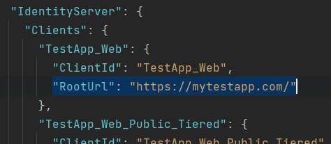
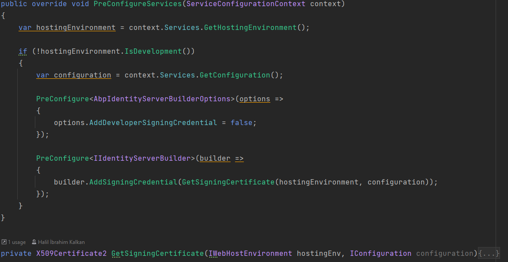
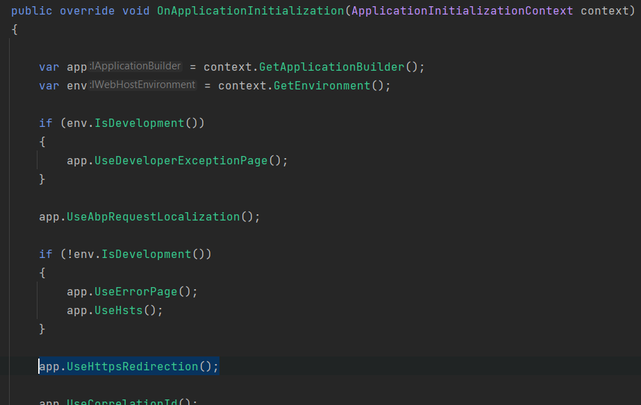
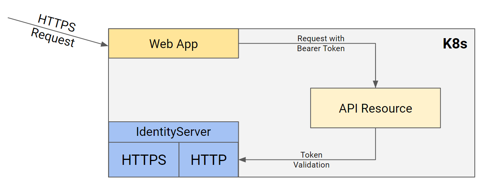
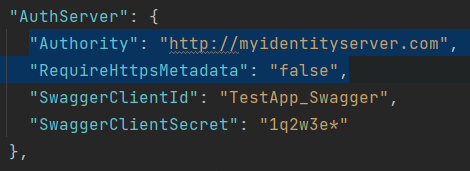

# IdentityServer Deployment

IdentityServer configuration may be different based on deployment configurations. Basically, you need update identityserver client related data and update your hosting preferences based on your deployment environment.

## Update Cors Origins

Cors origins configuration for **gateways**, **microservices** swagger authorization and **Angular/Blazor** (web assembly) must be updated for deployment. This can be found under **App** configuration in *appsettings.json* 

```json
"CorsOrigins": "https://*.MyProjectName.com,http://localhost:4200,https://localhost:44307,https://localhost:44325,https://localhost:44353,https://localhost:44367,https://localhost:44388,https://localhost:44381,https://localhost:44361",
```

## Update Redirect Allowed Urls

This configuration must be done if **Angular** or **Blazor** (web assembly) is used as back-office web application. It is found under **App** configuration in appsettings.json

```json
"RedirectAllowedUrls": "http://localhost:4200,https://localhost:44307"
```

## Update DbMigrator

`IdentityServerDataSeedContributor` uses **IdentityServer.Clients** section of `appsettings.json` for `ClientId`, `RedirectUri`, `PostLogoutRedirectUri`, `CorsOrigins`.

Update DbMigrator project `appsettings.json` **IdentityServer.Clients.RootUrls** with production values:



Or, manually add production values to `IdentityServerClientRedirectUris`, `IdentityServerClientPostLogoutRedirectUris`, `IdentityServerClientCorsOrigins` tables in your database.

> If you are using microservice template on-the-fly migration and not using dbmigrator project, update **IdentityService** appsettings.

Eventually, you shouldn't have `localhost` related data.

## Update IdentityServer

You need to update token signing certificate and identityserver midware based on your hosting environment.

### Signing Certificate

Default development environment uses [developer signing certificates option](https://github.com/abpframework/abp/blob/dev/modules/identityserver/src/Volo.Abp.IdentityServer.Domain/Volo/Abp/IdentityServer/AbpIdentityServerBuilderOptions.cs#L29). Using developer signing certificates may cause *IDX10501: Signature validation failed* error on production.

Update **IdentityServerModule** with using real certificate on `IIdentityServerBuilder` pre-configuration.



You can also [create self-signed certificate](https://docs.abp.io/en/commercial/5.0/startup-templates/microservice/tye-integration#create-developer-certificates) and use it.

> If you are using self signed certificate, do not forget to set the certificate (.pfx file) as `EmbeddedResource` and set `CopyToOutputDirectory`. File needs to exist physically.

### Use HTTPS

Update **IdentityServerModule** to [enfcore https](https://docs.microsoft.com/en-us/aspnet/core/security/enforcing-ssl?view=aspnetcore-6.0&tabs=visual-studio). Add `UseHsts` to add hsts headers to clients, add `UseHttpsRedirection` to redirect http requests to https.



### Behind Load Balancer

To redirect http requests to https from load balancer, update `OnApplicationInitialization` method of the **IdentityServerModule** with the midware below:

```csharp
app.Use((httpContext, next) =>
{
    httpContext.Request.Scheme = "https";
    return next();
});
```

### Kubernetes

A common scenario is running applications in kubernetes environment. While IdentityServer needs to face internet on https, internal requests can be done using http.



**HttpApi.Host** and **Web** applications authority should be set to http since token validations will done using http request.



> You can use different appsettings files like *appsettings.production.json* to override these values or directly override environment values from kubernetes.

To isolate internal identityserver requests from external network (internet), append extra header instead of overwriting. 
For ingress, you can use `nginx.ingress.kubernetes.io/configuration-snippet`:

```yaml
apiVersion: networking.k8s.io/v1
kind: Ingress
metadata:
  name: myidentityserver-ingress
  annotations:
    nginx.ingress.kubernetes.io/rewrite-target: /
    nginx.ingress.kubernetes.io/force-ssl-redirect: "true"
    nginx.ingress.kubernetes.io/proxy-buffer-size: "32k"
    nginx.ingress.kubernetes.io/proxy-buffers-number: "8"
    nginx.ingress.kubernetes.io/configuration-snippet: |
      more_set_input_headers "from-ingress: true";
spec:
```

You need to set the IdentityServer origin based on header. Update `OnApplicationInitialization` method of the **IdentityServerModule** with the midware below:

```csharp
app.Use(async (ctx, next) =>
{
    if (ctx.Request.Headers.ContainsKey("from-ingress"))
    {
        ctx.SetIdentityServerOrigin("https://myidentityserver.com");
    }

    await next();
});
```
