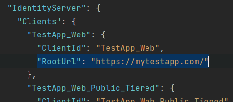
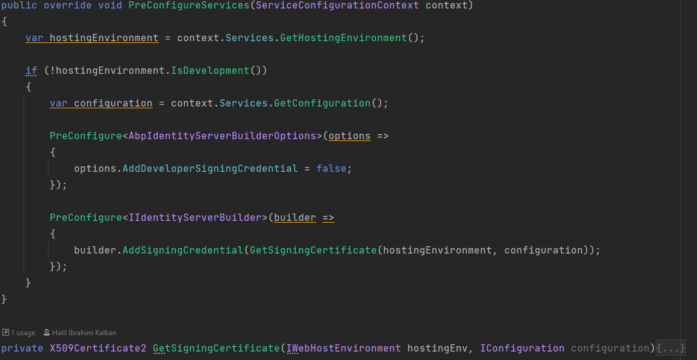
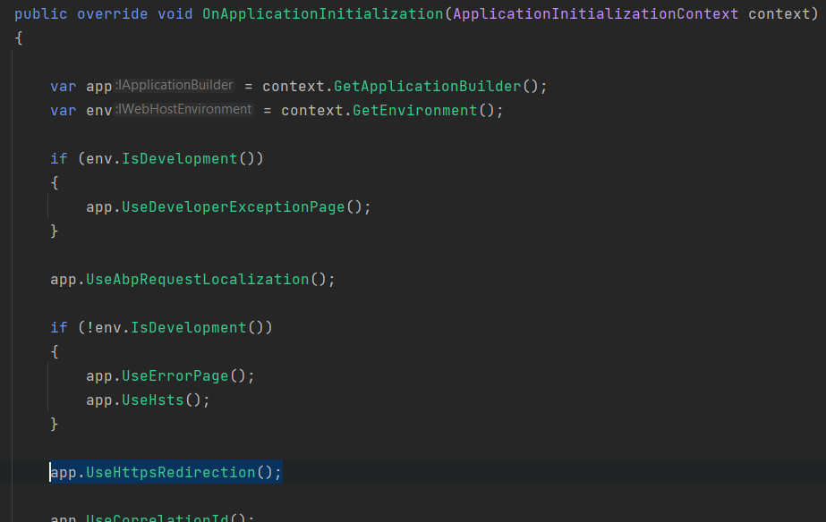
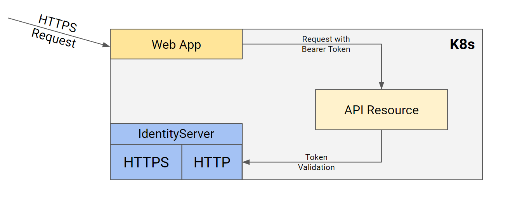

```json
//[doc-seo]
{
    "Description": "Learn how to configure IdentityServer for deployment, including CORS origins and redirect URLs, ensuring a secure and efficient setup for your applications."
}
```

# IdentityServer Deployment

> This page applies only to applications that still use the legacy [IdentityServer module](../../../modules/identity-server.md). Current startup templates use OpenIddict; see [Configuring OpenIddict](../../../deployment/configuring-openIddict.md) for current applications.

IdentityServer configuration changes between deployment environments. Update the IdentityServer client data and the host settings for the deployed URLs before releasing the application.

## Update CORS Origins

CORS origin configuration for **gateways**, **microservices** Swagger authorization and **Angular/Blazor WebAssembly** applications must be updated for deployment. It is under the **App** section in *appsettings.json*.

```json
"CorsOrigins": "https://*.MyProjectName.com,http://localhost:4200,https://localhost:44307,https://localhost:44325,https://localhost:44353,https://localhost:44367,https://localhost:44388,https://localhost:44381,https://localhost:44361",
```

## Update Redirect Allowed URLs

Update this configuration when an **Angular** or **Blazor WebAssembly** application is used as the back-office application. It is under the **App** section in *appsettings.json*.

```json
"RedirectAllowedUrls": "http://localhost:4200,https://localhost:44307"
```

## Update DbMigrator

`IdentityServerDataSeedContributor` uses **IdentityServer.Clients** section of `appsettings.json` for `ClientId`, `RedirectUri`, `PostLogoutRedirectUri`, `CorsOrigins`.

Update the DbMigrator project's `appsettings.json` **IdentityServer.Clients.RootUrls** values for production:



Or, manually add production values to `IdentityServerClientRedirectUris`, `IdentityServerClientPostLogoutRedirectUris`, `IdentityServerClientCorsOrigins` tables in your database.

> If you use the microservice template's on-the-fly migration instead of a DbMigrator project, update the **IdentityService** settings.

Remove all `localhost` values from the production client data.

## Update IdentityServer

Update the token-signing certificate and IdentityServer middleware for your hosting environment.

### Signing Certificate

The default `AbpIdentityServerBuilderOptions.AddDeveloperSigningCredential` value enables a developer signing credential. Don't use a developer signing credential in production; configure a real certificate through `IIdentityServerBuilder` pre-configuration. Otherwise, signing keys can change between deployments and cause errors such as *IDX10501: Signature validation failed*.

Update **IdentityServerModule** to use a real certificate in `IIdentityServerBuilder` pre-configuration.



Load the production certificate from your deployment platform's certificate or secret store. Don't embed the production private key in the application assembly or commit it to the source repository.

### Use HTTPS

Update **IdentityServerModule** to [enforce HTTPS](https://learn.microsoft.com/aspnet/core/security/enforcing-ssl). Add `UseHsts` to send HSTS headers and `UseHttpsRedirection` to redirect HTTP requests to HTTPS.



### Behind Load Balancer

When TLS terminates at a reverse proxy or load balancer, use ASP.NET Core Forwarded Headers Middleware so IdentityServer receives the original scheme and host. Follow the [Forwarded Headers](../../../deployment/forwarded-headers.md) guide and the [ASP.NET Core proxy and load balancer guidance](https://learn.microsoft.com/aspnet/core/host-and-deploy/proxy-load-balancer).

Configure the proxy addresses or networks in `ForwardedHeadersOptions.KnownProxies` or `KnownNetworks`, and call `UseForwardedHeaders` before authentication, IdentityServer, HTTPS redirection and HSTS middleware. If you enable `X-Forwarded-Host`, restrict `AllowedHosts` and configure the proxy to overwrite incoming forwarded headers.

Don't set `HttpContext.Request.Scheme` unconditionally. Don't derive the IdentityServer origin from a custom request header unless the application first verifies that the request came through a trusted proxy; internet clients can forge ordinary request headers.

### Kubernetes

A common scenario is running applications in Kubernetes. While IdentityServer must be exposed to the internet over HTTPS, internal requests can use HTTP.



Keep the externally advertised IdentityServer authority and origin on the public HTTPS URL. If services use cluster-local routing, configure internal DNS or the ingress so that the public authority resolves through the trusted internal route without changing the issuer or accepting a client-controlled origin.

> You can use environment-specific files such as *appsettings.Production.json* or environment variables to override these values in Kubernetes.
