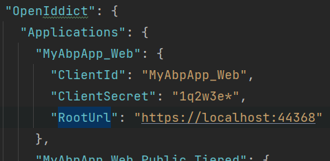
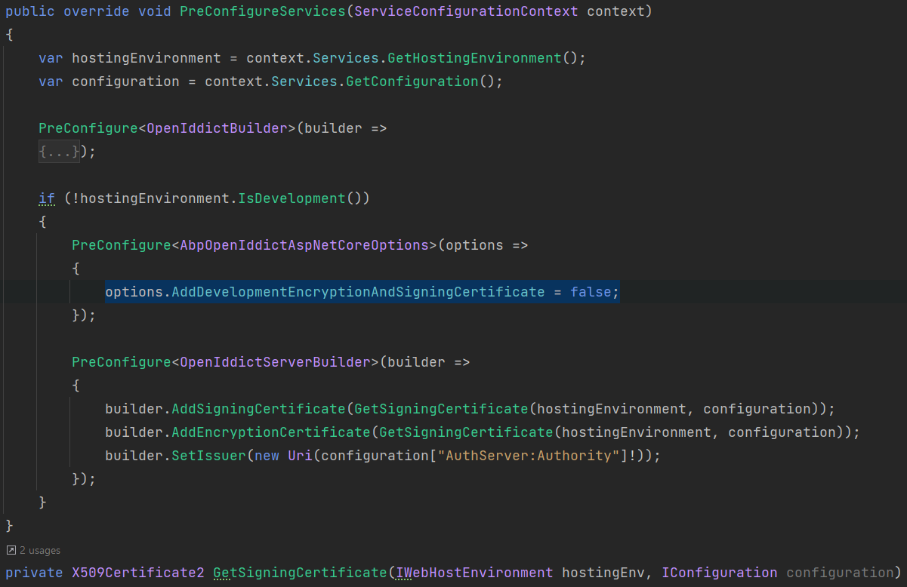

# OpenIddict Deployment

[OpenIddict](https://github.com/openiddict/openiddict-core) is the default OpenId Provider library used by ABP templates through the [OpenIddict Module](https://docs.abp.io/en/abp/latest/Modules/OpenIddict). It is hosted by the **AuthServer** project in the tiered/seperate-authserver application templates. For non-tiered applications, it is hosted by the Web (MVC/Razor), BlazorServer or the **HttpApi.Host** project for Blazor and Angular applications.

## Update Cors Origins

Cors origins configuration for ***gateways***, ***microservices*** swagger authorization, and ***Angular/Blazor*** (web assembly) must be updated for deployment. This can be found under the ***App*** configuration in **appsettings.json** 

```json
"CorsOrigins": "https://*.MyProjectName.com,http://localhost:4200,https://localhost:44307,https://localhost:44325,https://localhost:44353,https://localhost:44367,https://localhost:44388,https://localhost:44381,https://localhost:44361",
```
## Update Redirect Allowed URLs

If **Angular** or **Blazor** (Web Assembly) is used as a back-office web application, this configuration must be done. It is found under **App** configuration in `appsettings.json`.

```json
"RedirectAllowedUrls": "http://localhost:4200,https://localhost:44307"
```
## Update DbMigrator

`OpenIddictDataSeedContributor` uses **OpenIddict.Applications** section of `appsettings.json` for `ClientId`, `RedirectUri`, `PostLogoutRedirectUri` and `CorsOrigins`.

Update DbMigrator project `appsettings.json` **OpenIddict.Applications.RootUrls** with production values or override them:




> If you are using microservice template self-migration and not using DbMigrator project, update **IdentityService** appsettings.

Eventually, you shouldn't have any `localhost` related data.

## Update AuthServer

In the development environment, OpenIddict uses a development encryption and signing certificate. In the production environment, this must be disabled. OpenIddict needs a real certificate for signing and encrypting the tokens.

### Signing and Encryption Certificate

The default development environment uses [developer signing certificates option](https://github.com/abpframework/abp/blob/bda231b319b62582dee4f8389494cd4442ac474f/modules/openiddict/src/Volo.Abp.OpenIddict.AspNetCore/Volo/Abp/OpenIddict/AbpOpenIddictAspNetCoreModule.cs#L104-L105). Using developer signing certificates may cause *IDX10501: Signature validation failed* error on production.

Update **AuthServerModule** by using a real certificate on `OpenIddictBuilder` pre-configuration.



When you create a new application from the application template, ABP CLI automatically generates a new self-signed certificate with the name `openiddict.pfx` and a random password. This file and the password are provided in the `GetSigningCertificate` method.

> Note: If you are receiving errors about not being able to reach the `openiddict.pfx` file on the server, make sure you have the necessary permissions.

The best place to store your certificates will depend on your host:

- For IIS applications, [storing the certificates in the machine store](https://www.sonicwall.com/support/knowledge-base/how-can-i-import-certificates-into-the-ms-windows-local-machine-certificate-store/170504615105398/) is the recommended option.
- On Azure, certificates can be uploaded and exposed to Azure App Service applications using the special `WEBSITE_LOAD_CERTIFICATES` flag. For more information, visit the [Use a TLS/SSL certificate in your code in Azure App Service](https://docs.microsoft.com/en-us/azure/app-service/configure-ssl-certificate-in-code) document.

Please check [OpenIddict documentation](https://documentation.openiddict.com/configuration/encryption-and-signing-credentials.html#registering-a-certificate-recommended-for-production-ready-scenarios) for more information and using different types of signing/encryption keys.

### Using or Disabling the HTTPS

AuthServer that hosts the OpenIddict openid-provider library uses the SSL/TLS binding of the ASP.NET Core middleware. If you host it on `HTTPS`, the **Issuer** will be hosted on `HTTPS`. 

In some deployment scenarios, you may come across an error: 

```json
error: invalid_request
error_description: This server only accepts HTTPS requests.
error_uri: https//documnentation.openiddict.com/errors/ID2083
```

You can easily disable the HTTPS requirement from the **appsettings.json**:
```json
"AuthServer": {
    "Authority": "https://localhost:44369",
    "RequireHttpsMetadata": "false"    
  },
```

This configuration can be found under the `ConfigureServices` method of the AuthServer project:
```csharp
if (!Convert.ToBoolean(configuration["AuthServer:RequireHttpsMetadata"]))
{
    Configure<OpenIddictServerAspNetCoreOptions>(options =>
    {
        options.DisableTransportSecurityRequirement = true;
    }); 
}
```

### Behind Load Balancer

You may need to forward the headers if you are using [Nginx](https://www.nginx.com/) or [Kubernetes Nginx Ingress](https://github.com/kubernetes/ingress-nginx). 
Configure the options in the **ConfigureServices** method of `AuthServerModule`:

```csharp
Configure<ForwardedHeadersOptions>(options =>
{
    options.ForwardedHeaders = ForwardedHeaders.XForwardedFor | ForwardedHeaders.XForwardedProto;
});
```
And use the middleware in the **OnApplicationInitialization** method of `AuthServerModule`:
```csharp
if (env.IsDevelopment())
{
    app.UseDeveloperExceptionPage();
}

app.UseForwardedHeaders();
...
```

Sometimes, including forwarded headers in requests proxied to the application may be impossible. 
If the proxy enforces that all public external requests are HTTPS, the scheme can be manually set before using any middleware. 
Configure it under the **OnApplicationInitialization** method of `AuthServerModule`:

```csharp
app.Use((httpContext, next) =>
{
    httpContext.Request.Scheme = "https";
    return next();
});
```

# FAQ

- I see `Server Error 502!` 
  - Check your application logs under the *Logs* folder. A misconfiguration can prevent your application from starting up, and the easiest way is to pinpoint the problem by checking the logs.
- `System.IO.FileNotFoundException: Signing Certificate couldn't found!:`
  - Ensure you have the **.pfx** file in the related location. The **.pfx** file should be marked as an embedded resource, and it should be in the publish directory when you publish your application.
- I can't see the login page! It shows  an `HTTP 400` error.
  - This is related to the generated URL from the application that tries to authenticate against the AuthServer. Check the AuthServer logs and make sure you have **valid redirect_uri** seeded from the *OpenIddictDataSeedContributor* and the application that redirects to AuthServer has the same configuration.
