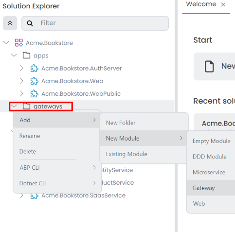
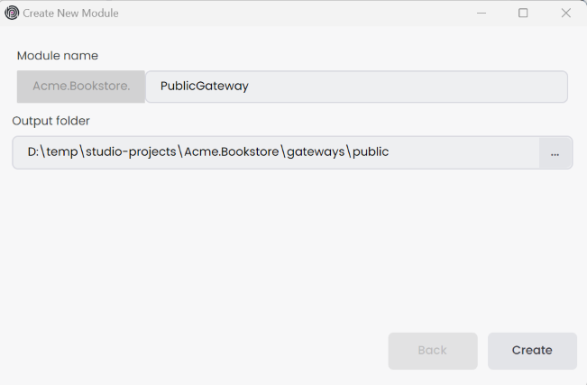
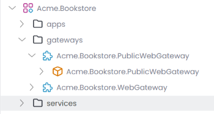
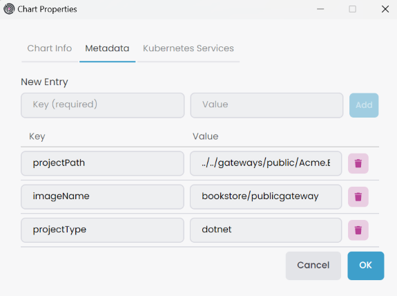
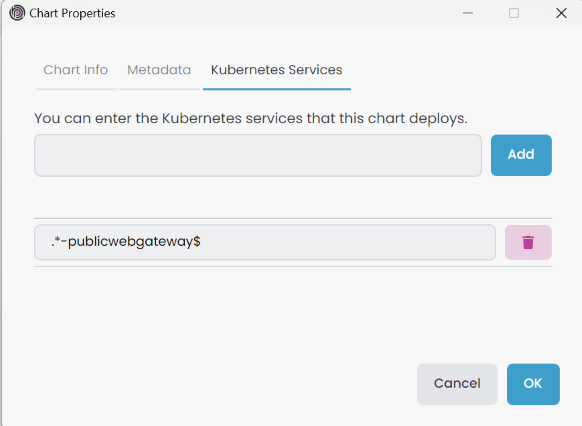

# Microservice Solution: Adding New API Gateways

````json
//[doc-nav]
{
  "Next": {
    "Name": "Mono-repo vs multiple repository approaches",
    "Path": "solution-templates/microservice/mono-repo-vs-multiple-repository-approaches"
  }
}
````

> You must have an ABP Business or a higher license to be able to create a microservice solution.

API gateways are the entry points of your microservice system. They are responsible for routing the incoming requests to the correct microservices. In a microservice system, you can have multiple API gateways to serve different purposes. For example, you can have a public API gateway for your customers and a private API gateway for your internal services. In the solution template, there is a folder named `gateways` that includes the API gateway projects. You can add new API gateways to this folder.

Additionally, there is a folder named `_templates` in the root directory. This folder contains templates you can use to create new microservices, API gateways, and applications. These templates can be customized according to your needs.

## Adding a New API Gateway

To add a new gateway application to the solution, you can use the `gateway` template. This template creates a new ASP.NET Core application with the necessary configurations and dependencies. Follow the steps below to add a new web application:

In ABP Studio [Solution Explorer](../../studio/solution-explorer.md#adding-a-new-microservice-module), right-click on the `gateways` folder and select `Add` -> `New Module` -> `Gateway`.



It opens the `Create New Module` dialog. Enter the name of the new gateway application, specify the output directory if needed, and click the `Create` button. There is a naming convention: the *Module name* should include the solution name as a prefix, and the use of the dot (.) character in the *Module name* is not allowed.



The new gateway is created and added to the solution. You can see the new application in the `gateways` folder.



### Configuring the appsettings.json

The new gateway application is use the [YARP](https://microsoft.github.io/reverse-proxy/) as a reverse proxy. You can configure the `appsettings.json` file to define the routes and endpoints. The `ReverseProxy` section in the `appsettings.json` file includes the configuration for the reverse proxy. You can add new routes and endpoints to this section.

```json
{
  "ReverseProxy": {
    "Routes": {
      "AbpApi": {
        "ClusterId": "Administration",
        "Match": {
          "Path": "/api/abp/{**catch-all}"
        }
      },
      "AdministrationSwagger": {
        "ClusterId": "Administration",
        "Match": {
          "Path": "/swagger-json/Administration/swagger/v1/swagger.json"
        },
        "Transforms": [
          { "PathRemovePrefix": "/swagger-json/Administration" }
        ]
      },
      "ProductService": {
        "ClusterId": "ProductService",
        "Match": {
          "Path": "/api/productservice/{**catch-all}"
        }
      },
      "ProductServiceSwagger": {
        "ClusterId": "ProductService",
        "Match": {
          "Path": "/swagger-json/ProductService/swagger/v1/swagger.json"
        },
        "Transforms": [
          { "PathRemovePrefix": "/swagger-json/ProductService" }
        ]
      }
    },
    "Clusters": {
      "Administration": {
        "Destinations": {
          "Administration": {
            "Address": "http://localhost:44393/"
          }
        }
      },
      "ProductService": {
        "Destinations": {
          "ProductService": {
            "Address": "http://localhost:44350/"
          }
        }
      }
    }
  }
}
```

### Configuring the OpenId Options

We should configure the OpenId options by modifying the `OpenIddictDataSeeder` in the `Identity` service. Below is an example of the `OpenIddictDataSeeder` options for the `PublicGateway` application.

Add the created gateway URL to the *redirectUris* parameter in the `CreateSwaggerClientAsync` method in the `OpenIddictDataSeeder` class.

```csharp
private async Task CreateSwaggerClientAsync(string clientId, string[] scopes)
{
    var webGatewaySwaggerRootUrl = _configuration["OpenIddict:Applications:WebGateway:RootUrl"]!.TrimEnd('/'); 
    //PublicGateway Url
    var publicGatewaySwaggerRootUrl = _configuration["OpenIddict:Applications:PublicGateway:RootUrl"]!.TrimEnd('/');
    ...

    await CreateOrUpdateApplicationAsync(
        name: clientId,
        type:  OpenIddictConstants.ClientTypes.Public,
        consentType: OpenIddictConstants.ConsentTypes.Implicit,
        displayName: "Swagger Test Client",
        secret: null,
        grantTypes: new List<string>
        {
            OpenIddictConstants.GrantTypes.AuthorizationCode,
        },
        scopes: commonScopes.Union(scopes).ToList(),
        redirectUris: new List<string> {
            $"{webGatewaySwaggerRootUrl}/swagger/oauth2-redirect.html",
            $"{publicGatewaySwaggerRootUrl}/swagger/oauth2-redirect.html", // PublicGateway redirect uri
            ...
        },
        clientUri: webGatewaySwaggerRootUrl,
        logoUri: "/images/clients/swagger.svg"
    );
}
```

Add the new gateway URL to the `appsettings.json` file in the `Identity` service.

```json
{
  "OpenIddict": {
    "Applications": {
      ...
      "PublicGateway": {
        "RootUrl": "http://localhost:44382"
      }
    }
  }
}
```

### Configuring the AuthServer

We should configure the AuthServer for **CORS** and **RedirectAllowedUrls**.

```json
"App": {
  "SelfUrl": "http://localhost:***",
  "CorsOrigins": "...... ,http://localhost:44382",
  "EnablePII": false,
  "RedirectAllowedUrls": "...... ,http://localhost:44382"
}
```

## Creating Helm Chart for the New Gateway

If you want to deploy the new gateway to Kubernetes, you should create a Helm chart for the new application.

First, add the new gateway to the `build-all-images.ps1` script in the `etc/helm` folder. You can copy the configurations from the existing applications and modify them according to the new application. Below is an example of the `build-all-images.ps1` script for the `PublicGateway` application.

```powershell
./build-image.ps1 -ProjectPath "../../gateways/public/Acme.Bookstore.PublicGateway/Acme.Bookstore.PublicGateway.csproj" -ImageName bookstore/publicgateway
```

Since we want to expose our gateway outside the cluster, we should add the host URL to the `values.projectname-local.yaml` file in the `etc/helm/projectname` folder. Below is an example of the `values.bookstore-local.yaml` file for the `PublicGateway` application.

```yaml
global:
  ...
  hosts:
    ...
    publicgateway: "[RELEASE_NAME]-publicgateway"
```

For development purposes, we should also create TLS certificates for the new gateway. You can edit the `create-tls-certificate.ps1` script in the `etc/helm` folder to generate TLS certificates for the new gateway. Below is an example of the `create-tls-certificate.ps1` script for the `PublicGateway` application.

```powershell
mkcert --cert-file bookstore-local.pem --key-file bookstore-local-key.pem "bookstore-local" ... "bookstore-local-publicgateway"
kubectl create namespace bookstore-local
kubectl create secret tls -n bookstore-local bookstore-local-tls --cert=./bookstore-local.pem --key=./bookstore-local-key.pem
```

Lastly, we should define the new application in the *_helpers.tpl* file in the `etc/helm/projectname/templates` folder. You can copy the configurations from the existing applications and modify them according to the new application. Below is an example of the *_helpers.tpl* file for the `PublicGateway` application.



Afterwards, we need to create a new Helm chart for the new gateway. You can copy the configurations from the existing applications and modify them according to the new gateway. Below is an example of the `publicgateway` Helm chart for the `PublicGateway` application.

{%{
```yaml
# values.yaml
image:
  repository: "bookstore/publicgateway"
  tag: "latest"
  pullPolicy: "IfNotPresent"
swagger:
  isEnabled: "true"

# Chart.yaml
apiVersion: v2
name: publicgateway
appVersion: "1.0"
description: Bookstore Public API Gateway
version: 1.0.0
type: application

# publicapigateway.yaml
apiVersion: apps/v1
kind: Deployment
metadata:
  name: "{{ .Release.Name }}-{{ .Chart.Name }}"
spec:
  selector:
    matchLabels:
      app: "{{ .Release.Name }}-{{ .Chart.Name }}"
  template:
    metadata:
      labels:
        app: "{{ .Release.Name }}-{{ .Chart.Name }}"
    spec:
      containers:
      - image: "{{ .Values.image.repository }}:{{ .Values.image.tag }}"
        imagePullPolicy: "{{ .Values.image.pullPolicy }}"
        name: "{{ .Release.Name }}-{{ .Chart.Name }}"
        ports:
        - name: "http"
          containerPort: 80
        env:
        - name: "DOTNET_ENVIRONMENT"
          value: "{{ .Values.global.dotnetEnvironment }}"
        - name: "ElasticSearch__IsLoggingEnabled"
          value: "{{ .Values.global.elasticSearch.isLoggingEnabled }}"
        - name: "ElasticSearch__Url"
          value: "http://{{ .Release.Name }}-elasticsearch:{{ .Values.global.elasticSearch.port }}"
        - name: "Swagger__IsEnabled"
          value: "{{ .Values.swagger.isEnabled }}"
        - name: "AbpStudioClient__StudioUrl"
          value: "{{ .Values.global.abpStudioClient.studioUrl }}"
        - name: "AbpStudioClient__IsLinkEnabled"
          value: "{{ .Values.global.abpStudioClient.isLinkEnabled }}"
        - name: "ReverseProxy__Clusters__Administration__Destinations__Administration__Address"
          value: "http://{{ .Release.Name }}-administration"
        - name: "ReverseProxy__Clusters__ProductService__Destinations__ProductService__Address"
          value: "http://{{ .Release.Name }}-productservice"

# publicapigateway-service.yaml
apiVersion: v1
kind: Service
metadata:
  labels:
    name: "{{ .Release.Name }}-{{ .Chart.Name }}"
  name: "{{ .Release.Name }}-{{ .Chart.Name }}"
spec:
  ports:
    - name: "80"
      port: 80
  selector:
    app: "{{ .Release.Name }}-{{ .Chart.Name }}"

# publicapigateway-ingress.yaml
apiVersion: networking.k8s.io/v1
kind: Ingress
metadata:
  name: "{{ .Release.Name }}-{{ .Chart.Name }}"
  annotations:
    nginx.ingress.kubernetes.io/rewrite-target: "/"
    nginx.ingress.kubernetes.io/force-ssl-redirect: "true"
    nginx.ingress.kubernetes.io/proxy-buffer-size: "32k"
    nginx.ingress.kubernetes.io/proxy-buffers-number: "8"
    cert-manager.io/cluster-issuer: "letsencrypt"
spec:
  ingressClassName: "nginx"
  tls:
  - hosts:
      - "{{ (include "bookstore.hosts.publicgateway" .) | trimPrefix "https://" }}"
    secretName: "{{ .Values.global.tlsSecret }}"
  rules:
  - host: "{{ (include "bookstore.hosts.publicgateway" .) | trimPrefix "https://" }}"
    http:
      paths:
      - path: /
        pathType: "Prefix"
        backend:
          service:
            name: "{{ .Release.Name }}-{{ .Chart.Name }}"
            port:
              number: 80
```
}%}

After creating the Helm chart, you can *Refresh Sub Charts* in the ABP Studio.


Then, update *Metadata* information right-click the *gateway* [sub-chart](../../studio/kubernetes.md#subchart), select *Properties* it open *Chart Properties* window. You can edit in the *Metadata* tab. 



Add the service name Regex pattern *Kubernetes Services* in the *Chart Properties* -> *Kubernetes Services* tab.



Last but not least, we need to configure the helm chart environments for identity microservice and auth-server application.

