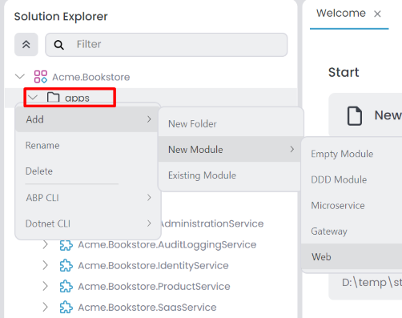
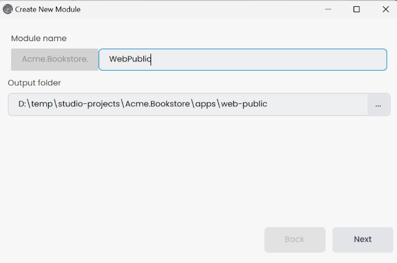
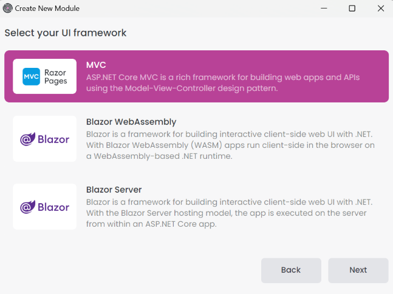
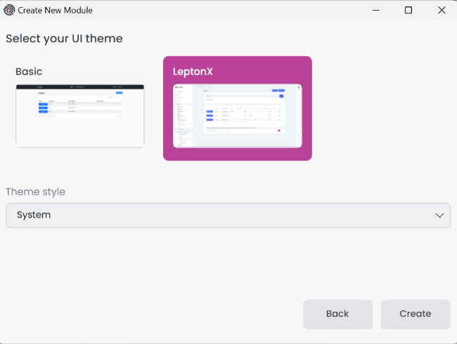
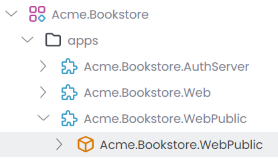
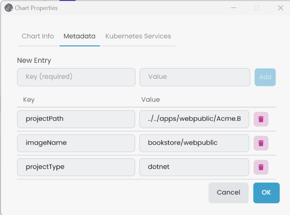
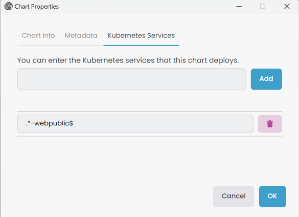

# Microservice Solution: Adding New Applications

````json
//[doc-nav]
{
  "Next": {
    "Name": "Adding new API gateways to Microservice solution",
    "Path": "solution-templates/microservice/adding-new-api-gateways"
  }
}
````

> You must have an ABP Business or a higher license to be able to create a microservice solution.

You can add new applications to the microservice solution template. This document explains how to add new web applications to the solution. In the solution template, there is a folder named `apps` in the root directory, which contains all the applications in the solution. You can create separate applications for different purposes, such as web applications, public websites for landing pages, or admin panels.

Additionally, there is a folder named `_templates` in the root directory. This folder contains templates you can use to create new microservices, API gateways, and applications. These templates can be customized according to your needs.

## Adding a New Web Application

To add a new web application to the solution, you can use the `web` template. This template creates a new ASP.NET Core application with the necessary configurations and dependencies. Follow the steps below to add a new web application:

In ABP Studio [Solution Explorer](../../studio/solution-explorer.md#adding-a-new-microservice-module), right-click on the `apps` folder and select `Add` -> `New Module` -> `Web`.



It opens the `Create New Module` dialog. Enter the name of the new application, specify the output directory if needed, and click the `Next` button. There is a naming convention: the *Module name* should include the solution name as a prefix, and the use of the dot (.) character in the *Module name* is not allowed.



Select the UI framework and click the `Next` button.



Select the UI theme and click the `Create` button.



The new application is created and added to the solution. You can see the new application in the `apps` folder.



### Configuring the appsettings.json

The new application is created with the necessary configurations and dependencies. We should configure the `appsettings.json` file to set the `Authority` section for authentication and the `Gateway` section for the API gateway. You can copy the configurations from the existing web application and modify them according to the new application. Below is an example of the `appsettings.json` file for the `Public` web application.

```json
{
  "App": {
    "SelfUrl": "http://localhost:44344",
    "EnablePII": false
  },
  "AuthServer": {
    "Authority": "http://localhost:44387",
    "RequireHttpsMetadata": "false",
    "ClientId": "WebPublic",
    "ClientSecret": "1q2w3e*",
    "IsOnK8s": "false",
    "MetaAddress": "http://localhost:44387"
  },
  "RemoteServices": {
    "Default": {
      "BaseUrl": "http://localhost:44333"
    }
  },
  ...
}
```

### Configuring the OpenId Options

You can use existing [OpenIddict applications](../../modules/openiddict.md#openiddictapplication) or create a new one for the new web application. In our example, we use *WebPublic* as the `ClientId` and *1q2w3e\** as the `ClientSecret`. According to the configurations in the `appsettings.json` file, we should configure the `OpenIddictDataSeeder` class in the `Identity` service. You can copy the configurations from the existing web application and modify them according to the new application. Below is an example of the `OpenIddictDataSeeder` configuration for the `Public` web application.

```csharp
private async Task CreateClientsAsync()
{
    ...

    //Web Public Client
    var webPublicClientRootUrl = _configuration["OpenIddict:Applications:WebPublic:RootUrl"]!.EnsureEndsWith('/');
    await CreateOrUpdateApplicationAsync(
        name: "WebPublic",
        type: OpenIddictConstants.ClientTypes.Confidential,
        consentType: OpenIddictConstants.ConsentTypes.Implicit,
        displayName: "Web Public Client",
        secret: "1q2w3e*",
        grantTypes: new List<string> //Hybrid flow
        {
            OpenIddictConstants.GrantTypes.AuthorizationCode,
            OpenIddictConstants.GrantTypes.Implicit
        },
        scopes: commonScopes.Union(new[]
        {
            "AuthServer", 
            "IdentityService",
            "SaasService",
            "AuditLoggingService",
            "AdministrationService"
        }).ToList(),
        redirectUris: new List<string> { $"{webPublicClientRootUrl}signin-oidc" },
        postLogoutRedirectUris: new List<string>() { $"{webPublicClientRootUrl}signout-callback-oidc" },
        clientUri: webPublicClientRootUrl,
        logoUri: "/images/clients/aspnetcore.svg"
    );
}
```

Add the new application URL to the `appsettings.json` file in the `Identity` service.

```json
{
  "OpenIddict": {
    "Applications": {
      ...
      "WebPublic": {
        "RootUrl": "http://localhost:44344"
      }
    }
  }
}
```

## Docker Configuration for Prometheus

If you want to monitor the new application with Prometheus when you debug the solution, you should add the new application to the `prometheus.yml` file in the `etc/docker/prometheus` folder. You can copy the configurations from the existing applications and modify them according to the new application. Below is an example of the `prometheus.yml` file for the `WebPublic` application.

```yml
  - job_name: 'webpublic'
    scheme: http
    metrics_path: 'metrics'
    static_configs:
    - targets: ['host.docker.internal:44344']
```

## Creating Helm Chart for the New Application

If you want to deploy the new application to Kubernetes, you should create a Helm chart for the new application.

First, add the new application to the `build-all-images.ps1` script in the `etc/helm` folder. You can copy the configurations from the existing applications and modify them according to the new application. Below is an example of the `build-all-images.ps1` script for the `WebPublic` application.

```powershell
./build-image.ps1 -ProjectPath "../../apps/web-public/Acme.Bookstore.WebPublic/Acme.Bookstore.WebPublic.csproj" -ImageName bookstore/webpublic
```

Since we want to expose our application outside the cluster, we should add the host URL to the `values.projectname-local.yaml` file in the `etc/helm/projectname` folder. Below is an example of the `values.bookstore-local.yaml` file for the `WebPublic` application.

```yaml
global:
  ...
  hosts:
    ...
    webpublic: "[RELEASE_NAME]-webpublic"
```

For development purposes, we should also create TLS certificates for the new application. You can edit the `create-tls-certificate.ps1` script in the `etc/helm` folder to generate TLS certificates for the new application. Below is an example of the `create-tls-certificate.ps1` script for the `WebPublic` application.

```powershell
mkcert --cert-file bookstore-local.pem --key-file bookstore-local-key.pem "bookstore-local" ... "bookstore-local-webpublic"
kubectl create namespace bookstore-local
kubectl create secret tls -n bookstore-local bookstore-local-tls --cert=./bookstore-local.pem --key=./bookstore-local-key.pem
```

Lastly, we should define the new application in the *_helpers.tpl* file in the `etc/helm/projectname/templates` folder. You can copy the configurations from the existing applications and modify them according to the new application. Below is an example of the *_helpers.tpl* file for the `WebPublic` application.



Afterwards, we need to create a new Helm chart for the new application. You can copy the configurations from the existing applications and modify them according to the new application. Below is an example of the `webpublic` Helm chart for the `WebPublic` application.

{%{
```yaml
# values.yaml
image:
  repository: "bookstore/webpublic"
  tag: "latest"
  pullPolicy: IfNotPresent
authServer:
  clientSecret: "1q2w3e*"

# Chart.yaml
apiVersion: v2
name: webpublic
appVersion: "1.0"
description: Bookstore Web Public Application
version: 1.0.0
type: application

# webpublic.yaml
apiVersion: apps/v1
kind: Deployment
metadata:
  name: "{{ .Release.Name }}-{{ .Chart.Name }}"
spec:
  selector:
    matchLabels:
      app: "{{ .Release.Name }}-{{ .Chart.Name }}"
  template:
    metadata:
      labels:
        app: "{{ .Release.Name }}-{{ .Chart.Name }}"
    spec:
      containers:
      - image: "{{ .Values.image.repository }}:{{ .Values.image.tag }}"
        imagePullPolicy: "{{ .Values.image.pullPolicy }}"
        name: "{{ .Release.Name }}-{{ .Chart.Name }}"
        ports:
        - name: "http"
          containerPort: 80
        env:
        - name: "DOTNET_ENVIRONMENT"
          value: "{{ .Values.global.dotnetEnvironment }}"
        - name: "App__SelfUrl"
          value: "{{ include "bookstore.hosts.webpublic" . }}"
        - name: App__EnablePII
          value: "{{ .Values.global.enablePII }}"
        - name: "AuthServer__Authority"
          value: "{{ include "bookstore.hosts.authserver" . }}"
        - name: "AuthServer__ClientSecret"
          value: "{{ .Values.authServer.clientSecret }}"
        - name: "AuthServer__IsOnK8s"
          value: "true"
        - name: "AuthServer__MetaAddress"
          value: "http://{{ .Release.Name }}-authserver"
        - name: "RemoteServices__Default__BaseUrl"
          value: "http://{{ .Release.Name }}-webgateway"
          ...

# webpublic-service.yaml
apiVersion: v1
kind: Service
metadata:
  labels:
    name: "{{ .Release.Name }}-{{ .Chart.Name }}"
  name: "{{ .Release.Name }}-{{ .Chart.Name }}"
spec:
  ports:
    - name: "80"
      port: 80
  selector:
    app: "{{ .Release.Name }}-{{ .Chart.Name }}"

# webpublic-ingress.yaml
apiVersion: networking.k8s.io/v1
kind: Ingress
metadata:
  name: "{{ .Release.Name }}-{{ .Chart.Name }}"
  annotations:
    nginx.ingress.kubernetes.io/rewrite-target: "/"
    nginx.ingress.kubernetes.io/force-ssl-redirect: "true"
    nginx.ingress.kubernetes.io/proxy-buffer-size: "32k"
    nginx.ingress.kubernetes.io/proxy-buffers-number: "8"
    cert-manager.io/cluster-issuer: "letsencrypt"
spec:
  ingressClassName: "nginx"
  tls:
  - hosts:
      - "{{ (include "bookstore.hosts.webpublic" .) | trimPrefix "https://" }}"
    secretName: "{{ .Values.global.tlsSecret }}"
  rules:
  - host: "{{ (include "bookstore.hosts.webpublic" .) | trimPrefix "https://" }}"
    http:
      paths:
      - path: /
        pathType: "Prefix"
        backend:
          service:
            name: "{{ .Release.Name }}-{{ .Chart.Name }}"
            port:
              number: 80
```
}%}

After creating the Helm chart, you can *Refresh Sub Charts* in the ABP Studio.


Then, update *Metadata* information right-click the *application* [sub-chart](../../studio/kubernetes.md#subchart), select *Properties* it open *Chart Properties* window. You can edit in the *Metadata* tab. 



Add the service name Regex pattern *Kubernetes Services* in the *Chart Properties* -> *Kubernetes Services* tab.



Last but not least, we need to configure the helm chart environments for identity microservice.



## Customizing the Application Template

You can customize the application template if needed. Add new configurations, dependencies, or modules to the template by opening the `_templates` folder in the root directory and then the `web` folder. Modify the `web` template as required. The naming convention dictates that *microservicename* represents the name of the application when created. Use *microservicename* in the template files for dynamic naming. In the `web` folder, there are 3 subfolders: *Blazor*, *BlazorServer*, and *MVC*. You can customize the template according to the UI framework you selected when creating the new application. 