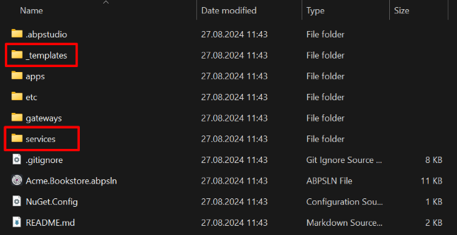
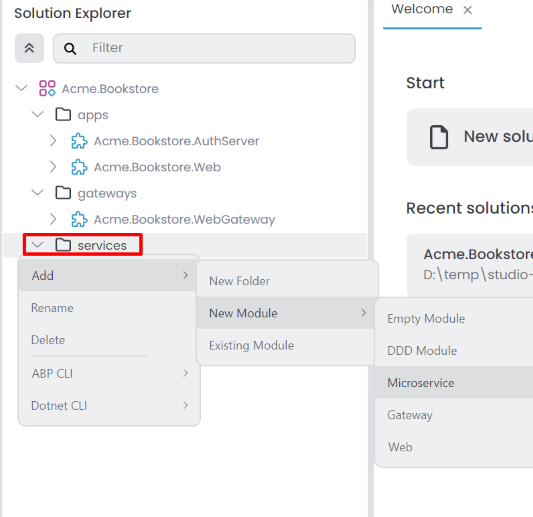
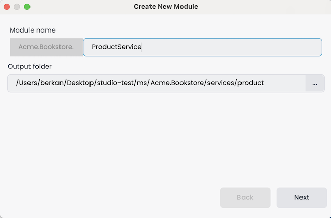
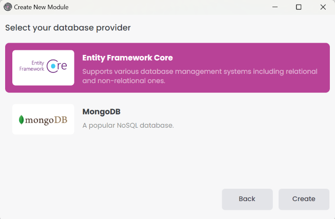
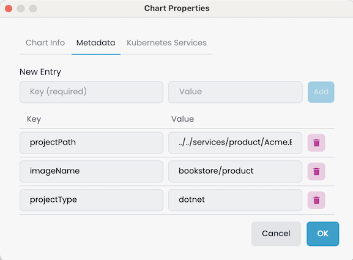
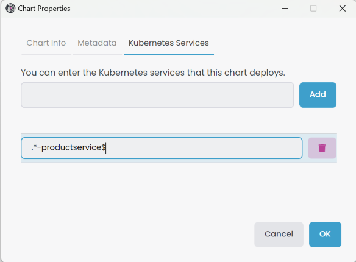

# Microservice Solution: Adding New Microservices

````json
//[doc-nav]
{
  "Next": {
    "Name": "Adding new applications to Microservice solution",
    "Path": "solution-templates/microservice/adding-new-applications"
  }
}
````

> You must have an ABP Business or a higher license to be able to create a microservice solution.

This document explains how to add new microservices to the microservice solution template. In the solution template, there is a folder named `services` in the root directory, which contains all the microservices in the solution. Each microservice is a separate ASP.NET Core application that can be developed, tested, and deployed independently.

Additionally, there is a folder named `_templates` in the root directory. This folder contains templates you can use to create new microservices, API gateways, and applications. These templates can be customized according to your needs.



## Adding a New Microservice

To add a new microservice to the solution, you can use the `service_nolayers` template. This template creates a new ASP.NET Core application with the necessary configurations and dependencies. Follow the steps below to add a new microservice:

In ABP Studio [Solution Explorer](../../studio/solution-explorer.md#adding-a-new-microservice-module), right-click on the `services` folder and select `Add` -> `New Module` -> `Microservice`.



It opens the `Create New Module` dialog. Enter the name of the new microservice, specify the output directory if needed, and click the `Next` button. There is a naming convention: the *Module name* should include the solution name as a prefix, and the use of the dot (.) character in the *Module name* is not allowed.



Select the database provider and click the `Create` button.



When you create a new microservice, you can choose to enable integration with the current solution. If you check *Enable integration*, the new microservice is added to the solution, and the necessary configurations are made automatically, so no manual configuration is needed. If you uncheck the *Enable integration* option, you will need to manually configure the new microservice. You can follow the steps in this documentation, starting from the [Configuring the appsettings.json](#configuring-the-appsettingsjson) section.


The new microservice is created and added to the solution. You can see the new microservice in the `services` folder.


### Configuring the appsettings.json

The new microservice is created with the necessary configurations and dependencies. We should configure several sections by modifying the `appsettings.json` file:
 * Set the `CorsOrigins` to allow the web gateway to access the microservice.
 * Set the `AuthServer` configurations to enable the microservice to authenticate and authorize users.

You can copy the configurations from the existing microservices and modify them according to the new microservice. Below is an example of the `appsettings.json` file for the `ProductService` microservice.

```diff
{
  "ConnectionStrings": {
    "Administration": "Server=localhost,1434; User Id=sa; Password=myPassw@rd; Database=Bookstore_Administration; TrustServerCertificate=true",
    "AbpBlobStoring": "Server=localhost,1434; User Id=sa; Password=myPassw@rd; Database=Bookstore_BlobStoring; TrustServerCertificate=true",
    "ProductService": "Server=localhost,1434; User Id=sa; Password=myPassw@rd; Database=Bookstore_ProductService; TrustServerCertificate=true"
  },
  "App": {
-   "CorsOrigins": "http://localhost:webgateway_port",
+   "CorsOrigins": "http://localhost:44333",
    "EnablePII": false
  },
  "Swagger": {
    "IsEnabled": true
  },
  "AuthServer": {
-   "Authority": "http://localhost:authserver_port",
-   "MetaAddress": "http://localhost:authserver_port",
+   "Authority": "http://localhost:44387",
+   "MetaAddress": "http://localhost:44387",
    "RequireHttpsMetadata": "false",
    "SwaggerClientId": "SwaggerTestUI",
    "Audience": "ProductService"
  },
  "Redis": {
    "Configuration": "localhost:6379"
  },
  "RabbitMQ": {
    "Connections": {
      "Default": {
        "HostName": "localhost"
      }
    },
    "EventBus": {
      "ClientName": "Bookstore_ProductService",
      "ExchangeName": "Bookstore"
    }
  },
  "AbpDistributedCache": {
    "KeyPrefix": "Bookstore:"
  },
  "DataProtection": {
    "ApplicationName": "Bookstore",
    "Keys": "Bookstore-Protection-Keys"
  },
  "ElasticSearch": {
    "IsLoggingEnabled": "true",
    "Url": "http://localhost:9200"
  },
  "StringEncryption": {
     "DefaultPassPhrase": "PDAWjbshpwlOwNB6"
  }
}
```

### Configuring the OpenId Options

We should configure the OpenId options by modifying the `OpenIddictDataSeeder` in the `Identity` service. Below is an example of the `OpenIddictDataSeeder` options for the `Product` microservice.

Create API scopes and add the required API scope for Swagger clients in the `CreateApiScopesAsync` and `CreateSwaggerClientsAsync` methods in the `OpenIddictDataSeeder` class.

```diff
private async Task CreateApiScopesAsync()
{
    await CreateScopesAsync("AuthServer");
    await CreateScopesAsync("IdentityService");
    await CreateScopesAsync("AdministrationService");
+   await CreateScopesAsync("ProductService");
}

private async Task CreateSwaggerClientsAsync()
{
    await CreateSwaggerClientAsync("SwaggerTestUI", new[]
    {
        "AuthServer",
        "IdentityService",
        "AdministrationService",
+       "ProductService"
    });
}
```

Add the redirect URL for the new service in the `CreateSwaggerClientAsync` method.

```diff
private async Task CreateSwaggerClientAsync(string clientId, string[] scopes)
{
    ...
    ...
    ...
    var administrationServiceRootUrl = _configuration["OpenIddict:Resources:AdministrationService:RootUrl"]!.TrimEnd('/');
+   var productServiceRootUrl = _configuration["OpenIddict:Resources:ProductService:RootUrl"]!.TrimEnd('/');

    await CreateOrUpdateApplicationAsync(
        name: clientId,
        type:  OpenIddictConstants.ClientTypes.Public,
        consentType: OpenIddictConstants.ConsentTypes.Implicit,
        displayName: "Swagger Test Client",
        secret: null,
        grantTypes: new List<string>
        {
            OpenIddictConstants.GrantTypes.AuthorizationCode,
        },
        scopes: commonScopes.Union(scopes).ToList(),
        redirectUris: new List<string> {
            $"{webGatewaySwaggerRootUrl}/swagger/oauth2-redirect.html",
            $"{authServerRootUrl}/swagger/oauth2-redirect.html",
            $"{identityServiceRootUrl}/swagger/oauth2-redirect.html",
            $"{administrationServiceRootUrl}/swagger/oauth2-redirect.html",
+           $"{productServiceRootUrl}/swagger/oauth2-redirect.html"
        }
    );
}
```

Add the allowed scope for the web (front-end) application(s) in the `CreateClientsAsync` method. You might have different clients for different UI applications such as web, Angular, React, etc. Ensure you add the new microservice to the allowed scopes of these clients.

```diff
private async Task CreateClientsAsync()
{
    var commonScopes = new List<string>
    {
        OpenIddictConstants.Permissions.Scopes.Address,
        OpenIddictConstants.Permissions.Scopes.Email,
        OpenIddictConstants.Permissions.Scopes.Phone,
        OpenIddictConstants.Permissions.Scopes.Profile,
        OpenIddictConstants.Permissions.Scopes.Roles
    };

    //Web Client
    var webClientRootUrl = _configuration["OpenIddict:Applications:Web:RootUrl"]!.EnsureEndsWith('/');
    await CreateOrUpdateApplicationAsync(
        name: "Web",
        type: OpenIddictConstants.ClientTypes.Confidential,
        consentType: OpenIddictConstants.ConsentTypes.Implicit,
        displayName: "Web Client",
        secret: "1q2w3e*",
        grantTypes: new List<string>
        {
            OpenIddictConstants.GrantTypes.AuthorizationCode,
            OpenIddictConstants.GrantTypes.Implicit
        },
        scopes: commonScopes.Union(new[]
        {
            "AuthServer", 
            "IdentityService",
            "SaasService",
            "AuditLoggingService",
            "AdministrationService",
+           "ProductService"
        }).ToList(),
        redirectUris: new List<string> { $"{webClientRootUrl}signin-oidc" },
        postLogoutRedirectUris: new List<string>() { $"{webClientRootUrl}signout-callback-oidc" },
        clientUri: webClientRootUrl,
        logoUri: "/images/clients/aspnetcore.svg"
    );
}
```

Add the new service URL to the `appsettings.json` file in the `Identity` microservice. In this example we're gonna edit the *Acme.Bookstore.IdentityService* project `appsettings.json` file.

```diff
"OpenIddict": {
  "Applications": {
    ...
  },
  "Resources": {
    ...
+    "ProductService": {
+      "RootUrl": "http://localhost:44350"
+    }
  }
}
```

### Configuring the AuthServer

We should configure the *AuthServer* application `appsettings.json` file for the **CorsOrigins** and **RedirectAllowedUrls** sections.

```diff
...
"App": {
  "SelfUrl": "http://localhost:***",
- "CorsOrigins": "http://localhost:44358,..",
+ "CorsOrigins": "http://localhost:44358,..,http://localhost:44350",
  "EnablePII": false,
- "RedirectAllowedUrls": "http://localhost:44358,..",
+ "RedirectAllowedUrls": "http://localhost:44358,..,http://localhost:44350"
},
...
```

### Configuring the API Gateway

We should configure the API Gateway to access the new microservice. First, add the **Product** sections to the `appsettings.json` file in the `WebGateway` project. In this example we're gonna edit the *Acme.Bookstore.WebGateway* project `appsettings.json` file.

```diff
"ReverseProxy": {
    "Routes": {
      ...
+      "Product": {
+        "ClusterId": "Product",
+        "Match": {
+          "Path": "/api/product/{**catch-all}"
+        }
+      },
+      "ProductSwagger": {
+        "ClusterId": "Product",
+        "Match": {
+          "Path": "/swagger-json/Product/swagger/v1/swagger.json"
+        },
+        "Transforms": [
+          { "PathRemovePrefix": "/swagger-json/Product" }
+        ]
+      }
    },
    "Clusters": {
      ...
+      "Product": {
+        "Destinations": {
+          "Product": {
+            "Address": "http://localhost:44350/"
+          }
+        }
+      }
    }
}
```

Afterwards, open the `ProjectNameWebGatewayModule` class in the `WebGateway` project and add the `ProductService` to the `ConfigureSwaggerUI` method. In this example we're gonna edit the `BookstoreWebGatewayModule` file.

```diff
private static void ConfigureSwaggerUI(
    IProxyConfig proxyConfig,
    SwaggerUIOptions options,
    IConfiguration configuration)
{
    foreach (var cluster in proxyConfig.Clusters)
    {
        options.SwaggerEndpoint($"/swagger-json/{cluster.ClusterId}/swagger/v1/swagger.json", $"{cluster.ClusterId} API");
    }

    options.OAuthClientId(configuration["AuthServer:SwaggerClientId"]);
    options.OAuthScopes(
        "AdministrationService",
        "AuthServer",
        ...,
+       "ProductService"
    );
}
```

### Configuring the UI Services

We should configure the UI application(s) to allow the new microservice to access through the web gateway. To do this, we should add the new microservice scope to the `ConfigureAuthentication` method in the `ProjectName...Module` class in the `Web` or `Blazor` application. In this example we're gonna edit the `BookstoreWebModule` file.

```diff
private void ConfigureAuthentication(ServiceConfigurationContext context, IConfiguration configuration)
{
  context.Services.AddAuthentication(options =>
  {
    options.DefaultScheme = "Cookies";
    options.DefaultChallengeScheme = "oidc";
  })
  .AddCookie("Cookies", options =>
  {
    options.ExpireTimeSpan = TimeSpan.FromDays(365);
  })
  .AddAbpOpenIdConnect("oidc", options =>
  {
    ...
    options.Scope.Add("AuthServer");
    options.Scope.Add("IdentityService");
    options.Scope.Add("AdministrationService");
+  	options.Scope.Add("ProductService");
  });
  ...
}
```

Similarly, if you have an Angular application, you should add the new service scope to the `oAuthConfig` in `environment.ts`:

```diff
const baseUrl = 'http://localhost:4200';

const oAuthConfig = {
  issuer: 'http://localhost:44387',
  redirectUri: baseUrl,
  clientId: 'Angular',
  responseType: 'code',
- scope: 'openid profile email roles AuthServer IdentityService AdministrationService',
+ scope: 'openid profile email roles AuthServer IdentityService AdministrationService ProductService',
  requireHttps: false
};
```

## Docker Configuration for Prometheus

If you want to monitor the new microservice with Prometheus when you debug the solution, you should add the new microservice to the `prometheus.yml` file in the `etc/docker/prometheus` folder. You can copy the configurations from the existing microservices and modify them according to the new microservice. Below is an example of the `prometheus.yml` file for the `Product` microservice.

```diff
  - job_name: 'authserver'
    scheme: http
    metrics_path: 'metrics'
    static_configs:
    - targets: ['host.docker.internal:44398']
    ...
+ - job_name: 'product'
+   scheme: http
+   metrics_path: 'metrics'
+   static_configs:
+   - targets: ['host.docker.internal:44350']
```

## Creating Helm Chart for the New Microservice

If you want to deploy the new microservice to Kubernetes, you should create a Helm chart for the new microservice.

First, we need to add the new microservice to the `build-all-images.ps1` script in the `etc/helm` folder. You can copy the configurations from the existing microservices and modify them according to the new microservice. Below is an example of the `build-all-images.ps1` script for the `Product` microservice.

```diff
...
  ./build-image.ps1 -ProjectPath "../../apps/auth-server/Acme.Bookstore.AuthServer/Acme.Bookstore.AuthServer.csproj" -ImageName bookstore/authserver
+ ./build-image.ps1 -ProjectPath "../../services/product/Acme.Bookstore.ProductService/Acme.Bookstore.ProductService.csproj" -ImageName bookstore/product
```

Then, we need to add the connection string to the `values.projectname-local.yaml` file in the `etc/helm/projectname` folder. Below is an example of the `values.bookstore-local.yaml` file for the `Product` microservice.

```diff
global:
  ...
  connectionStrings:
    ...
+   product: "Server=[RELEASE_NAME]-sqlserver,1433; Database=Bookstore_ProductService; User Id=sa; Password=myPassw@rd; TrustServerCertificate=True"
```

Afterwards, we need to create a new Helm chart for the new microservice. You can copy the configurations from the existing microservices and modify them according to the new microservice. Below is an example of the `product` Helm chart for the `Product` microservice.

Product microservice `values.yaml` file. 



Product microservice `Chart.yaml` file. 



Product microservice `product.yaml` file. 

{%{
```yaml
apiVersion: apps/v1
kind: Deployment
metadata:
  name: "{{ .Release.Name }}-{{ .Chart.Name }}"
spec:
  selector:
    matchLabels:
      app: "{{ .Release.Name }}-{{ .Chart.Name }}"
  template:
    metadata:
      labels:
        app: "{{ .Release.Name }}-{{ .Chart.Name }}"
    spec:
      containers:
      - image: "{{ .Values.image.repository }}:{{ .Values.image.tag }}"
        imagePullPolicy: "{{ .Values.image.pullPolicy }}"
        name: "{{ .Release.Name }}-{{ .Chart.Name }}"
        ports:
        - name: "http"
          containerPort: 80
        env:
        - name: "DOTNET_ENVIRONMENT"
          value: "{{ .Values.global.dotnetEnvironment }}"
        - name: "ConnectionStrings__Administration"
          value: "{{ .Values.global.connectionStrings.administration | replace "[RELEASE_NAME]" .Release.Name }}"
        - name: "ConnectionStrings__AbpBlobStoring"
          value: "{{ .Values.global.connectionStrings.blobStoring | replace "[RELEASE_NAME]" .Release.Name }}"
        - name: "ConnectionStrings__ProductService"
          value: "{{ .Values.global.connectionStrings.product | replace "[RELEASE_NAME]" .Release.Name }}"
          ...
```
}%}

Product microservice `product-service.yaml` file. 



After creating the Helm chart, you can *Refresh Sub Charts* in the ABP Studio.


Then, update *Metadata* information right-click the *microservicename* [sub-chart](../../studio/kubernetes.md#subchart), select *Properties* it open *Chart Properties* window. You should add the following keys in the *Metadata* tab.



- `projectPath`: The path to the microservice host application project. In the bookstore example, this value is `../../services/product/Acme.Bookstore.ProductService/Acme.Bookstore.ProductService.csproj`.
- `imageName`: When we build the Docker image, it uses this value as the Docker image name. We're going to use it in the Helm chart values.
- `projectType`: You can add a Helm chart for Angular and .NET projects, which is why we should explicitly specify the project type.

Add the *Kubernetes Services* in the *Chart Properties* -> *Kubernetes Services* tab.



> This value should be the same as the [solution runner application](./../../studio/running-applications.md#properties) *Kubernetes service* value. It's necessary for browsing because when we connect to the Kubernetes cluster, we should browse the Kubernetes services instead of using the Launch URL.

Last but not least, we need to configure the helm chart environments for identity, auth-server, and gateway applications.

Below is an example of the *Identity* microservice `identity.yaml` file. 

{%{
```diff
apiVersion: apps/v1
kind: Deployment
metadata:
  name: "{{ .Release.Name }}-{{ .Chart.Name }}"
spec:
  selector:
    matchLabels:
      app: "{{ .Release.Name }}-{{ .Chart.Name }}"
  template:
    metadata:
      labels:
        app: "{{ .Release.Name }}-{{ .Chart.Name }}"
    spec:
      containers:
      - image: "{{ .Values.image.repository }}:{{ .Values.image.tag }}"
        imagePullPolicy: "{{ .Values.image.pullPolicy }}"
        name: "{{ .Release.Name }}-{{ .Chart.Name }}"
        ports:
        - name: "http"
          containerPort: 80
        env:
        ...
+       - name: "OpenIddict__Resources__ProductService__RootUrl"
+         value: "http://{{ .Release.Name }}-product"
```
}%}

Below is an example of the *AuthServer* application `authserver.yaml` file. 

{%{
```diff
apiVersion: apps/v1
kind: Deployment
metadata:
  name: "{{ .Release.Name }}-{{ .Chart.Name }}"
spec:
  selector:
    matchLabels:
      app: "{{ .Release.Name }}-{{ .Chart.Name }}"
  template:
    metadata:
      labels:
        app: "{{ .Release.Name }}-{{ .Chart.Name }}"
    spec:
      containers:
      - image: "{{ .Values.image.repository }}:{{ .Values.image.tag }}"
        imagePullPolicy: "{{ .Values.image.pullPolicy }}"
        name: "{{ .Release.Name }}-{{ .Chart.Name }}"
        ports:
        - name: "http"
          containerPort: 80
        env:
        ...
        - name: "App__CorsOrigins"
-         value: "...,http://{{ .Release.Name }}-administration"
+         value: "...,http://{{ .Release.Name }}-administration,http://{{ .Release.Name }}-product"
```
}%}

Below is an example of the *WebApiGateway* application `webapigateway.yaml` file.

{%{
```diff
apiVersion: apps/v1
kind: Deployment
metadata:
  name: "{{ .Release.Name }}-{{ .Chart.Name }}"
spec:
  selector:
    matchLabels:
      app: "{{ .Release.Name }}-{{ .Chart.Name }}"
  template:
    metadata:
      labels:
        app: "{{ .Release.Name }}-{{ .Chart.Name }}"
    spec:
      containers:
      - image: "{{ .Values.image.repository }}:{{ .Values.image.tag }}"
        imagePullPolicy: "{{ .Values.image.pullPolicy }}"
        name: "{{ .Release.Name }}-{{ .Chart.Name }}"
        ports:
        - name: "http"
          containerPort: 80
        env:
        ...
+       - name: "ReverseProxy__Clusters__Product__Destinations__Product__Address"
+         value: "http://{{ .Release.Name }}-product"
```
}%}

## Customizing the Microservice Template

You can customize the microservice template if needed. Add new configurations, dependencies, or modules to the template by opening the `_templates` folder in the root directory and then the `service_nolayers` folder. Modify the `service_nolayers` template as required. The naming convention dictates that *microservicename* represents the name of the microservice when created. Use *microservicename* in the template files for dynamic naming. Existing `service_nolayers` template do not include the [SaaS](../../modules/saas.md) and [Audit Logging](../../modules/audit-logging-pro.md) modules by default. If creating a solution with these modules, add the necessary configurations to the `service_nolayers` template files.

## Developing the UI for the New Microservice

After adding the new microservice to the solution, you can develop the UI for the new microservice. For .NET applications, you can add the microservice *Contracts* package to the UI application(s) to access the services provided by the new microservice. Afterwards, you can use the [generate-proxy](../../cli/index.md#generate-proxy) command to generate the proxy classes for the new microservice.

```bash
abp generate-proxy -t csharp -url http://localhost:44333/ -m product --without-contracts
```

Next, start creating *Pages* and *Components* for the new microservice in the UI application(s). Similarly, if you have an Angular application, you can use the [generate-proxy](../../cli/index.md#generate-proxy) command to generate the proxy classes for the new microservice and start developing the UI.

```bash
abp generate-proxy -t ng -url http://localhost:44333/ -m product
```