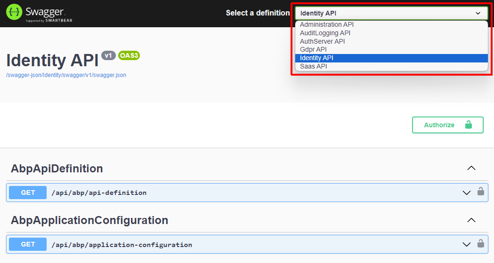
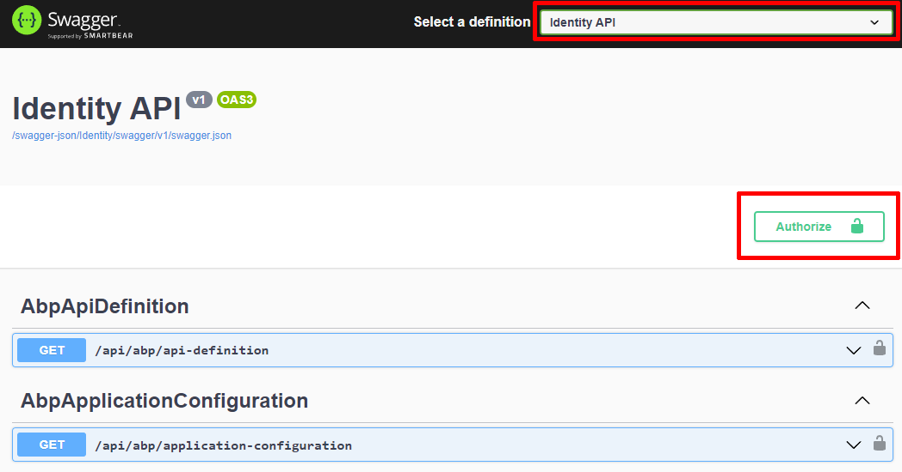
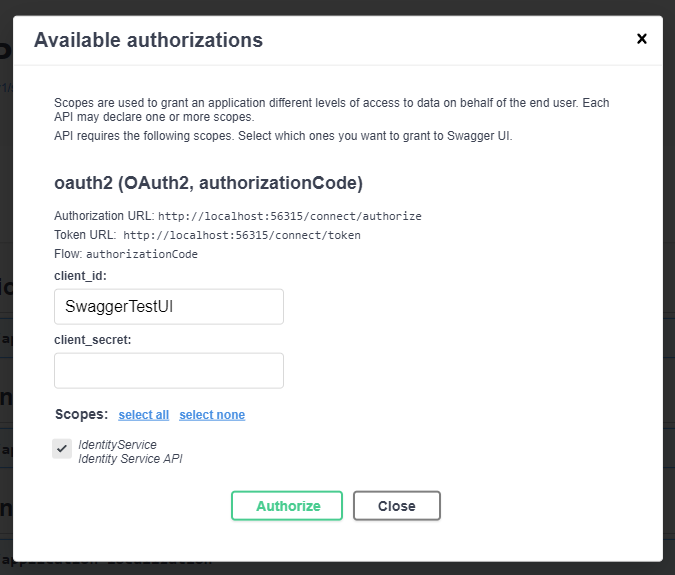
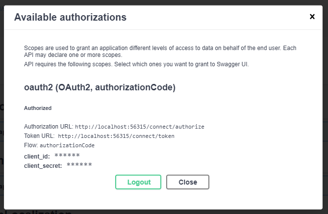
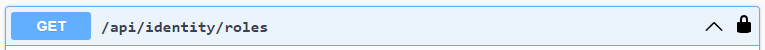
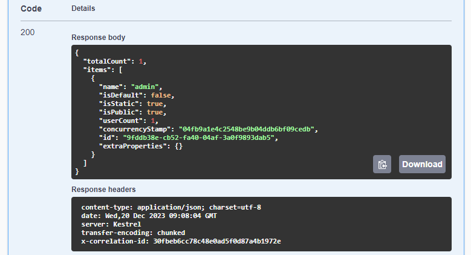

# Microservice Solution: API Gateways

````json
//[doc-nav]
{
  "Next": {
    "Name": "Web applications in the Microservice solution",
    "Path": "solution-templates/microservice/web-applications"
  }
}
````

> You must have an ABP Business or a higher license to be able to create a microservice solution.

An API Gateway is used to expose your system to the clients. It also provides a single entry point to your system.

## About the BFF Pattern

ABP Studio Microservice solution implements the [Backend for Frontend (BFF) pattern](https://learn.microsoft.com/en-us/azure/architecture/patterns/backends-for-frontends), which means that it created a separate API Gateway for each kind of client application. For example, if you selected a web and a mobile application, you will have two API Gateways; One for the web application and the other one for the mobile application. Different API Gateways may serve different set of APIs, may be configured different scalability and policy rules, etc.

## YARP Reverse Proxy

This solution uses [YARP](https://microsoft.github.io/reverse-proxy/) to implement the API Proxies. It is a commonly used [library](https://www.nuget.org/packages/Yarp.ReverseProxy) provided by Microsoft.

### The Configuration

The main YARP [configuration](https://microsoft.github.io/reverse-proxy/articles/config-files.html) is obtained from the `ReverseProxy` section of the `appsettings.json` file. It basically redirects HTTP requests to underlying microservices with the rules provided in that configuration.

Here, a part of an example configuration in the `appsettings.json` file:

````json
"AuditLogging": {
  "ClusterId": "AuditLogging",
    "Match": {
      "Path": "/api/audit-logging/{**catch-all}"
    }
  },
"AuditLoggingSwagger": {
  "ClusterId": "AuditLogging",
    "Match": {
      "Path": "/swagger-json/AuditLogging/swagger/v1/swagger.json"
    },
  "Transforms": [
    { "PathRemovePrefix": "/swagger-json/AuditLogging" }
  ]
},
````

For each microservice, we typically define two route definition; One for the service's regular HTTP APIs (`AuditLogging` in this example), the other one is for Swagger proxy (`AuditLoggingSwagger` in this example). See *The Swagger Configuration* section to understand why it does exist.

### The Proxy Config Filter

API Gateway projects contains an implementation of the `IProxyConfigFilter` interface to remove the Swagger proxying in case of Swagger is disabled for the gateway. See *The Swagger Configuration* section.

## The Swagger Configuration

Swagger is used to serve a UI to discover and test HTTP APIs. It is enabled for the [microservices](microservices.md), so you can test them easily. However, most of the times, microservices are not exposed out of your cluster and only the API Gateway endpoint is available to the clients and 3rd-party companies. For that reason, it would be great to provide a unified Swagger UI by the API Gateway that includes all the HTTP APIs exposes by that API Gateway.

This solution configures Swagger and YARP, so the API Gateway can serve a unified Swagger UI. In this way, your clients can easily discover and test your APIs.

The Swagger UI is configured as the default page for API Gateways, that means it is automatically open when you browse an API Gateway application on your browser:



You will see a dropdown list that contains all the microservices exposed by that API Gateway. You should select the service you want to discover and test. You may need to authenticate the services to be able to properly test them. See the *Authentication* section below for the details.

### Enabling / Disabling the Swagger UI

Swagger UI is enabled by default. You can change that configuration in the `appsettings.json` file:

````json
"Swagger": {
  "IsEnabled": true
}
````

### The Endpoint Configuration

The Gateway project configures the Swagger UI endpoint using the following method:

````csharp
private static void ConfigureSwaggerUI(
    IProxyConfig proxyConfig,
    SwaggerUIOptions options,
    IConfiguration configuration)
{
    foreach (var cluster in proxyConfig.Clusters)
    {
        options.SwaggerEndpoint(
            $"/swagger-json/{cluster.ClusterId}/swagger/v1/swagger.json", 
            $"{cluster.ClusterId} API"
        );
    }

    options.OAuthClientId(configuration["AuthServer:SwaggerClientId"]);
    options.OAuthScopes(
        "AdministrationService",
        "AuthServer",
        "SaasService",
        "AuditLoggingService",
        "GdprService",
        "IdentityService"
    );
}
````

Here, it adds a `swagger.json` endpoint for each `Cluster` that is defined in the `appsettings.json` file for YARP. It matches to the route definition that was explained in the *YARP Reverse Proxy* section.

It also configures the authentication, so you can test the HTTP APIs requiring authorization. The default OAuth client name is `SwaggerTestUI` which is defined in the `appsettings.json` file. That client is automatically created by the [Identity microservice](microservices.md) when it first runs.

### Authentication

Some of your APIs will need to authenticate (and authorize) users to be able to consume them. The Gateway project configures the authentication for the Swagger UI as explained in the previous section.

When you browse the UI of an API Gateway, you will see a screen as shown below:



> **WARNING: ABP Studio's built-in browser can not be used to authenticate a Swagger UI because of some technical limitations on the authentication flow. We will work on that in the future to fix the problem. Please use your browser to open the Swagger UI. You can right-click to a gateway application in the *Solution Runner* and select the *Copy Url* command to copy the application's URL to your clipboard in ABP Studio.**

Ensure that you've selected the service you want to test in the dropdown on top of the page. Then click the *Authorize* button here to open the Swagger's authorization modal:



Here, you don't need to change anything (leave the *client_secret* field as empty). Just click the *Authorize* button. You are redirected to the login page of the authentication server. You can use the default `admin` username and `1q2w3E*` password if you haven't change them yet. After the login process, you should see a modal similar to the following screenshot:



Now, you are authenticated with the user you've used while logging in to the application, and you have all the permissions of that user. For example, you can test the `/api/identity/roles` endpoint to get a list of the roles in the system:



When you execute that API, the server should return a JSON value as shown in the following screenshot:


