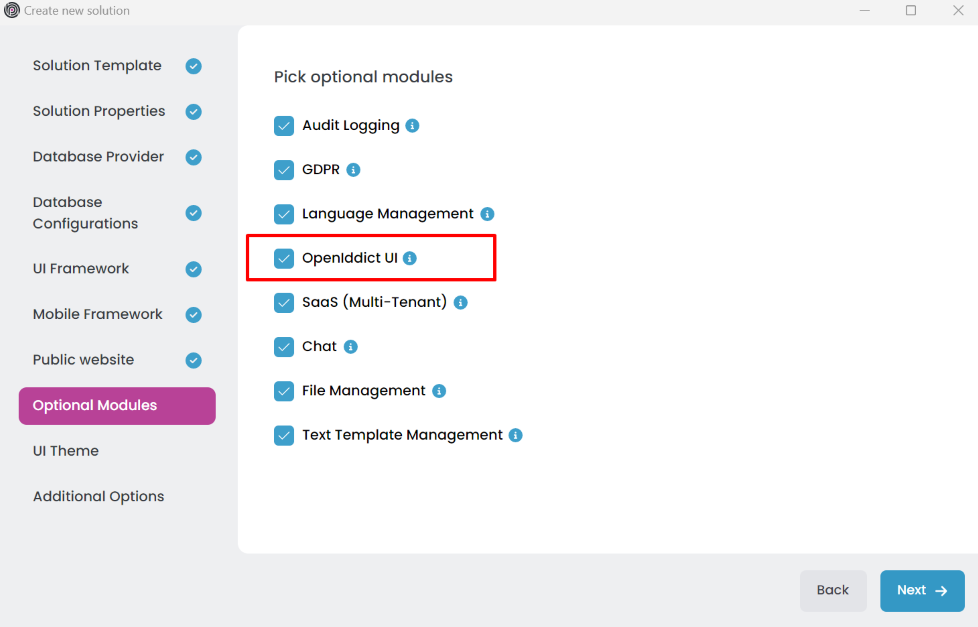
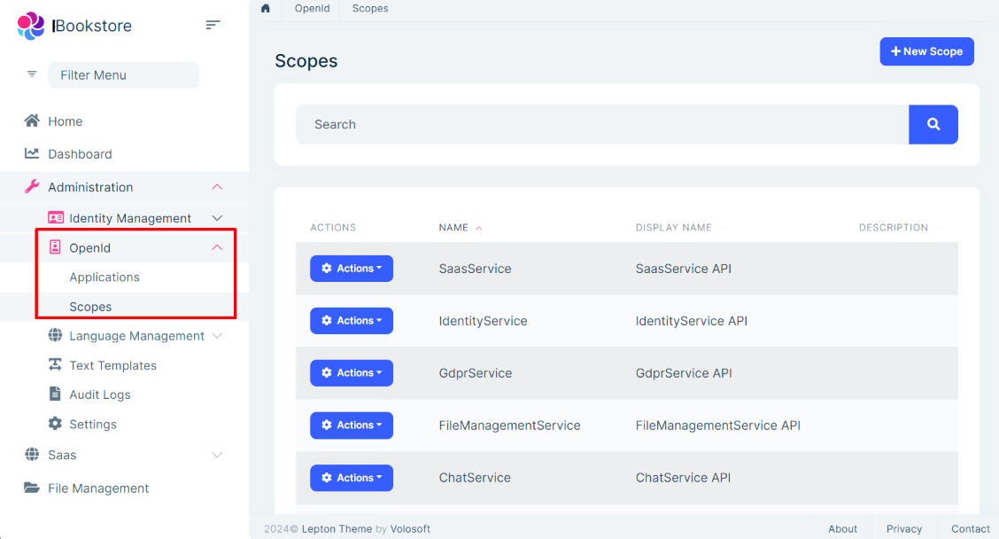
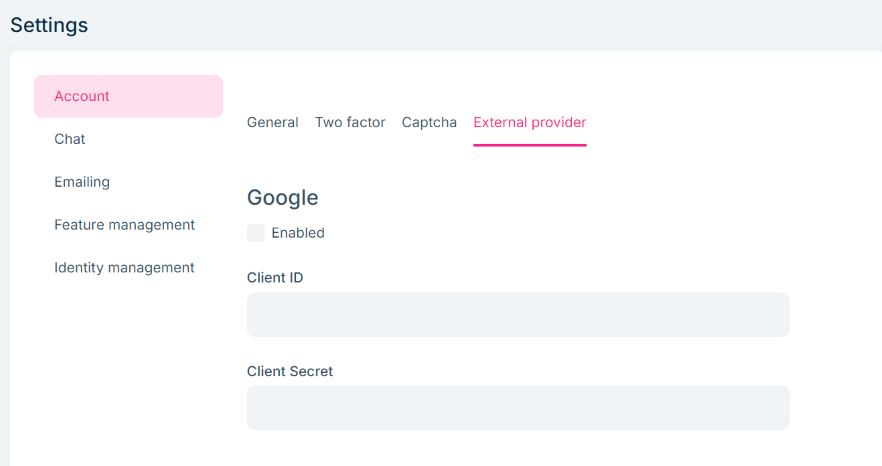

# Microservice Solution: Authentication

````json
//[doc-nav]
{
  "Next": {
    "Name": "Database configurations in the Microservice solution",
    "Path": "solution-templates/microservice/database-configurations"
  }
}
````

> You must have an ABP Business or a higher license to be able to create a microservice solution.

The [microservice solution template](index.md) is fully configured for authentication. All the services and applications are configured to use the [OpenIddict](https://documentation.openiddict.com) library for authentication. They are configured in a common way for authentication. This document explains that common authentication structure.

## OpenIddict

[OpenIddict](https://documentation.openiddict.com) is an open-source library that provides a simple and easy way to implement an OpenID Connect server in your application. ABP has built-in modules ([OpenIddict](../../modules/openiddict.md), [OpenIddict UI](../../modules/openiddict-pro.md)) to integrate OpenIddict into the solution.

## Identity Service

The microservice solution template has the [identity](microservices.md#identity-microservice) service that is responsible for the OpenIddict definitions (Applications, Scopes, etc.). Also, it provides the *OpenIddictDataSeeder* class to seed the initial data. It creates the default clients (applications) and scopes for the solution. Each microservice has its own scope and the web applications use these scopes to get access to the microservices. So, when you add a new microservice, you should add a new scope and add the allowed scopes for related clients (applications).

The [OpenIddict UI](../../modules/openiddict-pro.md) module is added to the identity microservice only if you choose the OpenIddict UI module while creating the solution.



The OpenIddict UI module provides a user interface to manage the OpenIddict entities such as applications, scopes, etc. You can manage these entities from the application UI.



## The Authentication Server

The solution has an authentication server (auth-server) application to provide the token generation, validation and account (login, register, etc) pages. It uses the [account](../../modules/account-pro.md) module. The [account](../../modules/account-pro.md) module also provides the [social logins](../../modules/account-pro.md#social--external-logins) (Google, Facebook, etc.) feature. You can enable/disable and configure the social logins from the application UI.



## Authentication Flows

The applications use several flows to authenticate users based on the application type. The MVC UI web application uses the [hybrid flow](https://openid.net/specs/openid-connect-core-1_0.html#HybridFlowAuth) (OpenID Connect Authentication) to authenticate users, while the SPA and Swagger applications use the [authorization code flow](https://openid.net/specs/openid-connect-core-1_0.html#CodeFlowAuth) to authenticate users. After the user logs into the system and receives the token from the authentication server, the applications (microservices) use [JWT Bearer Authentication](https://jwt.io/introduction/) to authorize users.