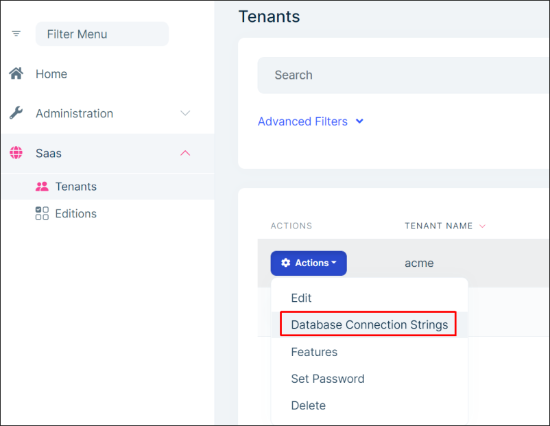
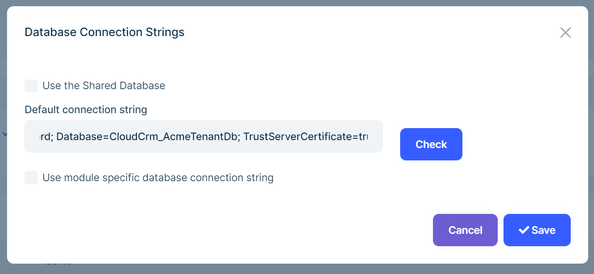
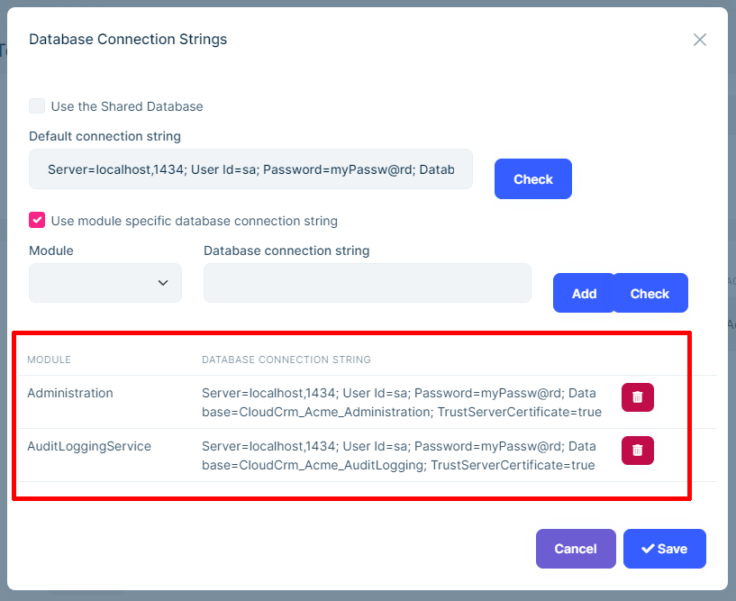
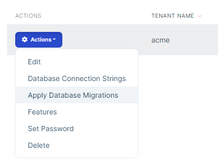

# Microservice Solution: Database Configurations

````json
//[doc-nav]
{
  "Next": {
    "Name": "Logging in the Microservice solution",
    "Path": "solution-templates/microservice/logging"
  }
}
````

> You must have an ABP Business or a higher license to be able to create a microservice solution.

This document explains the database configuration and migration structure that is designed and implemented in the ABP Studio Microservice solution template.

## Database Configurations

The microservice solution was designed so that there are more than one database. Typically, each microservice has its own database. The service is responsible to define, configure and migrate its own database.

> This document is mainly focused on the Entity Framework configuration. It also notices the differences for MongoDB.

### The DbContext Class

Every microservice in the solution defines a `DbContext` class. The following example was taken from the Identity microservice:

````csharp
[ConnectionStringName(DatabaseName)]
[ReplaceDbContext(
    typeof(IIdentityProDbContext),
    typeof(IOpenIddictDbContext)
    )]
public class IdentityServiceDbContext :
    AbpDbContext<IdentityServiceDbContext>,
    IIdentityProDbContext,
    IOpenIddictDbContext,
    IHasEventInbox,
    IHasEventOutbox
{
    public const string DbTablePrefix = "";
    public const string DbSchema = null;
    
    public const string DatabaseName = "Identity";
    
    public DbSet<IncomingEventRecord> IncomingEvents { get; set; }
    public DbSet<OutgoingEventRecord> OutgoingEvents { get; set; }
    
    /* These DbSet properties are coming from the Identity module */
    public DbSet<IdentityUser> Users { get; set; }
    public DbSet<IdentityRole> Roles { get; set; }
    public DbSet<IdentityClaimType> ClaimTypes { get; set; }
    public DbSet<OrganizationUnit> OrganizationUnits { get; set; }
    public DbSet<IdentitySecurityLog> SecurityLogs { get; set; }
    public DbSet<IdentityLinkUser> LinkUsers { get; set; }
    public DbSet<IdentityUserDelegation> UserDelegations { get; set; }
    
    /* These DbSet properties are coming from the OpenIddict module */
    public DbSet<OpenIddictApplication> Applications { get; set; }
    public DbSet<OpenIddictAuthorization> Authorizations { get; set; }
    public DbSet<OpenIddictScope> Scopes { get; set; }
    public DbSet<OpenIddictToken> Tokens { get; set; }

    public IdentityServiceDbContext(DbContextOptions<IdentityServiceDbContext> options) 
        : base(options)
    {
    }

    protected override void OnModelCreating(ModelBuilder builder)
    {
        base.OnModelCreating(builder);
        
        builder.ConfigureEventInbox();
        builder.ConfigureEventOutbox();
        builder.ConfigureIdentityPro();
        builder.ConfigureOpenIddictPro();
    }
}
````

Let's examine that class. The first important thing is the `ConnectionStringName` attribute:

````csharp
[ConnectionStringName(DatabaseName)]
````

[The `ConnectionStringName` attribute](../../framework/fundamentals/connection-strings.md#set-the-connection-string-name) defines the unique name of the connection string that is being used by that `DbContext` class. It matches with the connection string defined in the `appsettings.json` file. That name is also used in database migrations to distinguish different database schemas, and used as the key while storing tenant connection strings for a multi-tenant system. So, each physically separate database should have a unique connection string / database name as here.

The `DatabaseName` constant is defined in the `DbContext` class:

````csharp
public const string DatabaseName = "Identity";
````

The second important part of that class is the `ReplaceDbContext` attribute's usage:

````csharp
[ReplaceDbContext(
    typeof(IIdentityProDbContext),
    typeof(IOpenIddictDbContext)
    )]
````

The Identity microservice utilizes the [Identity](../../modules/identity.md) and [OpenIddict](../../modules/openiddict.md) modules and creates a single database that contains these modules' database schemas. These modules define their own `DbContext` class normally. But [the `ReplaceDbContext` attribute](../../framework/data/entity-framework-core/index.md#replace-other-dbcontextes) tells to ABP to use this (`IdentityServiceDbContext`) `DbContext` class instead of the `DbContext` classes defined by these modules. Technically, it replaces the given `DbContext` classes on runtime. We are doing that to ensure that we have a single (merged) database schema, single database migration path and a single database transaction operation when we work these multiple modules. When we replace a `DbContext`, we should implement its interface as done with the `IdentityServiceDbContext` class:

````csharp
public class IdentityServiceDbContext :
    AbpDbContext<IdentityServiceDbContext>,
    IIdentityProDbContext,
    IOpenIddictDbContext,
    IHasEventInbox,
    IHasEventOutbox
````

* That class implements `IIdentityProDbContext` and `IOpenIddictDbContext`, so these modules can use it.
* It also implements `IHasEventInbox` and `IHasEventOutbox` interfaces, so the transactional [inbox/outbox patterns](inbox/outbox patterns) can work while sending and receiving [distributed events](../../framework/infrastructure/event-bus/distributed).

As the next part, the `IdentityServiceDbContext` class defines the following properties those are forced by the implemented interfaces:

````csharp
public DbSet<IncomingEventRecord> IncomingEvents { get; set; }
public DbSet<OutgoingEventRecord> OutgoingEvents { get; set; }

/* These DbSet properties are coming from the Identity module */
public DbSet<IdentityUser> Users { get; set; }
public DbSet<IdentityRole> Roles { get; set; }
public DbSet<IdentityClaimType> ClaimTypes { get; set; }
public DbSet<OrganizationUnit> OrganizationUnits { get; set; }
public DbSet<IdentitySecurityLog> SecurityLogs { get; set; }
public DbSet<IdentityLinkUser> LinkUsers { get; set; }
public DbSet<IdentityUserDelegation> UserDelegations { get; set; }

/* These DbSet properties are coming from the OpenIddict module */
public DbSet<OpenIddictApplication> Applications { get; set; }
public DbSet<OpenIddictAuthorization> Authorizations { get; set; }
public DbSet<OpenIddictScope> Scopes { get; set; }
public DbSet<OpenIddictToken> Tokens { get; set; }
````

Finally, we are executing the extension properties provided by the ABP and the modules to configure the entity mappings for them:

````csharp
protected override void OnModelCreating(ModelBuilder builder)
{
    base.OnModelCreating(builder);

    builder.ConfigureEventInbox();
    builder.ConfigureEventOutbox();
    builder.ConfigureIdentityPro();
    builder.ConfigureOpenIddictPro();
}
````

### The `IDesignTimeDbContextFactory` Implementation

The solution has a class that implements `IDesignTimeDbContextFactory` for each `DbContext` class. For example, the Identity microservice has the following class:

````csharp
public class IdentityServiceDbContextFactory
    : IDesignTimeDbContextFactory<IdentityServiceDbContext>
{
    public IdentityServiceDbContext CreateDbContext(string[] args)
    {
        IdentityServiceEfCoreEntityExtensionMappings.Configure();
        
        var builder = new DbContextOptionsBuilder<IdentityServiceDbContext>()
        .UseSqlServer(GetConnectionStringFromConfiguration(), b =>
        {
            b.MigrationsHistoryTable("__IdentityService_Migrations");
        });
        
        return new IdentityServiceDbContext(builder.Options);
    }

    private static string GetConnectionStringFromConfiguration()
    {
        return BuildConfiguration()
            .GetConnectionString(IdentityServiceDbContext.DatabaseName)
               ?? throw new ApplicationException(
                    $"Could not find a connection string named
                    '{IdentityServiceDbContext.DatabaseName}'.");
    }

    private static IConfigurationRoot BuildConfiguration()
    {
        var builder = new ConfigurationBuilder()
            .SetBasePath(Directory.GetCurrentDirectory())
            .AddJsonFile("appsettings.json", optional: false);

        return builder.Build();
    }
}
````

The `IdentityServiceDbContextFactory` class is used to create a `IdentityServiceDbContext` instance when you use the [EF Core command-line commands](https://learn.microsoft.com/en-us/ef/core/cli/dotnet), like `dotnet ef migrations add` or `dotnet ef database update`. It is also used if you use the `Add-Migration` or `Update-Database` commands in the *Package Manager Console* of Visual Studio.

There are two important points in that class:

* `b.MigrationsHistoryTable("__IdentityService_Migrations");` call sets a table name that is used by EF Core to track the migration history for a database schema. We are overriding it to ensure that each `DbContext` has a unique table name. This is especially useful if you want to use a single physical database for multiple microservices, or merge databases of services later.
* `BuildConfiguration` method creates the configuration using the `appsettings.json` file, so you use don't need to duplicate the connection string and other options.

### The AbpDbConnectionOptions Configuration

Every microservice (and the other applications that touches to a database) configures the `AbpDbConnectionOptions` [options class](../../framework/fundamentals/options.md). It is typically done in a method (named `ConfigureDatabase`) defined in the service's (or application's) [module class](../../framework/architecture/modularity/basics.md). For example, the Identity microservices has a `CloudCrmIdentityServiceModule` class that defines a `ConfigureDatabase` method:

````csharp
private void ConfigureDatabase(ServiceConfigurationContext context)
{
    // ...
}
````

That method configures a few options. In this section, we will be focusing on the `AbpDbConnectionOptions` configuration part:

````csharp
Configure<AbpDbConnectionOptions>(options =>
{
    options.Databases.Configure("Administration", database =>
    {
        database.MappedConnections
		        .Add(AbpPermissionManagementDbProperties.ConnectionStringName);
        database.MappedConnections
		        .Add(AbpFeatureManagementDbProperties.ConnectionStringName);
        database.MappedConnections
		        .Add(AbpSettingManagementDbProperties.ConnectionStringName);
        database.MappedConnections
		        .Add(LanguageManagementDbProperties.ConnectionStringName);
    });
            
    options.Databases.Configure("AuditLogging", database =>
    {
        database.MappedConnections
		        .Add(AbpAuditLoggingDbProperties.ConnectionStringName);
    });
            
    options.Databases.Configure("Saas", database =>
    {
        database.MappedConnections
		        .Add(SaasDbProperties.ConnectionStringName);
    });
            
    options.Databases.Configure(IdentityServiceDbContext.DatabaseName, database =>
    {
        database.MappedConnections
		        .Add(AbpIdentityDbProperties.ConnectionStringName);
        database.MappedConnections
		        .Add(AbpOpenIddictDbProperties.ConnectionStringName);
    });
});
````

That configuration basically defines the different databases that is accessed by that service/application and defines [the mapping](../../framework/fundamentals/connection-strings.md#configuring-the-database-structures) between module database schemas to physical databases.

For example, Permission Management, Feature Management, Setting Management and the Language Management modules will use the `Administration` database, because we have merged that modules into the Administration microservice - we don't wanted to create separate services and databases for them.

As similar, we are mapping and redirecting the Identity and OpenIddict module connection strings to the database defined by the `IdentityServiceDbContext`.

Defining the databases and mapping pre-built modules to these databases is critical on runtime, so it should be carefully configured.

### The AbpDbContextOptions Configuration

The `ConfigureDatabase` method then configures the `AbpDbContextOptions` options class. An example from the Identity microservice:

````csharp
Configure<AbpDbContextOptions>(options =>
{
    options.Configure(opts =>
    {
        /* Sets default DBMS for this service */
        opts.UseSqlServer();
    });
            
    options.Configure<IdentityServiceDbContext>(c =>
    {
        c.UseSqlServer(b =>
        {
            b.MigrationsHistoryTable("__IdentityService_Migrations");
        });
    });     
});
````

We are basically setting the SQL Server as the default DBMS for this service (or application). The we are overriding the configuration for `IdentityServiceDbContext` to set the migrations history table to match with the one defined in the `IdentityServiceDbContextFactory` class.

### Registering the `DbContext` Class

Finally, the `ConfigureDatabase` method registers `IdentityServiceDbContext` class to the [dependency injection](../../framework/fundamentals/dependency-injection.md) system and configures it:

````csharp
context.Services.AddAbpDbContext<IdentityServiceDbContext>(options =>
{
    options.AddDefaultRepositories();
});
````

`AddDefaultRepositories` is used to register the default [repository](../../framework/architecture/best-practices/repositories.md) implementations for all the aggregate root [entities](../../framework/architecture/best-practices/entities.md).

## Database Migrations

When you use a relational database, the database schema (tables, fields, views, etc) should be explicitly created before using it. In addition, whenever you deploy a new version of your service, the database schema should be updated if you made a change on it.

For example, if you have added a new field to a database table, you should also add that field to the production database before (or while) deploying your service to the production environment.

Managing the schema changes manually is not a good practice and error-prone in a highly dynamic system like a microservice solution. The Microservice solution template uses [Entity Framework migrations](https://learn.microsoft.com/en-us/ef/core/managing-schemas/migrations/) to maintain the database schema and automatically migrate it whenever you deploy a new version of your service/application.

In addition to the schema changes, you may also need to insert some initial (seed) data to some tables in order to make your server properly works. That process is called as [data seeding](../../framework/infrastructure/data-seeding.md). The Microservice solution is also configured so it can seed such initial data on the application startup.

> If you are using **MongoDB** as your database provider, the schema migration is not needed (But you should care about some kind of data and schema migrations in case of you made a breaking change on your database schema - this is something depends on your application, so you should understand how to work with a document database like MongoDB). However, the data seeding system is still used to insert initial data to the database.

### Database Migrations on Service Startup

Every microservice is responsible to migrate its own database schema. They perform that responsibility by checking and applying database migrations on service startup.

> In this document, we will examine the Identity microservice as an example, but the document is valid for other services too.

For example, the Identity microservice's startup module class overrides the `OnPostApplicationInitializationAsync` method to trigger the migration operation:

````csharp
public override async Task
    OnPostApplicationInitializationAsync(ApplicationInitializationContext context)
{
    using var scope = context.ServiceProvider.CreateScope();
    await scope.ServiceProvider
        .GetRequiredService<IdentityServiceRuntimeDatabaseMigrator>()
        .CheckAndApplyDatabaseMigrationsAsync();
}
````

In this example, `IdentityServiceRuntimeDatabaseMigrator` class checks and applies the pending changes if available.

````csharp
public class IdentityServiceRuntimeDatabaseMigrator
    : EfCoreRuntimeDatabaseMigratorBase<IdentityServiceDbContext>
{
    private readonly IdentityServiceDataSeeder _identityServiceDataSeeder;

    /* The constructor code is omitted to keep it short */

    protected override async Task SeedAsync()
    {
        await _identityServiceDataSeeder.SeedAsync();
    }
}
````

Since the migration logic is very common, ABP provides a base class to implement the fundamental migration logic. `IdentityServiceRuntimeDatabaseMigrator` inherits from the `EfCoreRuntimeDatabaseMigratorBase` class which perform the actual migration operation. 

Here, we are just overriding the `SeedAsync` method that runs just after the database schema migration. If you check the source code, you will see that `IdentityServiceDataSeeder` creates the `admin` user, `admin` role and their permissions, so you can be able to login to the application.

Let's explain how `EfCoreRuntimeDatabaseMigratorBase` behaves:

* First of all, **it re-tries the migration operation** in case of any failure. It tries 3 times in total, then re-throws the exception and causes the application crash. Since Kubernetes (or ABP Studio [solution runner](../../studio/running-applications.md)) will re-start it on crash, it will continue to try until it succeed. Temporary failures are especially expected if the database server is not ready when the service starts. It waits a random value between 5 and 15 seconds before the next try.
* It uses a [distributed lock](../../framework/infrastructure/distributed-locking.md) to ensure that the migration operation is performed only by one service instance in a time. This is especially important if you run multiple instances of your service, which is usual in a microservice system. It uses a unique distributed key name based on the `DatabaseName` property, so different databases can be migrated in parallel.
* It uses Entity Framework's API to get a list of pending migrations and migrates the database if there were pending migrations.
* It then seeds the database by calling the virtual `SeedAsync` method. Remember that we have overridden that method to seed the initial data for the identity microservice.
* Finally, if a database schema migration has applied, it publishes a distributed event, `AppliedDatabaseMigrationsEto`, with the `DatabaseName`. This event is then used by the [SaaS module](../../modules/saas.md) to trigger migration of tenant databases in a multi-tenant system. See the *Database Migrations for Tenants* section in this document.

#### Configuring the `EfCoreRuntimeDatabaseMigratorBase` Class

`EfCoreRuntimeDatabaseMigratorBase` works is optimized for common scenarios. However, you may want to fine-tune it in some cases.

The following properties are candidate to change in the constructor of your derived class (`IdentityServiceRuntimeDatabaseMigrator` for the Identity microservice):

* `AlwaysSeedTenantDatabases` (default value: `false`): If you don't have a database schema change, it doesn't trigger the `AppliedDatabaseMigrationsEto` event. So, if you don't have a database schema change, but have a new database seed, then the new seed code is not applied to the tenant databases. If you want to apply the seed always even if there is no database schema change, you can set that property to `true`. However, if you have many tenant databases, it will be very inefficient to run the database seed code in every service startup. Alternatively, you can use EF Core's `Add-Migration` command to add an empty database migration to trigger the schema change. Your migration history will grow unnecessarily, but the performance loss is a bigger problem otherwise.
* `MinValueToWaitOnFailure` (default value: `5000` as milliseconds): Minimum wait duration before re-trying the migrations in case of any failure.
* `MaxValueToWaitOnFailure` (default value: `15000` as milliseconds): Maximum wait duration before re-trying the migrations in case of any failure.
* `DatabaseName` (string): Every separate database must be a unique name in the system, so `EfCoreRuntimeDatabaseMigratorBase` can use the distributed locking system per database. This value is passed in the constructor of the `IdentityServiceRuntimeDatabaseMigrator` class and properly configured for the pre-built services. See also the *Database Configurations* section in this document.

### Database Migrations for Tenants

The microservice solution allows to create dedicated physical databases for each tenant for each microservice. This can be useful if you want to have dedicate resources for specific tenants or need to separate some tenant databases for security, isolation or other reasons.

> Tenants with their own databases per services may dramatically increase your database count and may make your system hard to monitor, backup and maintain. It is a serious system decision and we suggest to avoid it if you don't have to do.

If you have a separate database for a tenant for a microservice and if that microservice's database schema is changed, you must change the tenant's database schema too. Otherwise, your service may fail when it uses that tenant's database.

As explained above, `EfCoreRuntimeDatabaseMigratorBase` publishes a distributed event (`AppliedDatabaseMigrationsEto`) when it applied a database schema migration for a microservice database. That is then handled by the SaaS module. The SaaS module then finds all the tenants that have dedicated databases for that microservice database, and publishes `ApplyDatabaseMigrationsEto` events (one for each tenant). The `ApplyDatabaseMigrationsEto` events are then handled by the related microservice to migrate the related database for the given tenant. This is done by the `IdentityServiceDatabaseMigrationEventHandler` in the microservice project. `IdentityServiceDatabaseMigrationEventHandler` is inherited from the `EfCoreDatabaseMigrationEventHandlerBase` class which implements the actual migration logic. 

`EfCoreDatabaseMigrationEventHandlerBase` handles three types of events:

* `TenantCreatedEto`: Published when a new tenant is created.
* `TenantConnectionStringUpdatedEto`: Published when a connection string of a tenant has changed.
* `ApplyDatabaseMigrationsEto`: Published when a tenant database should be migrated, as explained above.

For all that events, we need to migrate the related database for the tenant (the migration system creates the initial database if it doesn't exists). The migration logic is like that:

* Switches to the related tenant context using the [`ICurrentTenant.Change` method](../../framework/architecture/multi-tenancy/index.md#change-the-current-tenant).
* If the given tenant has a dedicated connection string for the current microservice, it migrates the database schema and seeds the initial data.
* In case a failure, it re-tries a maximum of 3 times by waiting a random duration between 5 and 15 seconds. It does that by ignoring the error and re-publishing the event that is handled.

#### Connection String Update

As explained in the previous section, the migration system automatically creates and seeds the new database when you change connection string of a tenant. However, it doesn't move the data if old database has data in it. You should handle it yourself. You can override the `AfterTenantConnectionStringUpdated` method to take the necessary action.

#### On Failures

As explained before, the migration system re-tries a maximum of 3 times on failures by waiting a random duration between 5 and 15 seconds. You can set `MinValueToWaitOnFailure` and `MaxValueToWaitOnFailure` as milliseconds to change these durations. Default try count can be changed by setting the `MaxEventTryCount` value.

If the maximum try count (`MaxEventTryCount`) is reached, then the re-try mechanism is stopped. In that case, the tenant database will remain old, since it couldn't be migrated. In such a case, it is expected from a system admin to understand the problem (maybe the connection string was wrong or the target database server is temporarily unreachable) and manually trigger the migration once the problem is resolved. See the *SaaS Module: The Tenant Management UI* section for details.

#### SaaS Module: The Tenant Management UI

SaaS module provides the necessary UI to set and change connection string for tenants and trigger the database migrations.

##### The Connection String Management Modal

You can click to the *Database Connection Strings* command in the *Actions* dropdown button for a tenant in the *Tenants* page of the SaaS module:



It opens the *Database Connection Strings* modal as shown below:



Here, we can set a *Default connection string* for the tenant. The default connection string is used as a fallback value if you don't define a connection string for a specific microservice database.

If you only set the *Default connection string* for a tenant, all the microservices will use that single database for that tenant. They will create their tables inside that database and perform all operations on it. We suggest that approach since a tenant will have a single database, which is easier to manage.

If you want to set a database for each microservice for a tenant, then check the *Use module specific database connection string* checkbox as shown below:



Here, you can set a different connection string for each microservice. If you don't define a connection string for one of the services, it will use the *Default* connection string above. If you haven't defined a *Default* connection string, than the main database of the related microservice will be used.

> Tenants with their own databases per services may dramatically increase your database count and may make your system hard to monitor, backup and maintain. It is a serious system decision and we suggest to avoid it if you don't have to do.

When you make the changes and save the dialog, the necessary databases are automatically created and migrated. If you later update the connection string (for example if you change the database name), it will also trigger the database migration process again.

##### Manually Applying the Database Migrations

If you need to manually trigger the database migrations for a specific tenant, click the *Actions* dropdown for the related tenant and select the *Apply Database Migrations* command on the *Tenant Management* page of the SaaS module:



See the *On Failures* section above to understand why you may need to manually trigger that operation.

## Rapid Failures on System Startup

When you initially run the application on your development environment, or when you first deploy your solution to production, your services may rapidly fails on startup. This is because they need to make some database operations on their startup, but the databases weren't created yet. They will be created in the first run of the related service.

For example, the Identity microservice will fail on startup if the Administration service wasn't started before and created the database. All **these are expected and nothing to worry about**. That is the nature of distributed system.

The solution has designed to tolerate these startup failures and everything will be working in a few seconds or minutes. ABP Studio solution runner and Kubernetes have systems to restart a failed service, so the service will restart and try it again until its startup dependencies are satisfied.
