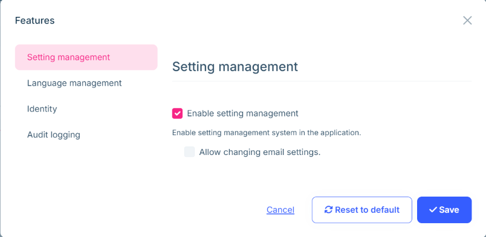

# Microservice Solution: Feature Management

````json
//[doc-nav]
{
  "Next": {
    "Name": "Localization system in the Microservice solution",
    "Path": "solution-templates/microservice/localization-system"
  }
}
````

> You must have an ABP Business or a higher license to be able to create a microservice solution.

The *Administration* microservice is responsible for managing features. It is used by all the services and applications in the solution. This document explains how feature management works in the microservice solution. It's similar to the [permission management](permission-management.md). When we send a request to `/api/abp/application-configuration`, the gateway application forwards the request to the *Administration* microservice. The *Administration* microservice returns the application configuration, which includes the [features](../../framework/infrastructure/features.md) for the current user tenant. You can see the details of the application configuration here: [Application Configuration](../../framework/api-development/standard-apis/configuration.md).

Since [Feature Management](../../modules/feature-management.md) is a fundamental feature module, each microservice depends on the *Volo.Abp.FeatureManagement.EntityFrameworkCore* or *Volo.Abp.FeatureManagement.MongoDB* package. These modules provide the necessary infrastructure (such as `IFeatureStore`) to check features. Additionally, the *Administration* microservice depends on the *Volo.Abp.FeatureManagement.Application*, *Volo.Abp.FeatureManagement.HttpApi* packages to manage features.

## Feature Management

The *Administration* microservice provides a set of APIs to manage features. The features are defined in each microservice, and when a microservice starts, it registers its features to the related feature definition tables if `SaveStaticFeaturesToDatabase` option is true for `FeatureManagementOptions`. Since the default value is true, this behavior is ensured. After that, you can see the features from the [Feature Management Dialog](../../modules/feature-management.md#feature-management-dialog) for related provider such as [Tenant](../../modules/saas.md#tenant-features) or [Editions](../../modules/saas.md#edition-features).



When you define a new feature to a microservice, you need to restart the microservice to register the new feature to the feature definition tables. Afterwards you can see the features from the [Feature Management Dialog](../../modules/feature-management.md#feature-management-dialog).

## Administration Service Feature Management Option

`SaveStaticFeaturesToDatabase` default value is true and it is used to save the static features to the database. Each microservice already adds their feature definitions to the related table. However, there is also another option `IsDynamicFeatureStoreEnabled`, which is used to enable the dynamic feature store. We need to enable this option only for the *Administration* microservice, because the *Administration* microservice is the only service that manages the features. Other services and applications use their own feature definitions.

You can see this option in the `ConfigureFeatureManagement` method of the *Administration* microservice module:

```csharp
private void ConfigureFeatureManagement()
{
    Configure<FeatureManagementOptions>(options =>
    {
        options.IsDynamicFeatureStoreEnabled = true;
    });
}
```

## Creating a New Feature

You can define new features in the *MicroservicenameFeatureDefinitionProvider* in the *Contracts* project for the related microservice. Since existing microservices uses the monolith module approch all featuers comes from related module. However, you can create new features if you need.

For example;

```csharp
public class FormsFeatureDefinitionProvider : FeatureDefinitionProvider
{
    public override void Define(IFeatureDefinitionContext context)
    {
        var group = context.AddGroup(FormsFeatures.GroupName,
            L("Feature:FormsGroup"));

        group.AddFeature(FormsFeatures.Enable,
            "true",
            L("Feature:FormsEnable"),
            L("Feature:FormsEnableDescription"),
            new ToggleStringValueType());
    }

    private static LocalizableString L(string name)
    {
        return LocalizableString.Create<FormsResource>(name);
    }
}
```