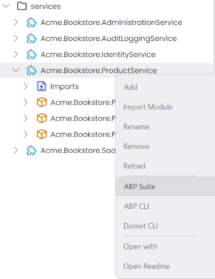
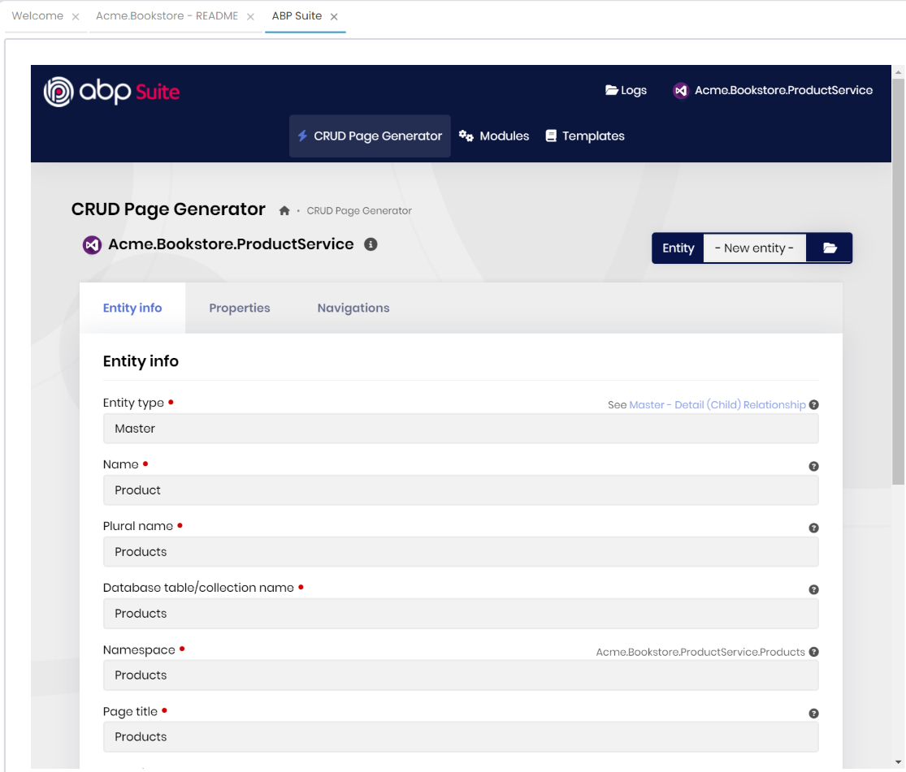
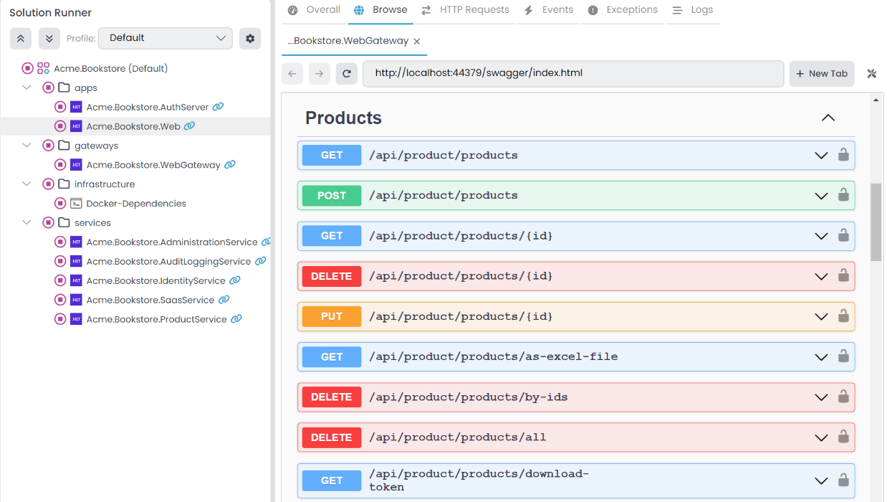
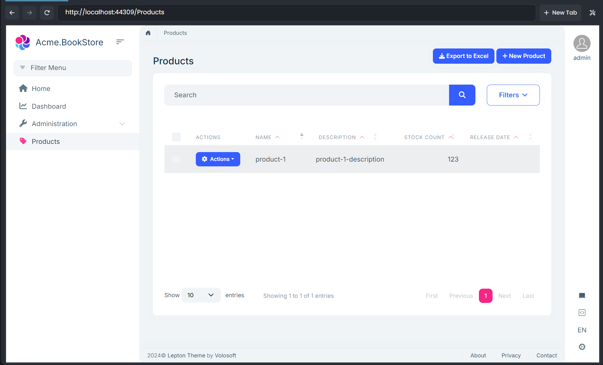

# Microservice Solution: How to use with ABP Suite

ABP Suite provides a visual solution designer, code generators, and other tools to make your development process easier and faster.

You can open ABP Suite from ABP Studio by using the **ABP Suite** -> **Open** toolbar menu item, or by right-clicking on the desired module and selecting the **ABP Suite** menu item.



It opens the ABP Suite in a built-in browser window. You can also access the suite by visiting `http://localhost:3000` through your browser. From there, you can visually design your solution and generate code. 

In the following example, we've defined the entity name as **Product** and provide other metadata for the related entity:



After clicking **Save and generate** for the entity in ABP Suite, use **Run** -> **Build & Restart** in the [Solution Runner](../../studio/running-applications.md#start) to apply the changes.

> ABP Suite requires you to stop all running instances in the related solution/project to be able to generate codes properly. Otherwise, it might not work effectively.

Then, to confirm, you can visit the Swagger UI to verify that the necessary API endpoints and services have been created.



If you selected the *Create user interface* option for the entity, the related UI components (pages, styles, scripts etc.) will also be created. To be able to see the related pages in your host application/UI you should apply the following steps:

1. Generate [*client-proxies*](../../framework/api-development/static-csharp-clients.md) with the following command:

```bash
abp generate-proxy -t csharp -url http://localhost:{your-service-port}/ -m {remote-service-name} --without-contracts
```

* You should run this command in the directory of your host application, and your microservices should be up and running.
* The command will generate proxy classes for your microservice in the host application, which you can see under the **ClientProxies** folder.

> **Note:** After each entity generation/modification in your services, then you should run this command to update client-proxies.

2. Configure the application for the static client proxy:

```csharp
public class MyClientAppModule : AbpModule
{
    public override void ConfigureServices(ServiceConfigurationContext context)
    {
        // Prepare for static client proxy generation
        context.Services.AddStaticHttpClientProxies(
            typeof(MyServiceApplicationContractsModule).Assembly
        );

        // Include the generated app-generate-proxy.json in the virtual file system
        Configure<AbpVirtualFileSystemOptions>(options =>
        {
            options.FileSets.AddEmbedded<MyClientAppModule>();
        });
    }
}
```

After you apply these steps, you're ready to go to run your microservices and see the generated CRUD pages:


