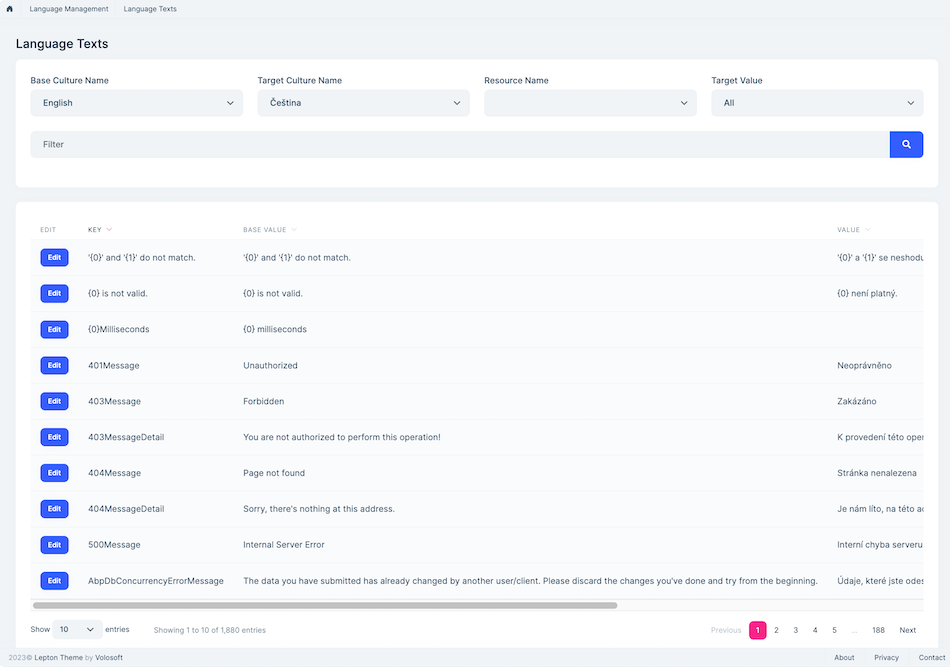

# Microservice Solution: Localization System

````json
//[doc-nav]
{
  "Next": {
    "Name": "Background jobs in the Microservice solution",
    "Path": "solution-templates/microservice/background-jobs"
  }
}
````

> You must have an ABP Business or a higher license to be able to create a microservice solution.

The *Administration* microservice is responsible for managing localization. It is used by all the services and applications in the solution. This document explains how localization works in the microservice solution. When we send a request to `/api/abp/application-localization`, the gateway application forwards the request to the *Administration* microservice. The *Administration* microservice returns the application localization, which includes the localization resources of the solution. You can see the details of the [application localization](../../framework/api-development/standard-apis/localization.md) endpoint.

Like the other fundamental feature modules ([Permission Management](permission-management.md), [Feature Management](feature-management.md)), each microservice depends on the *Volo.Abp.LanguageManagement.EntityFrameworkCore* or *Volo.Abp.LanguageManagement.MongoDB* package. These modules provide the necessary infrastructure (such as `IExternalLocalizationStore`) to access all localization. Additionally, the *Administration* microservice might depend on the *Volo.Abp.LanguageManagement.Application* and *Volo.Abp.LanguageManagement.HttpApi* packages to manage localization if you check the *Language Management* module while creating the solution.

## Language Management

The *Administration* microservice provides a set of APIs to manage localization. The localization resources are defined in each microservice, and when a microservice starts, it registers its localization resources to the related localization tables automatically. After that, you can see the localization resources from the [language texts](../../modules/language-management.md#language-texts) and manage them.



> The *Language Management* module is optional. If you don't need to manage localization resources from the UI, you can uncheck the *Language Management* module while creating the solution. However, each microservice's localization resources are still registered to the database and can be used by the applications.

## Creating a New Localization Resource

To create a new localization resource, you can create a class named *MicroservicenameResource* in the *Contracts* project for the related microservice, which is already created by the solution template. For example, the *Identity* microservice has an *IdentityServiceResource* class and localization JSON files.

```csharp
[LocalizationResourceName("IdentityService")]
public class IdentityServiceResource
{

}
```

Additionally, it configures the localization resource in the *IdentityServiceContractsModule* class.

```csharp	
public override void ConfigureServices(ServiceConfigurationContext context)
{
    Configure<AbpVirtualFileSystemOptions>(options =>
    {
        options.FileSets.AddEmbedded<BookstoreIdentityServiceContractsModule>();
    });

    Configure<AbpLocalizationOptions>(options =>
    {
        options.Resources
            .Add<IdentityServiceResource>("en")
            .AddBaseTypes(typeof(AbpValidationResource), typeof(AbpUiResource))
            .AddVirtualJson("/Localization/IdentityService");
    });

    Configure<AbpExceptionLocalizationOptions>(options =>
    {
        options.MapCodeNamespace("IdentityService", typeof(IdentityServiceResource));
    });
}
```

> Existing microservices in the solution don't contain the localization text. These localization resources are defined in their own modules. You can add new localization resources to the existing microservices by following the steps above.