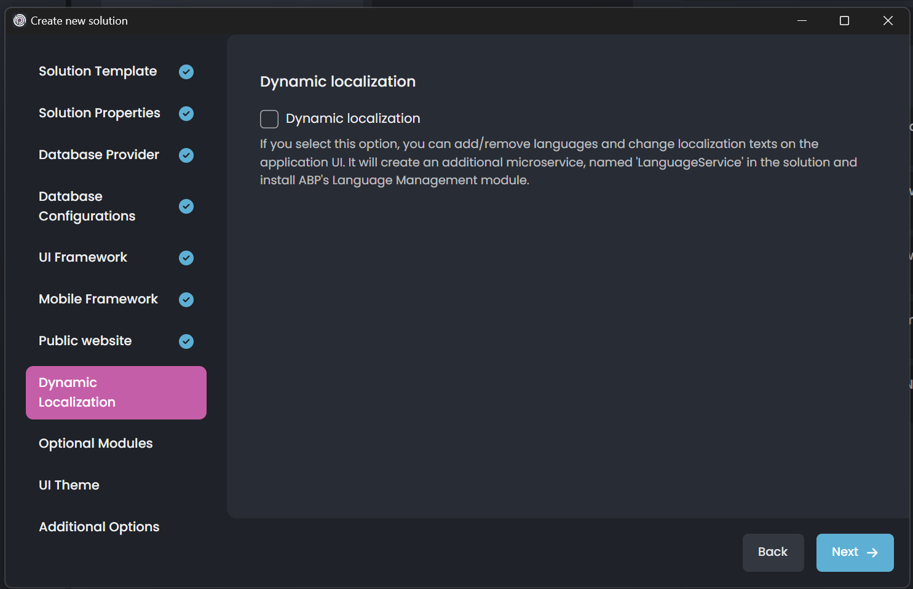

```json
//[doc-seo]
{
    "Description": "Learn how localization works in ABP Studio's modern microservice solution template across backend services, React apps, and the optional React Native client."
}
```

# Microservice Solution: Localization System

````json
//[doc-nav]
{
  "Next": {
    "Name": "Background jobs in the Microservice solution",
    "Path": "solution-templates/microservice/background-jobs"
  }
}
````

> You must have an ABP Business or a higher license to be able to create a microservice solution.

The *Administration* microservice is responsible for managing localization. It is used by all the services and applications in the solution. This document explains how localization works in the microservice solution. When we send a request to `/api/abp/application-localization`, the gateway application forwards the request to the *Administration* microservice. The *Administration* microservice returns the application localization, which includes the localization resources of the solution. You can see the details of the [application localization](../../framework/api-development/standard-apis/localization.md) endpoint.

Like the other fundamental feature modules ([Permission Management](permission-management.md), [Feature Management](feature-management.md)), each microservice depends on the *Volo.Abp.LanguageManagement.EntityFrameworkCore* or *Volo.Abp.LanguageManagement.MongoDB* package. These modules provide the necessary infrastructure (such as `IExternalLocalizationStore`) to access all localization. Additionally, the *Administration* microservice might depend on the *Volo.Abp.LanguageManagement.Application* and *Volo.Abp.LanguageManagement.HttpApi* packages to manage localization if you check the *Language Management* module while creating the solution.

## Language Management

> If the dynamic localization option is enabled, then the *Language Management Module* is removed from the optional modules and a new microservice named `LanguageService` is created. `LanguageService` uses the *Language Management Module* behind the scenes.

The *Administration* microservice provides a set of APIs to manage localization. The localization resources are defined in each microservice, and when a microservice starts, it registers its localization resources to the related localization tables automatically. After that, you can see the localization resources from the [language texts](../../modules/language-management.md#language-texts) and manage them.


> The *Language Management* module is optional. If you don't need to manage localization resources from the UI, you can uncheck the *Language Management* module while creating the solution. However, each microservice's localization resources are still registered to the database and can be used by the applications.

## Dynamic Localization

When you create a new microservice solution, you can **enable dynamic localization** option, which allows you to add/remove languages and change localization texts on the application UI:



When you enable this option, a new microservice named **LanguageService** is added with the language management module integrated. Define new shared localization entries in the `LanguageService` localization files, or update the registered texts from the *Language Texts* UI. The generated React applications can then consume those backend resources through the application configuration and `application-localization` endpoints.

## UI Localizations

In the current modern microservice template, UI-only localizations live in the generated React or React Native applications. The template does not generate MVC, Blazor, or Angular hosts for the modern microservice solution structure.

> **Note:** UI-only strings that you keep in frontend locale files are not managed by the Language Management module. Put shared or domain-level texts in backend localization resources if they should participate in dynamic localization.

### `react`

The main `react` application initializes `i18next` from `apps/react/src/locales/en.json`. It also:

* persists the selected culture in browser storage
* sets the document language
* loads available languages from the application configuration
* fetches additional cultures from `/api/abp/application-localization` and merges them into `i18next`

Use the locale files under `apps/react/src/locales` for UI-only strings that belong only to this application.

### `react-admin-console`

The `react-admin-console` application keeps its bundled translations under `apps/react-admin-console/src/locales/*.json` and initializes `i18next` from those files.

Its supported language list is controlled by `AbpAdminConsoleOptions` using the `AdminConsole:LocalizationLanguages` configuration key, which is exposed to the SPA through `/admin-console/api/config`. If no languages are configured, the frontend falls back to `en`.

Use the admin console locale files for UI-only texts that are specific to the administration surface. Keep shared module texts in backend localization resources.

### `react-native`

When mobile is enabled, the generated React Native client stores its bundled translations under `apps/mobile/react-native/src/locales`. The `LocalizationService.ts` file:

* registers the available locale files
* exposes the language list used by the app
* maps the default resource name from `Environment.ts`

Use these locale files for mobile-specific UI strings.

## Creating a New Localization Resource

To create a new localization resource, you can create a class named *MicroservicenameResource* in the *Contracts* project for the related microservice, which is already created by the solution template. For example, the *Identity* microservice has an *IdentityServiceResource* class and localization JSON files.

```csharp
[LocalizationResourceName("IdentityService")]
public class IdentityServiceResource
{

}
```

Additionally, it configures the localization resource in the *IdentityServiceContractsModule* class.

```csharp	
public override void ConfigureServices(ServiceConfigurationContext context)
{
    Configure<AbpVirtualFileSystemOptions>(options =>
    {
        options.FileSets.AddEmbedded<BookstoreIdentityServiceContractsModule>();
    });

    Configure<AbpLocalizationOptions>(options =>
    {
        options.Resources
            .Add<IdentityServiceResource>("en")
            .AddBaseTypes(typeof(AbpValidationResource), typeof(AbpUiResource))
            .AddVirtualJson("/Localization/IdentityService");
    });

    Configure<AbpExceptionLocalizationOptions>(options =>
    {
        options.MapCodeNamespace("IdentityService", typeof(IdentityServiceResource));
    });
}
```

> Existing microservices in the solution don't contain the localization text. These localization resources are defined in their own modules. You can add new localization resources to the existing microservices by following the steps above.
