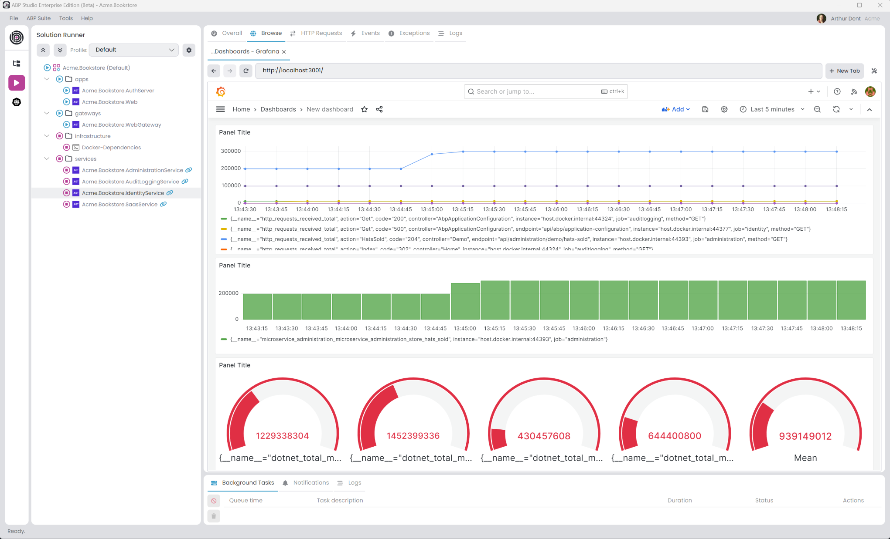

# Microservice Solution: Monitoring

````json
//[doc-nav]
{
  "Next": {
    "Name": "Swagger integration in the Microservice solution",
    "Path": "solution-templates/microservice/swagger-integration"
  }
}
````

> You must have an ABP Business or a higher license to be able to create a microservice solution.

In a distributed system it is important to monitor the health of the system and the services. Monitoring helps to detect issues before they become problems and helps to understand the system's behavior. All the services, applications and gateways are configured to use the [Prometheus](https://prometheus.io/) and [Grafana](https://grafana.com/) libraries for monitoring. They are configured in a common way for monitoring. This document explains that common monitoring structure.

## Configuration

The monitoring configuration is done in the each *Module* class of the project. The `OnApplicationInitialization` method of the module class is used to set the monitoring system. We're adding the `prometheus-net.AspNetCore` package to the project to use Prometheus. The `prometheus-net.AspNetCore` package is a library that provides a middleware to expose metrics for Prometheus. The `app.UseHttpMetrics();` line is collect the HTTP request metrics. The `endpoints.MapMetrics();` line is used to expose the metrics to the `/metrics` endpoint. Existing templates includes the prometheus and grafana configurations in the `docker-compose` file. So, you can visit the `http://localhost:9090` to see the [Prometheus](https://prometheus.io/) dashboard and `http://localhost:3001` to see the [Grafana](https://grafana.com/) dashboard. 

> Default username and password for Grafana is `admin` and `admin`. You can change the password after the first login.

After you login to the Grafana dashboard, you can add a new data source to connect to the Prometheus server and create a new dashboard to monitor the system. 



## Custom Metrics

To create custom metrics, you can use the [IMeterFactory](https://learn.microsoft.com/en-us/dotnet/api/system.diagnostics.metrics.imeterfactory) interface. Basically, you can follow the steps in the [official documentation](https://learn.microsoft.com/en-us/dotnet/core/diagnostics/metrics-instrumentation) to create custom metrics. For example, you can create a custom metric to monitor the number of requests to a specific endpoint.

```csharp
public class AdministrationMetrics : ISingletonDependency
{
    private readonly Counter<int> _demoRequested;

    public AdministrationMetrics(IMeterFactory meterFactory)
    {
        var meter = meterFactory.Create("Microservice.Administration");
        _demoRequested = meter.CreateCounter<int>("demo_controller.requested");
    }

    public void DemoRequested()
    {
        _demoRequested.Add(1);
    }
}
```

In the demo controller, you can inject the `AdministrationMetrics` class and use the `DemoRequested` method to increase the counter.

```csharp
[Route("api/administration/demo")]
public class DemoController : AbpController
{
    public AdministrationMetrics AdministrationMetrics { get; }

    public DemoController(AdministrationMetrics administrationMetrics)
    {
        AdministrationMetrics = administrationMetrics;
    }

    [HttpGet]
    [Route("requested")]
    public  Task DemoRequested()
    {
        AdministrationMetrics.DemoRequested();
        return Task.CompletedTask;
    }
}
```

## Kubernetes Monitoring

If you check the *Kubernetes Configuration* option during project creation, the monitoring system is automatically configured for Kubernetes. The `prometheus` and `grafana` configurations are added to the `helm` chart.